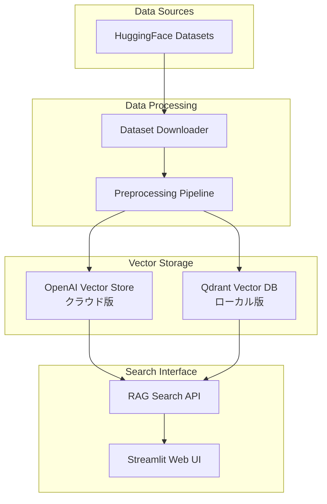

# 🚀 RAG(Cloud & local-Qdrant)From Scratch with Streamlit
## スクラッチで、RAG構築（クラウド版＆ローカル-Qdrant版）
- If you prefer English, please use translation tools like Google Translate to read the English version.
## 📚 ドキュメント

詳細な使用方法とサンプルプログラムについては：
- [README_2.md](./README_2.md) - 目的別の詳細な使用例
- [README_preparation.md](./README_preparation.md) - 開発環境の詳細設定
- [README_qdrant.md](./README_qdrant.md) - Qdrantローカル版の詳細
- [README_qdrant_setup.md](./README_qdrant_setup.md) - Qdrant高度な設定

## 🔗 関連プロジェクト## 🔗 関連プロジェクト


| プロジェクト                                                             | 説明                                         | ステータス |
| ------------------------------------------------------------------------ | -------------------------------------------- | ---------- |
| [openai_api_jp](https://github.com/nakashima2toshio/openai_api_jp)       | OpenAI API完全ガイド（本プロジェクト）       | ✅ 公開中  |
| [anthropic_api_jp](https://github.com/nakashima2toshio/anthropic_api_jp) | Anthropic Claude API活用                     | ✅ 公開中  |
| [openai_rag_jp](https://github.com/nakashima2toshio/openai_rag_jp)       | RAG実装パターン集（cloud版、Local-Qdrant版） | ✅ 公開中  |
| [openai_mcp_jp](https://github.com/nakashima2toshio/openai_mcp_jp)       | MCP(Model Context Protocol)実装              | 🚧 整備中  |
| [openai_django_jp](https://github.com/nakashima2toshio/openai_django_jp) | OpenAI API + Django実装                      | ✅ 公開中  |
| [openai_agent_jp](https://github.com/nakashima2toshio/openai_agent_jp)   | AIエージェント構築                           | 📝 作成中  |

## 📌 概要

日本語対応のRAG（Retrieval-Augmented Generation）システムの完全実装版。OpenAI APIとQdrantベクトルデータベースを使用して、クラウド版とローカル版の両方のRAGシステムを構築できます。

### 🎯 主な特徴

- **デュアルモード対応**: OpenAI Vector Store（クラウド）とQdrant（ローカル）の両方をサポート
- **マルチドメイン対応**: カスタマーサポート、医療、科学技術、法律の4つの専門分野
- **日本語完全対応**: 日本語での質問応答と検索に最適化
- **プロダクション対応**: Docker化、監視、エラーハンドリング機能を完備
- **最新モデル対応**: GPT-4o、o1-o4シリーズの最新AIモデルをサポート

# RAG 工程マップ（Cloud / Local 対応表）

本書は、リポジトリ内の各プログラムが **RAG 工程（1〜7）** の **どこを、どう担当しているか** にフォーカスして整理したものです。
まず工程の凡例、つづいて **(1) Cloud 版（Vector Store）**、**(2) Local 版（Qdrant）**、最後に **共通モジュール** を記載します。

## 工程の凡例

| 番号 | 工程名 | 主な内容 |
|---|---|---|
| 1 | 前処理 | 文字コード/改行/空白/重複の整形、ノイズ除去（ナビ/フッター等）、メタデータ抽出（タイトル/URL/セクション/更新日） |
| 2 | チャンク分割 | 固定長 or 意味単位。オーバーラップ（10–20%）。日本語は文字数基準（800–1,200字＋100–200重なり）推奨。コード/表は独立チャンク |
| 3 | ベクトル化 | 各チャンクを埋め込み。必要に応じ **L2 正規化**（Cosine 類似度時） |
| 4 | インデックス化 | ベクタDBへ格納（近似最近傍）。本文・メタ・chunk_id を保存。属性フィルタ用のフィールド化 |
| 5 | 検索（クエリ側） | クエリも同じモデルで埋め込み。ベクトル検索＋（任意で）BM25、MMR、フィルタ、時間減衰、再ランキング |
| 6 | 生成 | 選抜チャンクを結合（重複/同一出典の統合）。出典メタデータ付与 |
| 7 | モニタリング/評価 | ヒット率・正確性の評価、チャンク長/オーバーラップ/モデル/閾値のチューニング |

---

# (1) Cloud 版（OpenAI Vector Store を使う）

## ファイル別マッピング（Cloud）

| プログラム | RAG 工程（どこ） | どう対応しているか | 入力 → 出力 | 備考 |
|---|---|---|---|---|
| `a01_load_set_rag_data.py` | **1 前処理**＋**2 チャンク分割** | 正規化／ノイズ除去／メタ抽出 → 文字数基準＋オーバーラップで分割 | 原文, `config_yml.yml` → `OUTPUT/processed/*.jsonl`（`{text, meta, chunk_id}`） | Cloud/Local 共用の前段 |
| `a02_set_vector_store_vsid.py` | **3 ベクトル化**＋**4 インデックス化（Cloud）** | Vector Store 作成/取得（VSID）→ a01 出力を投入。VS 側で埋め込み生成＆索引化。本文・メタ・chunk_id を格納 | `OUTPUT/processed/*.jsonl` → Vector Store（VSID/ファイルID） | L2 正規化は VS の類似度設定に従う（必要に応じクライアント側で実施） |
| `a20_rag_search_cloud_vs.py` | **5 検索**＋**6 生成** | クエリ埋め込み → VS 類似検索 →（任意）MMR/フィルタ/時間減衰 → コンテキスト結合 → 出典付与して応答 | `query`, VSID → 回答テキスト＋出典 | Top-k/テンプレート/モデルは `config_yml.yml` で制御 |
| `server.py` | **5 検索**＋**6 生成**（エンドポイント） | `a20` の処理を API/サーバとして公開（問い合わせ→検索→組立→応答） | HTTP/CLI → JSON/テキスト応答 | 運用時のエントリーポイント |
| `setup.py` | 0 環境土台 | 依存導入・CLI エントリ。RAG ロジックは持たない | - | - |
| `docker-compose/docker-compose.yml` | （Cloud では通常未使用） | Qdrant を使わないため不要 | - | Local で使用 |

> Cloud 版では、`a10_show_qdrant_data.py` / `a50_qdrant_registration.py` / `a50_rag_search_local_qdrant.py` は対象外です（Qdrant 用）。

---

# (2) Local 版（Qdrant を使う）

## ファイル別マッピング（Local）

| プログラム | RAG 工程（どこ） | どう対応しているか | 入力 → 出力 | 備考 |
|---|---|---|---|---|
| `docker-compose/docker-compose.yml` | **4/5 の「器」** | Qdrant の起動・永続化・ポートを定義（HNSW 実体は Qdrant 内） | compose 設定 → Qdrant ランタイム | `docker compose up -d` |
| `a01_load_set_rag_data.py` | **1 前処理**＋**2 チャンク分割** | 正規化／メタ抽出 → 文字数基準＋オーバーラップ分割 | 原文, `config_yml.yml` → `OUTPUT/processed/*.jsonl` | Cloud と共通の前段 |
| `a50_qdrant_registration.py` | **3 ベクトル化**＋**4 インデックス化（Local）** | 各チャンクを埋め込み →（Cosine 運用なら **L2 正規化**）→ Qdrant コレクション作成（`m`, `ef_construct`）→ upsert（本文・メタ・`chunk_id` を payload） | `OUTPUT/processed/*.jsonl` → Qdrant コレクション | `distance=Cosine` を推奨（または L2 正規化を徹底） |
| `a10_show_qdrant_data.py` | **4 インデックス検証** | コレクション一覧/件数/スキーマ/任意ポイントの payload を可視化 | Qdrant → 表示/ログ | 登録品質の点検用 |
| `a50_rag_search_local_qdrant.py` | **5 検索**＋**6 生成** | クエリ埋め込み → Qdrant 検索（`top_k`,`ef`）＋メタフィルタ →（任意）MMR/再ランク → コンテキスト結合 → 出典付与 | `query`, Qdrant → 回答テキスト＋出典 | 検索パラメタは `config_yml.yml` |
| `server.py` | **5 検索**＋**6 生成**（エンドポイント） | `a50_rag_search_local_qdrant.py` の処理を API/サーバとして公開 | HTTP/CLI → JSON/テキスト応答 | 運用時のエントリーポイント |
| `setup.py` | 0 環境土台 | 依存導入・CLI エントリ。RAG ロジックは持たない | - | - |

> Local 版では、`a02_set_vector_store_vsid.py` / `a20_rag_search_cloud_vs.py` は対象外です（Cloud 専用）。

---

# 共通モジュール（Cloud / Local 両対応）

## 共通テーブル

| モジュール | 関与工程 | どう支えるか | 主なキー/関数の例 |
|---|---|---|---|
| `config_yml.yml` | **1〜6** | 前処理/分割/埋め込み/検索/生成の一元設定 | `preprocess.*`, `chunk.size/overlap`, **Cloud**: `cloud.vector_store.*`, `cloud.embedding.model`, `cloud.search.*`, `cloud.generation.*` / **Local**: `qdrant.*`, `embedding.model`, `hnsw.*`, `search.top_k/ef`, `prompt.template` |
| `helper_api.py` | **3〜6 周辺** | OpenAI/Anthropic/Qdrant クライアント、レート制御、リトライ、ログ | `get_openai_client()`, `get_qdrant_client()`, `retry_request()` |
| `helper_rag.py` | **1〜6 コア** | 前処理・分割・メタ生成・埋め込み・MMR・L2 正規化・コンテキスト整形・出典整形 | `clean_text()`, `chunk_text()`, `build_metadata()`, `embed_texts()`, `l2_normalize()`, `mmr()`, `build_context()` |
| `helper_st.py` | **5〜6 可視化** | 検索結果・スコア・出典の UI、設定パネル、デバッグビュー | `render_search_results()`, `render_config_panel()` |

---

## 最短実行フロー（参考）

### Cloud（Vector Store）
1. `a01_load_set_rag_data.py`：**1 前処理＋2 分割**
2. `a02_set_vector_store_vsid.py`：**3 ベクトル化＋4 インデックス化（Cloud）**
3. `a20_rag_search_cloud_vs.py`（or `server.py`）：**5 検索＋6 生成**

### Local（Qdrant）
1. `a01_load_set_rag_data.py`：**1 前処理＋2 分割**
2. `docker compose up -d`：**Qdrant 起動**
3. `a50_qdrant_registration.py`：**3 ベクトル化＋4 インデックス化（Local）**
4. `a50_rag_search_local_qdrant.py`（or `server.py`）：**5 検索＋6 生成**
5. 必要に応じて `a10_show_qdrant_data.py`：**4 検証**

---

## ベストプラクティス（要点だけ）

- **日本語チャンク**：開始は **800–1,200 文字**＋**100–200 重なり**。
- **正規化の一貫性**：前処理（本文）とクエリ側で同じ正規化ポリシー（全角/半角、句読点、空白）。
- **Cosine 運用**：Qdrant は `distance=Cosine` または **L2 正規化**を一貫。
- **メタデータ**：`source, title, section, lang, domain, timestamp` を保存（フィルタ/出典表示に活用）。
- **MMR/再ランク**：Top-k の多様性・精度を上げる。必要に応じクロスエンコーダ導入。
- **評価ログ（工程7）**：クエリ→命中チャンク→採点を `logs/` に残し、`chunk.size/overlap/top_k/MMR λ` をチューニング。

---

## 🏗️ システムアーキテクチャ



## 📦 クイックスタート

### 🔧 環境準備

```bash
# 1. リポジトリのクローン
git clone <repository-url>
cd openai_rag_jp

# 2. Python仮想環境の作成
python -m venv venv
source venv/bin/activate  # macOS/Linux
# venv\Scripts\activate   # Windows

# 3. 依存パッケージのインストール
pip install -r requirements.txt

# 4. 環境変数の設定
echo "OPENAI_API_KEY=sk-your-api-key" > .env
```

詳細な環境準備手順は [📚 README_preparation.md](./README_preparation.md) を参照

### 🐳 Docker環境の起動（ローカル版のみ）

```bash
# Docker Composeでサービス起動
cd docker-compose/
docker-compose -f docker-compose.yml up -d

# プロジェクトルートに戻る
cd ..
```

### ⚡ 自動セットアップ

```bash
# 環境の自動セットアップ
python setup.py

# 統合サーバーの起動
python server.py
```

## 🔄 RAG構築フロー

### 📊 Step 1: 統合データ処理ツール

**🆕 統合RAGデータ処理ツール（Streamlit UI）:**
```bash
# 統合RAGデータ処理ツールを起動
streamlit run a01_load_set_rag_data.py --server.port=8501
```

統合ツールの特徴：
- ✅ 4種類のデータセットを単一UIで処理
- ✅ HuggingFaceから直接ダウンロード＆処理
- ✅ データ品質チェックと検証機能
- ✅ トークン使用量の事前推定
- ✅ CSV/TXT/JSON形式での出力
- ✅ メタデータの自動保存

対応データセット（HuggingFaceから最新データをダウンロード）：
- 📞 カスタマーサポートFAQ
- 🏥 医療Q&A（推論過程付き）
- 🔬 科学技術Q&A（選択肢付き）
- ⚖️ 法律Q&A

### 💾 Step 2: ベクトルストアへの登録

#### ☁️ クラウド版（OpenAI Vector Store）

```bash
# OpenAI Vector Storeの作成
python a02_make_vsid.py
```

#### 🏠 ローカル版（Qdrant）

```bash
# Qdrantへのデータ登録（詳細版）
python a50_qdrant_registration.py --recreate --include-answer

# または簡易版（テスト用）
python qdrant_data_loader.py --recreate --limit 100
```

### 🔍 Step 4: RAG検索の実行

#### ☁️ クラウド版検索

```bash
# Streamlit UIで検索（OpenAI Vector Store使用）
streamlit run a03_rag_search.py
```

#### 🏠 ローカル版検索

```bash
# Streamlit UIで検索（Qdrant使用）
streamlit run a50_qdrant_search.py
```

## 📁 プロジェクト構成

```
openai_rag_jp/
├── 📋 README関連
│   ├── README.md                    # 本ドキュメント
│   ├── README_2.md                  # 利用手順と目的別サンプル
│   ├── README_preparation.md        # 開発環境の準備
│   ├── README_qdrant.md            # Qdrantローカルセットアップ
│   └── README_qdrant_setup.md      # Qdrant詳細設定
│
├── 🔧 セットアップ・サーバー
│   ├── setup.py                     # 環境自動セットアップ
│   ├── server.py                    # 統合サーバー管理
│   └── docker-compose/              # Docker設定
│       └── docker-compose.yml
│
├── 📥 データ取得・処理
│   └── a01_load_set_rag_data.py    # 統合RAGデータ処理ツール（HuggingFaceからダウンロード＆処理）
│
├── ☁️ クラウド版RAG
│   ├── a02_make_vsid.py             # OpenAI Vector Store作成
│   └── a03_rag_search.py            # クラウド版RAG検索
│
├── 🏠 ローカル版RAG
│   ├── a50_qdrant_registration.py   # Qdrantデータ登録
│   ├── a50_qdrant_search.py        # Qdrant RAG検索
│   ├── a10_show_qdrant_data.py     # Qdrantデータ表示
│   └── qdrant_data_loader.py       # 簡易データローダー
│
├── 🛠️ ヘルパーモジュール
│   ├── helper_api.py                # OpenAI APIラッパー
│   ├── helper_rag.py                # RAG処理ユーティリティ
│   └── helper_st.py                 # Streamlitヘルパー
│
├── 📚 ドキュメント
│   └── doc/
│       ├── docker-compose.md        # Docker設定詳細
│       ├── server.md                # サーバー管理詳細
│       ├── setup.md                 # セットアップ詳細
│       ├── config_yml.md            # 設定ファイル詳細
│       └── ...                      # その他の詳細ドキュメント
│
└── 📂 データディレクトリ
    ├── datasets/                    # ダウンロードしたCSVファイル
    ├── OUTPUT/                      # 処理済みデータ
    └── logs/                        # 実行ログ
```

## 📚 詳細ドキュメント

### 🐳 インフラ・セットアップ

| ドキュメント | 内容 |
|------------|------|
| [doc/docker-compose.md](doc/docker-compose.md) | Qdrant Docker設定と管理 |
| [doc/server.md](doc/server.md) | 統合サーバー管理システム |
| [doc/setup.md](doc/setup.md) | 環境自動セットアップツール |

### 📊 データ処理

| ドキュメント | 内容 |
|------------|------|
| [doc/a01_load_set_rag_data.md](doc/a01_load_set_rag_data.md) | 統合RAGデータ処理ツール |
| [doc/a02_set_vector_store_vsid.md](doc/a02_set_vector_store_vsid.md) | OpenAI Vector Store作成詳細 |

### 🔍 検索システム

| ドキュメント | 内容 |
|------------|------|
| [doc/a20_rag_search_cloud_vs.md](doc/a20_rag_search_cloud_vs.md) | クラウド版RAG検索詳細 |
| [doc/a50_rag_search_local_qdrant.md](doc/a50_rag_search_local_qdrant.md) | ローカル版RAG検索詳細 |
| [doc/a10_show_qdrant_data.md](doc/a10_show_qdrant_data.md) | Qdrantデータ表示ツール |
| [doc/a50_qdrant_registration.md](doc/a50_qdrant_registration.md) | Qdrantデータ登録詳細 |

### ⚙️ 共通モジュール

| ドキュメント | 内容 |
|------------|------|
| [doc/config_yml.md](doc/config_yml.md) | 設定ファイル詳細仕様 |
| [doc/helper_api.md](doc/helper_api.md) | OpenAI APIラッパー詳細 |
| [doc/helper_rag.md](doc/helper_rag.md) | RAG処理ユーティリティ詳細 |
| [doc/helper_st.md](doc/helper_st.md) | Streamlitヘルパー詳細 |

## 🎯 使用例

### 例1: カスタマーサポートFAQシステム

```bash
# 統合ツールでデータ準備
streamlit run a01_load_set_rag_data.py
# UIで「カスタマーサポート」を選択して処理

# クラウド版で実行
python a02_make_vsid.py
streamlit run a03_rag_search.py

# またはローカル版で実行
python a50_qdrant_registration.py --domain customer
streamlit run a50_qdrant_search.py
```

### 例2: 医療情報検索システム

```bash
# 統合ツールでデータ準備
streamlit run a01_load_set_rag_data.py
# UIで「医療QA」を選択、Complex_CoTを含めて処理

# ローカルQdrantで構築
python a50_qdrant_registration.py --domain medical --include-answer
streamlit run a50_qdrant_search.py
```

### 例3: マルチドメイン統合検索

```bash
# 統合ツールで全ドメインのデータを順次準備
streamlit run a01_load_set_rag_data.py
# UIで各ドメインを順番に選択して処理

# 統合検索システムの構築
python a50_qdrant_registration.py --recreate
streamlit run a50_qdrant_search.py  # ALLドメインを選択
```

## ⚙️ 設定カスタマイズ

### config.yml の主要設定

```yaml
# モデル設定
model:
  default: "gpt-4o-mini"
  available: ["gpt-4o", "gpt-4o-mini", "o1-preview"]

# API設定
api:
  timeout: 60
  max_retries: 3

# 言語設定
language:
  default: "ja"
  supported: ["ja", "en"]

# Qdrant設定
qdrant:
  url: "http://localhost:6333"
  collection_name: "qa_corpus"
```

詳細は [doc/config_yml.md](doc/config_yml.md) を参照

## 🚀 パフォーマンス最適化

### バッチ処理の活用

```python
# 大量データの効率的処理
python a50_qdrant_registration.py --batch-size 100
```

### キャッシュの利用

```python
# helper_api.py のMemoryCacheシステムが自動的に有効
```

### 並列処理

```python
# 複数ドメインの並列処理
from concurrent.futures import ThreadPoolExecutor
```

## 🛠️ トラブルシューティング

### よくある問題と解決法

| 問題 | 解決方法 |
|-----|---------|
| Qdrantに接続できない | `docker ps`でコンテナ状態を確認、`docker restart qdrant`で再起動 |
| OpenAI APIエラー | `.env`ファイルのAPIキーを確認、課金状況をチェック |
| メモリ不足 | `config.yml`でバッチサイズを調整 |
| 検索精度が低い | TopK値を増やす、embedding modelを変更 |

## 🔄 データ更新・メンテナンス

### データの定期更新

```bash
# 統合ツールで新しいデータを追加
streamlit run a01_load_set_rag_data.py
# HuggingFaceから最新データをダウンロード＆処理

# ベクトルストアの更新
python a50_qdrant_registration.py --recreate
```

### バックアップ

```bash
# Qdrantデータのバックアップ
docker exec qdrant qdrant-backup create backup-$(date +%Y%m%d)
```

## 📊 システム要件

### 最小要件
- Python 3.8以上
- メモリ: 8GB
- ディスク: 10GB

### 推奨要件
- Python 3.10以上
- メモリ: 16GB以上
- ディスク: 20GB以上
- Docker Desktop（ローカル版使用時）

## 📝 ライセンスと貢献

本プロジェクトはRAG技術の実装例として提供されています。商用利用の際は各データセットのライセンスを確認してください。

## 🆘 サポート

問題が発生した場合：
1. [トラブルシューティング](#-トラブルシューティング)を確認
2. `logs/`ディレクトリのエラーログを確認
3. 各機能の詳細ドキュメント（`doc/`）を参照

---

**開発環境**: Python 3.8+ | OpenAI API | Qdrant | Docker | Streamlit

**対応モデル**: GPT-4o, GPT-4o-mini, o1-preview, o1-mini, o3-mini

**言語**: 日本語・英語対応