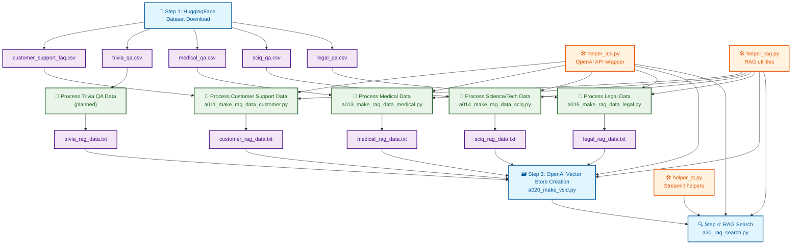

## RAG（Cloud版：OpenAI Embedding)

OpenAIのVector StoreとResponses APIを活用したクラウドベースRAG（Retrieval-Augmented Generation）システム。
Vector Storeの自動作成・管理からfile_search機能を使った高精度検索まで、完全統合されたRAGワークフローを提供する。

[a00_cloud_rag.md](./doc/a00_cloud_rag.md)

[](https://)

## RAG（Local版：OpenAI-Embedding + Qdrant: Hybrid Search)

Qdrantベクトルデータベースを使用したRAG（Retrieval-Augmented Generation）システム。
4つのドメイン（customer、medical、legal、sciq）のQAデータを統合管理し、多言語での意味的検索とStreamlit WebUIを提供する。

[a50_qdrant.md](./doc/a50_qdrant.md)

（＊）ドキュメントは、プログラムと同名.md の資料が doc/ に配置している。

 ### プログラム一覧：

| 順番 | プログラム名                       | 概要                                                                                                                                                 |
| ---- | ---------------------------------- | ---------------------------------------------------------------------------------------------------------------------------------------------------- |
| 0    | setup.py                           | MCP環境セットアップスクリプト。Python環境チェック、必要パッケージ自動インストール（streamlit、openai、qdrant-client等）、環境構築の自動化            |
| 1    | helper_api.py                      | OpenAI API関連のコア機能。ConfigManager、APIクライアント管理、ログ設定、Responses API型定義、トークン計算、エラーハンドリング等の共通基盤機能        |
| 2    | helper_rag.py                      | RAGデータ前処理の共通機能モジュール。AppConfig（モデル設定・料金情報）、データ検証、データセット読み込み、前処理、統計表示、ファイル保存等の汎用機能 |
| 3    | helper_st.py                       | Streamlit関連のヘルパー機能モジュール。Streamlit UI部品の共通機能を提供                                                                              |
| 4    | a00_dl_dataset_from_huggingface.py | HuggingFaceからRAG用データセットを一括ダウンロード。カスタマーサポート、医療、科学技術、法律、トリビアの5つのデータセットをCSVファイルとして保存     |
| 5    | a011_make_rag_data_customer.py     | カスタマーサポートFAQデータ専用のRAG前処理Streamlitアプリ。問題・解決・サポート関連用語の検証機能でデータを質問・回答形式に変換                      |
| 6    | a013_make_rag_data_medical.py      | 医療QAデータ専用のRAG前処理Streamlitアプリ。症状・診断・治療・薬等の医療関連用語検証機能で医療質問データをRAG用に最適化                              |
| 7    | a014_make_rag_data_sciq.py         | 科学・技術QAデータ専用のRAG前処理Streamlitアプリ。化学・物理・生物・数学等の科学技術関連用語検証機能でSciQデータセットをRAG検索用に変換              |
| 8    | a015_make_rag_data_legal.py        | 法律・判例QAデータ専用のRAG前処理Streamlitアプリ。法律・条文・判例・裁判等の法律関連用語検証機能でリーガルベンチデータをRAG用に最適化                |
| 9A   | a02_make_vsid.py                   | OpenAI Vector Store作成用Streamlitアプリ。前処理済みテキストからVector Storeを作成し、vector_stores.jsonに管理情報を保存。重複対応・最新優先選択機能 |
| 10A  | a03_rag_search.py                  | OpenAI Responses API使用のRAG検索Streamlitアプリ。file_searchツールでVector Store検索を実行。動的Vector Store ID管理、重複対応、多言語質問対応       |
| 9B   | a50_qdrant_registration.py         | Qdrantベクトルデータベース一括データ登録スクリプト。4つのCSVファイルを単一コレクションに統合登録。domain別フィルタ検索対応、Named Vectors対応        |
| 10B  | a50_qdrant_search.py               | Qdrant検索用Streamlit UI。ドメイン絞り込み検索、横断検索、TopK設定、スコア表示、Named Vectors切替機能を提供                                          |
| 11B  | mcp_qdrant_show.py                 | Qdrantデータ専用表示Streamlitアプリ。Qdrant接続状態チェック、コレクション一覧表示、データ概要取得等の管理・監視機能                                  |
| 12   | server.py                          | MCPサーバー起動スクリプト。PostgreSQL・Redis接続確認、データベース初期化、FastAPIアプリケーション起動、ポート設定、テストモード対応                  |

## 📝 概要

RAG - Local版は、HuggingFaceからデータセットをダウンロードし、OpenAI RAG（Retrieval-Augmented Generation）システムを構築する4段階の処理パイプラインです。

## 🔄 処理フロー



## 📋 詳細処理手順

### 🔽 Step 1: HuggingFace Dataset Download

**実行スクリプト**: `a30_00_dl_dataset_from_huggingface.py`


| No. | データセット         | ファイル名                 | 内容                                |
| --- | -------------------- | -------------------------- | ----------------------------------- |
| ①  | Customer Support FAQ | `customer_support_faq.csv` | カスタマーサポート・FAQデータセット |
| ②  | Trivia QA            | `trivia_qa.csv`            | 一般知識・トリビアQAデータセット    |
| ③  | Medical QA           | `medical_qa.csv`           | 医療質問回答データセット            |
| ④  | Science/Tech QA      | `sciq_qa.csv`              | 科学・技術QAデータセット            |
| ⑤  | Legal QA             | `legal_qa.csv`             | 法律・判例QAデータセット            |

### 📝 Step 2: RAG Data Processing

各CSVファイルを RAG用のTXTファイルに加工


| データセット     | 処理スクリプト                   | 出力ファイル            |
| ---------------- | -------------------------------- | ----------------------- |
| Customer Support | `a011_make_rag_data_customer.py` | `customer_rag_data.txt` |
| Medical QA       | `a013_make_rag_data_medical.py`  | `medical_rag_data.txt`  |
| Science/Tech QA  | `a014_make_rag_data_sciq.py`     | `sciq_rag_data.txt`     |
| Legal QA         | `a015_make_rag_data_legal.py`    | `legal_rag_data.txt`    |

### 🗃️ Step 3: Vector Store Creation

**実行スクリプト**: `a020_make_vsid.py`

加工済みTXTファイルをOpenAIのVector Storeに登録し、検索可能な形式に変換

### 🔍 Step 4: RAG Search

**実行スクリプト**: `a30_rag_search.py`

Vector Storeに登録されたデータを利用して、質問に対する関連情報を検索・回答生成

## 🛠️ ヘルパー関数


| ファイル        | 機能                         | 利用箇所             |
| --------------- | ---------------------------- | -------------------- |
| `helper_api.py` | OpenAI API wrapper、設定管理 | 全ステップ           |
| `helper_rag.py` | RAG用データ前処理、設定      | データ加工・検索     |
| `helper_st.py`  | Streamlit UI関数             | 検索インターフェース |

## 🔄 データフロー概要

```
HuggingFace → CSV → RAG用TXT → OpenAI Vector Store → RAG検索
```

各ステップは順次実行される設計で、前段階の出力が次段階の入力となる一方向のパイプライン構造です。

概要：
・プログラムとドキュメントの対応表：


| プログラム名                       | 概要                                           | OUTPUT                                      |
| ---------------------------------- | ---------------------------------------------- | ------------------------------------------- |
| a00_dl_dataset_from_huggingface.py | テストデータを<br/>HuggingFaceからダウンロード | customer_support_faq.csv<br />trivia_qa.csv |
| a011_make_rag_data_customer.py     | ① カスタマーサポート・FAQ加工                 | customer_support_faq.csv                    |
| a013_make_rag_data_medical.py      | ② 医療質問回答データ加工                      | medical_qa.csv                              |
| a014_make_rag_data_sciq.py         | ③ 科学・技術QAデータ加工                      | sciq_qa.csv                                 |
| a015_make_rag_data_legal.py        | 4 法律・判例QAデータ加工                       | legal_qa.csv                                |
| a020_make_vsid.py                  | OpenAI vector storeに登録                      | vs_id                                       |
| a30_rag_search.py                  | RAGサーチ                                      |                                             |
| helper_api.py                      | ヘルパー関数：OpenAI API                       |                                             |
| helper_st.py                       | Streamlit ヘルパー関数                         |                                             |
| helper_rag.py                      | OpenAI API　RAG処理ヘルパー                    |                                             |

（1）開発の準備
・requirements.txt から必要なソフトをインストールする。

（2）HuggingFaceからテスト用データとして、以下をダウンロードする。
[a00_dl_dataset_from_huggingface.py]
customer_support_faq.csv    ① カスタマーサポート・FAQデータセット
trivia_qa.csv               ② 一般知識・トリビアQAデータセット
medical_qa.csv              ③ 医療質問回答データセット
sciq_qa.csv                 ④ 科学・技術QAデータセット
legal_qa.csv                ⑤ 法律・判例QAデータセット

（3）それぞれのダウンロードしたCSVファイルをRAG用のデータとして加工しTXTファイルを作成する。
[a011_make_rag_data_customer.py]
[a013_make_rag_data_medical.py]
[a014_make_rag_data_sciq.py]
[a015_make_rag_data_legal.py]

（4）RAG用のデータとして加工ずみのTXTファイルをOpenAIのvector storeに登録する。
[a020_make_vsid.py]

（5）vector store に登録されたデータを利用して、検索を実施する。
[a30_rag_search.py]

（6）ヘルパー関数
[helper_api.py]
[helper_rag.py]
[helper_st.py]
