# 🚀 OpenAI RAG System - クラウド＆ローカル対応 RAG構築・検索システム

## 📚 ドキュメント

詳細な使用方法とサンプルプログラムについては：
- [README_2.md](./README_2.md) - 目的別の詳細な使用例
- [README_preparation.md](./README_preparation.md) - 開発環境の詳細設定
- [README_qdrant.md](./README_qdrant.md) - Qdrantローカル版の詳細
- [README_qdrant_setup.md](./README_qdrant_setup.md) - Qdrant高度な設定

## 🔗 関連プロジェクト## 🔗 関連プロジェクト


| プロジェクト                                                             | 説明                                         | ステータス |
| ------------------------------------------------------------------------ | -------------------------------------------- | ---------- |
| [openai_api_jp](https://github.com/nakashima2toshio/openai_api_jp)       | OpenAI API完全ガイド（本プロジェクト）       | ✅ 公開中  |
| [anthropic_api_jp](https://github.com/nakashima2toshio/anthropic_api_jp) | Anthropic Claude API活用                     | ✅ 公開中  |
| [openai_rag_jp](https://github.com/nakashima2toshio/openai_rag_jp)       | RAG実装パターン集（cloud版、Local-Qdrant版） | ✅ 公開中  |
| [openai_mcp_jp](https://github.com/nakashima2toshio/openai_mcp_jp)       | MCP(Model Context Protocol)実装              | 🚧 整備中  |
| [openai_django_jp](https://github.com/nakashima2toshio/openai_django_jp) | OpenAI API + Django実装                      | 🚧 整備中  |
| [openai_agent_jp](https://github.com/nakashima2toshio/openai_agent_jp)   | AIエージェント構築                           | 📝 作成中  |

## 📌 概要

日本語対応のRAG（Retrieval-Augmented Generation）システムの完全実装版。OpenAI APIとQdrantベクトルデータベースを使用して、クラウド版とローカル版の両方のRAGシステムを構築できます。

### 🎯 主な特徴

- **デュアルモード対応**: OpenAI Vector Store（クラウド）とQdrant（ローカル）の両方をサポート
- **マルチドメイン対応**: カスタマーサポート、医療、科学技術、法律の4つの専門分野
- **日本語完全対応**: 日本語での質問応答と検索に最適化
- **プロダクション対応**: Docker化、監視、エラーハンドリング機能を完備
- **最新モデル対応**: GPT-4o、o1-o4シリーズの最新AIモデルをサポート

## 🏗️ システムアーキテクチャ

```mermaid
graph TB
    subgraph "Data Sources"
        HF[HuggingFace Datasets]
    end
    
    subgraph "Data Processing"
        DL[Dataset Downloader]
        PP[Preprocessing Pipeline]
    end
    
    subgraph "Vector Storage"
        direction TB
        Cloud[OpenAI Vector Store<br/>クラウド版]
        Local[Qdrant Vector DB<br/>ローカル版]
    end
    
    subgraph "Search Interface"
        UI[Streamlit Web UI]
        API[RAG Search API]
    end
    
    HF --> DL
    DL --> PP
    PP --> Cloud
    PP --> Local
    Cloud --> API
    Local --> API
    API --> UI
```



## 📦 クイックスタート

### 🔧 環境準備

```bash
# 1. リポジトリのクローン
git clone <repository-url>
cd openai_rag_jp

# 2. Python仮想環境の作成
python -m venv venv
source venv/bin/activate  # macOS/Linux
# venv\Scripts\activate   # Windows

# 3. 依存パッケージのインストール
pip install -r requirements.txt

# 4. 環境変数の設定
echo "OPENAI_API_KEY=sk-your-api-key" > .env
```

詳細な環境準備手順は [📚 README_preparation.md](./README_preparation.md) を参照

### 🐳 Docker環境の起動（ローカル版のみ）

```bash
# Docker Composeでサービス起動
cd docker-compose/
docker-compose -f docker-compose.yml up -d

# プロジェクトルートに戻る
cd ..
```

### ⚡ 自動セットアップ

```bash
# 環境の自動セットアップ
python setup.py

# 統合サーバーの起動
python server.py
```

## 🔄 RAG構築フロー

### 📊 Step 1: 統合データ処理ツール

**🆕 統合RAGデータ処理ツール（Streamlit UI）:**
```bash
# 統合RAGデータ処理ツールを起動
streamlit run a01_load_set_rag_data.py --server.port=8501
```

統合ツールの特徴：
- ✅ 4種類のデータセットを単一UIで処理
- ✅ HuggingFaceから直接ダウンロード＆処理
- ✅ データ品質チェックと検証機能
- ✅ トークン使用量の事前推定
- ✅ CSV/TXT/JSON形式での出力
- ✅ メタデータの自動保存

対応データセット（HuggingFaceから最新データをダウンロード）：
- 📞 カスタマーサポートFAQ
- 🏥 医療Q&A（推論過程付き）
- 🔬 科学技術Q&A（選択肢付き）
- ⚖️ 法律Q&A

### 💾 Step 2: ベクトルストアへの登録

#### ☁️ クラウド版（OpenAI Vector Store）

```bash
# OpenAI Vector Storeの作成
python a02_make_vsid.py
```

#### 🏠 ローカル版（Qdrant）

```bash
# Qdrantへのデータ登録（詳細版）
python a50_qdrant_registration.py --recreate --include-answer

# または簡易版（テスト用）
python qdrant_data_loader.py --recreate --limit 100
```

### 🔍 Step 4: RAG検索の実行

#### ☁️ クラウド版検索

```bash
# Streamlit UIで検索（OpenAI Vector Store使用）
streamlit run a03_rag_search.py
```

#### 🏠 ローカル版検索

```bash
# Streamlit UIで検索（Qdrant使用）
streamlit run a50_qdrant_search.py
```

## 📁 プロジェクト構成

```
openai_rag_jp/
├── 📋 README関連
│   ├── README.md                    # 本ドキュメント
│   ├── README_2.md                  # 利用手順と目的別サンプル
│   ├── README_preparation.md        # 開発環境の準備
│   ├── README_qdrant.md            # Qdrantローカルセットアップ
│   └── README_qdrant_setup.md      # Qdrant詳細設定
│
├── 🔧 セットアップ・サーバー
│   ├── setup.py                     # 環境自動セットアップ
│   ├── server.py                    # 統合サーバー管理
│   └── docker-compose/              # Docker設定
│       └── docker-compose.yml
│
├── 📥 データ取得・処理
│   └── a01_load_set_rag_data.py    # 統合RAGデータ処理ツール（HuggingFaceからダウンロード＆処理）
│
├── ☁️ クラウド版RAG
│   ├── a02_make_vsid.py             # OpenAI Vector Store作成
│   └── a03_rag_search.py            # クラウド版RAG検索
│
├── 🏠 ローカル版RAG
│   ├── a50_qdrant_registration.py   # Qdrantデータ登録
│   ├── a50_qdrant_search.py        # Qdrant RAG検索
│   ├── a10_show_qdrant_data.py     # Qdrantデータ表示
│   └── qdrant_data_loader.py       # 簡易データローダー
│
├── 🛠️ ヘルパーモジュール
│   ├── helper_api.py                # OpenAI APIラッパー
│   ├── helper_rag.py                # RAG処理ユーティリティ
│   └── helper_st.py                 # Streamlitヘルパー
│
├── 📚 ドキュメント
│   └── doc/
│       ├── docker-compose.md        # Docker設定詳細
│       ├── server.md                # サーバー管理詳細
│       ├── setup.md                 # セットアップ詳細
│       ├── config_yml.md            # 設定ファイル詳細
│       └── ...                      # その他の詳細ドキュメント
│
└── 📂 データディレクトリ
    ├── datasets/                    # ダウンロードしたCSVファイル
    ├── OUTPUT/                      # 処理済みデータ
    └── logs/                        # 実行ログ
```

## 📚 詳細ドキュメント

### 🐳 インフラ・セットアップ

| ドキュメント | 内容 |
|------------|------|
| [doc/docker-compose.md](doc/docker-compose.md) | Qdrant Docker設定と管理 |
| [doc/server.md](doc/server.md) | 統合サーバー管理システム |
| [doc/setup.md](doc/setup.md) | 環境自動セットアップツール |

### 📊 データ処理

| ドキュメント | 内容 |
|------------|------|
| [doc/a01_load_set_rag_data.md](doc/a01_load_set_rag_data.md) | 統合RAGデータ処理ツール |
| [doc/a02_set_vector_store_vsid.md](doc/a02_set_vector_store_vsid.md) | OpenAI Vector Store作成詳細 |

### 🔍 検索システム

| ドキュメント | 内容 |
|------------|------|
| [doc/a20_rag_search_cloud_vs.md](doc/a20_rag_search_cloud_vs.md) | クラウド版RAG検索詳細 |
| [doc/a50_rag_search_local_qdrant.md](doc/a50_rag_search_local_qdrant.md) | ローカル版RAG検索詳細 |
| [doc/a10_show_qdrant_data.md](doc/a10_show_qdrant_data.md) | Qdrantデータ表示ツール |
| [doc/a50_qdrant_registration.md](doc/a50_qdrant_registration.md) | Qdrantデータ登録詳細 |

### ⚙️ 共通モジュール

| ドキュメント | 内容 |
|------------|------|
| [doc/config_yml.md](doc/config_yml.md) | 設定ファイル詳細仕様 |
| [doc/helper_api.md](doc/helper_api.md) | OpenAI APIラッパー詳細 |
| [doc/helper_rag.md](doc/helper_rag.md) | RAG処理ユーティリティ詳細 |
| [doc/helper_st.md](doc/helper_st.md) | Streamlitヘルパー詳細 |

## 🎯 使用例

### 例1: カスタマーサポートFAQシステム

```bash
# 統合ツールでデータ準備
streamlit run a01_load_set_rag_data.py
# UIで「カスタマーサポート」を選択して処理

# クラウド版で実行
python a02_make_vsid.py
streamlit run a03_rag_search.py

# またはローカル版で実行
python a50_qdrant_registration.py --domain customer
streamlit run a50_qdrant_search.py
```

### 例2: 医療情報検索システム

```bash
# 統合ツールでデータ準備
streamlit run a01_load_set_rag_data.py
# UIで「医療QA」を選択、Complex_CoTを含めて処理

# ローカルQdrantで構築
python a50_qdrant_registration.py --domain medical --include-answer
streamlit run a50_qdrant_search.py
```

### 例3: マルチドメイン統合検索

```bash
# 統合ツールで全ドメインのデータを順次準備
streamlit run a01_load_set_rag_data.py
# UIで各ドメインを順番に選択して処理

# 統合検索システムの構築
python a50_qdrant_registration.py --recreate
streamlit run a50_qdrant_search.py  # ALLドメインを選択
```

## ⚙️ 設定カスタマイズ

### config.yml の主要設定

```yaml
# モデル設定
model:
  default: "gpt-4o-mini"
  available: ["gpt-4o", "gpt-4o-mini", "o1-preview"]

# API設定
api:
  timeout: 60
  max_retries: 3

# 言語設定
language:
  default: "ja"
  supported: ["ja", "en"]

# Qdrant設定
qdrant:
  url: "http://localhost:6333"
  collection_name: "qa_corpus"
```

詳細は [doc/config_yml.md](doc/config_yml.md) を参照

## 🚀 パフォーマンス最適化

### バッチ処理の活用

```python
# 大量データの効率的処理
python a50_qdrant_registration.py --batch-size 100
```

### キャッシュの利用

```python
# helper_api.py のMemoryCacheシステムが自動的に有効
```

### 並列処理

```python
# 複数ドメインの並列処理
from concurrent.futures import ThreadPoolExecutor
```

## 🛠️ トラブルシューティング

### よくある問題と解決法

| 問題 | 解決方法 |
|-----|---------|
| Qdrantに接続できない | `docker ps`でコンテナ状態を確認、`docker restart qdrant`で再起動 |
| OpenAI APIエラー | `.env`ファイルのAPIキーを確認、課金状況をチェック |
| メモリ不足 | `config.yml`でバッチサイズを調整 |
| 検索精度が低い | TopK値を増やす、embedding modelを変更 |

## 🔄 データ更新・メンテナンス

### データの定期更新

```bash
# 統合ツールで新しいデータを追加
streamlit run a01_load_set_rag_data.py
# HuggingFaceから最新データをダウンロード＆処理

# ベクトルストアの更新
python a50_qdrant_registration.py --recreate
```

### バックアップ

```bash
# Qdrantデータのバックアップ
docker exec qdrant qdrant-backup create backup-$(date +%Y%m%d)
```

## 📊 システム要件

### 最小要件
- Python 3.8以上
- メモリ: 8GB
- ディスク: 10GB

### 推奨要件
- Python 3.10以上
- メモリ: 16GB以上
- ディスク: 20GB以上
- Docker Desktop（ローカル版使用時）

## 📝 ライセンスと貢献

本プロジェクトはRAG技術の実装例として提供されています。商用利用の際は各データセットのライセンスを確認してください。

## 🆘 サポート

問題が発生した場合：
1. [トラブルシューティング](#-トラブルシューティング)を確認
2. `logs/`ディレクトリのエラーログを確認
3. 各機能の詳細ドキュメント（`doc/`）を参照

---

**開発環境**: Python 3.8+ | OpenAI API | Qdrant | Docker | Streamlit

**対応モデル**: GPT-4o, GPT-4o-mini, o1-preview, o1-mini, o3-mini

**言語**: 日本語・英語対応