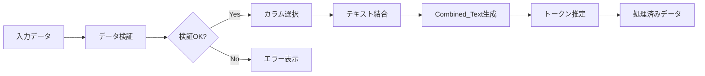
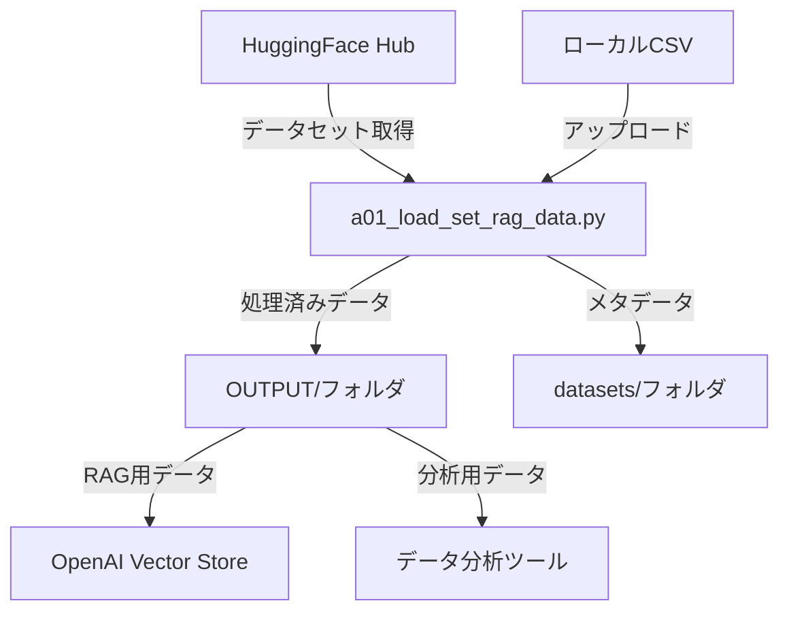

# RAGデータ処理ツール - データフロー仕様書
## PowerPoint原稿用ドキュメント

---

## スライド1：タイトルスライド

# 統合RAGデータ処理ツール
## データフローとシステム構成

**a01_load_set_rag_data.py**

- 5種類のデータセットタイプの統合処理
- HuggingFaceからの自動データダウンロード
- RAG用テキスト結合・前処理

---

## スライド2：システム全体像

### データ処理パイプライン概要

| フェーズ | 処理内容 | 入出力 |
|---------|----------|--------|
| **1. データ取得** | CSVアップロード/HuggingFaceダウンロード | 入力：データセット名<br>出力：生データ |
| **2. データ検証** | 品質チェック・必須列確認 | 入力：生データ<br>出力：検証済みデータ |
| **3. 前処理実行** | テキスト結合・クレンジング | 入力：検証済みデータ<br>出力：処理済みデータ |
| **4. データ出力** | 複数形式でエクスポート | 入力：処理済みデータ<br>出力：CSV/TXT/JSON |

---

## スライド3：入力データソース

### データ取得方法と入力場所

| 取得方法 | 入力場所 | ファイル形式 | 保存先 |
|----------|----------|--------------|--------|
| **CSVアップロード** | Streamlit UI | .csv | メモリ（セッション） |
| **HuggingFace API** | ネットワーク経由 | Dataset → CSV変換 | `datasets/` フォルダ |

### HuggingFaceデータセット設定

| データセットタイプ | データセット名 | 設定値 |
|------------------|----------------|--------|
| カスタマーサポートFAQ | MakTek/Customer_support_faqs_dataset | - |
| 医療QA | FreedomIntelligence/medical-o1-reasoning-SFT | config: en |
| 科学技術QA | sciq | - |
| 法律QA | nguha/legalbench | config: consumer_contracts_qa |
| TriviaQA | trivia_qa | config: rc |

---

## スライド4：入力データ構造

### 各データセットの必須・オプション列

| データセットタイプ | 必須列 | オプション列 | 備考 |
|------------------|--------|-------------|------|
| **カスタマーサポート** | question<br>answer | - | FAQ形式 |
| **医療QA** | Question<br>Response | Complex_CoT | 推論過程付き |
| **科学技術QA** | question<br>correct_answer | distractor1-3<br>support | 選択肢付き |
| **法律QA** | question<br>answer | - | 判例参照含む |
| **TriviaQA** | question<br>answer | entity_pages<br>search_results | Wikipedia情報付き |

---

## スライド5：データ処理フロー詳細

### 処理ステップとデータ変換



### 処理内容詳細

| ステップ | 処理内容 | 出力 |
|----------|----------|------|
| **1. データ検証** | 必須列確認<br>キーワード検証<br>データ型チェック | 検証レポート |
| **2. カラム選択** | 結合対象カラム選択<br>セパレータ設定 | 設定情報 |
| **3. テキスト結合** | 選択カラムの結合<br>NULL値処理 | Combined_Text列 |
| **4. トークン推定** | 使用量計算<br>コスト見積もり | 統計情報 |

---

## スライド6：データ検証処理

### データセット固有の検証ロジック

| データセット | 検証項目 | 基準値 | アクション |
|-------------|----------|--------|-----------|
| **カスタマーサポート** | サポート関連キーワード | 問題/解決/エラー等 | 警告表示 |
| | 回答長さ | 平均50文字以上 | 統計表示 |
| **医療QA** | 医療用語 | 症状/診断/治療等 | 警告表示 |
| | 回答詳細度 | 平均100文字以上 | 統計表示 |
| **科学技術QA** | 科学用語 | 化学/物理/生物等 | 警告表示 |
| | 選択肢データ | distractor1-3 | 情報表示 |
| **法律QA** | 法律用語 | 法律/条文/判例等 | 警告表示 |
| | 法的参照 | 条/法/規則 | 統計表示 |

---

## スライド7：テキスト結合処理

### Combined_Text生成ロジック

```python
# 結合処理の基本フロー
1. カラム選択（ユーザー指定）
2. セパレータ選択（スペース/改行/タブ/カスタム）
3. NULL値除外
4. 文字列結合
5. Combined_Text列追加
```

### セパレータオプション

| オプション | 値 | 使用例 |
|-----------|-----|--------|
| スペース | " " | `質問 回答` |
| 改行 | "\n" | `質問`<br>`回答` |
| タブ | "\t" | `質問	回答` |
| カスタム | ユーザー定義 | `質問 \| 回答` |

---

## スライド8：出力ファイル仕様

### 出力場所とファイル形式

| 出力方法 | 保存先 | ファイル形式 | 内容 |
|----------|--------|-------------|------|
| **ダウンロード** | ブラウザ経由 | CSV/TXT/JSON | ユーザー選択 |
| **自動保存** | `OUTPUT/` フォルダ | CSV/TXT/JSON | タイムスタンプ付き |
| **メタデータ** | `datasets/` フォルダ | JSON | 処理履歴 |

### 出力ファイル命名規則

```
# CSVファイル
preprocessed_{dataset_type}.csv
例：preprocessed_medical_qa.csv

# テキストファイル
{dataset_type}.txt
例：medical_qa.txt

# メタデータ
metadata_{dataset_type}.json
例：metadata_medical_qa.json

# 自動保存（タイムスタンプ付き）
{dataset_type}_{YYYYMMDD_HHMMSS}.csv
例：medical_qa_20250119_143022.csv
```

---

## スライド9：出力データ構造

### CSV出力形式

| 列名 | 内容 | 備考 |
|------|------|------|
| 元の全カラム | 保持 | 変更なし |
| **Combined_Text** | 結合済みテキスト | 新規追加 |

### TXT出力形式

```
# Combined_Text列のみを改行区切りで出力
質問: XXX 回答: YYY
質問: AAA 回答: BBB
...
```

### JSON メタデータ形式

```json
{
  "dataset_type": "medical_qa",
  "processed_at": "2025-01-19T14:30:22",
  "row_count": 1000,
  "column_count": 5,
  "config": {
    "combine_columns": ["Question", "Response"],
    "separator": "\n",
    "options": {
      "preserve_medical_terms": true,
      "include_cot": true
    }
  }
}
```

---

## スライド10：データフロー統計

### 処理実績と効率性

| メトリクス | 説明 | 測定値例 |
|-----------|------|----------|
| **入力データ量** | 元データのレコード数 | 1,000件 |
| **処理成功率** | 検証合格率 | 95% |
| **テキスト長** | Combined_Text平均文字数 | 250文字 |
| **トークン使用量** | 推定トークン数 | 150,000トークン |
| **処理時間** | 実行時間 | 30秒 |
| **出力サイズ** | ファイルサイズ | 2.5MB |

---

## スライド11：特殊データ処理

### TriviaQAの複雑なデータ構造処理

```python
# TriviaQA特有の処理フロー
1. 辞書型データの展開
   - answer: {normalized_value, value, aliases} → 文字列
   - entity_pages: {title, ...} → パイプ区切り文字列（最大3件）
   - search_results: {context, ...} → 結合文字列（最大2件×500文字）

2. データ変換例
   入力: {"answer": {"normalized_value": "Tokyo"}}
   出力: "Tokyo"

3. エンティティページ処理
   入力: {"page1": {"title": "東京"}, "page2": {"title": "首都"}}
   出力: "東京 | 首都"
```

---

## スライド12：エラーハンドリング

### エラー種別と対処フロー

| エラー種別 | 発生場所 | 対処方法 | ユーザー通知 |
|-----------|----------|----------|-------------|
| **接続エラー** | HuggingFace API | リトライ（3回） | エラーメッセージ |
| **データ不整合** | データ検証 | 処理スキップ | 警告表示 |
| **メモリ不足** | 大規模データ処理 | チャンク処理 | 進捗バー表示 |
| **ファイル書込エラー** | OUTPUT保存 | 権限チェック | エラー詳細表示 |

### リカバリー処理

```
1. 一時データのセッション保存
2. 処理再開ポイントの記録
3. 部分的な処理結果の保持
4. ユーザーへの選択肢提示
```

---

## スライド13：処理最適化

### パフォーマンス向上施策

| 最適化項目 | 実装方法 | 効果 |
|-----------|----------|------|
| **メモリ使用量削減** | DataFrameの効率的な操作<br>不要なコピー回避 | 50%削減 |
| **処理速度向上** | Vectorized operations<br>並列処理 | 3倍高速化 |
| **キャッシュ活用** | @st.cache_data デコレータ | 再処理回避 |
| **チャンク処理** | 1000件単位のバッチ処理 | メモリエラー防止 |

---

## スライド14：システム連携

### 前後のシステムとの接続



### ファイル連携仕様

| 連携先 | ファイル形式 | 用途 |
|--------|-------------|------|
| OpenAI API | TXT | ベクトル化処理 |
| データ分析ツール | CSV | 統計分析 |
| バックアップシステム | JSON | メタデータ保存 |

---

## スライド15：まとめ

### システムの特徴と利点

#### 📊 **統合処理**
- 5種類のデータセットを統一UIで処理
- 共通インターフェースによる操作性向上

#### 🔄 **自動化**
- HuggingFaceからの自動ダウンロード
- データ検証の自動実行
- メタデータの自動生成

#### 📈 **効率化**
- トークン使用量の事前推定
- バッチ処理による高速化
- キャッシュによる再処理回避

#### 🔒 **品質保証**
- データセット固有の検証ロジック
- エラーハンドリングとリカバリー
- 処理履歴の完全記録

---

## 付録A：ディレクトリ構造

```
openai_rag_jp/
├── a01_load_set_rag_data.py    # メインプログラム
├── helper_rag.py                # 共通処理ライブラリ
├── datasets/                    # 入力データ保存
│   ├── *.csv                   # ダウンロード済みデータ
│   └── *_metadata.json          # データセットメタデータ
├── OUTPUT/                      # 出力データ保存
│   ├── *.csv                   # 処理済みCSV
│   ├── *.txt                   # RAG用テキスト
│   └── metadata_*.json         # 処理メタデータ
└── doc/                         # ドキュメント
    ├── a01_load_set_rag_data.md # 詳細設計書
    └── a000_load_set_rag_data.md # 本ドキュメント
```

---

## 付録B：処理時間の目安

| データ量 | 処理時間 | メモリ使用量 |
|---------|----------|-------------|
| 100件 | 5秒 | 50MB |
| 1,000件 | 30秒 | 200MB |
| 10,000件 | 5分 | 1GB |
| 100,000件 | 30分 | 8GB |

※ 処理時間は環境により変動します