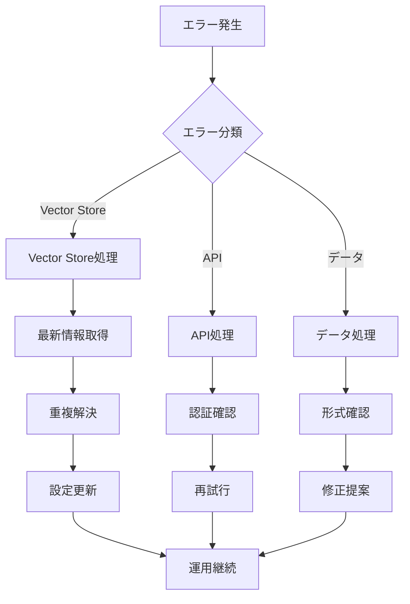

# a00_cloud_rag - OpenAI Cloud RAGシステム

## 概要

OpenAIのVector StoreとResponses APIを活用したクラウドベースRAG（Retrieval-Augmented Generation）システム。Vector Storeの自動作成・管理からfile_search機能を使った高精度検索まで、完全統合されたRAGワークフローを提供する。

### システム構成

本システムは2つの主要コンポーネントで構成されています：

1. **a02_make_vsid.py** (a30_020_make_vsid.py): Vector Store作成・管理システム
2. **a03_rag_search.py** (a30_30_rag_search.py): RAG検索Webアプリケーション

## 処理手順（Vector Store作成から検索まで）

### 1. 環境準備

```bash
# OpenAI APIキー設定
export OPENAI_API_KEY=sk-...

# 必要なパッケージインストール
pip install streamlit openai pandas PyYAML pathlib
```

### 2. Vector Store作成（初期セットアップ）

```bash
# StreamlitでVector Store作成UI起動
streamlit run a02_make_vsid.py

# ブラウザでアクセス
# http://localhost:8501
```

**作成手順**:
1. データセット選択（医療QA、FAQ、科学技術QA、法律QA）
2. 「Vector Store作成」ボタンクリック
3. 処理進捗確認・結果ダウンロード
4. Vector Store IDの記録

### 3. RAG検索システム起動（日常運用）

```bash
# RAG検索WebUI起動
streamlit run a03_rag_search.py --server.port=8502

# ブラウザでアクセス  
# http://localhost:8502
```

### 4. 統合ワークフロー

```
データ準備 → Vector Store → クラウド保存 → RAG検索 → 高品質回答
    ↓           ↓            ↓           ↓          ↓
 CSVファイル → 埋め込み → OpenAI Cloud → file_search → 引用付き回答
```

## 主な機能

### Vector Store作成機能（a02_make_vsid.py）

- **多様なデータセット対応**: 医療・FAQ・科学技術・法律の4分野
- **最適化された分割設定**: 分野ごとの専用チャンクサイズ設定
- **リアルタイム進捗表示**: 作成状況のリアルタイム監視
- **自動制限システム**: データサイズに応じた動的制限
- **結果管理**: 作成結果のダウンロード・履歴管理

### RAG検索機能（a03_rag_search.py）

- **最新Responses API**: OpenAI最新APIによる高品質回答生成
- **file_search統合**: Vector Store統合検索機能
- **動的Vector Store管理**: 重複問題解決・最新優先選択
- **多言語対応**: 日本語質問で英語データ検索可能
- **引用表示**: 検索結果の出典明示
- **履歴管理**: 検索履歴の保存・再実行

## システムアーキテクチャ

### データ処理フロー（Vector Store作成）

1. **データロード**: CSVファイルからテキスト抽出
2. **前処理**: テキストクレンジング・短文除去
3. **チャンク分割**: 分野別最適チャンクサイズで分割
4. **JSONL変換**: OpenAI形式での構造化
5. **Vector Store作成**: OpenAI APIでクラウド保存
6. **監視・完了**: ステータス監視・結果取得

### 検索処理フロー（RAG検索）

1. **Vector Store選択**: 動的管理による最新ID取得
2. **クエリ処理**: ユーザー質問の受付・処理
3. **file_search実行**: OpenAI file_searchツール実行
4. **知識検索**: Vector Storeからの関連文書取得
5. **回答生成**: Responses APIによる高品質回答
6. **引用抽出**: 検索結果からの出典情報抽出
7. **結果表示**: 回答・引用・履歴の統合表示

## 設定ファイル・連携

### helper_*.py連携

システムは既存のhelperモジュールと連携：

```python
# helper_api.py: OpenAI APIクライアント管理
# helper_rag.py: RAG処理ユーティリティ  
# helper_st.py: Streamlit UI共通機能

# 連携例
try:
    import helper_api as hapi
    client = hapi.get_openai_client()  # 統一クライアント使用
except Exception:
    client = OpenAI()  # フォールバック
```

### Vector Store設定（vector_stores.json）

```json
{
    "vector_stores": {
        "Customer Support FAQ": "vs_687a0604f1508191aaf416d88e266ab7",
        "Medical Q&A": "vs_687a060f9ed881918b213bfdeab8241b",
        "Science & Technology Q&A": "vs_687a061acc908191af7d5d9ba623470b",
        "Legal Q&A": "vs_687a062418ec8191872efdbf8f554836"
    },
    "last_updated": "2025-08-30T12:34:56.789Z",
    "source": "a03_rag_search.py",
    "version": "1.1"
}
```

## 分野別データセット設定

### 医療QA（最大規模データセット）
```yaml
設定:
  chunk_size: 16000        # 16KB - 最大チャンクサイズ
  overlap: 300            # 300文字オーバーラップ
  max_file_size_mb: 20    # 20MB制限
  max_chunks_per_file: 6000  # 6,000チャンク制限
  特別制限:
    - 第1段階: 5,000チャンク制限
    - 第2段階: 15MB動的削減
    - 最低保証: 1,000チャンク
```

### カスタマーサポートFAQ
```yaml
設定:
  chunk_size: 2000        # 2KB - 標準サイズ
  overlap: 100           # 100文字オーバーラップ
  max_file_size_mb: 30   # 30MB制限
  max_chunks_per_file: 4000  # 4,000チャンク制限
```

### 科学技術QA
```yaml
設定:
  chunk_size: 2000        # 2KB - 標準サイズ
  overlap: 100           # 100文字オーバーラップ
  max_file_size_mb: 25   # 25MB制限
  max_chunks_per_file: 8000  # 8,000チャンク制限
```

### 法律QA
```yaml
設定:
  chunk_size: 3000        # 3KB - 大きめサイズ
  overlap: 150           # 150文字オーバーラップ
  max_file_size_mb: 25   # 25MB制限
  max_chunks_per_file: 6000  # 6,000チャンク制限
```

## 重複Vector Store問題の解決

### 問題と解決策

**問題**: 同名Vector Storeが複数存在し、古いIDが選択される
**解決**: 作成日時ベースの最新優先選択システム


### VectorStoreManagerクラス

```python
class VectorStoreManager:
    def fetch_latest_vector_stores(self):
        # 1. API から全Vector Store取得
        # 2. 作成日時で降順ソート
        # 3. 表示名でグループ化
        # 4. 各グループから最新IDを選択
        # 5. 重複解決完了
```

## API設定・パラメータ

### Responses API設定

```python
responses_config = {
    "model": "gpt-4o-mini",
    "tools": [{
        "type": "file_search",
        "vector_store_ids": ["vs_xxx..."],  # 動的取得
        "max_num_results": 20,              # カスタマイズ可能
        "filters": None
    }],
    "include": ["file_search_call.results"],
    "timeout": 30,
    "max_retries": 3
}
```

### Vector Store作成パラメータ

| パラメータ | デフォルト | 説明 |
|----------|----------|------|
| **max_wait_time** | 600秒 | Vector Store作成タイムアウト |
| **status_check_interval** | 5秒 | ステータスチェック間隔 |
| **min_line_length** | 10文字 | テキスト行フィルタリング基準 |
| **boundary_search_range** | 50% | チャンク境界調整範囲 |

## 多言語埋め込み機能

OpenAIの埋め込みモデルの多言語対応により：

- **日本語質問 ↔ 英語データ**: 意味的マッチング
- **翻訳処理不要**: 直接ベクトル比較
- **高精度検索**: 言語境界を越えた検索

例: 「返金は可能ですか？」⟷「Can I get a refund?」（類似度0.85+）

## 分野別サンプル質問

### Customer Support FAQ
- "返金は可能ですか？"
- "配送にはどのくらい時間がかかりますか？"
- "アカウントを作成するにはどうすればよいですか？"

### Medical Q&A
- "副作用はありますか？"
- "心房細動の症状について教えてください"
- "糖尿病の管理方法は何ですか？"

### Science & Technology Q&A
- "チーズやヨーグルトなどの食品の調製に一般的に使用される生物のタイプは何ですか？"
- "放射性崩壊の最も危険性の低いタイプは何ですか？"
- "物質が酸素と迅速に反応するときに起こる反応の種類は何ですか？"

### Legal Q&A
- "Googleは私が作成したコンテンツに基づいて新しいコンテンツを作成することが許可されていますか？"
- "ユーザー生成コンテンツの修正からなる派生作品を作成することはGoogleの法的権利内ですか？"

## 技術仕様

### 依存ライブラリ
- **streamlit**: Web UIフレームワーク
- **openai**: OpenAI APIクライアント（1.x+）
- **pandas**: データ処理・テーブル表示
- **PyYAML**: 設定ファイル処理（オプション）
- **pathlib**: ファイルパス操作
- **tempfile**: 一時ファイル管理
- **json**: JSON処理
- **datetime**: 時刻処理
- **logging**: ログ管理

### パフォーマンス考慮
- **バッチ処理**: 効率的な埋め込み生成・Vector Store作成
- **キャッシュシステム**: 5分間有効期限でのパフォーマンス最適化  
- **段階的制限**: 大規模データの動的サイズ制限
- **タイムアウト設定**: 長時間処理の適切な制限

## エラーハンドリング

### Vector Store作成エラー

| エラー種別 | 原因 | 対処法 | 影響度 |
|-----------|------|--------|--------|
| **ファイルサイズ超過** | OpenAI制限超過 | チャンクサイズ調整・データ分割 | 中 |
| **API認証エラー** | 不正なAPIキー | キー確認・再設定指示 | 高 |
| **作成タイムアウト** | 処理時間超過 | 待機時間延長・データ削減 | 中 |
| **データ形式不正** | CSV構造問題 | 形式確認・修正提案 | 中 |

### RAG検索エラー

| エラー種別 | 原因 | 対処法 | 影響度 |
|-----------|------|--------|--------|
| **重複Vector Store** | 同名Store複数 | 最新ID自動選択・解決 | 中 |
| **Vector Store不存在** | 無効ID指定 | 最新情報更新・再選択 | 高 |
| **検索API失敗** | OpenAI API障害 | エラーメッセージ・リトライ | 中 |
| **設定ファイル破損** | JSON不正 | デフォルト値フォールバック | 中 |

### エラー対処フロー



## 運用上の特徴

### 高信頼性
- **重複問題完全解決**: 安定した検索品質の保証
- **フォールバック機能**: API障害時の継続運用
- **自動回復**: エラーからの自動復旧機能

### メンテナンス性
- **直感的UI**: ブラウザベースの管理インターフェース
- **デバッグ機能**: 詳細な内部状態確認
- **ログ出力**: 問題解決のための詳細記録

### スケーラビリティ
- **新規Vector Store認識**: 自動的な新規作成物の取り込み
- **動的設定**: 運用中の設定変更対応
- **拡張可能設計**: 新しいデータセット・分野の追加容易

## カスタマイズポイント

- **新しいデータセット追加**: 分野別設定の拡張
- **チャンクサイズ調整**: 各分野の最適化
- **UI カスタマイズ**: Streamlitレイアウト変更
- **検索オプション**: file_searchパラメータ調整
- **多言語対応**: UI・質問例の多言語化
- **認証システム**: ユーザー管理機能追加

## 今後の拡張可能性

- **マルチテナント対応**: 複数組織でのVector Store管理
- **A/Bテスト機能**: 複数Vector Storeでの比較検索
- **分析ダッシュボード**: 検索統計・利用状況分析
- **API化**: REST API経由での外部システム連携
- **バッチ処理**: 大量クエリの並行処理
- **コスト最適化**: 使用量ベースの動的最適化

## 運用上の注意点

1. **APIキー管理**: 環境変数での安全な管理必須
2. **Vector Store容量**: OpenAI制限を考慮した運用計画
3. **コスト管理**: 埋め込み生成・検索コストの監視
4. **定期メンテナンス**: Vector Store の定期的な更新・整理
5. **バックアップ**: 設定ファイル・重要データのバックアップ
6. **モニタリング**: システム稼働状況・エラー率の監視