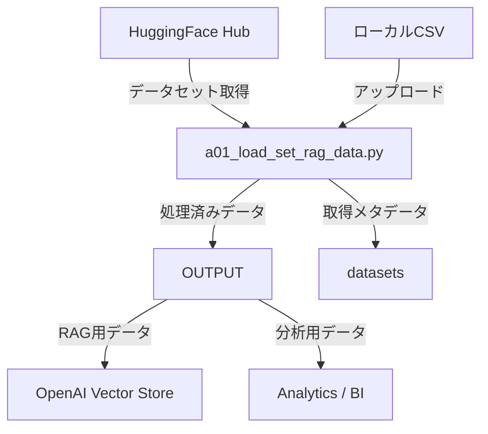
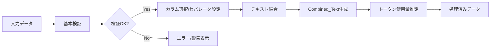

## a01_load_set_rag_data データ入力・加工・出力（統合版）

本資料は、a01_load_set_rag_data.py による「入力→検証→前処理→出力」までのデータの流れを、入力場所・入力ファイル・加工内容・出力場所・出力ファイルにフォーカスして統合整理したものです。

---

## 全体像（データ処理図）



---

## 入力（Where/What）

### 入力経路と保存先

| 取得方法 | 入力場所 | 入力ファイル/形式 | 即時保存先 | 備考 |
|----------|----------|------------------|------------|------|
| CSVアップロード | Streamlit UI | CSV（UTF-8） | メモリ（セッション） | 必須列はデータセット種別に依存 |
| HuggingFace | ネットワーク | Dataset → CSV化 | `datasets/` | CSVとメタデータJSONを自動保存 |

### HuggingFaceデータセット設定

| データセットタイプ | データセット名 | 設定値 |
|------------------|----------------|--------|
| カスタマーサポートFAQ | MakTek/Customer_support_faqs_dataset | - |
| 医療QA | FreedomIntelligence/medical-o1-reasoning-SFT | config: en |
| 科学技術QA | sciq | - |
| 法律QA | nguha/legalbench | config: consumer_contracts_qa |
| TriviaQA | trivia_qa | config: rc |

### データセット別の必須列（UI表示基準）

| データセット | 必須列 | 備考 |
|---|---|---|
| customer_support_faq | question, answer | FAQのQ/A |
| medical_qa | Question, Complex_CoT, Response | 実データにComplex_CoTが無い場合も読込可（UIは必須表示） |
| sciq_qa | question, correct_answer | distractor1..3, support があれば活用 |
| legal_qa | question, answer | 法的参照語を検証で確認 |
| trivia_qa | question, answer | entity_pages, search_results を抽出・要約 |

---

## 加工（Processing）

### 処理ステップ（フロー）



### 基本検証と固有検証

| 区分 | 主な検証 | 補足 |
|---|---|---|
| 基本検証 | 必須列の存在、空値/重複チェック、基本統計 | helper_rag.validate_data |
| カスタマーサポート | サポート関連語の有無、回答平均長 | 例: 問題/解決/エラー 等 |
| 医療QA | 医療語の有無、Complex_CoTの充足率、回答平均長 | 例: 症状/診断/治療 等 |
| SciQ | 科学語、distractor/support の有無 | 例: 化学/物理/生物 等 |
| 法律QA | 法律用語、条/法/規則/判例の参照有無、長さ分布 | |

### Combined_Text 生成とセパレータ

- 既定: データセット主要列をスペースで自然結合（helper_rag.combine_columns）
- UI: 結合対象カラムとセパレータ（スペース/改行/タブ/カスタム）を選択して `Combined_Text` を上書き可能

| セパレータ | 表記 | 使用例 |
|---|---|---|
| スペース | " " | `質問 回答` |
| 改行 | "\n" | "質問\n回答" |
| タブ | "\t" | `質問\t回答` |
| カスタム | 任意文字列 | `質問 | 回答` など |

### トークン使用量推定
- `Combined_Text` のサンプルから全体トークン数を推定し、概算コストを表示

---

## 出力（Where/What）

### 出力場所とファイル形式

| 出力方法 | 保存先 | ファイル名 | 形式 | 内容 |
|---|---|---|---|---|
| ダウンロード | ブラウザ | `preprocessed_<dataset_type>.csv` | CSV | 元列＋Combined_Text を保持 |
| ダウンロード | ブラウザ | `<dataset_type>.txt` | TXT | Combined_Text のみ（1行1件） |
| ダウンロード | ブラウザ | `metadata_<dataset_type>.json` | JSON | 実行時設定・行数等のメタ情報 |
| 保存 | `OUTPUT/` | `preprocessed_<dataset_type>.csv` | CSV | 同上 |
| 保存 | `OUTPUT/` | `<dataset_type>.txt` | TXT | 同上（Combined_Textあり時） |
| 保存 | `OUTPUT/` | `metadata_<dataset_type>.json` | JSON | 保存時メタ情報 |
| 取得保存 | `datasets/` | `<dataset>_<split>_<samples>_<ts>.csv` | CSV | HFダウンロードの原データ |
| 取得保存 | `datasets/` | `<dataset>_<split>_<samples>_<ts>_metadata.json` | JSON | HF取得条件・列情報 |

注記: `<ts>` はタイムスタンプ、`<dataset>` は `MakTek/Customer_support_faqs_dataset` 等を `/`→`_` 置換した値。

---

## 参考：処理内容詳細（要約）

| ステップ | 主処理 | 主な出力 |
|---|---|---|
| データ検証 | 必須列・空値・重複・基本統計 | 検証メッセージ |
| カラム選択 | 結合対象の選択、セパレータ設定 | 設定情報（セッション） |
| テキスト結合 | 選択カラムの結合、NULL除外 | `Combined_Text` 追加 |
| トークン推定 | 概算トークン計算・コスト見積 | 推定値/メトリクス |

---

## ディレクトリ構造（抜粋）

```
openai_rag_jp/
├── a01_load_set_rag_data.py
├── helper_rag.py
├── datasets/
│   ├── <dataset>_<split>_<samples>_<ts>.csv
│   └── <dataset>_<split>_<samples>_<ts>_metadata.json
├── OUTPUT/
│   ├── preprocessed_<dataset_type>.csv
│   ├── <dataset_type>.txt
│   └── metadata_<dataset_type>.json
└── doc/
    └── a00_locad_set_data.md  ← 本ドキュメント
```

---

## トラブルシューティング（抜粋）

| 症状 | 原因 | 対処 |
|---|---|---|
| HFからロードできない | `datasets` 未インストール | `pip install datasets` を実行 |
| 検証エラー | 必須列不足/命名不一致 | 列名確認・必要に応じてリネーム |
| 文字化け | エンコーディング不一致 | UTF-8で保存・読み込み |
| 保存失敗 | 権限/容量不足 | OUTPUT権限と空き容量を確認 |

