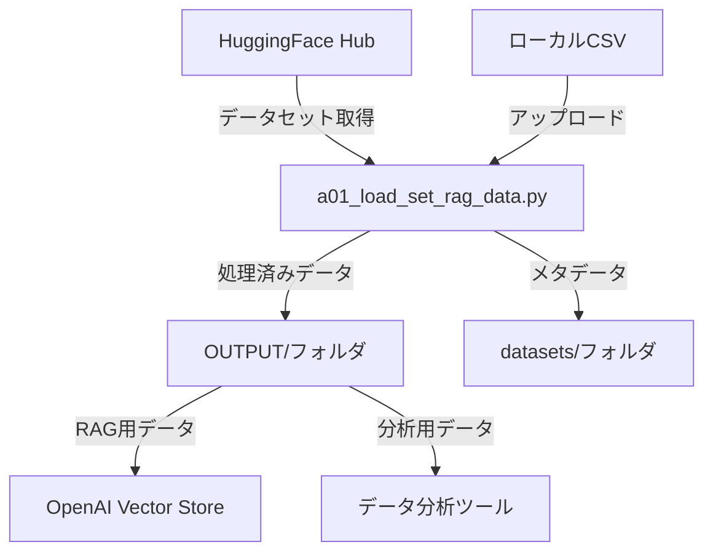
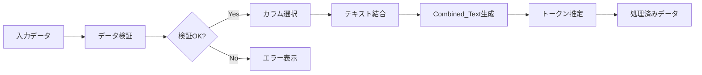

## データ処理図

## 入力データ
### HuggingFaceデータセット設定

| データセットタイプ | データセット名 | 設定値 |
|------------------|----------------|--------|
| カスタマーサポートFAQ | MakTek/Customer_support_faqs_dataset | - |
| 医療QA | FreedomIntelligence/medical-o1-reasoning-SFT | config: en |
| 科学技術QA | sciq | - |
| 法律QA | nguha/legalbench | config: consumer_contracts_qa |
| TriviaQA | trivia_qa | config: rc |

## データセット別の必須列
- UIの「必須列」は RAGConfig に準拠

| データセット | 必須列（UI表示） | 補足 |
|---|---|---|
| customer_support_faq | `question`, `answer` | FAQ形式のQ/A |
| medical_qa | `Question`, `Complex_CoT`, `Response` | Complex_CoTがないデータでも読み込みは可能だが、UI上は必須表示 |
| sciq_qa | `question`, `correct_answer` | `distractor1..3`, `support`があれば活用 |
| legal_qa | `question`, `answer` | 法的参照語の混入有無を検証で確認 |
| trivia_qa | `question`, `answer` | `entity_pages`, `search_results`を抽出・要約して活用 |

## データ処理フロー詳細

### 処理ステップとデータ変換

### ファイル連携仕様

| 連携先 | ファイル形式 | 用途 |
|--------|-------------|------|
| OpenAI API | TXT | ベクトル化処理 |
| データ分析ツール | CSV | 統計分析 |
| バックアップシステム | JSON | メタデータ保存 |

## 出力ファイル仕様

### 出力場所とファイル形式

| 出力方法 | 保存先 | ファイル形式 | 内容 |
|----------|--------|-------------|------|
| **ダウンロード** | ブラウザ経由 | CSV/TXT/JSON | ユーザー選択 |
| **自動保存** | `OUTPUT/` フォルダ | CSV/TXT/JSON | タイムスタンプ付き |
| **メタデータ** | `datasets/` フォルダ | JSON | 処理履歴 |

