# 📋 a10_00_responses_api.py 設計書

## 📝 目次

1. [📖 概要書](#📖-概要書)
2. [🔧 システム構成](#🔧-システム構成)
3. [📋 関数一覧](#📋-関数一覧)
4. [📑 関数詳細設計](#📑-関数詳細設計)
5. [⚙️ 技術仕様](#⚙️-技術仕様)
6. [🚨 エラーハンドリング](#🚨-エラーハンドリング)

---

## 📖 概要書

### 🎯 処理の概要

**OpenAI Responses API 統合デモアプリケーション**

本アプリケーションは、OpenAI Responses APIの包括的な機能を体験できるStreamlit Webアプリケーションです。基本的なテキスト生成から高度なマルチモーダル処理、構造化出力、外部API連携まで、OpenAI APIの主要機能を9つの統合デモで学習・体験できます。

#### 🌟 主要機能

| 機能 | 説明 |
|------|------|
| 🤖 **テキスト応答** | ワンショット・メモリ対応の対話システム |
| 🖼️ **マルチモーダル** | 画像入力（URL・Base64）からテキスト生成 |
| 📊 **構造化出力** | Pydanticモデルによる型安全な出力 |
| 🌤️ **外部API連携** | OpenWeatherMap APIとの統合 |
| 📁 **ファイル検索** | Vector Store使用のRAG機能 |
| 🌐 **Web検索** | リアルタイムWeb検索ツール |
| 💻 **Computer Use** | AI自動操作デモ |
| 🧠 **推論モデル** | o1/o3/o4シリーズ対応 |
| ⚙️ **統一設定** | モデル横断的な設定管理 |

#### 🎨 処理対象データ

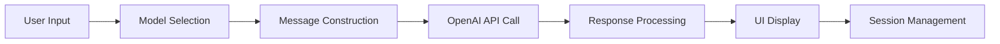

### 🔄 mainの処理の流れ

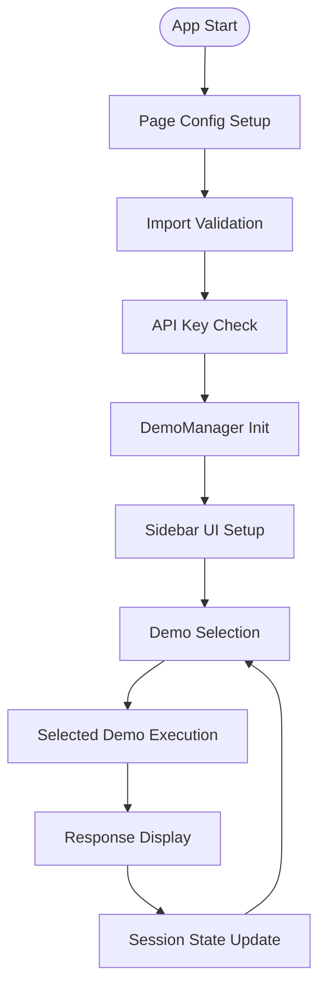

---

## 🔧 システム構成

### 📦 主要コンポーネント

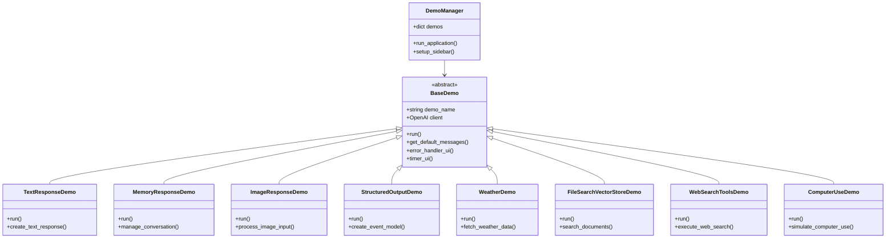

### 📋 データフロー

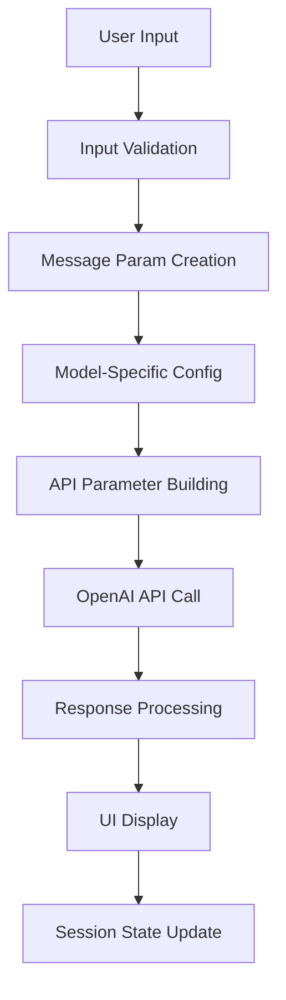

---

## 📋 関数一覧

### 🏗️ アプリケーション制御関数

| 関数名 | 分類 | 処理概要 | 重要度 |
|--------|------|----------|---------|
| `main()` | 🎯 制御 | アプリケーションエントリーポイント | ⭐⭐⭐ |
| `DemoManager.run_application()` | 🎯 制御 | デモ統合管理・実行制御 | ⭐⭐⭐ |
| `DemoManager.setup_sidebar()` | 🎨 UI | サイドバー設定・デモ選択UI | ⭐⭐⭐ |

### 🏭 抽象基底クラス関数

| 関数名 | 分類 | 処理概要 | 重要度 |
|--------|------|----------|---------|
| `BaseDemo.__init__()` | 🔧 初期化 | デモ基盤初期化・クライアント設定 | ⭐⭐⭐ |
| `BaseDemo.run()` | 🎯 制御 | 抽象デモ実行メソッド | ⭐⭐⭐ |
| `BaseDemo.get_default_messages()` | 📝 構築 | デフォルトメッセージ構築 | ⭐⭐ |
| `BaseDemo.error_handler_ui()` | 🛡️ 保護 | UI統合エラーハンドリング | ⭐⭐⭐ |
| `BaseDemo.timer_ui()` | 📊 計測 | 実行時間計測デコレータ | ⭐⭐ |

### 🤖 デモ実装関数

#### TextResponseDemo
| 関数名 | 分類 | 処理概要 | 重要度 |
|--------|------|----------|---------|
| `TextResponseDemo.run()` | 🎯 実行 | テキスト応答デモ実行 | ⭐⭐⭐ |

#### MemoryResponseDemo  
| 関数名 | 分類 | 処理概要 | 重要度 |
|--------|------|----------|---------|
| `MemoryResponseDemo.run()` | 🎯 実行 | 記憶対応対話デモ実行 | ⭐⭐⭐ |

#### ImageResponseDemo
| 関数名 | 分類 | 処理概要 | 重要度 |
|--------|------|----------|---------|
| `ImageResponseDemo.run()` | 🎯 実行 | 画像応答デモ実行（URL・Base64） | ⭐⭐⭐ |

#### StructuredOutputDemo
| 関数名 | 分類 | 処理概要 | 重要度 |
|--------|------|----------|---------|
| `StructuredOutputDemo.run()` | 🎯 実行 | 構造化出力デモ実行 | ⭐⭐⭐ |

#### WeatherDemo
| 関数名 | 分類 | 処理概要 | 重要度 |
|--------|------|----------|---------|
| `WeatherDemo.run()` | 🎯 実行 | 天気API連携デモ実行 | ⭐⭐⭐ |

#### FileSearchVectorStoreDemo
| 関数名 | 分類 | 処理概要 | 重要度 |
|--------|------|----------|---------|
| `FileSearchVectorStoreDemo.run()` | 🎯 実行 | ファイル検索デモ実行 | ⭐⭐⭐ |

#### WebSearchToolsDemo
| 関数名 | 分類 | 処理概要 | 重要度 |
|--------|------|----------|---------|
| `WebSearchToolsDemo.run()` | 🎯 実行 | Web検索デモ実行 | ⭐⭐⭐ |

#### ComputerUseDemo
| 関数名 | 分類 | 処理概要 | 重要度 |
|--------|------|----------|---------|
| `ComputerUseDemo.run()` | 🎯 実行 | Computer Useデモ実行 | ⭐⭐ |

---

## 📑 関数詳細設計

### 🎯 main()

#### 🎯 処理概要
アプリケーション全体のエントリーポイント・初期化・実行制御

#### 📊 処理の流れ
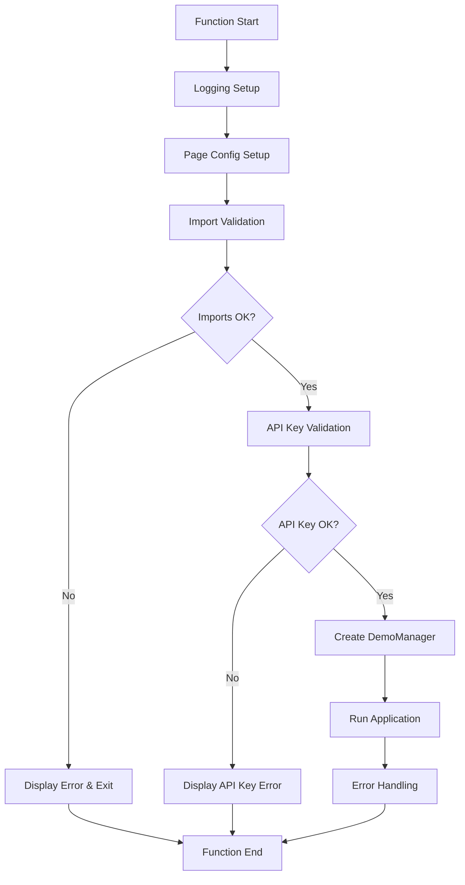

#### 📋 IPO設計

| 項目 | 内容 |
|------|------|
| **INPUT** | 環境変数 (`OPENAI_API_KEY`)、設定ファイル (`config.yml`) |
| **PROCESS** | 初期化 → 検証 → DemoManager作成 → アプリ実行 |
| **OUTPUT** | Streamlit Webアプリケーション起動 |

---

### 🏗️ BaseDemo (抽象基底クラス)

#### 🎯 処理概要
全デモの共通基盤・統一インターフェース・エラーハンドリング提供

#### 📊 処理の流れ
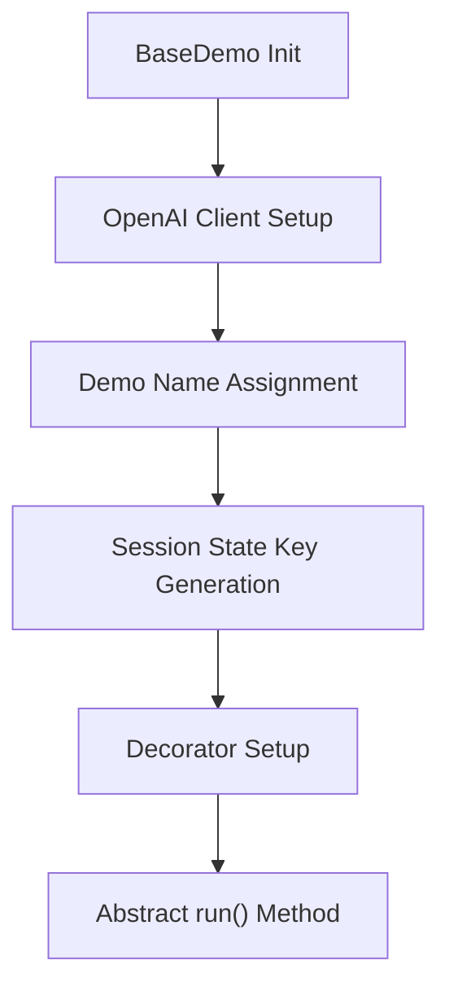

#### 📋 IPO設計

| 項目 | 内容 |
|------|------|
| **INPUT** | `demo_name: str`、OpenAI APIキー |
| **PROCESS** | クライアント初期化 → セッション管理 → デコレータ適用 |
| **OUTPUT** | 統一されたデモ実行基盤 |

---

### 🤖 TextResponseDemo.run()

#### 🎯 処理概要
基本的なテキスト応答デモ・ワンショット対話実装

#### 📊 処理の流れ
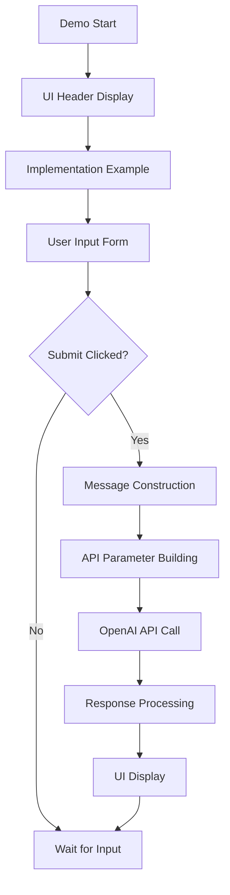

#### 📋 IPO設計

| 項目 | 内容 |
|------|------|
| **INPUT** | ユーザークエリ、モデル選択、温度設定 |
| **PROCESS** | メッセージ構築 → API呼び出し → 応答処理 |
| **OUTPUT** | AI生成テキスト応答、実行統計 |

---

### 🧠 MemoryResponseDemo.run()

#### 🎯 処理概要
会話履歴管理・文脈保持対話システム実装

#### 📊 処理の流れ
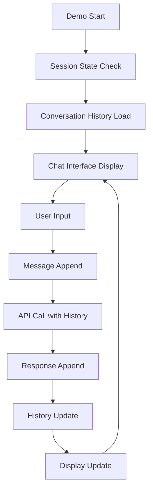

#### 📋 IPO設計

| 項目 | 内容 |
|------|------|
| **INPUT** | 連続対話入力、会話履歴 |
| **PROCESS** | 履歴管理 → 文脈保持 → API呼び出し → 履歴更新 |
| **OUTPUT** | 文脈考慮済AI応答、会話履歴 |

---

### 🖼️ ImageResponseDemo.run()

#### 🎯 処理概要  
画像入力（URL・Base64）からテキスト生成・マルチモーダル処理

#### 📊 処理の流れ
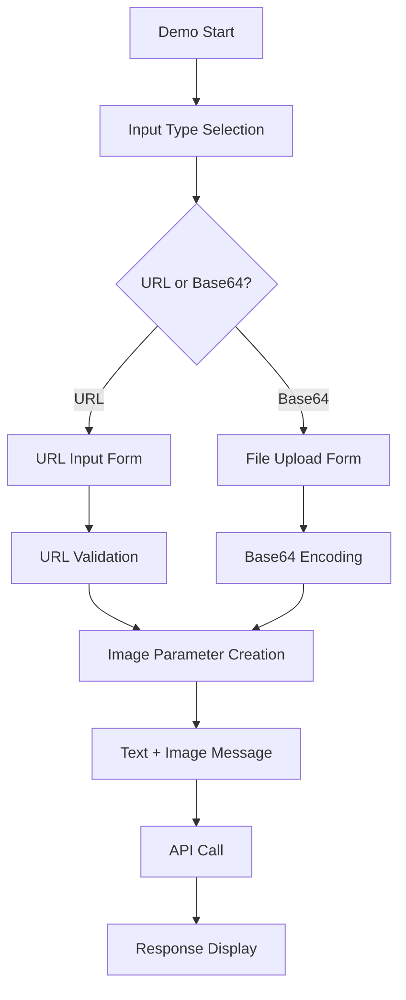

#### 📋 IPO設計

| 項目 | 内容 |
|------|------|
| **INPUT** | 画像URL or ファイル、テキストクエリ |
| **PROCESS** | 画像処理 → マルチモーダルメッセージ構築 → API呼び出し |
| **OUTPUT** | 画像分析結果テキスト |

---

### 📊 StructuredOutputDemo.run()

#### 🎯 処理概要
Pydanticモデルによる構造化JSON出力・型安全処理

#### 📊 処理の流れ
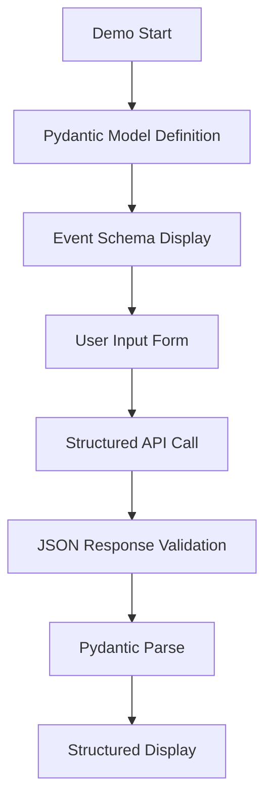

#### 📋 IPO設計

| 項目 | 内容 |
|------|------|
| **INPUT** | イベント情報、JSONスキーマ |
| **PROCESS** | Pydanticモデル定義 → 構造化API呼び出し → 検証 |
| **OUTPUT** | 構造化JSON、Eventオブジェクト |

---

### 🌤️ WeatherDemo.run()

#### 🎯 処理概要
OpenWeatherMap API統合・外部API連携デモ

#### 📊 処理の流れ
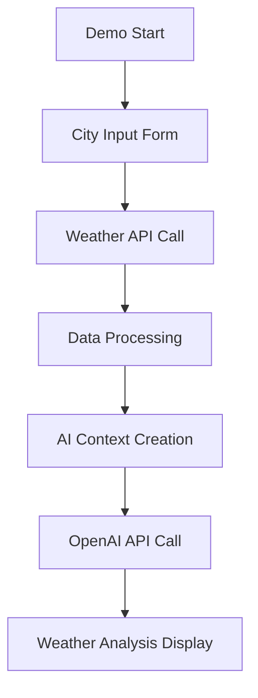

#### 📋 IPO設計

| 項目 | 内容 |
|------|------|
| **INPUT** | 都市名、OpenWeatherMap APIキー |
| **PROCESS** | 天気データ取得 → AI分析 → 結果統合 |
| **OUTPUT** | 天気情報、AI分析結果 |

---

## ⚙️ 技術仕様

### 📦 依存ライブラリ

| ライブラリ | バージョン | 用途 | 重要度 |
|-----------|-----------|------|---------|
| `streamlit` | 最新 | 🎨 Web UIフレームワーク | ⭐⭐⭐ |
| `openai` | 最新 | 🤖 OpenAI API SDK | ⭐⭐⭐ |
| `pydantic` | 最新 | 📊 データ検証・構造化 | ⭐⭐⭐ |
| `requests` | 最新 | 🌐 HTTP通信 | ⭐⭐ |
| `pandas` | 最新 | 📈 データ操作 | ⭐⭐ |

### 🗃️ モデル対応

#### 📋 対応モデルカテゴリ

```yaml
Model_Categories:
  reasoning: ["o1", "o3", "o4", "o1-pro"]
  standard: ["gpt-4o", "gpt-4o-mini", "gpt-4.1", "gpt-4.1-mini"]
  vision: ["gpt-5", "gpt-4o", "gpt-4o-mini"]
  frontier: ["gpt-5", "gpt-5-mini", "gpt-5-nano"]
```

#### ⚙️ モデル固有設定

```python
# 推論モデル判定
def is_reasoning_model(model: str) -> bool:
    reasoning_indicators = ["o1", "o3", "o4"]
    return any(indicator in model.lower() 
               for indicator in reasoning_indicators)

# 温度設定（推論モデル除外）
if not is_reasoning_model(selected_model):
    api_params["temperature"] = temperature
```

### 🔄 API統合パターン

#### 📋 統一API呼び出し

```python
# メッセージ構築パターン
messages = get_default_messages()
messages.append(EasyInputMessageParam(
    role="user", 
    content=user_input
))

# API パラメータ構築
api_params = {
    "input": messages,
    "model": selected_model
}

# 応答作成
response = client.responses.create(**api_params)
```

### 💾 セッション管理

#### 🗂️ セッション状態構造

```python
session_state_structure = {
    "demo_conversations": "Dict[str, List]",
    "selected_model": "str", 
    "temperature": "float",
    "api_usage": "Dict[str, Any]",
    "demo_settings": "Dict[str, Dict]"
}
```

---

## 🚨 エラーハンドリング

### 📄 エラー分類

| エラー種別 | 原因 | 対処法 | 影響度 |
|-----------|------|--------|---------|
| **インポートエラー** | 🚫 モジュール不在 | インストール指示・依存関係確認 | 🔴 高 |
| **API認証エラー** | 🔑 無効なAPIキー | API キー設定方法表示 | 🔴 高 |
| **API呼び出しエラー** | 🌐 通信・制限問題 | リトライ提案・制限説明 | 🟡 中 |
| **モデル選択エラー** | 🤖 無効なモデル | デフォルトモデル復帰 | 🟡 中 |
| **UI状態エラー** | 🎨 セッション問題 | ページリロード提案 | 🟠 低 |

### 🛠️ デコレータベースエラー処理

```python
@error_handler_ui
@timer_ui  
def run(self):
    # デモ実装
```

### 🎨 エラー表示パターン

```python
# 段階的エラー表示
st.error("❌ エラーが発生しました")
st.warning("⚠️ 設定を確認してください")  
st.info("💡 解決策: ...")
st.code("# 設定例\nOPENAI_API_KEY='your-key'")
```

### 🔄 エラー復旧フロー

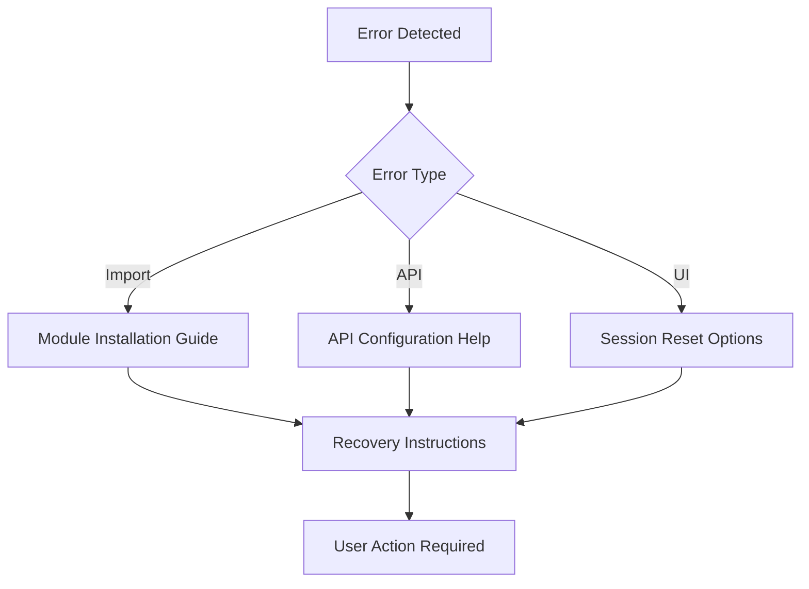

---

## 🎉 まとめ

この設計書は、**a10_00_responses_api.py** の包括的な技術仕様と実装詳細を網羅した完全ドキュメントです。

### 🌟 設計のハイライト

- **🏗️ オブジェクト指向設計**: 抽象基底クラスによる統一インターフェース
- **🤖 包括的API対応**: 9つの主要機能を統合したデモシステム
- **🎨 直感的UI**: Streamlitによる使いやすいWebインターフェース
- **🛡️ 堅牢性**: デコレータベースの統一エラーハンドリング
- **⚙️ 柔軟な設定**: 設定ファイルによるカスタマイズ対応

### 🔧 アーキテクチャ特徴

- **📦 モジュール分離**: BaseDemo抽象クラスによる共通機能統合
- **🔄 統一API**: 全デモで共通のAPI呼び出しパターン
- **💾 セッション管理**: Streamlitセッション状態の効率的活用
- **🎯 型安全性**: Pydanticによる構造化出力対応