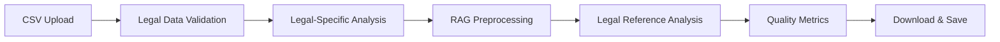
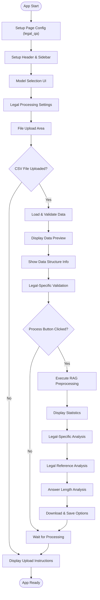
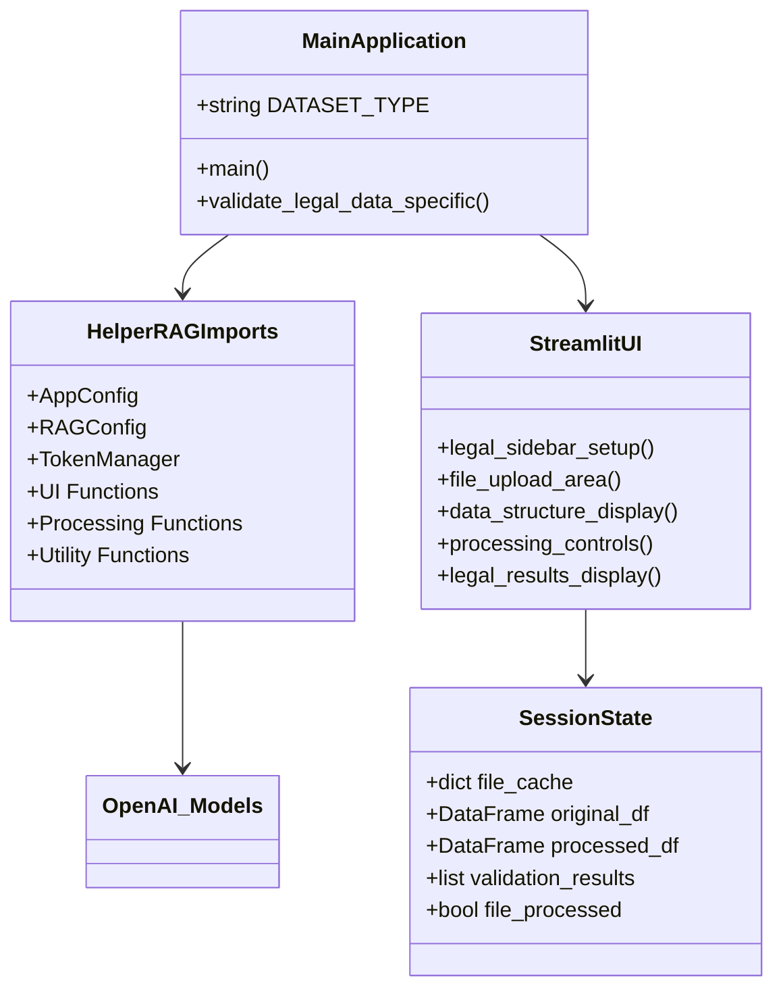
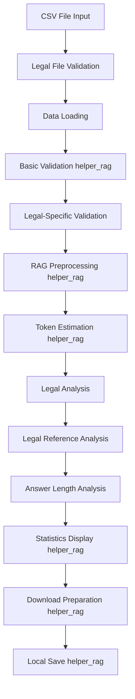
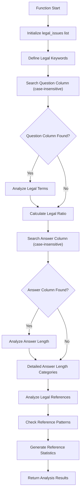
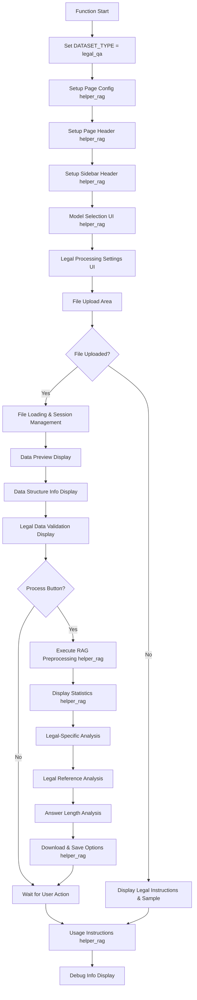
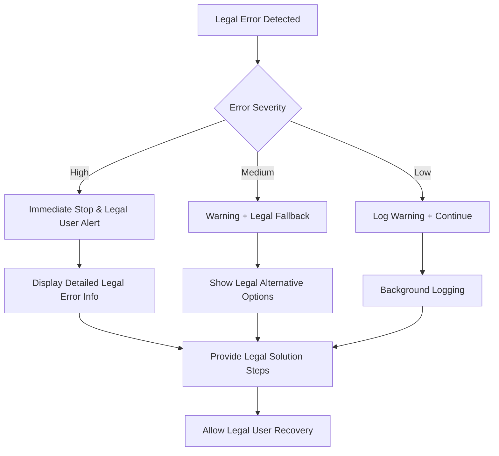

# 📋 a30_015_make_rag_data_legal.py 設計書

## 📝 目次

1. [📖 概要書](#📖-概要書)
2. [🔧 システム構成](#🔧-システム構成)
3. [📋 関数一覧](#📋-関数一覧)
4. [📑 関数詳細設計](#📑-関数詳細設計)
5. [⚙️ 技術仕様](#⚙️-技術仕様)
6. [🚨 エラーハンドリング](#🚨-エラーハンドリング)

---

## 📖 概要書

### 🎯 処理の概要

**法律・判例QAデータ専用RAGデータ前処理システム**

本アプリケーションは、法律・判例質問回答（Legal QA）データに特化したRAG（Retrieval-Augmented Generation）用データ前処理システムです。helper_rag.pyの共通機能を活用しながら、法律固有の要件（法的根拠の分析、条文・判例参照の処理、法律専門用語の保護）に対応した専門的な前処理を実行します。

#### 🌟 主要機能

| 機能 | 説明 |
|------|------|
| ⚖️ **法律QA前処理** | question・answer列の法律専門的処理 |
| 🔍 **法律特化検証** | 法律関連用語・法的根拠・回答品質の分析 |
| 🤖 **モデル最適化** | 選択可能なOpenAIモデルに応じたトークン最適化 |
| 📊 **法的根拠分析** | 条文参照・判例番号・事件番号の詳細分析 |
| 💾 **柔軟保存** | ブラウザダウンロード + ローカル保存 |
| ⚙️ **法律設定** | 法律用語保護・法的根拠保護・判例名正規化オプション |

#### 🎨 処理対象データ



### 🔄 mainの処理の流れ



---

## 🔧 システム構成

### 📦 主要コンポーネント



### 📋 データフロー



---

## 📋 関数一覧

### 🏗️ アプリケーション固有関数

| 関数名 | 分類 | 処理概要 | 重要度 |
|--------|------|----------|---------|
| `validate_legal_data_specific()` | 🔍 検証 | 法律・判例QAデータ特有の品質検証 | ⭐⭐⭐ |
| `main()` | 🎯 制御 | 法律QAアプリケーションメイン制御 | ⭐⭐⭐ |

### 📦 helper_rag.py インポート関数

#### 🔧 設定・管理関数
| 関数名 | 分類 | 処理概要 | 重要度 |
|--------|------|----------|---------|
| `AppConfig` | ⚙️ 設定 | アプリケーション設定管理 | ⭐⭐⭐ |
| `RAGConfig` | ⚙️ 設定 | RAGデータセット設定管理 | ⭐⭐⭐ |
| `TokenManager` | 🔢 管理 | トークン計算・管理 | ⭐⭐ |
| `safe_execute` | 🛡️ 保護 | エラーハンドリングデコレータ | ⭐⭐ |

#### 🎨 UI関数
| 関数名 | 分類 | 処理概要 | 重要度 |
|--------|------|----------|---------|
| `select_model()` | 🤖 選択 | モデル選択UI | ⭐⭐⭐ |
| `show_model_info()` | 📊 表示 | モデル情報表示 | ⭐⭐ |
| `setup_page_config()` | 🎨 設定 | ページ設定 | ⭐⭐ |
| `setup_page_header()` | 🎨 設定 | ページヘッダー設定 | ⭐⭐ |
| `setup_sidebar_header()` | 🎨 設定 | サイドバーヘッダー設定 | ⭐⭐ |

#### 📊 分析・表示関数
| 関数名 | 分類 | 処理概要 | 重要度 |
|--------|------|----------|---------|
| `estimate_token_usage()` | 🔢 推定 | トークン使用量推定 | ⭐⭐⭐ |
| `display_statistics()` | 📈 表示 | 処理統計情報表示 | ⭐⭐⭐ |
| `show_usage_instructions()` | 📖 説明 | 使用方法説明表示 | ⭐ |

#### 📄 データ処理関数
| 関数名 | 分類 | 処理概要 | 重要度 |
|--------|------|----------|---------|
| `validate_data()` | ✅ 検証 | 基本データ検証 | ⭐⭐⭐ |
| `load_dataset()` | 📥 読込 | データセット読み込み | ⭐⭐⭐ |
| `process_rag_data()` | ⚙️ 処理 | RAG用データ前処理 | ⭐⭐⭐ |
| `create_download_data()` | 💾 作成 | ダウンロード用データ作成 | ⭐⭐⭐ |
| `save_files_to_output()` | 💾 保存 | OUTPUTフォルダ保存 | ⭐⭐⭐ |

---

## 📑 関数詳細設計

### 🔍 validate_legal_data_specific()

#### 🎯 処理概要
法律・判例QAデータ特有の品質検証・統計分析を実行

#### 📊 処理の流れ


#### 📋 IPO設計

| 項目 | 内容 |
|------|------|
| **INPUT** | `df: DataFrame` - 法律・判例QAデータフレーム |
| **PROCESS** | 法律用語分析 → 回答長分析 → 法的根拠分析 |
| **OUTPUT** | `List[str]` - 法律特有分析結果メッセージリスト |

#### 🔍 分析項目詳細

##### ⚖️ 法律関連用語分析
```python
legal_keywords = [
    # 日本語
    '法律', '条文', '判例', '裁判', '最高裁', '地裁', '高裁', '民法', '刑法', '商法', '憲法',
    '契約', '損害賠償', '違法', '合法', '権利', '義務', '責任',
    # 英語
    'law', 'legal', 'court', 'judge', 'civil', 'criminal', 'contract', 'liability'
]
```

##### 📊 回答長詳細分析（法律特化5段階）
```python
# 法律回答は通常詳細で長い - 5段階分析
very_short = (answer_lengths <= 100).sum()   # 極短
short = ((answer_lengths > 100) & (answer_lengths <= 300)).sum()  # 短
medium = ((answer_lengths > 300) & (answer_lengths <= 500)).sum()  # 中
long = ((answer_lengths > 500) & (answer_lengths <= 1000)).sum()   # 長
very_long = (answer_lengths > 1000).sum()    # 極長

if avg_answer_length < 100:
    "⚠️ 平均回答長が短い可能性: {avg_answer_length:.0f}文字"
else:
    "✅ 適切な回答長: 平均{avg_answer_length:.0f}文字"
```

##### 📚 法的根拠参照分析（詳細版）
```python
reference_patterns = {
    '条文参照': r'第\d+条',
    '民法条文': r'民法第?\d+条',
    '刑法条文': r'刑法第?\d+条',
    '憲法条文': r'憲法第?\d+条',
    '判例': r'判例|最判|東京地判|大阪高判',
    '年月日': r'\d{4}年\d{1,2}月\d{1,2}日',
    '事件番号': r'(平成|令和)\d+年'
}

# 各パターンの出現頻度を分析
for pattern_name, pattern in reference_patterns.items():
    count = df[answer_col].str.contains(pattern, regex=True, na=False).sum()
    if count > 0:
        percentage = (count / len(df)) * 100
        reference_analysis[pattern_name] = f"{count:,}件 ({percentage:.1f}%)"
```

#### 📈 出力例

```python
legal_analysis_results = [
    "法律関連用語を含む質問: 1,420件 (94.7%)",
    "✅ 適切な回答長: 平均387文字",
    "短い回答（≤300文字）: 230件",
    "中程度の回答（301-500文字）: 650件",
    "長い回答（>500文字）: 620件",
    "**法的根拠の参照分析:**",
    "  - 条文参照: 1,180件 (78.7%)",
    "  - 民法: 640件 (42.7%)",
    "  - 刑法: 290件 (19.3%)",
    "  - 判例: 580件 (38.7%)",
    "  - 年月日: 420件 (28.0%)"
]
```

---

### 🎯 main()

#### 🎯 処理概要
法律・判例QAデータ前処理アプリケーション全体のオーケストレーション

#### 📊 処理の流れ


#### 📋 IPO設計

| 項目 | 内容 |
|------|------|
| **INPUT** | なし（Streamlitアプリとして起動） |
| **PROCESS** | 法律UI構築 → ファイル処理 → 法律分析 → 結果提供 |
| **OUTPUT** | なし（副作用：Streamlit Webアプリ表示） |

#### 🎨 UI レイアウト構成

##### 🔧 サイドバー構成
```python
legal_sidebar_sections = [
    "Model Selection (helper_rag)",
    "Model Information Display (helper_rag)",
    "Legal Processing Settings",
    "Legal Data Settings",
    "Debug Information"
]
```

##### 📋 メインエリア構成
```python
legal_main_sections = [
    "Model Info Display",
    "File Upload Area",
    "Data Preview",
    "Data Structure Information",  # 法律QA特有
    "Validation Results",
    "Processing Controls",
    "Statistics Display (helper_rag)",
    "Legal-Specific Analysis",
    "Legal Reference Analysis",  # 法律QA特有
    "Answer Length Analysis",  # 法律QA特有
    "Download & Save (helper_rag)",
    "Usage Instructions (helper_rag)"
]
```

#### ⚙️ 法律データ特有の設定

##### ⚖️ 法律データ設定
```python
legal_settings = {
    "preserve_legal_terms": {
        "default": True,
        "help": "法律専門用語の過度な正規化を防ぐ"
    },
    "preserve_references": {
        "default": True,
        "help": "条文番号や判例番号などの法的根拠を保護"
    },
    "normalize_case_names": {
        "default": False,
        "help": "判例名の表記ゆれを統一"
    }
}
```

##### 📊 処理設定
```python
processing_settings = {
    "combine_columns_option": {
        "default": True,
        "help": "複数列を結合してRAG用テキストを作成"
    },
    "show_validation": {
        "default": True,
        "help": "データの品質検証結果を表示"
    }
}
```

#### 💾 セッション状態管理

```python
legal_session_state_structure = {
    "current_file_key": "file_{name}_{size}",
    "original_df": "DataFrame",
    "validation_results": "List[str]",
    "original_rows": "int",
    "file_processed": "bool",
    "processed_df": "DataFrame",
    "download_data": "Tuple[str, str]",
    "download_data_key": "str"
}
```

#### ⚖️ 法律データ特有の後処理分析

##### 📊 法律用語出現頻度分析
```python
if 'Combined_Text' in df_processed.columns:
    combined_texts = df_processed['Combined_Text']
    legal_keywords = ['法律', '条文', '判例', '民法', '刑法', '契約', '責任']

    keyword_counts = {}
    for keyword in legal_keywords:
        count = combined_texts.str.contains(keyword, case=False, na=False).sum()
        keyword_counts[keyword] = count
```

##### 📚 法的根拠の詳細分析
```python
# より詳細な法的参照パターンの分析
detailed_patterns = {
    '条文参照': r'第\d+条',
    '民法': r'民法',
    '刑法': r'刑法',
    '憲法': r'憲法',
    '判例': r'判例',
    '最高裁判例': r'最判',
    '地裁判例': r'地判',
    '高裁判例': r'高判'
}

reference_stats = {}
total_with_references = 0

for pattern_name, pattern in detailed_patterns.items():
    count = df_processed[answer_col].str.contains(pattern, regex=True, na=False).sum()
    if count > 0:
        percentage = (count / len(df_processed)) * 100
        reference_stats[pattern_name] = (count, percentage)
```

##### 📏 回答長の詳細分析（5段階）
```python
# 法律回答長のカテゴリ分析（5段階）
answer_lengths = df_processed[answer_col].astype(str).str.len()

very_short = (answer_lengths <= 100).sum()     # 極短: ≤100文字
short = ((answer_lengths > 100) & (answer_lengths <= 300)).sum()  # 短: 101-300文字
medium = ((answer_lengths > 300) & (answer_lengths <= 500)).sum() # 中: 301-500文字
long = ((answer_lengths > 500) & (answer_lengths <= 1000)).sum()  # 長: 501-1000文字
very_long = (answer_lengths > 1000).sum()      # 極長: >1000文字

# 5列でメトリクス表示
col1, col2, col3, col4, col5 = st.columns(5)
with col1:
    st.metric("極短", f"{very_short}")
    st.caption("≤100文字")
with col2:
    st.metric("短", f"{short}")
    st.caption("101-300文字")
with col3:
    st.metric("中", f"{medium}")
    st.caption("301-500文字")
with col4:
    st.metric("長", f"{long}")
    st.caption("501-1000文字")
with col5:
    st.metric("極長", f"{very_long}")
    st.caption(">1000文字")
```

---

## ⚙️ 技術仕様

### 📦 依存ライブラリ

| ライブラリ | バージョン | 用途 | 重要度 |
|-----------|-----------|------|---------|
| `streamlit` | 最新 | 🎨 Web UIフレームワーク | ⭐⭐⭐ |
| `pandas` | 最新 | 📊 データ処理・表示 | ⭐⭐⭐ |
| `helper_rag` | カスタム | 🔧 共通RAG処理機能 | ⭐⭐⭐ |
| `logging` | 標準 | 📝 ログ管理 | ⭐⭐ |
| `re` | 標準 | 🔤 正規表現処理（法的参照パターン用） | ⭐⭐⭐ |
| `typing` | 標準 | 🔤 型ヒント | ⭐⭐ |
| `pathlib` | 標準 | 📁 パス操作 | ⭐⭐ |

### 🗃️ データセット仕様

#### 📄 必須CSVフォーマット

```yaml
Legal_CSV_Requirements:
  encoding: "UTF-8"
  required_columns:
    - "question": "法律質問テキスト"
    - "answer": "法律回答テキスト"
  file_format: ".csv"
  case_sensitivity: "大文字小文字非依存検索対応"
  max_file_size: "制限なし（メモリ依存）"
  special_content: "条文参照・判例番号・事件番号等の法的根拠を含む"
```

#### 📊 法律データ品質指標

```yaml
Legal_Quality_Metrics:
  legal_term_ratio:
    optimal: "> 90%"
    warning: "< 75%"
    keywords: ["法律", "条文", "判例", "民法", "刑法", "契約", "責任", etc.]

  answer_length:
    optimal: "> 100文字"
    warning: "< 50文字"
    metric: "平均回答長（法律回答は通常詳細）"
    categories:
      very_short: "≤100文字"
      short: "101-300文字"
      medium: "301-500文字"
      long: "501-1000文字"
      very_long: ">1000文字"

  legal_reference_coverage:
    optimal: "> 70%"
    measure: "法的根拠参照率"
    patterns:
      - "条文参照（第X条）"
      - "法律名（民法、刑法、etc.）"
      - "判例（最判、地判、etc.）"
      - "年月日"
      - "事件番号"

  reference_quality:
    optimal: "> 50%"
    metric: "具体的参照含有率"
    description: "条文番号や判例番号等の具体的参照の割合"
```

### 🤖 モデル対応

#### 📋 利用可能モデル（helper_rag.AppConfig）

```python
legal_recommended_models = [
    "gpt-4o",           # 高品質・法律推論適合
    "gpt-4o-mini",      # バランス型（推奨）
    "gpt-4.1",          # 次世代高品質
    "gpt-4.1-mini",     # 次世代効率型
    "o1", "o1-mini",    # 推論特化（法律論理分析に適合）
    "o3", "o3-mini",    # 高度推論
    "o4", "o4-mini"     # 最新高性能
]
```

#### 💰 法律用途でのコスト最適化設定

```python
legal_model_recommendations = {
    "legal_qa": {
        "recommended": ["gpt-4o-mini", "o1-mini"],
        "reason": "法律論理処理に最適なコスト効率",
        "token_estimation": "法的根拠・詳細回答考慮の自動計算・表示",
        "special_consideration": "法律専門用語・条文番号の適切な処理"
    }
}
```

### 🔄 処理パイプライン

#### 📋 法律特化前処理ステップ

```yaml
Legal_Processing_Pipeline:
  step1:
    name: "File Validation"
    function: "load_dataset (helper_rag)"
    checks: ["encoding", "legal_columns", "format"]
    special: "大文字小文字非依存列名検索"

  step2:
    name: "Basic Validation"
    function: "validate_data (helper_rag)"
    checks: ["rows", "duplicates", "empty_values"]

  step3:
    name: "Legal-Specific Validation"
    function: "validate_legal_data_specific"
    checks: ["legal_keywords", "answer_length", "legal_references"]

  step4:
    name: "RAG Preprocessing"
    function: "process_rag_data (helper_rag)"
    operations: ["cleaning", "combining", "normalization"]
    special: "法律用語保護・法的根拠保護処理"

  step5:
    name: "Token Estimation"
    function: "estimate_token_usage (helper_rag)"
    models: ["selected_model"]
    consideration: "法律回答の長さ・専門用語を考慮"

  step6:
    name: "Legal Statistics Display"
    function: "display_statistics (helper_rag)"
    metrics: ["processing_stats", "legal_quality_metrics"]
```

### 💾 出力仕様

#### 📊 生成ファイル

```yaml
Legal_Output_Files:
  csv_file:
    name: "preprocessed_legal_qa_{rows}rows.csv"
    format: "CSV with all processed columns"
    encoding: "UTF-8"
    includes: ["question", "answer", "Combined_Text"]

  text_file:
    name: "legal_qa.txt"
    format: "Combined text for RAG/Vector Store"
    content: "One legal text per line (question + answer)"

  metadata_file:
    name: "metadata_legal_qa_{timestamp}.json"
    format: "JSON metadata"
    content: "processing_info, legal_statistics, reference_analysis"
```

#### 🗂️ 保存場所

```python
legal_save_locations = {
    "browser_download": "User's default download folder",
    "local_save": "./OUTPUT/ directory",
    "session_cache": "Streamlit session state",
    "file_naming": "法律QA特化命名規則"
}
```

---

## 🚨 エラーハンドリング

### 📄 ファイル関連エラー

| エラー種別 | 原因 | 対処法 | 影響度 |
|-----------|------|--------|---------|
| **法律CSV形式エラー** | 🚫 不正なCSV形式 | 法律データフォーマット確認指示・サンプル表示 | 🔴 高 |
| **法律必須列不在** | 📋 question/answer列なし | 法律必須列説明・フォーマット例提示 | 🔴 高 |
| **法的根拠検出失敗** | 📚 参照パターンなし | 法的根拠確認指示・参照例提示 | 🟡 中 |
| **法律エンコーディングエラー** | 🔤 非UTF-8ファイル | UTF-8変換指示・法律ツール案内 | 🟡 中 |
| **法律ファイルサイズ過大** | 💾 メモリ不足 | 法律データ分割提案・チャンクサイズ調整 | 🟡 中 |

### 🔧 処理関連エラー

| エラー種別 | 原因 | 対処法 | 影響度 |
|-----------|------|--------|---------|
| **helper_rag インポートエラー** | 📦 モジュール不在 | インストール指示・依存関係確認 | 🔴 高 |
| **法律前処理実行エラー** | ⚙️ 法律データ形式問題 | 法律データ確認・修正指示 | 🟡 中 |
| **法的根拠分析エラー** | 📚 正規表現処理問題 | 参照パターン確認・代替処理提示 | 🟡 中 |
| **法律トークン計算エラー** | 🔢 計算処理問題 | モデル設定確認・代替手段提示 | 🟠 低 |
| **法律統計計算エラー** | 📊 数値処理問題 | 法律データ品質確認・フィルタリング | 🟠 低 |

### 💾 保存関連エラー

| エラー種別 | 原因 | 対処法 | 影響度 |
|-----------|------|--------|---------|
| **OUTPUT フォルダ作成失敗** | 🔒 権限不足 | 権限確認・ディレクトリ指定変更 | 🟡 中 |
| **法律ファイル書き込み失敗** | 💾 ディスク容量・権限 | 容量確認・権限設定指示 | 🟡 中 |
| **法律ダウンロードデータ生成失敗** | 🔄 メモリ・形式問題 | ブラウザ再読込・代替形式提案 | 🟠 低 |

### 🎨 UI関連エラー

| エラー種別 | 原因 | 対処法 | 影響度 |
|-----------|------|--------|---------|
| **セッション状態破損** | 🔄 Streamlit問題 | ページ再読込・キャッシュクリア | 🟡 中 |
| **法律モデル選択エラー** | 🤖 設定問題 | デフォルトモデル復帰・再選択 | 🟠 低 |
| **法律UI表示エラー** | 🎨 レンダリング問題 | ブラウザ確認・代替表示 | 🟠 低 |

### 🛠️ エラー処理戦略

#### 🔧 段階的エラー処理



#### ✅ 法律特化エラーメッセージ例

```python
# 📄 法律ファイル形式エラー
st.error("❌ 法律・判例QACSVファイルの形式に問題があります")
st.info("💡 必要な列: question, answer")
st.code("""
question,answer
契約違反があった場合の損害賠償はどうなりますか？,契約違反による損害賠償は民法第415条に基づき...
民法第415条について教えてください,民法第415条は債務不履行による損害賠償について定めた条文で...
""")

# 🔧 法律処理エラー
st.error("❌ 法律・判例QAデータ前処理中にエラーが発生しました")
st.warning("⚠️ 法律データの一部に問題がある可能性があります")
st.info("💡 対処法: 法律データを確認して再アップロードしてください")

# 💾 法律保存エラー
st.error("❌ 法律ファイル保存に失敗しました")
st.info("💡 ブラウザダウンロードは利用可能です")
```

#### 🚨 法律特化エラー復旧フロー

```python
legal_error_recovery_flow = {
    "legal_file_error": [
        "Display detailed legal file requirements",
        "Show legal sample data format",
        "Provide legal data conversion tools"
    ],
    "legal_processing_error": [
        "Save partial legal results if possible",
        "Display legal error details",
        "Suggest legal data modifications"
    ],
    "legal_reference_error": [
        "Skip reference analysis, continue with Q&A",
        "Display reference pattern detection issues",
        "Provide legal reference formatting guidance"
    ],
    "legal_save_error": [
        "Offer alternative legal download methods",
        "Check disk space and permissions",
        "Provide manual legal export options"
    ]
}
```

---

## 🎉 まとめ

この設計書は、**a30_015_make_rag_data_legal.py** の完全な技術仕様と実装詳細を網羅した包括的ドキュメントです。

### 🌟 設計のハイライト

- **⚖️ 法律・判例QA特化設計**: 法律質問回答データに特化した専門処理
- **📚 法的根拠分析機能**: 条文参照・判例番号・事件番号の詳細分析
- **📏 回答長詳細分析**: 5段階カテゴリによる法律回答の品質評価
- **🔧 共通機能活用**: helper_rag.pyとの効率的な機能分担
- **📊 法律品質重視**: 法律特有の品質指標による詳細分析

### 🔧 アーキテクチャ特徴

- **📦 モジュール分離**: 共通処理はhelper_rag、法律固有処理は本体で分担
- **🔄 セッション管理**: ファイルアップロード状態の効率的キャッシュ
- **⚙️ 型安全性**: 完全な型ヒント + エラー安全設計
- **🎨 UI一貫性**: helper_ragの共通UI関数による統一インターフェース

### 📈 法律QA特化機能

- **🔍 専門分析**: 法律関連用語・法的根拠・回答品質の分析
- **⚙️ 法律設定**: 法律用語保護・法的根拠保護・判例名正規化の専門オプション
- **📊 品質メトリクス**: 法律データに最適化された品質指標
- **💡 業界対応**: 法律業界のベストプラクティス反映

### 🚀 今後の拡張可能性

- 🌍 多言語法律データ対応
- 🤖 法律分野AI自動分類機能
- 📊 高度な法律品質スコアリング
- 🔄 法律バッチ処理機能
- 📈 法律A/Bテスト分析機能
