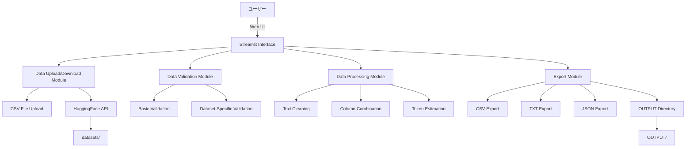
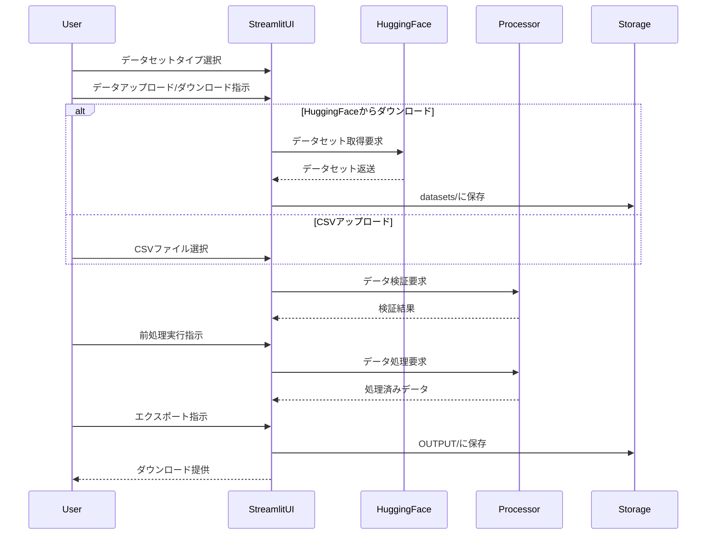

# a01_load_set_rag_data.py 詳細設計書

## 1. 概要書

### 1.1 プログラム名
`a01_load_set_rag_data.py` - 統合RAGデータ処理ツール

### 1.2 目的
複数の異なるドメインのデータセットを統一的に処理し、RAG（Retrieval-Augmented Generation）システムで使用可能な形式に変換するStreamlitアプリケーション。

### 1.3 主要機能
- 4種類のデータセットタイプの統合処理
  - カスタマーサポート・FAQ
  - 医療QAデータ
  - 科学・技術QA（SciQ）
  - 法律・判例QA
- HuggingFaceからの自動データダウンロード
- データ検証・品質チェック機能
- RAG用テキスト結合・前処理
- トークン使用量推定
- 複数形式でのデータエクスポート（CSV/TXT/JSON）

### 1.4 実行環境
- Python 3.9以上
- Streamlit 1.28.0以上
- 依存ライブラリ：pandas, datasets, streamlit

### 1.5 起動方法
```bash
streamlit run a01_load_set_rag_data.py --server.port=8501
```

## 2. システム構成

### 2.1 アーキテクチャ図



### 2.2 データフロー図



### 2.3 モジュール構成

| モジュール名 | 責務 | 依存関係 |
|------------|------|---------|
| Main UI Module | Streamlit UIの制御 | helper_rag |
| Data Loader | データの読み込みとHuggingFace連携 | datasets, pandas |
| Validator | データ検証処理 | pandas |
| Processor | データ前処理とテキスト結合 | helper_rag |
| Exporter | データエクスポート | pandas, json |

## 3. 関数一覧

### 3.1 検証関数

| 関数名 | 引数 | 戻り値 | 説明 |
|--------|------|--------|------|
| `validate_customer_support_data_specific` | `df: pd.DataFrame` | `List[str]` | カスタマーサポートデータ固有の検証 |
| `validate_medical_data_specific` | `df: pd.DataFrame` | `List[str]` | 医療QAデータ固有の検証 |
| `validate_sciq_data_specific` | `df: pd.DataFrame` | `List[str]` | 科学・技術QAデータ固有の検証 |
| `validate_legal_data_specific` | `df: pd.DataFrame` | `List[str]` | 法律QAデータ固有の検証 |

### 3.2 メイン関数

| 関数名 | 引数 | 戻り値 | 説明 |
|--------|------|--------|------|
| `main` | なし | なし | アプリケーションのメインエントリーポイント |

## 4. 関数詳細設計

### 4.1 validate_customer_support_data_specific

```python
def validate_customer_support_data_specific(df: pd.DataFrame) -> List[str]:
    """
    カスタマーサポートデータ固有の検証
    
    Parameters:
        df: 検証対象のDataFrame
        
    Returns:
        List[str]: 検出された問題のリスト
        
    Processing:
        1. 必須列（question, answer）の存在確認
        2. サポート関連キーワードのチェック
        3. 回答の長さチェック（平均50文字以上）
        4. 質問タイプの分析（疑問形式の割合）
    """
```

処理詳細：
- サポート関連キーワード：['問題', '解決', 'トラブル', 'エラー', 'help', 'support']
- 回答の平均文字数が50文字未満の場合、警告を出力
- 疑問形式（？または?を含む）の質問の割合を情報表示

### 4.2 validate_medical_data_specific

```python
def validate_medical_data_specific(df: pd.DataFrame) -> List[str]:
    """
    医療QAデータ固有の検証
    
    Parameters:
        df: 検証対象のDataFrame
        
    Returns:
        List[str]: 検出された問題のリスト
        
    Processing:
        1. 必須列（Question, Response）の存在確認
        2. 医療用語のチェック
        3. Complex_CoT列の存在と有効データ数確認
        4. 回答の詳細度チェック（平均100文字以上）
    """
```

処理詳細：
- 医療用語キーワード：['症状', '診断', '治療', '薬', '病気', 'disease', 'treatment', 'symptom']
- Complex_CoT（推論過程）付きデータの割合を情報表示
- 回答の平均文字数が100文字未満の場合、警告を出力

### 4.3 main

```python
def main():
    """
    メイン処理関数
    
    Processing:
        1. ページ設定とセッション状態の初期化
        2. サイドバーでの設定選択
           - データセットタイプ選択
           - モデル選択
           - データセット固有設定
        3. タブ構成によるUI表示
           - データアップロード
           - データ検証
           - 前処理実行
           - 結果・ダウンロード
        4. データ処理フロー実行
    """
```

## 5. 技術仕様

### 5.1 データセット仕様

#### 5.1.1 カスタマーサポートFAQ
```yaml
dataset_name: MakTek/Customer_support_faqs_dataset
required_columns: [question, answer]
text_column: Combined_Text
specific_options:
  - preserve_formatting: フォーマット保持
  - normalize_questions: 質問正規化
```

#### 5.1.2 医療QA
```yaml
dataset_name: FreedomIntelligence/medical-o1-reasoning-SFT
config: en
required_columns: [Question, Response]
optional_columns: [Complex_CoT]
text_column: Combined_Text
specific_options:
  - preserve_medical_terms: 医学用語保持
  - include_cot: 推論過程を含める
```

#### 5.1.3 科学・技術QA
```yaml
dataset_name: sciq
required_columns: [question, correct_answer]
optional_columns: [distractor1, distractor2, distractor3, support]
text_column: Combined_Text
specific_options:
  - include_distractors: 誤答選択肢を含める
  - include_support: サポートテキストを含める
  - preserve_scientific_notation: 科学的記法を保持
```

#### 5.1.4 法律QA
```yaml
dataset_name: nguha/legalbench
config: consumer_contracts_qa
required_columns: [question, answer]
text_column: Combined_Text
specific_options:
  - preserve_legal_terms: 法律用語保持
  - preserve_references: 条文参照保持
  - normalize_case_names: 事件名正規化
```

### 5.2 データ処理仕様

#### 5.2.1 テキスト結合処理
```python
# カラム結合ロジック
combined_text = separator.join(selected_columns)
# セパレータオプション：スペース、改行、タブ、カスタム
```

#### 5.2.2 トークン使用量推定
```python
# helper_ragのestimate_token_usage関数を使用
# 選択されたモデルに基づいてトークン数とコストを計算
```

### 5.3 出力仕様

#### 5.3.1 CSV形式
- 元データのすべてのカラム保持
- Combined_Textカラムを追加
- UTF-8エンコーディング

#### 5.3.2 TXT形式
- Combined_Textカラムのみ
- 改行区切りのプレーンテキスト

#### 5.3.3 JSON形式
- メタデータ付き構造化データ
```json
{
  "dataset_type": "customer_support_faq",
  "processed_at": "2025-01-01T10:00:00",
  "row_count": 1000,
  "column_count": 5,
  "config": {
    "combine_columns": ["question", "answer"],
    "separator": "\n",
    "options": {}
  }
}
```

## 6. エラーハンドリング

### 6.1 エラー種別と対処

| エラー種別 | 発生条件 | 対処方法 | ユーザー通知 |
|-----------|---------|----------|-------------|
| FileNotFoundError | CSVファイル不在 | デフォルト値使用 | 警告メッセージ表示 |
| HuggingFace接続エラー | API接続失敗 | リトライまたはスキップ | エラーメッセージとリトライボタン |
| データ検証エラー | 必須列不足 | 処理中断 | エラー詳細と修正方法表示 |
| メモリ不足 | 大規模データ処理 | チャンク処理 | 進捗表示と警告 |
| エンコーディングエラー | 文字コード不一致 | UTF-8強制変換 | 変換通知 |

### 6.2 エラーハンドリング実装

```python
try:
    # HuggingFaceからのデータロード
    dataset = hf_load_dataset(dataset_name, name=config_param, split=split_name)
except Exception as e:
    st.error(f"データセットのロードに失敗しました: {str(e)}")
    # エラーログ記録
    logger.error(f"HuggingFace load error: {e}")
    # フォールバック処理
    df = None
```

### 6.3 データ検証エラーの詳細

```python
# 必須列チェック
missing_columns = set(required_columns) - set(df.columns)
if missing_columns:
    st.error(f"必須列が不足しています: {missing_columns}")
    st.info("データセットに以下の列が必要です:")
    for col in required_columns:
        st.write(f"- {col}")
    return False
```

## 7. セキュリティ考慮事項

### 7.1 データ保護
- アップロードファイルの一時保存とセッション終了時の自動削除
- 個人情報を含む可能性のあるデータの警告表示
- OUTPUTディレクトリへの保存時の権限チェック

### 7.2 入力検証
- ファイルサイズ制限（デフォルト200MB）
- CSVファイル形式の厳密な検証
- SQLインジェクション対策（パラメータ化クエリ使用）

## 8. パフォーマンス最適化

### 8.1 メモリ管理
- 大規模データセットのチャンク処理
- 不要なDataFrameコピーの回避
- セッション状態の効率的な管理

### 8.2 処理速度最適化
- pandas vectorized operations の使用
- キャッシュ機能の活用（@st.cache_data）
- 並列処理可能な部分の識別と実装

## 9. 使用例

### 9.1 基本的な使用フロー
```
1. データセットタイプを選択（例：カスタマーサポートFAQ）
2. HuggingFaceからデータをダウンロード
   - データセット名：MakTek/Customer_support_faqs_dataset
   - Split：train
   - サンプル数：1000
3. データ検証タブで品質確認
4. 前処理実行タブでテキスト結合
   - 結合カラム：question, answer
   - セパレータ：改行
5. 結果・ダウンロードタブでエクスポート
   - CSV形式でダウンロード
   - OUTPUTフォルダに保存
```

### 9.2 高度な使用例
```python
# 医療データでComplex_CoTを含める場合
1. データセットタイプ：医療QA
2. データセット固有設定：
   - ☑ 医学用語を保持
   - ☑ Complex_CoTを含める
3. 結合カラム選択：Question, Complex_CoT, Response
4. セパレータ：カスタム " | "
5. トークン使用量を確認してから処理実行
```

## 10. トラブルシューティング

### 10.1 よくある問題と解決方法

| 問題 | 原因 | 解決方法 |
|------|------|----------|
| データセットがダウンロードできない | ネットワーク接続またはHuggingFace API制限 | VPN確認、時間を置いてリトライ |
| メモリエラー | データセットが大きすぎる | サンプル数を減らす、またはチャンク処理 |
| 文字化け | エンコーディング不一致 | UTF-8エンコーディングを明示的に指定 |
| 検証エラー | 必須列の不足または命名不一致 | カラム名を確認し、必要に応じてリネーム |
| エクスポート失敗 | ディスク容量不足または権限エラー | 空き容量確認、書き込み権限チェック |

### 10.2 デバッグ方法
```python
# ロギングレベルを設定
logging.basicConfig(level=logging.DEBUG)

# セッション状態の確認
st.write("Session State:", st.session_state)

# データフレームの詳細確認
st.write(df.info())
st.write(df.describe())
```

## 11. 今後の拡張計画

### 11.1 機能拡張
- [ ] バッチ処理機能の追加
- [ ] カスタムデータセットタイプの登録機能
- [ ] データ品質スコアリング機能
- [ ] 自動データクレンジング機能
- [ ] マルチ言語対応

### 11.2 パフォーマンス改善
- [ ] 非同期処理の導入
- [ ] 分散処理対応
- [ ] GPUアクセラレーション（トークン化処理）

### 11.3 インテグレーション
- [ ] 他のRAGシステムとの連携
- [ ] CI/CDパイプライン統合
- [ ] モニタリング・アラート機能