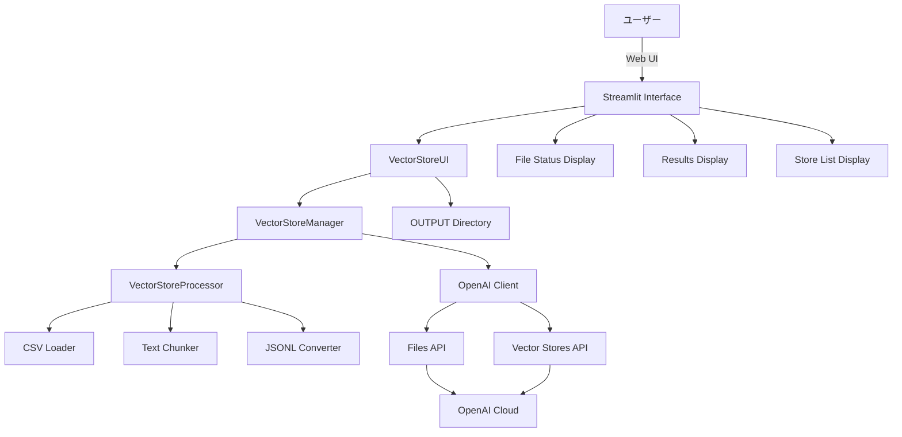
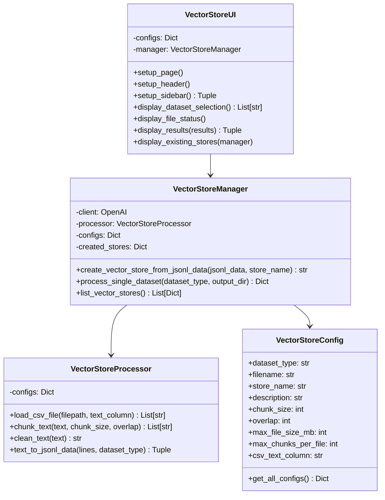
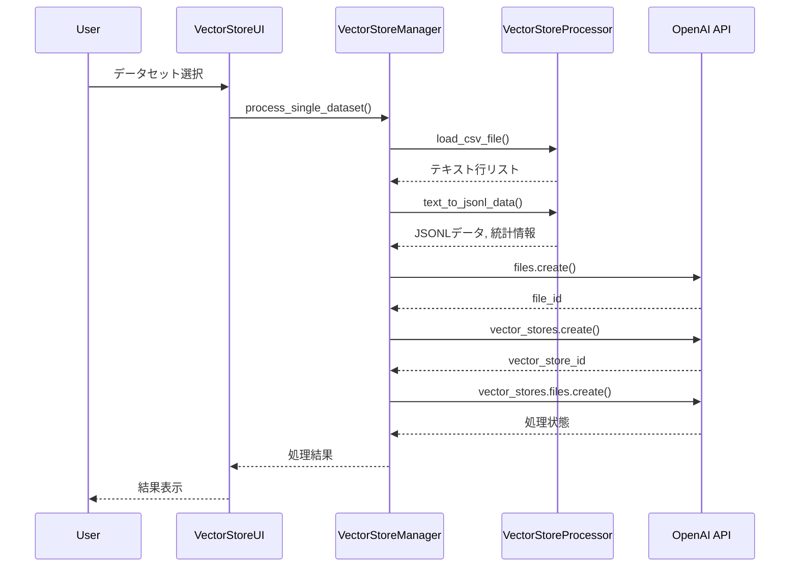

# a02_set_vector_store_vsid.py 詳細設計書

## 1. 概要

### 1.1 プログラム名
`a02_set_vector_store_vsid.py` - Vector Store作成・管理アプリケーション（完全修正版）

### 1.2 目的
OpenAI Vector Store APIを使用して、前処理済みのRAGデータ（CSVファイル）からVector Storeを作成し、管理するStreamlitアプリケーション。複数のデータセットに対応し、エラー処理とサイズ制限管理を完全に実装。

### 1.3 主要機能
- 5種類のデータセットからのVector Store作成
  - カスタマーサポートFAQ
  - 医療QA
  - 科学・技術QA（SciQ）
  - 法律QA
  - TriviaQA
- CSVファイルからのテキストデータ読み込み
- チャンク分割とサイズ最適化
- OpenAI Vector Store APIとの連携
- 既存Vector Store一覧表示
- 処理結果のJSON形式エクスポート

### 1.4 実行環境
- Python 3.9以上
- Streamlit 1.28.0以上
- OpenAI SDK 1.0以上
- 環境変数：OPENAI_API_KEY

### 1.5 起動方法
```bash
streamlit run a02_set_vector_store_vsid.py --server.port=8502
```

### 1.6 入出力ファイル一覧

| 種別 | データセット | ファイル名 | パス | 説明 |
|------|------------|------------|------|------|
| 入力 | customer_support_faq | preprocessed_customer_support_faq.csv | OUTPUT/ | カスタマーサポートFAQ前処理済みデータ |
| 入力 | medical_qa | preprocessed_medical_qa.csv | OUTPUT/ | 医療QA前処理済みデータ |
| 入力 | sciq_qa | preprocessed_sciq_qa.csv | OUTPUT/ | 科学・技術QA前処理済みデータ |
| 入力 | legal_qa | preprocessed_legal_qa.csv | OUTPUT/ | 法律QA前処理済みデータ |
| 入力 | trivia_qa | preprocessed_trivia_qa.csv | OUTPUT/ | TriviaQA前処理済みデータ |
| 一時 | - | *.txt (一時ファイル) | /tmp/ | JSONL形式の一時ファイル（処理後自動削除） |
| 出力 | - | vector_store_results_*.json | ユーザー指定 | 処理結果JSON（ダウンロード） |
| 出力 | - | vector_store_ids_*.txt | ユーザー指定 | Vector Store IDリスト（ダウンロード） |
| 出力 | - | (Vector Store) | OpenAI Cloud | 作成されたVector Store（クラウド上） |

**注記:**
- 入力ファイルはすべてOUTPUTディレクトリから読み込まれる
- CSVファイルのテキストカラム名は「Combined_Text」（trivia_qaのみ「combined_text」小文字）
- 一時ファイルは処理完了後にfinally節で自動削除される
- 出力のVector Store IDはOpenAI APIから返される識別子

## 2. システム構成

### 2.1 アーキテクチャ図



### 2.2 クラス図



### 2.3 データフロー図



## 3. クラス・関数一覧

### 3.1 データクラス

| クラス名 | 役割 | 主要属性 |
|---------|------|----------|
| `VectorStoreConfig` | Vector Store設定管理 | chunk_size, max_file_size_mb, max_chunks_per_file, csv_text_column |

### 3.2 処理クラス

| クラス名 | 役割 | 主要メソッド |
|---------|------|-------------|
| `VectorStoreProcessor` | データ処理 | load_csv_file, chunk_text, text_to_jsonl_data |
| `VectorStoreManager` | Vector Store管理 | create_vector_store_from_jsonl_data, process_single_dataset |
| `VectorStoreUI` | UI管理 | display_dataset_selection, display_results |

### 3.3 ユーティリティ関数

| 関数名 | 引数 | 戻り値 | 説明 |
|--------|------|--------|------|
| `initialize_session_state` | なし | なし | セッション状態初期化 |
| `main` | なし | なし | メインエントリーポイント |

## 4. クラス詳細設計

### 4.1 VectorStoreConfig

```python
@dataclass
class VectorStoreConfig:
    """
    Vector Store設定データクラス
    
    Attributes:
        dataset_type: データセットタイプ識別子
        filename: 入力CSVファイル名
        store_name: Vector Store名
        description: 説明文（日本語）
        chunk_size: テキストチャンクサイズ
        overlap: チャンク間のオーバーラップ
        max_file_size_mb: 最大ファイルサイズ（MB）
        max_chunks_per_file: 最大チャンク数
        csv_text_column: CSVから読み込むテキストカラム名
    """
```

データセット別設定：
- **customer_support_faq**: chunk_size=2000, max_file_size_mb=30, csv_text_column="Combined_Text"
- **medical_qa**: chunk_size=16000, max_file_size_mb=20（最も厳格）, csv_text_column="Combined_Text"
- **sciq_qa**: chunk_size=2000, max_file_size_mb=25, csv_text_column="Combined_Text"
- **legal_qa**: chunk_size=3000, max_file_size_mb=25, csv_text_column="Combined_Text"
- **trivia_qa**: chunk_size=2500, max_file_size_mb=25, csv_text_column="combined_text"（小文字）

### 4.2 VectorStoreProcessor

```python
class VectorStoreProcessor:
    """
    Vector Store用データ処理クラス
    
    Methods:
        load_csv_file: CSVファイル読み込み
        chunk_text: テキストのチャンク分割
        clean_text: テキストクレンジング
        text_to_jsonl_data: JSONL形式への変換
    """
```

#### 4.2.1 load_csv_file
```python
def load_csv_file(self, filepath: Path, text_column: str = "Combined_Text") -> List[str]:
    """
    CSVファイルを読み込み、指定カラムのテキストをリストとして返す
    
    Processing:
        1. CSVファイルをpandasで読み込み
        2. 指定カラムの存在確認
        3. NaNと短いテキスト（10文字未満）を除外
        4. クリーンなテキストリストを返却
    
    Error Handling:
        - FileNotFoundError: ファイル不在
        - EmptyDataError: 空のCSV
        - カラム不在: エラーログ出力
    """
```

#### 4.2.2 chunk_text
```python
def chunk_text(self, text: str, chunk_size: int = 1000, overlap: int = 100) -> List[str]:
    """
    長いテキストを指定サイズのチャンクに分割
    
    Algorithm:
        1. テキスト長がchunk_size以下なら分割なし
        2. 句読点（。！？.!?）で文境界を検出
        3. オーバーラップを考慮して次の開始位置を設定
        4. 無限ループ防止機構
    """
```

### 4.3 VectorStoreManager

```python
class VectorStoreManager:
    """
    Vector Store管理クラス
    
    Attributes:
        client: OpenAI APIクライアント
        processor: データ処理インスタンス
        configs: 設定辞書
        created_stores: 作成済みStore ID辞書
    """
```

#### 4.3.1 create_vector_store_from_jsonl_data
```python
def create_vector_store_from_jsonl_data(self, jsonl_data: List[Dict], store_name: str) -> Optional[str]:
    """
    JSONL形式のデータからVector Storeを作成
    
    Processing:
        1. 入力データ検証（型チェック、必須キー確認）
        2. 一時ファイルにJSONL形式で書き込み
        3. OpenAI Files APIでアップロード
        4. Vector Store作成
        5. ファイルとVector Storeのリンク
        6. 処理完了待機（最大10分）
        7. 一時ファイル削除
    
    Returns:
        成功時: vector_store_id
        失敗時: None
    """
```

#### 4.3.2 process_single_dataset
```python
def process_single_dataset(self, dataset_type: str, output_dir: Path = None) -> Dict[str, Any]:
    """
    単一データセットの処理（完全修正版）
    
    Special Handling for medical_qa:
        - チャンク数制限: 5000
        - ファイルサイズ制限: 15MB
        - 動的チャンク削減機能
    
    Returns:
        {
            "success": bool,
            "vector_store_id": str,
            "store_name": str,
            "processed_lines": int,
            "total_lines": int,
            "created_chunks": int,
            "estimated_size_mb": float,
            "warnings": List[str],
            "config_used": Dict
        }
    """
```

## 5. 技術仕様

### 5.1 OpenAI API仕様

#### 5.1.1 Files API
```python
# ファイルアップロード
uploaded_file = client.files.create(
    file=file,
    purpose="assistants"
)
```

#### 5.1.2 Vector Stores API
```python
# Vector Store作成
vector_store = client.vector_stores.create(
    name=store_name,
    metadata={
        "created_by": "vector_store_streamlit_app",
        "version": "2025.1",
        "data_format": "jsonl_as_txt",
        "entry_count": str(len(jsonl_data))
    }
)
```

#### 5.1.3 Vector Store Files API
```python
# ファイルリンク
vector_store_file = client.vector_stores.files.create(
    vector_store_id=vector_store.id,
    file_id=uploaded_file_id
)
```

### 5.2 制限事項

| 制限項目 | 値 | 対応策 |
|---------|-----|--------|
| 最大ファイルサイズ | 512MB（OpenAI） | 事前サイズチェック、25MB以下に制限 |
| 最大チャンク数 | 40000 | データセット毎に制限設定 |
| API待機時間 | 10分 | タイムアウト処理実装 |
| 医療データ特別制限 | 15MB, 5000チャンク | 動的削減アルゴリズム |

### 5.3 JSONL形式仕様

```json
{
    "id": "dataset_type_lineIdx_chunkIdx",
    "text": "チャンクテキスト"
}
```

注意：
- OpenAI制限により、メタデータはファイルに含めずシンプルな形式で保存
- メタデータは別途Vector Storeのmetadataフィールドに保存

### 5.4 データセット別ファイル名

| データセットタイプ | CSVファイル名 | テキストカラム名 |
|-------------------|--------------|----------------|
| customer_support_faq | preprocessed_customer_support_faq.csv | Combined_Text |
| medical_qa | preprocessed_medical_qa.csv | Combined_Text |
| sciq_qa | preprocessed_sciq_qa.csv | Combined_Text |
| legal_qa | preprocessed_legal_qa.csv | Combined_Text |
| trivia_qa | preprocessed_trivia_qa_*.csv | combined_text（小文字） |

## 6. エラーハンドリング

### 6.1 エラー種別と対処

| エラー種別 | 発生条件 | 対処方法 | ユーザー通知 |
|-----------|---------|----------|-------------|
| API Key Error | 環境変数未設定 | 処理中断 | 設定方法表示 |
| File Size Error | 25MB超過 | チャンク削減または分割 | サイズ制限エラー表示 |
| Chunk Limit Error | チャンク数超過 | データトリミング | 警告メッセージ |
| API Timeout | 10分超過 | 処理中断 | タイムアウトエラー |
| Connection Error | ネットワーク障害 | リトライ | 接続エラー表示 |
| CSV Column Error | 指定カラム不在 | 処理中断 | カラム名エラー表示 |

### 6.2 医療データ特別処理

```python
if dataset_type == "medical_qa":
    if len(jsonl_data_list) > 5000:
        # チャンク数制限
        jsonl_data_list = jsonl_data_list[:5000]
        
    if estimated_size_mb > 15:
        # サイズベース削減
        target_chunks = int(len(jsonl_data_list) * 15 / estimated_size_mb)
        target_chunks = max(1000, target_chunks)  # 最低保証
        jsonl_data_list = jsonl_data_list[:target_chunks]
```

### 6.3 エラーログ実装

```python
logger.error(f"{dataset_type} 処理エラー: {str(e)}")
logger.warning(f"医療QAデータのチャンク数制限適用: {len(jsonl_data_list):,} -> 5,000")
logger.info(f"✅ JSONL変換成功: {len(jsonl_data_list)}チャンク作成")
```

## 7. UI仕様

### 7.1 メイン画面構成

```
┌────────────────────────────────────────┐
│      🔗 Vector Store作成アプリ           │
├────────────┬───────────────────────────┤
│            │                           │
│  Sidebar   │    Main Content Area      │
│            │                           │
│ - Model    │  Tabs:                    │
│ - Options  │  - Vector Store作成       │
│ - API設定  │  - ファイル状況             │
│            │  - 既存Store一覧           │
│            │                           │
└────────────┴───────────────────────────┘
```

### 7.2 タブ構成

#### 7.2.1 Vector Store作成タブ
- データセット選択（チェックボックス）
  - 5つのデータセット対応
- ファイル存在確認表示
- 作成実行ボタン
- 進行状況表示（プログレスバー）
- 結果表示（成功/失敗）
- 警告表示（サイズ制限等）

#### 7.2.2 ファイル状況タブ
- OUTPUTディレクトリ内ファイル一覧
- ファイルサイズ、更新日時
- CSVファイル優先表示
- ディレクトリ詳細情報

#### 7.2.3 既存Store一覧タブ
- Vector Store一覧テーブル（最新20件）
- 統計情報（総数、総容量、総ファイル数）
- リフレッシュボタン

### 7.3 処理フロー表示

```python
# 進行状況表示例
with st.spinner(f"🔄 {config.description} を処理中..."):
    dataset_progress.progress(0.1)
    dataset_status.text("🔄 処理開始...")
    
    result = manager.process_single_dataset(dataset_type)
    
    if result["success"]:
        dataset_progress.progress(1.0)
        dataset_status.success(f"✅ 完了 - Vector Store ID: `{result['vector_store_id']}`")
```

## 8. パフォーマンス最適化

### 8.1 チャンクサイズ最適化

| データセット | チャンクサイズ | 理由 |
|------------|--------------|------|
| customer_support_faq | 2000 | FAQ形式に最適 |
| medical_qa | 16000 | チャンク数削減優先 |
| sciq_qa | 2000 | 質問-回答ペア保持 |
| legal_qa | 3000 | 条文参照保持 |
| trivia_qa | 2500 | 中間的なサイズ |

### 8.2 メモリ管理
- 一時ファイル使用によるメモリ使用量削減
- チャンク単位での処理
- 不要データの即座削除
- tempfileモジュールによる安全な一時ファイル管理

### 8.3 API呼び出し最適化
- バッチ処理なし（OpenAI制限）
- 待機時間の適切な設定（5秒間隔）
- 早期エラー検出による無駄な待機回避
- 最大待機時間10分の設定

## 9. 使用例

### 9.1 基本的な使用フロー
```
1. 環境変数設定
   export OPENAI_API_KEY='your-api-key'

2. アプリ起動
   streamlit run a02_set_vector_store_vsid.py --server.port=8502

3. データセット選択
   ☑ Customer Support FAQ Knowledge Base
   ☑ Medical Q&A Knowledge Base
   ☑ Science & Technology Q&A Knowledge Base
   ☑ Legal Q&A Knowledge Base
   ☑ Trivia Q&A Knowledge Base

4. Vector Store作成実行
   [🚀 Vector Store作成開始] ボタンクリック

5. 処理完了待機
   プログレスバーで進行状況確認

6. 結果確認
   成功: Vector Store ID表示
   失敗: エラー詳細と対処法表示

7. JSONダウンロード
   結果をJSONファイルとして保存

8. Vector Store IDの保存
   Python形式またはテキスト形式でダウンロード
```

### 9.2 一括処理の使用例

```
1. サイドバーで「🚀 全データセット一括処理」をチェック

2. 全データセットのファイル存在確認
   自動的に5つ全てのデータセットがチェックされる

3. Vector Store作成実行
   [🚀 Vector Store作成開始] ボタンクリック

4. 順次処理の進行状況確認
   各データセットの処理状況が個別に表示

5. 結果の一括確認
   成功/失敗の統計情報表示
   警告詳細の確認
```

## 10. トラブルシューティング

### 10.1 よくある問題と解決方法

| 問題 | 原因 | 解決方法 |
|------|------|----------|
| Vector Store作成失敗 | ファイルサイズ超過 | チャンクサイズを大きくする |
| 医療データ処理エラー | 15MB制限超過 | 自動削減機能が動作、警告確認 |
| タイムアウト | 大量データ処理 | データ量を減らすか分割処理 |
| API Key エラー | 環境変数未設定 | export OPENAI_API_KEY実行 |
| ファイル不在エラー | a01未実行 | a01_load_set_rag_data.py実行 |
| カラム名エラー | CSVカラム名不一致 | CSVファイルのカラム名確認 |

### 10.2 デバッグ方法

```python
# ログレベル変更
logging.basicConfig(level=logging.DEBUG)

# 詳細情報表示
with st.expander("🔍 デバッグ情報", expanded=True):
    st.json(debug_info)

# API レスポンス確認
logger.debug(f"API Response: {response}")

# CSVカラム確認
df = pd.read_csv(filepath)
logger.info(f"Available columns: {df.columns.tolist()}")
```

## 11. セキュリティ考慮事項

### 11.1 API Key管理
- 環境変数使用（ハードコード禁止）
- セッション終了時のクリーンアップ
- APIキー表示時のマスキング

### 11.2 データセキュリティ
- 一時ファイルの確実な削除（finally節での実行）
- HTTPSによる通信暗号化
- センシティブデータの警告表示

### 11.3 アクセス制御
- ローカルホストのみでの実行推奨
- ポート番号のカスタマイズ可能（デフォルト: 8502）
- 認証機能は未実装（必要に応じて追加）

## 12. 今後の拡張計画

### 12.1 機能拡張
- [ ] バッチ処理対応
- [ ] 増分更新機能
- [ ] Vector Store編集機能
- [ ] メタデータ管理強化
- [ ] 検索テスト機能統合
- [ ] 追加データセットタイプ対応

### 12.2 パフォーマンス改善
- [ ] 並列処理対応
- [ ] キャッシング機能
- [ ] 圧縮アルゴリズム導入
- [ ] チャンクサイズ自動最適化

### 12.3 運用機能
- [ ] スケジュール実行
- [ ] 監視・アラート機能
- [ ] バックアップ・リストア機能
- [ ] Vector Store バージョン管理