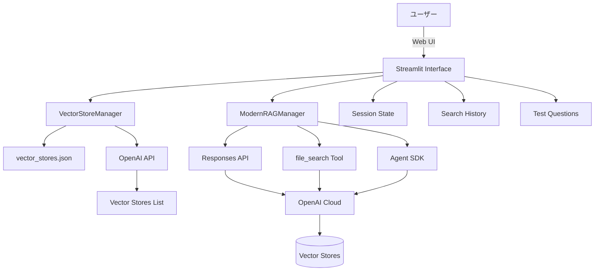
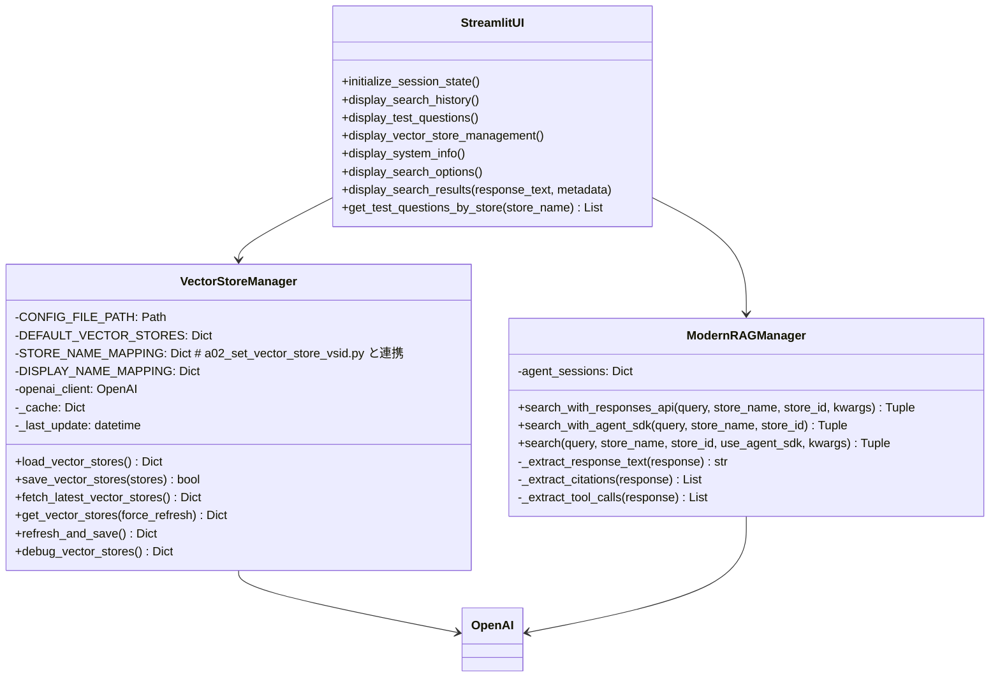
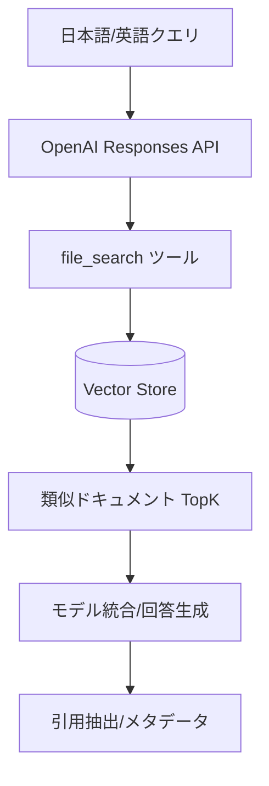

# a03_rag_search_cloud_vs.py 詳細設計書

## 1. 概要

### 1.1 プログラム名
`a03_rag_search_cloud_vs.py` - Cloud-based RAG検索アプリケーション（最新版・重複問題修正版）

### 1.2 目的
OpenAI Responses APIとfile_searchツールを使用して、Vector Store内のデータに対して高精度な検索を実行し、RAG（Retrieval-Augmented Generation）ベースの回答を生成するStreamlitアプリケーション。

### 1.3 主要機能
- 最新Responses API使用による検索
- file_searchツールでのVector Store検索  
- 動的Vector Store ID管理（vector_stores.json）
- 重複Vector Store対応（最新優先選択）
- ファイル引用表示機能
- 英語/日本語質問対応
- カスタマイズ可能な検索オプション
- モデル選択機能（gpt-4o, gpt-4o-mini等）
- 検索履歴管理（最大50件保持）
- Agent SDK連携（オプション）
- 型安全実装（型エラー完全修正）

### 1.4 実行環境（最新版）
- Python 3.12以上（本リポジトリのガイドライン準拠）
- Streamlit 1.48以上（requirements.txt 準拠）
- OpenAI Python SDK 1.100系（requirements.txt 準拠）
- オプション: OpenAI Agent SDK（`agents` パッケージ、未導入でも動作）
- 環境変数：`OPENAI_API_KEY`

### 1.5 起動方法
```bash
export OPENAI_API_KEY='your-api-key-here'
streamlit run a03_rag_search_cloud_vs.py --server.port=8503
```

## 2. システム構成

### 2.1 アーキテクチャ図



### 2.2 クラス図



## 3. クラス・関数一覧

### 3.1 主要クラス

| クラス名 | 役割 | 主要機能 |
|---------|------|----------|
| `VectorStoreManager` | Vector Store設定管理 | 動的ID管理、重複解決、設定ファイル管理 |
| `ModernRAGManager` | RAG検索実行 | Responses API呼び出し、検索結果処理 |

### 3.2 主要関数

| 関数名 | 引数 | 戻り値 | 説明 |
|--------|------|--------|------|
| `get_vector_store_manager` | なし | VectorStoreManager | シングルトンインスタンス取得 |
| `get_rag_manager` | なし | ModernRAGManager | シングルトンインスタンス取得 |
| `get_current_vector_stores` | force_refresh: bool | Tuple[Dict, List] | 現在のVector Store設定取得 |
| `initialize_session_state` | なし | なし | セッション状態初期化 |
| `display_search_history` | なし | なし | 検索履歴表示（最新10件/最大50件保持） |
| `get_test_questions_by_store` | store_name: str | List[str] | Store別のテスト質問集を取得（英語） |
| `display_test_questions` | なし | なし | テスト質問UI表示（クリックで入力欄に反映） |
| `display_vector_store_management` | なし | なし | Vector Store更新/デバッグ/設定閲覧 |
| `display_system_info` | なし | なし | 利用可能機能の状態表示 |
| `display_search_options` | なし | なし | 最大件数/引用表示/自動更新/Agent SDK切替 |
| `generate_enhanced_response` | query:str, search_result:str, has_result:bool | Tuple[str, Dict] | 日本語の追加回答生成（Chat Completions） |
| `display_search_results` | response_text:str, metadata:Dict, original_query:str | なし | 検索結果＋引用＋日本語回答生成の表示 |
| `main` | なし | なし | メインエントリーポイント |

## 4. クラス詳細設計

### 4.1 VectorStoreManager

```python
class VectorStoreManager:
    """
    Vector Store設定の動的管理（重複問題修正版）
    
    Attributes:
        CONFIG_FILE_PATH: 設定ファイルパス（vector_stores.json）
        DEFAULT_VECTOR_STORES: デフォルトVector Store設定
        STORE_NAME_MAPPING: a02_set_vector_store_vsid.py との連携マッピング
        DISPLAY_NAME_MAPPING: UI表示名マッピング
        openai_client: OpenAI APIクライアント
        _cache: キャッシュデータ
        _last_update: 最終更新日時
    """
```

#### 4.1.1 主要メソッド

##### fetch_latest_vector_stores
```python
def fetch_latest_vector_stores(self) -> Dict[str, str]:
    """
    OpenAI APIから最新のVector Store一覧を取得し、重複を解決
    
    Processing:
        1. OpenAI APIからVector Store一覧を取得
        2. 作成日時(created_at)で降順ソート
        3. 同名Vector Storeの場合、最新のものを優先選択
        4. 既知のパターンとマッチング
        5. 最終的なVector Store辞書を返却
    
    Returns:
        Dict[str, str]: {表示名: Vector Store ID}
    """
```

##### refresh_and_save
```python
def refresh_and_save(self) -> Dict[str, str]:
    """
    最新のVector Store情報を取得して設定ファイルに保存
    
    Processing:
        1. キャッシュクリア
        2. APIから最新情報取得（強制リフレッシュ）
        3. vector_stores.jsonに保存
        4. UI表示更新
    
    Returns:
        Dict[str, str]: 更新されたVector Store辞書
    """
```

### 4.2 ModernRAGManager

```python
class ModernRAGManager:
    """
    最新Responses API + file_search を使用したRAGマネージャー
    
    Attributes:
        agent_sessions: Agent SDKセッション管理用辞書
    """
```

#### 4.2.1 主要メソッド

##### search_with_responses_api
```python
def search_with_responses_api(self, query: str, store_name: str, 
                             store_id: str, **kwargs) -> Tuple[str, Dict[str, Any]]:
    """
    Responses API + file_searchツールを使用した検索
    
    Parameters:
        query: 検索クエリ
        store_name: Vector Store表示名
        store_id: Vector Store ID
        **kwargs:
            - selected_model: 使用モデル（gpt-4o-mini等）
            - max_results: 最大検索結果数（デフォルト: 20）
            - include_results: 検索結果詳細を含めるか
            - filters: 検索フィルター
    
    Returns:
        Tuple[str, Dict[str, Any]]: (応答テキスト, メタデータ)
    """
```

##### _extract_citations
```python
def _extract_citations(self, response) -> List[Dict[str, Any]]:
    """
    ファイル引用情報を抽出
    
    Returns:
        List[Dict[str, Any]]: 引用情報リスト
            - file_id: ファイルID
            - filename: ファイル名
            - index: 引用インデックス
    """
```

## 5. 技術仕様

### 5.1 OpenAI Responses API仕様

#### 5.1.1 基本呼び出し
```python
response = openai_client.responses.create(
    model=selected_model,  # 選択されたモデル
    input=query,
    tools=[{
        "type": "file_search",
        "vector_store_ids": [store_id],
        "max_num_results": max_results  # 例: 20（UIから指定）
    }],
    include=["file_search_call.results"]  # 検索結果詳細を含める
)
```

#### 5.1.2 file_searchツール設定
```python
file_search_tool_dict = {
    "type": "file_search",
    "vector_store_ids": [store_id],
    "max_num_results": max_results,
    "filters": filters  # オプション
}
```

#### 5.1.3 日本語追加回答（Chat Completions）
Responses APIの生テキストに対し、日本語での要約/再説明を追加生成します。

```python
response = openai_client.chat.completions.create(
    model=selected_model,
    messages=[
        {"role": "system", "content": system_prompt},
        {"role": "user", "content": user_prompt}  # 検索結果 + 元の質問
    ],
    temperature=0.7,
    max_tokens=2000
)
enhanced_response = response.choices[0].message.content
```

### 5.2 Vector Store設定

#### 5.2.1 デフォルトVector Store
| 表示名 | Vector Store ID | 説明 |
|--------|-----------------|------|
| Customer Support FAQ | vs_68c94da49c80819189dd42d6e941c4b5 | カスタマーサポートFAQ |
| Science & Technology Q&A | vs_68c94db932fc8191b6e17f86e6601bc1 | 科学技術QA |
| Medical Q&A | vs_68c94daffc708191b3c561f4dd6b2af8 | 医療QA |
| Legal Q&A | vs_68c94dc1cc008191a197bdbc3947a67b | 法律QA |
| Trivia Q&A | vs_68c94dc9e6b08191946d7cafcd9880a3 | トリビアQA |

#### 5.2.2 vector_stores.json形式
```json
{
  "vector_stores": {
    "Customer Support FAQ": "vs_xxx...",
    "Medical Q&A": "vs_yyy...",
    "Science & Technology Q&A": "vs_zzz...",
    "Legal Q&A": "vs_aaa...",
    "Trivia Q&A": "vs_bbb..."
  },
  "last_updated": "2025-01-XX...",
  "source": "a03_rag_search_cloud_vs.py",
  "version": "1.1"
}
```

### 5.3 重複ID解決ロジック

```python
# 重複解決アルゴリズム
1. Vector Store一覧をcreated_at降順でソート
2. 同名Store候補を管理する辞書を作成
3. 各Storeに対して：
   - 既知パターンとマッチング
   - 同名がある場合、created_at比較
   - 最新のものを選択
4. 最終的なVector Store辞書を構築
```

## 5.4 検索アルゴリズム

### 5.4.1 フロー



- TopK: `max_num_results` に相当（UIの「最大検索結果数」）。
- 引用: `include=["file_search_call.results"]` 指定で結果詳細を取得・表示。
- 多言語: 埋め込みと検索はVector Store側の設定に依存（英日クエリに対応可能）。

### 5.4.2 フィルタリング仕様

```python
file_search_tool_dict = {
    "type": "file_search",
    "vector_store_ids": [store_id],
    "max_num_results": max_results,  # TopK
    "filters": filters,              # 例: {"document_type": "faq"} など
}
```

- `filters` はファイルメタデータに基づく条件を想定。未指定時は全体から検索。
- UIのオプションで `include_results` をオンにすると結果詳細（スコア等）が含まれる。

### 5.4.3 スコアリングとランク付け
- Vector Store内部でベクトル類似度により候補を取得（TopK）。
- Responses APIが候補を統合し、応答テキストを生成。
- メタデータとして使用量（tokens）・ツール呼び出し・引用ファイルを併記可能。

## 6. UI仕様

### 6.1 メイン画面構成

```
┌────────────────────────────────────────┐
│    🔍 RAG検索（Cloud版）                │
├────────────┬───────────────────────────┤
│            │                           │
│  Sidebar   │    Main Content Area      │
│            │                           │
│ - Settings │  - 使い方ガイド            │
│ - Store    │  - 質問入力               │
│ - Model    │  - 検索結果表示           │
│ - Options  │  - 検索履歴               │
│ - Test Q   │                           │
│            │                           │
└────────────┴───────────────────────────┘
```

### 6.2 サイドバー構成

#### 6.2.1 Vector Store選択
- 動的に利用可能なVector Store一覧を表示
- 選択されたStore IDを表示
- 最終更新時刻を表示

#### 6.2.2 モデル選択
- 利用可能モデル一覧（AppConfigから取得）
- モデル情報表示（トークン数、料金）
- デフォルト: gpt-4o-mini

#### 6.2.3 検索オプション
- 最大検索結果数（1-50）
- 検索結果詳細の含有設定
- ファイル引用表示設定
- Agent SDK使用設定（オプション）
- Vector Store自動更新設定

#### 6.2.4 Vector Store管理
- 最新情報に更新ボタン
- デバッグ情報表示
- 設定ファイル表示

### 6.3 メインエリア

#### 6.3.1 使い方ガイド（Expander）
- RAG検索システムの使用方法
- Vector Store選択方法
- 質問入力方法
- ヒント・推奨事項

#### 6.3.2 質問入力
- テキストエリア（高さ100px）
- 検索実行ボタン（プライマリ）
- 質問例（Expander内）

#### 6.3.3 検索結果表示
- 回答テキスト
- ファイル引用（オプション）
- 検索情報（メタデータ）
- 詳細情報（Expander内）

#### 6.3.4 日本語回答生成（追加表示）
- 検索結果の有無を判定し、Chat Completionsで日本語の追加回答を生成
- 使用モデル・トークン使用量（入力/出力/合計）を併記
- 検索結果が空の場合は一般知識ベースで日本語回答を提示

#### 6.3.4 検索履歴
- 最新10件表示
- 各履歴アイテム：
  - 質問内容
  - Vector Store情報
  - 実行時間
  - 再実行/詳細表示ボタン

## 7. エラーハンドリング

### 7.1 エラー種別と対処

| エラー種別 | 発生条件 | 対処方法 | ユーザー通知 |
|-----------|---------|----------|-------------|
| API Key Error | 環境変数未設定 | アプリ停止 | 設定方法表示 |
| Vector Store Not Found | IDが無効 | デフォルト使用 | 警告表示 |
| API Timeout | レスポンス遅延 | リトライ | タイムアウト通知 |
| Connection Error | ネットワーク障害 | エラーメッセージ | 接続エラー表示 |
| JSON Parse Error | 設定ファイル破損 | デフォルト使用 | 警告表示 |

### 7.2 エラーログ実装

```python
logger.error(f"Responses API検索でエラーが発生しました: {str(e)}")
logger.error(traceback.format_exc())
logger.warning(f"⚠️ API取得に失敗、設定ファイルから読み込み: {e}")
```

## 8. パフォーマンス最適化

### 8.1 キャッシング戦略

| 対象 | キャッシュ方式 | 有効期限 |
|------|--------------|----------|
| Vector Store Manager | `@st.cache_resource` | アプリ再起動まで |
| RAG Manager | `@st.cache_resource` | アプリ再起動まで |
| Vector Store一覧 | インメモリキャッシュ | 5分間 |

### 8.2 最適化手法

- **シングルトン実装**: マネージャークラスの再作成防止
- **キャッシュ活用**: API呼び出し削減
- **遅延読み込み**: 必要時のみAPI呼び出し
- **検索履歴制限**: 最大50件保持でメモリ効率化

## 9. セキュリティ考慮事項

### 9.1 API Key管理
- 環境変数使用（ハードコード禁止）
- `OPENAI_API_KEY` から自動取得
- Streamlit secrets.toml 不要

注記: OpenAI Agent SDKが未導入の場合でも、Responses API + file_search により機能します。

### 9.2 データセキュリティ
- HTTPSによる通信暗号化
- 設定ファイルのローカル保存
- センシティブ情報のマスキング

### 9.3 アクセス制御
- ローカルホストのみでの実行推奨
- ポート番号のカスタマイズ可能（デフォルト: 8503）

## 10. 使用例

### 10.1 基本的な使用フロー
```
1. 環境変数設定
   export OPENAI_API_KEY='your-api-key'

2. アプリ起動
   streamlit run a03_rag_search_cloud_vs.py --server.port=8503

3. Vector Store選択
   サイドバーでVector Storeを選択

4. 質問入力
   - テスト質問から選択
   - または直接入力

5. 検索実行
   「🔍 検索実行」ボタンクリック

6. 結果確認
   - 回答内容
   - ファイル引用
   - 検索メタデータ
```

### 10.2 Vector Store更新フロー
```
1. サイドバー「Vector Store管理」を開く

2. 「🔄 最新情報に更新」ボタンクリック

3. OpenAI APIから最新一覧取得
   - 重複ID自動解決（最新優先）

4. 設定ファイル自動更新

5. UI自動リロード
```

## 11. トラブルシューティング

### 11.1 よくある問題と解決方法

| 問題 | 原因 | 解決方法 |
|------|------|----------|
| Vector Store重複 | 同名の複数Store存在 | 「最新情報に更新」で解決 |
| APIキーエラー | 環境変数未設定 | export OPENAI_API_KEY実行 |
| 検索結果なし | Vector Store ID不正 | Store管理で再取得 |
| 日本語文字化け | エンコーディング問題 | UTF-8設定確認 |
| タイムアウト | ネットワーク遅延 | 再試行または待機 |

### 11.2 デバッグ方法

```python
# ログレベル変更
logging.basicConfig(level=logging.DEBUG)

# デバッグ情報表示
debug_info = manager.debug_vector_stores()
st.json(debug_info)

# 詳細ログ確認
logger.info(f"🔍 処理中: '{store_name}' ({store_id}) - 作成日時: {created_at}")
```

## 12. 連携システム

### 12.1 a02_set_vector_store_vsid.py との連携
- 新規作成されたVector Storeを自動認識
- STORE_NAME_MAPPINGによる名前変換
- 作成後は「最新情報に更新」で反映

### 12.2 helper_rag モジュール連携
- AppConfig: モデル設定情報
- select_model: モデル選択UI
- show_model_info: モデル情報表示

### 12.3 Agent SDK連携（オプション）
- SQLiteSession: セッション管理
- Runner: エージェント実行
- 簡易版実装（RAG機能はResponses API使用）

## 13. 今後の拡張計画

### 13.1 機能拡張
- [ ] マルチVector Store同時検索
- [ ] 検索結果のエクスポート機能
- [ ] カスタムフィルター設定
- [ ] 検索結果のランキング表示
- [ ] ユーザー認証機能

### 13.2 パフォーマンス改善
- [ ] 非同期処理対応
- [ ] バッチ検索機能
- [ ] 検索結果キャッシング
- [ ] プリロード機能

### 13.3 UI/UX改善
- [ ] ダークモード対応
- [ ] モバイル対応
- [ ] 多言語対応拡張
- [ ] 音声入力対応
