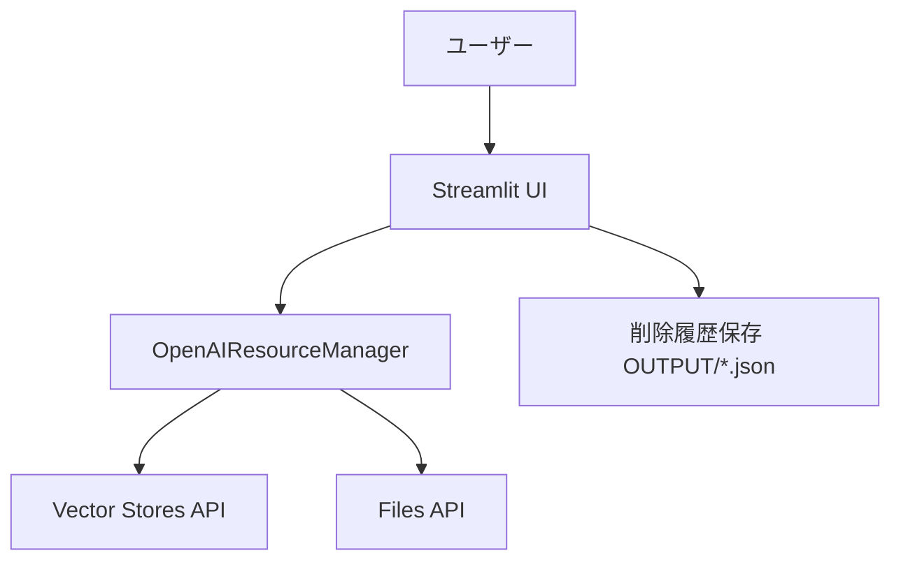

# a04_delete_vector_store.py 詳細設計書

## 1. 概要

### 1.1 プログラム名
`a04_delete_vector_store.py` — OpenAI Vector Store / Files 削除ツール（Streamlit）

### 1.2 目的
OpenAIのVector Storeおよび関連Filesを安全に一覧・選択し、個別/一括/全削除を行う運用向けユーティリティ。

### 1.3 主要機能
- 削除モード: 個別、複数選択、一括（全削除）
- Vector StoreとFilesの一覧表示（作成日時、サイズ、件数）
- Vector Storeに紐づくFilesの同時削除オプション
- 削除履歴の保存（`OUTPUT/*deletion_history*.json`）
- APIキー・安全確認（チェックボックス）

### 1.4 実行環境
- Python 3.12+（本リポジトリのガイドライン準拠）
- `streamlit`, `openai`（`requirements.txt` 参照）
- 環境変数: `OPENAI_API_KEY`

### 1.5 起動方法
```bash
export OPENAI_API_KEY='your-api-key'
streamlit run a04_delete_vector_store.py --server.port=8504
```

## 2. システム構成



### 2.1 主要コンポーネント
- `OpenAIResourceManager`: 一覧取得、削除、履歴保存の中核ロジック
- `DeletionUI`: UI表示（一覧、選択、結果サマリ）
- `DeletionResult`/`DeletionMode`: 結果記録/モード定義

## 3. 操作フロー
1) 左サイドバーで削除モード選択（個別/複数/全削除）
2) Vector Store または Files タブで対象をチェック
3) 危険操作（全削除）は二重チェックで確定
4) 実行ボタンで削除→結果サマリ（成功/失敗）表示
5) 必要に応じて履歴を保存（`OUTPUT/`）

## 4. 注意事項・トラブルシュート
- 削除は取り消せません。全削除は要二重確認。
- `OPENAI_API_KEY` 未設定 → サイドバーでエラー表示。環境変数を設定。
- `openai` 未インストール → `pip install -r requirements.txt`。

## 5. 関連
- データ作成/登録: `a01_load_set_rag_data.py`, `a02_set_vector_store_vsid.py`
- クラウド検索: `a03_rag_search_cloud_vs.py`
- ローカル検索(Qdrant): `a50_rag_search_local_qdrant.py`

