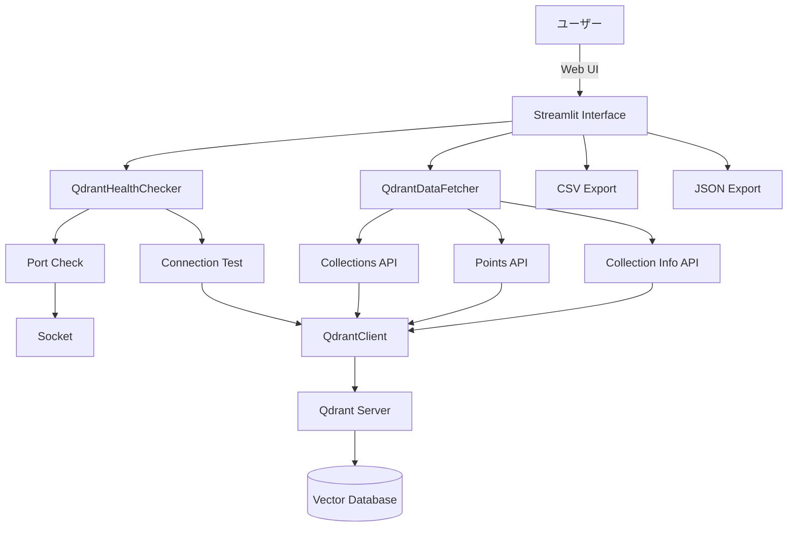
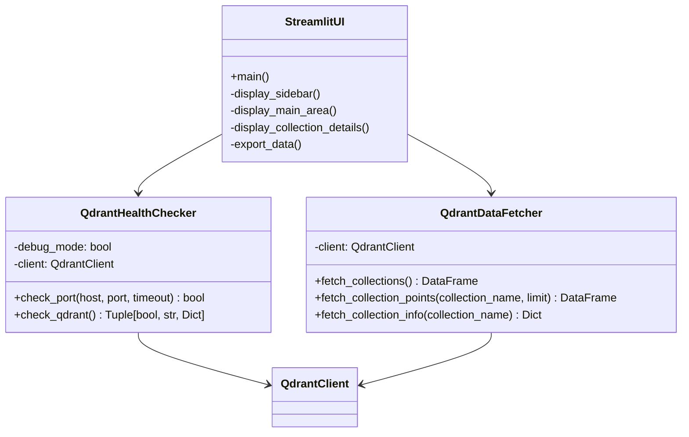
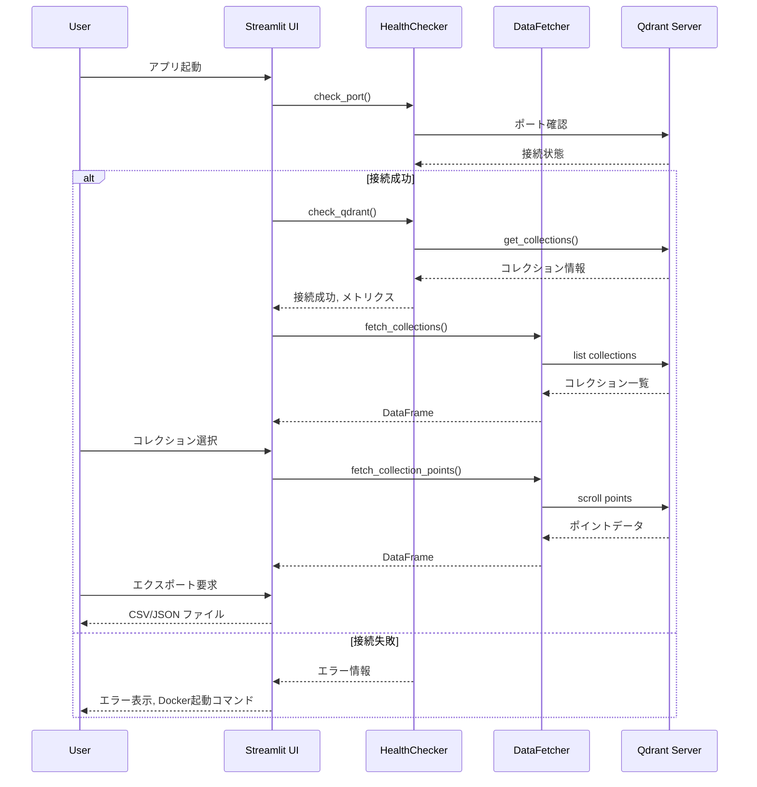

# a10_show_qdrant_data.py 詳細設計書

## 1. 概要書

### 1.1 プログラム名
`a10_show_qdrant_data.py` - Qdrantデータ表示ツール

### 1.2 目的
Qdrant Vector Databaseの状態監視、コレクション情報の表示、およびポイントデータの閲覧・エクスポート機能を提供するStreamlitアプリケーション。

### 1.3 主要機能
- Qdrantサーバーの接続状態チェック
- コレクション一覧の表示
- コレクション詳細情報の表示（ベクトル設定、ポイント数など）
- ポイントデータの表示とエクスポート（CSV, JSON）
- 自動更新機能
- デバッグモード

### 1.4 実行環境
- Python 3.9以上
- Streamlit 1.28.0以上
- qdrant-client 1.7.0以上
- Qdrantサーバー（Docker or ローカル）

### 1.5 起動方法
```bash
# Qdrantサーバー起動（Docker）
docker run -p 6333:6333 qdrant/qdrant

# アプリケーション起動
streamlit run a10_show_qdrant_data.py --server.port=8502
```

## 2. システム構成

### 2.1 アーキテクチャ図



### 2.2 クラス図



### 2.3 シーケンス図



## 3. 定数・設定

### 3.1 サーバー設定

```python
QDRANT_CONFIG = {
    "name": "Qdrant",
    "host": "localhost",
    "port": 6333,
    "icon": "🎯",
    "url": "http://localhost:6333",
    "health_check_endpoint": "/collections",
    "docker_image": "qdrant/qdrant"
}
```

## 4. クラス詳細設計

### 4.1 QdrantHealthChecker

```python
class QdrantHealthChecker:
    """
    Qdrantサーバーの接続状態をチェック
    
    Attributes:
        debug_mode: デバッグ情報の表示フラグ
        client: Qdrantクライアントインスタンス
    """
```

#### 4.1.1 check_port
```python
def check_port(self, host: str, port: int, timeout: float = 2.0) -> bool:
    """
    ポートが開いているかチェック
    
    Parameters:
        host: ホスト名またはIPアドレス
        port: ポート番号
        timeout: タイムアウト秒数
        
    Returns:
        bool: ポートが開いている場合True
        
    Implementation:
        1. ソケット作成（AF_INET, SOCK_STREAM）
        2. タイムアウト設定
        3. connect_exで接続試行
        4. 結果コード0なら成功
    """
```

#### 4.1.2 check_qdrant
```python
def check_qdrant(self) -> Tuple[bool, str, Optional[Dict]]:
    """
    Qdrant接続チェック
    
    Returns:
        Tuple[接続成功フラグ, メッセージ, メトリクス辞書]
        
    Processing:
        1. ポートチェック
        2. QdrantClient作成
        3. get_collections()でAPI確認
        4. メトリクス収集
           - collection_count: コレクション数
           - collections: コレクション名リスト
           - response_time_ms: レスポンス時間
    """
```

### 4.2 QdrantDataFetcher

```python
class QdrantDataFetcher:
    """
    Qdrantからデータを取得
    
    Attributes:
        client: Qdrantクライアントインスタンス
    """
```

#### 4.2.1 fetch_collections
```python
def fetch_collections(self) -> pd.DataFrame:
    """
    コレクション一覧を取得
    
    Returns:
        DataFrame with columns:
        - Collection: コレクション名
        - Vectors Count: ベクトル数
        - Points Count: ポイント数
        - Indexed Vectors: インデックス済みベクトル数
        - Status: ステータス
        
    Error Handling:
        - 各コレクションの詳細取得失敗時は"N/A"を設定
        - 全体エラー時はエラーメッセージを含むDataFrame
    """
```

#### 4.2.2 fetch_collection_points
```python
def fetch_collection_points(self, collection_name: str, limit: int = 50) -> pd.DataFrame:
    """
    コレクションの詳細データを取得
    
    Parameters:
        collection_name: 対象コレクション名
        limit: 取得件数上限
        
    Returns:
        DataFrame with columns:
        - ID: ポイントID
        - payload内の各フィールド（動的）
        
    Text Truncation:
        - 200文字を超える文字列は切り詰め
        - リストや辞書も文字列化して切り詰め
    """
```

#### 4.2.3 fetch_collection_info
```python
def fetch_collection_info(self, collection_name: str) -> Dict[str, Any]:
    """
    コレクションの詳細情報を取得
    
    Returns:
        {
            "vectors_count": ベクトル数,
            "points_count": ポイント数,
            "indexed_vectors": インデックス済み数,
            "status": ステータス,
            "config": {
                "vector_size": ベクトル次元数,
                "distance": 距離計算方式
            }
        }
        
    Vector Config Handling:
        - 単一ベクトル設定
        - Named vectors設定（複数ベクトル）
    """
```

## 5. UI仕様

### 5.1 画面レイアウト

```
┌────────────────────────────────────────────┐
│        🎯 Qdrant データ表示ツール           │
├──────────────┬─────────────────────────────┤
│              │                             │
│   Sidebar    │      Main Content Area      │
│              │                             │
│  Settings:   │  📊 Qdrant データ表示        │
│  - Debug     │                             │
│  - Auto      │  📚 コレクション一覧         │
│    Refresh   │  ┌─────────────────────┐    │
│              │  │ Collection Table    │    │
│  Status:     │  └─────────────────────┘    │
│  - Connected │                             │
│  - Metrics   │  🔍 コレクション詳細データ    │
│              │  ┌─────────────────────┐    │
│              │  │ Points Table        │    │
│              │  └─────────────────────┘    │
│              │                             │
└──────────────┴─────────────────────────────┘
```

### 5.2 サイドバー機能

#### 5.2.1 設定セクション
- **デバッグモード**: チェックボックスで切り替え
- **自動更新**: 有効/無効と更新間隔（5-300秒）
- **接続チェック**: 実行ボタン

#### 5.2.2 接続状態表示
```python
# 成功時
st.success(f"{icon} **{name}**")
st.caption(f"✅ {message}")

# 失敗時
st.error(f"{icon} **{name}**")
st.caption(f"❌ {message}")
```

### 5.3 メインエリア機能

#### 5.3.1 コレクション一覧
- DataFrameでの表形式表示
- CSVダウンロードボタン
- JSONダウンロードボタン

#### 5.3.2 コレクション詳細
- コレクション選択ドロップダウン
- 表示件数入力（1-500）
- 詳細情報表示ボタン
- ポイントデータ取得ボタン

#### 5.3.3 メトリクス表示
```python
col1, col2, col3, col4 = st.columns(4)
with col1:
    st.metric("ベクトル数", info["vectors_count"])
with col2:
    st.metric("ポイント数", info["points_count"])
with col3:
    st.metric("インデックス済み", info["indexed_vectors"])
with col4:
    st.metric("ステータス", info["status"])
```

## 6. エラーハンドリング

### 6.1 接続エラー

| エラー種別 | 原因 | 対処表示 |
|-----------|------|----------|
| Connection refused | サーバー未起動 | Docker起動コマンド表示 |
| Port closed | ポート未開放 | ポート確認方法表示 |
| Timeout | ネットワーク遅延 | タイムアウト値調整案内 |
| Collection not found | コレクション不在 | a50_qdrant_registration.py実行案内 |

### 6.2 エラー処理実装

```python
try:
    client.get_collections()
except ConnectionRefusedError:
    st.error(f"❌ Qdrantサーバーへの接続が拒否されました: {url}")
    st.error("Qdrantサーバーが起動していることを確認してください:")
    st.code("docker run -p 6333:6333 qdrant/qdrant", language="bash")
except Exception as e:
    if "collection" in str(e).lower() and "not found" in str(e).lower():
        st.error(f"❌ コレクション '{collection}' が見つかりません")
        st.error("先に a50_qdrant_registration.py を実行してデータを登録してください")
    else:
        st.error(f"❌ エラーが発生しました: {str(e)}")
        st.exception(e)
```

## 7. データエクスポート仕様

### 7.1 CSV形式
```python
csv = dataframe.to_csv(index=False)
st.download_button(
    label="📥 CSVダウンロード",
    data=csv,
    file_name=f"qdrant_data_{timestamp}.csv",
    mime="text/csv"
)
```

### 7.2 JSON形式
```python
json_str = dataframe.to_json(orient="records", indent=2)
st.download_button(
    label="📥 JSONダウンロード",
    data=json_str,
    file_name=f"qdrant_data_{timestamp}.json",
    mime="application/json"
)
```

### 7.3 ファイル命名規則
- コレクション一覧: `qdrant_collections_YYYYMMDD_HHMMSS.{csv|json}`
- ポイントデータ: `{collection_name}_points_YYYYMMDD_HHMMSS.{csv|json}`

## 8. セッション状態管理

### 8.1 管理対象

```python
# セッションステート初期化
if "debug_mode" not in st.session_state:
    st.session_state.debug_mode = False
if "auto_refresh" not in st.session_state:
    st.session_state.auto_refresh = False
if "refresh_interval" not in st.session_state:
    st.session_state.refresh_interval = 30
```

### 8.2 状態の永続化
- debug_mode: デバッグ表示の切り替え状態
- auto_refresh: 自動更新の有効/無効
- refresh_interval: 更新間隔（秒）

## 9. パフォーマンス最適化

### 9.1 データ取得最適化
- scrollメソッドによる効率的なページング
- with_vectors=Falseでベクトルデータ除外
- limit設定による取得件数制限

### 9.2 表示最適化
- 長いテキストの切り詰め（200文字）
- DataFrameの use_container_width=True
- 最新20件のみ表示（既存Store一覧）

### 9.3 接続管理
- タイムアウト設定（5秒）
- ポートチェック先行実施
- クライアント再利用

## 10. デバッグ機能

### 10.1 デバッグ情報表示

```python
if debug_mode:
    with st.expander("🐛 デバッグ情報", expanded=False):
        st.subheader("インストール済みクライアント")
        st.write({
            "Qdrant": "✅" if QDRANT_AVAILABLE else "❌"
        })
        
        st.subheader("サーバー設定")
        st.json(QDRANT_CONFIG)
        
        # 詳細メトリクス
        if metrics:
            for key, value in metrics.items():
                st.text(f"{key}: {value}")
```

### 10.2 エラー詳細表示
- スタックトレース表示
- 接続パラメータ確認
- Docker起動コマンド提供

## 11. 使用例

### 11.1 基本的な使用フロー

```
1. Qdrantサーバー起動
   docker run -p 6333:6333 qdrant/qdrant

2. アプリケーション起動
   streamlit run a10_show_qdrant_data.py --server.port=8502

3. 接続確認
   サイドバーで「🔍 接続チェック実行」クリック

4. コレクション確認
   メインエリアでコレクション一覧を確認

5. 詳細データ表示
   - コレクション選択
   - 表示件数設定（例: 100）
   - 「🔍 ポイントデータを取得」クリック

6. データエクスポート
   「📥 CSVダウンロード」または「📥 JSONダウンロード」
```

### 11.2 デバッグモード使用例

```python
# デバッグモード有効化
1. サイドバーで「🐛 デバッグモード」チェック

2. 接続チェック実行
   - 詳細なエラー情報表示
   - レスポンス時間計測
   - API応答の生データ表示

3. デバッグ情報確認
   - エクスパンダー展開
   - サーバー設定確認
   - クライアント状態確認
```

## 12. トラブルシューティング

### 12.1 よくある問題と解決方法

| 問題 | 原因 | 解決方法 |
|------|------|----------|
| 接続エラー | Qdrantサーバー未起動 | docker psで確認、起動 |
| ポート使用中 | 6333ポート競合 | 別ポート使用または競合プロセス停止 |
| コレクション不在 | データ未登録 | a50_qdrant_registration.py実行 |
| メモリ不足 | 大量データ取得 | limit値を減らす |
| タイムアウト | ネットワーク遅延 | timeout値を増やす |

### 12.2 Docker関連

```bash
# Qdrantコンテナ確認
docker ps | grep qdrant

# ログ確認
docker logs <container_id>

# 再起動
docker restart <container_id>

# データ永続化付き起動
docker run -p 6333:6333 -v ./qdrant_storage:/qdrant/storage qdrant/qdrant
```

## 13. セキュリティ考慮事項

### 13.1 接続セキュリティ
- localhost接続に限定（デフォルト）
- HTTPプロトコル使用（本番環境ではHTTPS推奨）
- 認証機能は未実装

### 13.2 データ保護
- エクスポート時の個人情報確認
- 一時ファイルの即座削除
- セッション終了時のクリーンアップ

## 14. 今後の拡張計画

### 14.1 機能拡張
- [ ] ベクトル検索機能
- [ ] データ編集機能
- [ ] コレクション作成/削除
- [ ] バックアップ機能
- [ ] 複数サーバー対応

### 14.2 UI改善
- [ ] ダークモード対応
- [ ] グラフ表示機能
- [ ] リアルタイム更新
- [ ] フィルタリング機能強化

### 14.3 性能改善
- [ ] 非同期データ取得
- [ ] キャッシング機能
- [ ] ページネーション改善