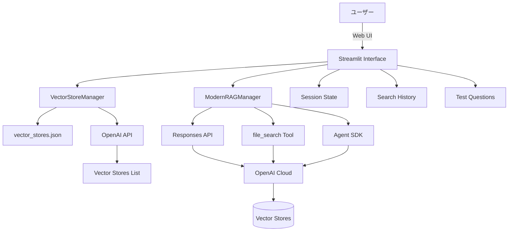
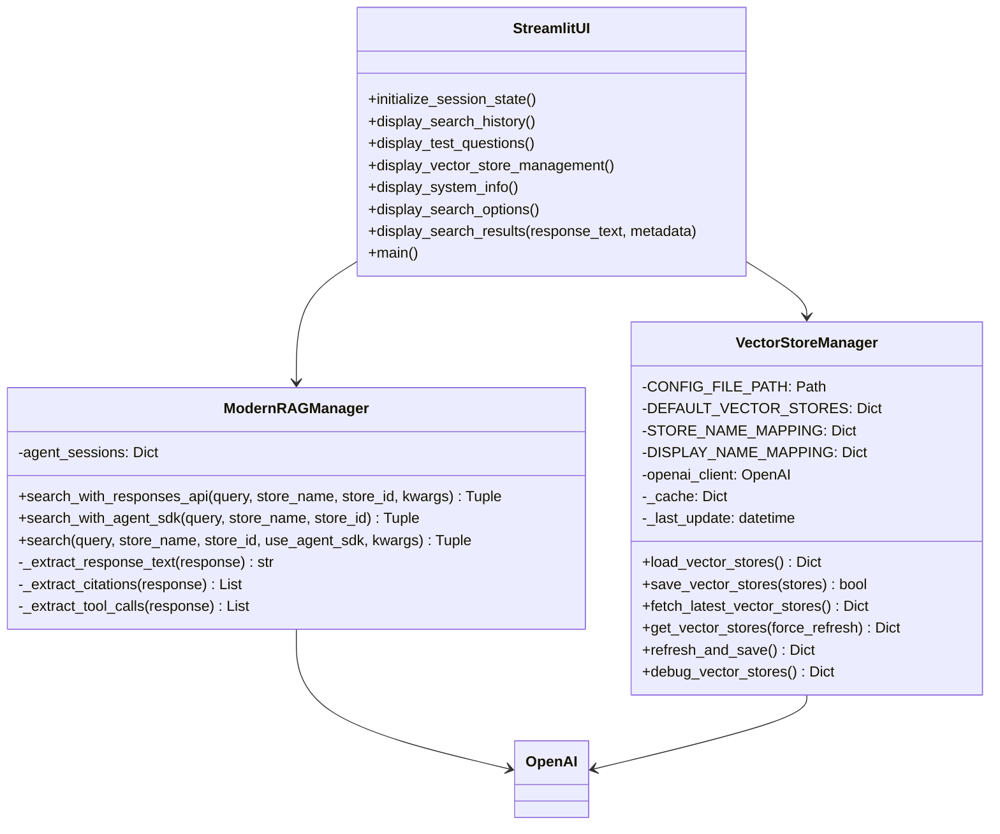
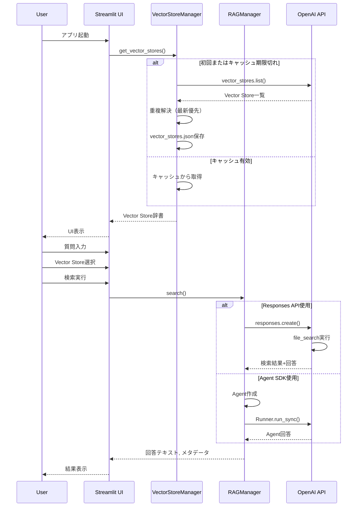

# a20_rag_search_cloud_vs.py 詳細設計書

## 1. 概要書

### 1.1 プログラム名
`a20_rag_search_cloud_vs.py` - Cloud-based RAG検索アプリケーション

### 1.2 目的
OpenAI Responses APIとfile_searchツールを使用して、Vector Store内のデータに対して高精度な検索を実行し、RAG（Retrieval-Augmented Generation）ベースの回答を生成するStreamlitアプリケーション。

### 1.3 主要機能
- 最新Responses API使用による検索
- file_searchツールでのVector Store検索
- 動的Vector Store ID管理（vector_stores.json）
- 重複Vector Store対応（最新優先選択）
- ファイル引用表示機能
- 英語/日本語質問対応
- カスタマイズ可能な検索オプション
- 検索履歴管理
- Agent SDK連携（オプション）

### 1.4 実行環境
- Python 3.9以上
- Streamlit 1.28.0以上
- OpenAI SDK 1.0以上
- 環境変数：OPENAI_API_KEY

### 1.5 起動方法
```bash
export OPENAI_API_KEY='your-api-key-here'
streamlit run a20_rag_search_cloud_vs.py --server.port=8501
```

## 2. システム構成

### 2.1 アーキテクチャ図



### 2.2 クラス図



### 2.3 シーケンス図



## 3. クラス詳細設計

### 3.1 VectorStoreManager

```python
class VectorStoreManager:
    """
    Vector Store設定の動的管理（重複問題修正版）
    
    重複解決アルゴリズム:
        1. OpenAI APIからVector Store一覧取得
        2. created_atで降順ソート（新しい順）
        3. 同名Storeは最新のものを選択
        4. 結果をキャッシュ（5分間有効）
    """
```

#### 3.1.1 fetch_latest_vector_stores
```python
def fetch_latest_vector_stores(self) -> Dict[str, str]:
    """
    OpenAI APIから最新のVector Store一覧を取得（重複問題修正版）
    
    Processing:
        1. vector_stores.list()でAPI取得
        2. created_atで降順ソート
        3. 各Storeを処理
           - DISPLAY_NAME_MAPPINGと照合
           - 完全一致または部分一致確認
        4. 同名の場合は最新を選択
           - created_at比較
           - 既存より新しければ更新
        5. 最終選択をログ出力
        
    Returns:
        {display_name: vector_store_id}
    """
```

#### 3.1.2 get_vector_stores
```python
def get_vector_stores(self, force_refresh: bool = False) -> Dict[str, str]:
    """
    Vector Store一覧を取得（キャッシュ機能付き）
    
    Cache Logic:
        - 初回: API取得
        - 5分以内: キャッシュ使用
        - 5分超過: 自動更新
        - force_refresh=True: 強制更新
    """
```

### 3.2 ModernRAGManager

```python
class ModernRAGManager:
    """
    最新Responses API + file_search を使用したRAGマネージャー
    
    Features:
        - Responses API直接利用
        - file_searchツール統合
        - Agent SDK連携（オプション）
        - 型安全実装
    """
```

#### 3.2.1 search_with_responses_api
```python
def search_with_responses_api(
    self, 
    query: str, 
    store_name: str, 
    store_id: str, 
    **kwargs
) -> Tuple[str, Dict[str, Any]]:
    """
    最新Responses API + file_search ツールを使用した検索
    
    Parameters:
        query: 検索クエリ
        store_name: Vector Store表示名
        store_id: Vector Store ID
        kwargs:
            - max_results: 最大結果数（デフォルト20）
            - include_results: 結果詳細含む（デフォルトTrue）
            - filters: 検索フィルタ
    
    API Call:
        openai_client.responses.create(
            model="gpt-4o-mini",
            input=query,
            tools=[file_search_tool_dict],
            include=include_params
        )
    
    Returns:
        (response_text, metadata_dict)
    """
```

#### 3.2.2 _extract_citations
```python
def _extract_citations(self, response) -> List[Dict[str, Any]]:
    """
    ファイル引用情報を抽出
    
    Processing:
        1. response.outputを走査
        2. type="message"のアイテム探索
        3. content内のannotations確認
        4. type="file_citation"を抽出
        
    Returns:
        [{
            "file_id": str,
            "filename": str,
            "index": int
        }]
    """
```

## 4. UI仕様

### 4.1 画面レイアウト

```
┌─────────────────────────────────────────────┐
│    🔍 RAG検索（Cloud:OpenAI Vector Store版）  │
├───────────┬─────────────────────────────────┤
│           │                                 │
│  Sidebar  │        Main Content Area        │
│           │                                 │
│ Settings: │  ❓ 質問入力                     │
│ - Vector  │  ┌───────────────────────┐      │
│   Store   │  │ Text Area             │      │
│ - Language│  └───────────────────────┘      │
│ - Options │  [🔍 検索実行]                   │
│           │                                 │
│ Test Q:   │  🤖 検索結果                     │
│ - Q1      │  ┌───────────────────────┐      │
│ - Q2      │  │ Response              │      │
│ - Q3      │  │ Citations             │      │
│           │  │ Metadata              │      │
│           │  └───────────────────────┘      │
│           │                                 │
│ VS管理    │  🕒 検索履歴                     │
│           │                                 │
└───────────┴─────────────────────────────────┘
```

### 4.2 サイドバー機能

#### 4.2.1 Vector Store選択
```python
selected_store = st.selectbox(
    "Vector Store を選択",
    options=vector_store_list,
    index=current_index
)
# 選択されたIDをコード表示
st.code(selected_store_id)
```

#### 4.2.2 言語選択
- English（RAGデータ最適化）
- 日本語（警告表示付き）

#### 4.2.3 検索オプション
- 最大検索結果数（1-50）
- 検索結果詳細を含める
- ファイル引用を表示
- Agent SDK使用
- Vector Store自動更新

#### 4.2.4 Vector Store管理
- 最新情報に更新ボタン
- デバッグ情報表示
- 設定ファイル表示

### 4.3 メインエリア機能

#### 4.3.1 質問入力
```python
with st.form("search_form"):
    query = st.text_area(
        "質問を入力してください",
        height=100,
        help="英語での質問がRAGデータに最適化されています"
    )
    submitted = st.form_submit_button("🔍 検索実行")
```

#### 4.3.2 検索結果表示
- 回答テキスト
- ファイル引用リスト
- 検索メタデータ
- 詳細情報（エクスパンダー）

#### 4.3.3 検索履歴
- 最新10件表示
- 再実行ボタン
- 詳細表示ボタン

## 5. データ管理

### 5.1 vector_stores.json

```json
{
    "vector_stores": {
        "Customer Support FAQ": "vs_xxx...",
        "Medical Q&A": "vs_yyy...",
        "Science & Technology Q&A": "vs_zzz...",
        "Legal Q&A": "vs_aaa..."
    },
    "last_updated": "2025-01-01T10:00:00",
    "source": "a20_rag_search_cloud_vs.py",
    "version": "1.1"
}
```

### 5.2 セッション状態

```python
st.session_state = {
    'search_history': [],          # 検索履歴リスト
    'current_query': "",           # 現在のクエリ
    'selected_store': "...",       # 選択Store
    'selected_language': "English", # 選択言語
    'use_agent_sdk': False,        # Agent SDK使用フラグ
    'search_options': {            # 検索オプション
        'max_results': 20,
        'include_results': True,
        'show_citations': True
    },
    'auto_refresh_stores': True,   # 自動更新フラグ
    'vector_stores_updated': None  # 最終更新時刻
}
```

### 5.3 テスト質問データ

```python
# データセット別・言語別質問
test_questions = {
    ("Customer Support FAQ", "English"): [
        "How do I create a new account?",
        "What payment methods are available?",
        ...
    ],
    ("Customer Support FAQ", "日本語"): [
        "新規アカウントを作るには？",
        "利用可能な決済方法は？",
        ...
    ],
    ...
}
```

## 6. エラーハンドリング

### 6.1 API関連エラー

| エラー種別 | 発生条件 | 対処方法 | ユーザー通知 |
|-----------|---------|----------|-------------|
| API Key Error | 環境変数未設定 | アプリ停止 | 設定方法表示 |
| Vector Store不在 | ID無効 | デフォルト使用 | エラーメッセージ |
| API Timeout | レスポンス遅延 | リトライ | スピナー表示 |
| Rate Limit | API制限到達 | 待機またはエラー | 制限通知 |

### 6.2 重複ID問題の解決

```python
# 同名Vector Storeの処理
if matched_display_name not in store_candidates:
    # 新規候補として登録
    store_candidates[matched_display_name] = {
        'id': store_id,
        'created_at': created_at
    }
else:
    # 既存と比較して新しい方を選択
    if created_at > existing['created_at']:
        store_candidates[matched_display_name] = {
            'id': store_id,
            'created_at': created_at
        }
```

### 6.3 型安全対策

```python
# 型を明示的に指定
file_search_tool_dict: Dict[str, Any] = {
    "type": "file_search",
    "vector_store_ids": [store_id]
}

# 型チェック無視（SDK制限対応）
response = openai_client.responses.create(
    tools=[file_search_tool_dict],  # type: ignore[arg-type]
)
```

## 7. パフォーマンス最適化

### 7.1 キャッシング

```python
@st.cache_resource
def get_vector_store_manager():
    """Vector Store Manager のシングルトン取得"""
    return VectorStoreManager(OpenAI())

@st.cache_resource
def get_rag_manager():
    """RAGマネージャーのシングルトン取得"""
    return ModernRAGManager()
```

### 7.2 Vector Store管理最適化
- 5分間のキャッシュ有効期限
- 強制更新オプション
- 初回のみ自動取得

### 7.3 検索履歴管理
- 最新50件保持
- 重複チェック実装
- セッション内永続化

## 8. セキュリティ考慮事項

### 8.1 API Key管理
- 環境変数使用必須
- ハードコード禁止
- マスキング表示

### 8.2 データ保護
- HTTPSによる通信
- ローカル実行推奨
- 個人情報警告

## 9. 使用例

### 9.1 基本的な使用フロー

```
1. 環境設定
   export OPENAI_API_KEY='your-api-key'

2. アプリ起動
   streamlit run a20_rag_search_cloud_vs.py

3. Vector Store選択
   サイドバーで "Customer Support FAQ" 選択

4. 質問入力
   "How do I create a new account?"

5. 検索実行
   [🔍 検索実行] ボタンクリック

6. 結果確認
   - 回答テキスト
   - 引用ファイル
   - 検索メタデータ
```

### 9.2 日本語質問例

```python
# 日本語での質問（自動翻訳付き）
質問: "新規アカウントは、どう作成すればよいか？日本語で回答してください。"

# システムは英語RAGデータを検索し、日本語で回答生成
```

### 9.3 Vector Store更新

```
1. サイドバー「Vector Store管理」展開
2. 「🔄 最新情報に更新」クリック
3. OpenAI APIから最新一覧取得
4. 重複解決（最新優先）
5. vector_stores.json更新
6. UI自動リフレッシュ
```

## 10. トラブルシューティング

### 10.1 よくある問題と解決方法

| 問題 | 原因 | 解決方法 |
|------|------|----------|
| Vector Store ID不正 | 古いID使用 | 最新情報に更新 |
| 重複Store問題 | 同名の複数Store | 自動で最新選択 |
| 日本語回答が不自然 | 英語データベース | 英語質問推奨 |
| API Key エラー | 環境変数未設定 | export実行 |
| 検索結果なし | Store不一致 | 適切なStore選択 |

### 10.2 デバッグ方法

```python
# デバッグ情報表示
manager = get_vector_store_manager()
debug_info = manager.debug_vector_stores()
st.json(debug_info)

# ログ確認
logging.basicConfig(level=logging.DEBUG)

# API応答確認
st.write("API Response:", response)
```

## 11. Agent SDK連携

### 11.1 Agent SDK概要
- オプション機能
- セッション管理機能提供
- file_searchはResponses API使用

### 11.2 実装詳細

```python
def search_with_agent_sdk(
    self, 
    query: str, 
    store_name: str, 
    store_id: str
) -> Tuple[str, Dict[str, Any]]:
    """
    Agent SDKを使用した検索（簡易版）
    
    Note:
        - file_search統合は複雑
        - 現在はセッション管理のみ
        - 実際のRAGはResponses APIに委譲
    """
```

## 12. 今後の拡張計画

### 12.1 機能拡張
- [ ] マルチVector Store同時検索
- [ ] 検索結果のランキング機能
- [ ] カスタムフィルタリング
- [ ] 検索履歴の永続化
- [ ] エクスポート機能

### 12.2 性能改善
- [ ] 非同期検索実装
- [ ] バッチ検索対応
- [ ] レスポンスキャッシング

### 12.3 UI/UX改善
- [ ] ダークモード対応
- [ ] モバイル対応
- [ ] 音声入力対応
- [ ] リアルタイム翻訳