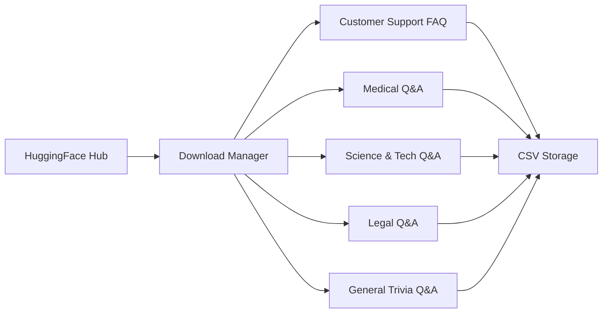
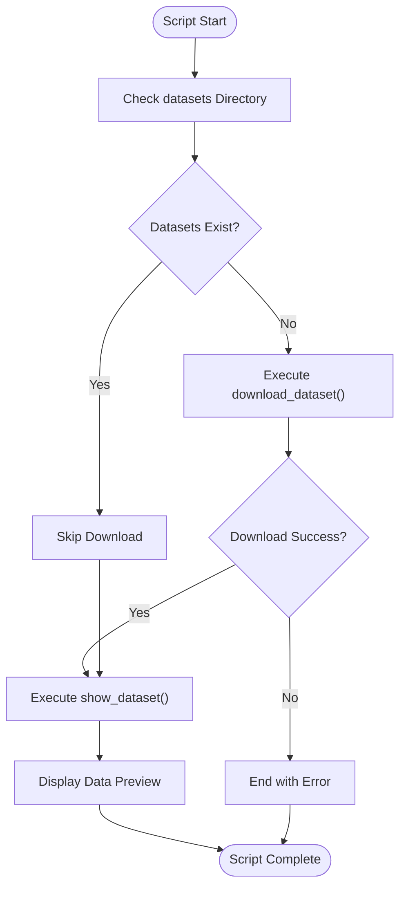
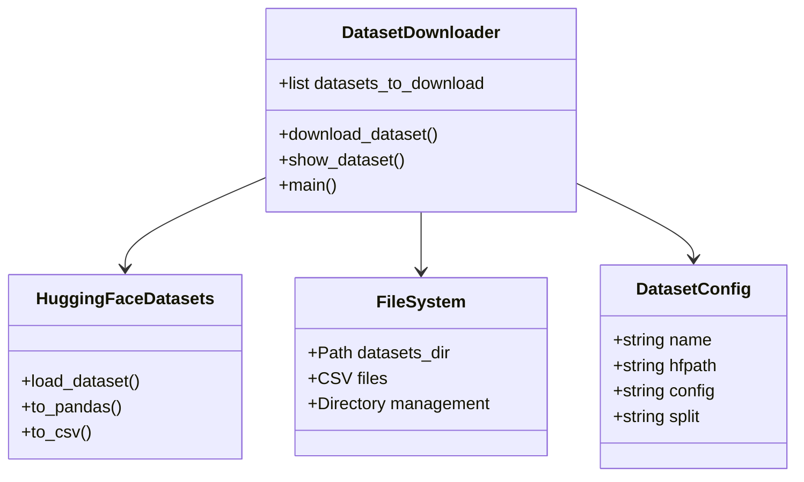
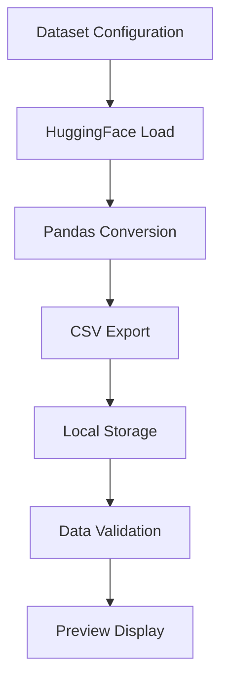
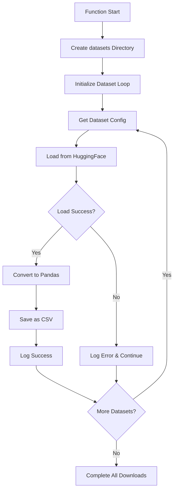
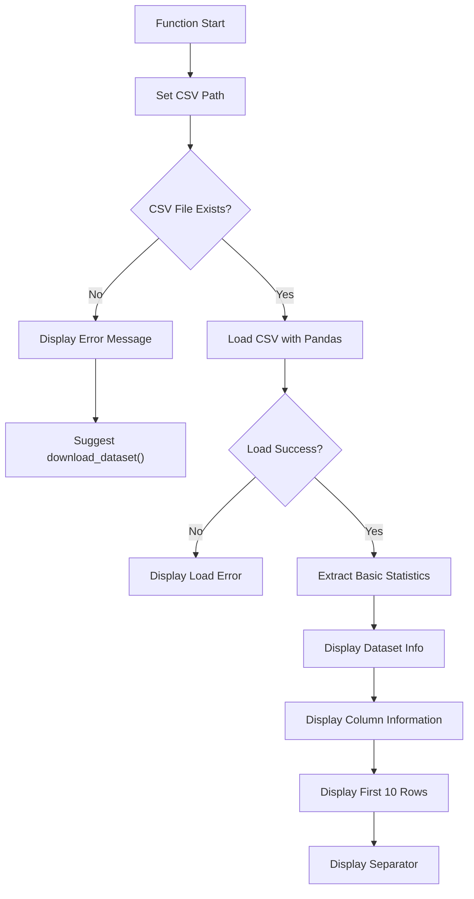
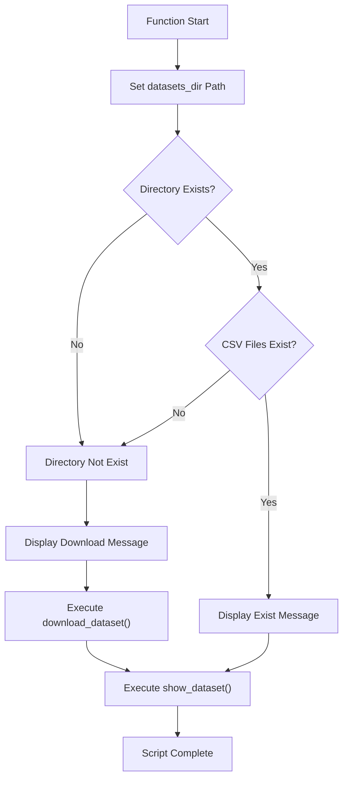
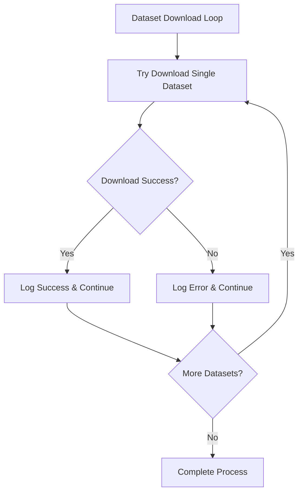

# 📋 a30_00_rag_dataset_from_huggingface.py 設計書

## 📝 目次

1. [📖 概要書](#📖-概要書)
2. [🔧 システム構成](#🔧-システム構成)
3. [📋 関数一覧](#📋-関数一覧)
4. [📑 関数詳細設計](#📑-関数詳細設計)
5. [⚙️ 技術仕様](#⚙️-技術仕様)
6. [🚨 エラーハンドリング](#🚨-エラーハンドリング)

---

## 📖 概要書

### 🎯 処理の概要

**HuggingFace RAGデータセット自動取得システム**

本スクリプトは、HuggingFace Datasetsから複数の専門分野QAデータセットを自動ダウンロードし、RAGシステム用のCSVファイルとして整理・保存するバッチ処理システムです。5つの異なる専門分野（カスタマーサポート、医療、科学技術、法律、一般知識）のデータセットを効率的に取得・管理します。

#### 🌟 主要機能

| 機能 | 説明 |
|------|------|
| 🌐 **HuggingFace連携** | datasets ライブラリによる自動ダウンロード |
| 📊 **5分野対応** | 専門分野別の最適化されたデータセット選択 |
| 💾 **CSV一括変換** | 統一されたCSV形式での保存 |
| 🔍 **データ検証** | 基本統計・構造確認機能 |
| 📁 **自動管理** | ディレクトリ作成・重複回避 |
| ⚡ **効率処理** | 進捗表示・エラー継続処理 |

#### 🗃️ 対象データセット



### 🔄 mainの処理の流れ



---

## 🔧 システム構成

### 📦 主要コンポーネント



### 📋 データフロー



---

## 📋 関数一覧

### 🌐 データセット取得関数

| 関数名 | 分類 | 処理概要 | 重要度 |
|--------|------|----------|---------|
| `download_dataset()` | 📥 取得 | HuggingFaceからデータセット一括ダウンロード | ⭐⭐⭐ |

### 📊 データ表示関数

| 関数名 | 分類 | 処理概要 | 重要度 |
|--------|------|----------|---------|
| `show_dataset()` | 📋 表示 | データセット構造・内容の表示 | ⭐⭐ |

### 🎯 制御関数

| 関数名 | 分類 | 処理概要 | 重要度 |
|--------|------|----------|---------|
| `main()` | 🎯 制御 | スクリプトメイン制御・実行フロー管理 | ⭐⭐⭐ |

---

## 📑 関数詳細設計

### 📥 download_dataset()

#### 🎯 処理概要
HuggingFace Datasetsから5つの専門分野データセットを一括ダウンロードし、CSV形式で保存

#### 📊 処理の流れ


#### 📋 IPO設計

| 項目 | 内容 |
|------|------|
| **INPUT** | なし（グローバル設定 `datasets_to_download` 使用） |
| **PROCESS** | HuggingFace API呼び出し → Pandas変換 → CSV保存 |
| **OUTPUT** | なし（副作用：CSV ファイル群の生成） |

#### 🗃️ データセット設定構造

```python
dataset_config_example = {
    "name": "customer_support_faq",           # 内部識別名
    "hfpath": "MakTek/Customer_support_faqs_dataset",  # HuggingFace パス
    "config": None,                           # 設定名（任意）
    "split": "train"                          # データ分割指定
}
```

#### 📂 出力ファイル構造

```
datasets/
├── customer_support_faq.csv
├── trivia_qa.csv
├── medical_qa.csv
├── sciq_qa.csv
└── legal_qa.csv
```

#### ⚡ エラー処理戦略

```python
# 個別データセットの失敗を他に影響させない継続処理
try:
    ds = load_dataset(path=d["hfpath"], name=d["config"], split=d["split"])
    ds.to_pandas().to_csv(csv_path, index=False)
    print(f"✅ Success: {d['name']}")
except Exception as e:
    print(f"❌ Error: {d['name']} - {e}")
    continue  # 他のデータセット処理を継続
```

---

### 📋 show_dataset()

#### 🎯 処理概要
ダウンロード済みデータセットの構造・内容確認とプレビュー表示

#### 📊 処理の流れ


#### 📋 IPO設計

| 項目 | 内容 |
|------|------|
| **INPUT** | なし（固定パス `customer_support_faq.csv` を使用） |
| **PROCESS** | ファイル存在確認 → CSV読み込み → 統計情報抽出 → プレビュー表示 |
| **OUTPUT** | なし（副作用：コンソール表示） |

#### 📊 表示情報構造

```python
display_info = {
    "dataset_name": "customer_support_faq.csv",
    "data_count": "len(df)",
    "columns": "list(df.columns)",
    "preview": "df.head(10)",
    "separator": "=" * 50
}
```

#### ⚠️ 現在の制限事項

```python
# 注意：現在はcustomer_support_faqのみ表示
csv_path = DATASETS_DIR / "customer_support_faq.csv"

# 改善案：全データセット表示への拡張
for dataset_name in ["customer_support_faq", "medical_qa", "sciq_qa", "legal_qa", "trivia_qa"]:
    csv_path = DATASETS_DIR / f"{dataset_name}.csv"
    # 各データセットの表示処理
```

---

### 🎯 main()

#### 🎯 処理概要
スクリプト全体の実行制御とデータセットライフサイクル管理

#### 📊 処理の流れ


#### 📋 IPO設計

| 項目 | 内容 |
|------|------|
| **INPUT** | なし（スクリプト実行時エントリーポイント） |
| **PROCESS** | 状態確認 → 条件分岐実行 → 結果表示 |
| **OUTPUT** | なし（副作用：ファイル生成・コンソール表示） |

#### 🔍 データセット存在判定ロジック

```python
existence_check = {
    "directory_check": "datasets_dir.exists()",
    "file_check": "any(datasets_dir.glob('*.csv'))",
    "combined_logic": "not (dir_exists and files_exist)"
}
```

#### 🎯 実行パターン

| 状況 | 実行フロー |
|------|------------|
| **初回実行** | ディレクトリ作成 → ダウンロード → 表示 |
| **データセット存在** | ダウンロードスキップ → 表示のみ |
| **部分的存在** | 不足分ダウンロード → 表示 |

---

## ⚙️ 技術仕様

### 📦 依存ライブラリ

| ライブラリ | バージョン | 用途 | 重要度 |
|-----------|-----------|------|---------|
| `datasets` | 最新 | 🌐 HuggingFace Datasets API | ⭐⭐⭐ |
| `pandas` | 最新 | 📊 データ処理・CSV変換 | ⭐⭐⭐ |
| `pathlib` | 標準 | 📁 ファイルパス操作 | ⭐⭐⭐ |
| `typing` | 標準 | 🔤 型ヒント | ⭐⭐ |
| `tqdm` | 最新 | 📈 進捗表示（未使用） | ⭐ |
| `openai` | 最新 | 🤖 OpenAI API（未使用） | ⭐ |
| `pydantic` | 最新 | 🔧 データ検証（未使用） | ⭐ |

### 🗃️ データセット詳細仕様

#### 📋 設定済みデータセット

```yaml
Datasets_Configuration:
  customer_support_faq:
    huggingface_path: "MakTek/Customer_support_faqs_dataset"
    config: null
    split: "train"
    description: "カスタマーサポート・FAQデータセット"

  trivia_qa:
    huggingface_path: "trivia_qa"
    config: "rc"
    split: "train"
    description: "一般知識・トリビアQAデータセット"

  medical_qa:
    huggingface_path: "FreedomIntelligence/medical-o1-reasoning-SFT"
    config: "en"
    split: "train"
    description: "医療質問回答データセット"

  sciq_qa:
    huggingface_path: "sciq"
    config: null
    split: "train"
    description: "科学・技術QAデータセット"

  legal_qa:
    huggingface_path: "nguha/legalbench"
    config: "consumer_contracts_qa"
    split: "train"
    description: "法律・判例QAデータセット"
```

#### 📊 推定データ特性

| データセット | 推定行数 | 主要列 | 特徴 |
|-------------|----------|--------|------|
| **Customer Support FAQ** | 1,000+ | question, answer | サポート特化語彙 |
| **Trivia Q&A** | 100,000+ | question, answer, evidence | 一般知識・多様性 |
| **Medical Q&A** | 10,000+ | Question, Complex_CoT, Response | 医療専門用語・推論過程 |
| **SciQ** | 13,000+ | question, correct_answer, support | 科学・技術専門 |
| **Legal Q&A** | 5,000+ | question, answer | 法律専門用語 |

### 🗂️ ファイルシステム構造

#### 📁 ディレクトリ構成

```
project_root/
├── a30_00_rag_dataset_from_huggingface.py
└── datasets/
    ├── customer_support_faq.csv
    ├── trivia_qa.csv
    ├── medical_qa.csv
    ├── sciq_qa.csv
    └── legal_qa.csv
```

#### 📄 CSV ファイル仕様

```yaml
CSV_Specifications:
  encoding: "UTF-8"
  separator: ","
  index: false
  format: "pandas default CSV"
  headers: "dataset dependent"
```

### ⚙️ 環境要件

#### 🖥️ システム要件

```yaml
System_Requirements:
  python: ">=3.7"
  memory: ">=2GB (大型データセット処理用)"
  disk_space: ">=1GB (全データセット保存用)"
  network: "インターネット接続必須"
```

#### 🔧 セットアップ手順

```bash
# 必要ライブラリのインストール
pip install datasets pandas tqdm openai pydantic

# スクリプト実行
python a30_00_rag_dataset_from_huggingface.py
```

### 🌐 HuggingFace API 仕様

#### 📡 API 呼び出しパターン

```python
# 基本パターン
ds = load_dataset(
    path="dataset_name",      # 必須: データセット名
    name="config_name",       # 任意: 設定名
    split="train"             # 必須: データ分割
)

# 設定例
examples = {
    "simple": load_dataset("sciq", split="train"),
    "with_config": load_dataset("trivia_qa", name="rc", split="train"),
    "with_lang": load_dataset("medical-dataset", name="en", split="train")
}
```

#### ⚡ パフォーマンス考慮事項

```yaml
Performance_Considerations:
  download_time:
    small_datasets: "30秒 - 2分"
    large_datasets: "5分 - 30分"

  memory_usage:
    peak_usage: "データセットサイズの2-3倍"
    concurrent_limit: "1データセットずつ処理推奨"

  network_bandwidth:
    requirement: "安定したインターネット接続"
    retry_strategy: "datasets ライブラリの自動リトライ"
```

---

## 🚨 エラーハンドリング

### 🌐 ネットワーク関連エラー

| エラー種別 | 原因 | 対処法 | 影響度 |
|-----------|------|--------|---------|
| **接続エラー** | 🌐 インターネット接続不良 | 接続確認・再実行指示 | 🔴 高 |
| **データセット不在** | 🚫 HuggingFace上のデータセット削除・移動 | 代替データセット提案・パス確認 | 🔴 高 |
| **認証エラー** | 🔑 プライベートデータセットアクセス | HuggingFace認証設定指示 | 🟡 中 |
| **タイムアウト** | ⏱️ 大容量データセット・低速回線 | 分割ダウンロード・再試行提案 | 🟡 中 |

### 📁 ファイルシステム関連エラー

| エラー種別 | 原因 | 対処法 | 影響度 |
|-----------|------|--------|---------|
| **ディスク容量不足** | 💾 ストレージ不足 | 容量確認・不要ファイル削除指示 | 🔴 高 |
| **権限エラー** | 🔒 書き込み権限なし | 権限確認・ディレクトリ変更提案 | 🟡 中 |
| **ディレクトリ作成失敗** | 📁 パス問題・権限問題 | パス確認・権限設定指示 | 🟡 中 |
| **CSV書き込みエラー** | 📄 ファイル使用中・権限問題 | ファイル状態確認・閉じる指示 | 🟠 低 |

### 📊 データ処理関連エラー

| エラー種別 | 原因 | 対処法 | 影響度 |
|-----------|------|--------|---------|
| **メモリ不足** | 💾 大容量データセット | メモリ増設・分割処理提案 | 🔴 高 |
| **データ形式エラー** | 📋 予期しないデータ構造 | データセット仕様確認・修正提案 | 🟡 中 |
| **Pandas変換エラー** | 🔄 データ型問題 | データ型確認・変換方法提示 | 🟡 中 |
| **CSV出力エラー** | 📄 エンコーディング問題 | UTF-8確認・代替方法提示 | 🟠 低 |

### 🔧 ライブラリ関連エラー

| エラー種別 | 原因 | 対処法 | 影響度 |
|-----------|------|--------|---------|
| **datasets未インストール** | 📦 ライブラリ不在 | インストール指示・requirements提供 | 🔴 高 |
| **pandas未インストール** | 📦 ライブラリ不在 | インストール指示・代替処理なし | 🔴 高 |
| **バージョン非互換** | 🔄 古いライブラリバージョン | アップデート指示・互換性確認 | 🟡 中 |
| **依存関係エラー** | 🔗 ライブラリ間の競合 | 仮想環境作成・依存関係解決 | 🟡 中 |

### 🛠️ エラー処理戦略

#### 🔄 継続処理設計



#### ✅ 適切なエラーメッセージ例

```python
# 🌐 ネットワークエラー
print(f"❌ Error downloading {d['name']}: {e}")
print("💡 インターネット接続を確認してください")

# 📁 ディレクトリエラー
print("❌ Error: datasets ディレクトリの作成に失敗しました")
print("💡 書き込み権限を確認してください")

# 📄 ファイルエラー
print(f"❌ Error: {csv_path} が見つかりません")
print("💡 先にdownload_dataset()を実行してください")

# 📊 CSV読み込みエラー
print(f"❌ CSVファイルの読み込みエラー: {e}")
print("💡 ファイル形式を確認してください")
```

#### 🚨 回復処理フロー

```python
recovery_strategies = {
    "network_error": [
        "Check internet connection",
        "Retry with smaller datasets",
        "Use cached datasets if available"
    ],
    "file_error": [
        "Check disk space",
        "Verify write permissions",
        "Try alternative directory"
    ],
    "memory_error": [
        "Process datasets individually",
        "Use streaming mode if available",
        "Close other applications"
    ],
    "library_error": [
        "Update dependencies",
        "Create virtual environment",
        "Check Python version"
    ]
}
```

### 📊 エラー分類と対応マトリクス

| エラー分類 | 自動回復 | 手動対応必要 | スクリプト停止 |
|------------|----------|--------------|----------------|
| **ネットワーク一時的** | ✅ リトライ | ❌ | ❌ |
| **権限・ディスク** | ❌ | ✅ 設定変更 | ✅ |
| **データセット不在** | ❌ | ✅ 代替案検討 | 部分的 |
| **ライブラリ問題** | ❌ | ✅ 環境修正 | ✅ |
| **データ形式** | ❌ | ✅ データ確認 | 部分的 |

---

## 🎉 まとめ

この設計書は、**a30_00_rag_dataset_from_huggingface.py** の完全な技術仕様と実装詳細を網羅した包括的ドキュメントです。

### 🌟 設計のハイライト

- **🌐 HuggingFace統合**: datasets ライブラリによる効率的データ取得
- **📊 5分野対応**: 多様な専門分野のQAデータセット統合管理
- **⚡ バッチ処理**: 一括ダウンロード・変換による効率化
- **🛡️ エラー耐性**: 個別失敗の継続処理による堅牢性
- **📁 統一管理**: 標準化されたCSV形式での一元管理

### 🔧 技術的特徴

- **シンプル設計**: 最小限の依存関係による軽量実装
- **設定駆動**: データセット設定の外部化による拡張性
- **継続処理**: 一部失敗での全体停止回避
- **標準形式**: pandas CSV出力による後続処理との互換性

### 📈 RAGシステムでの位置づけ

- **データ調達の起点**: RAGパイプラインの最上流工程
- **品質データ供給**: 厳選されたHuggingFaceデータセット活用
- **標準化基盤**: 後続処理での統一インターフェース提供

### 🚀 今後の拡張可能性

- 🔄 増分更新機能（データセット更新チェック）
- 📊 データ品質自動検証
- 🌍 多言語データセット対応
- ⚡ 並列ダウンロード処理
- 📈 ダウンロード進捗詳細表示
- 🔧 カスタムデータセット設定UI
