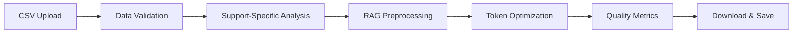
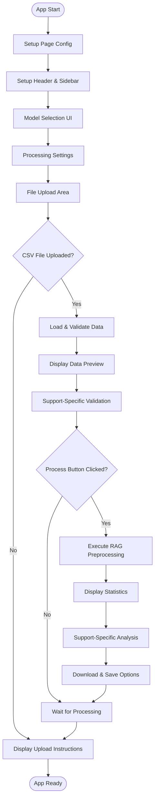
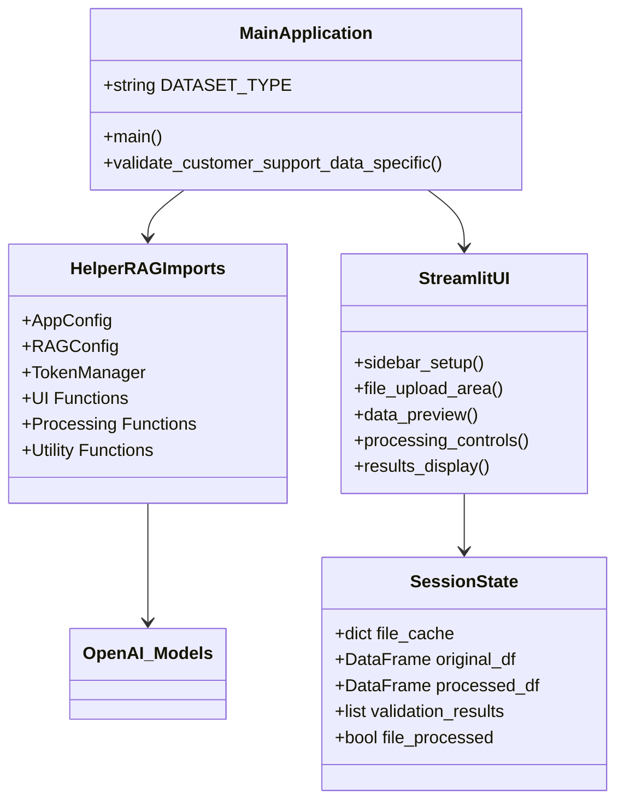
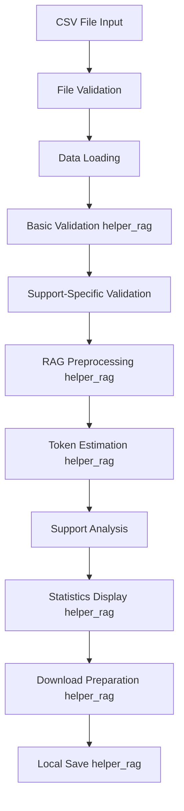
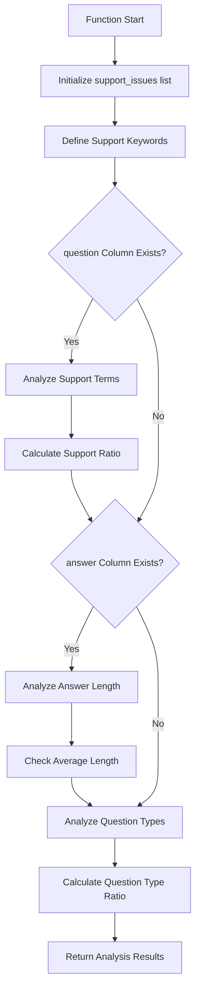
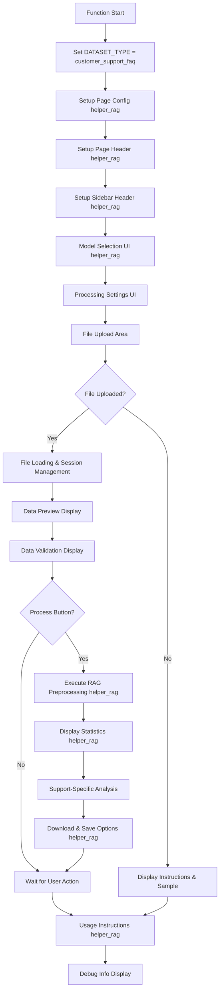
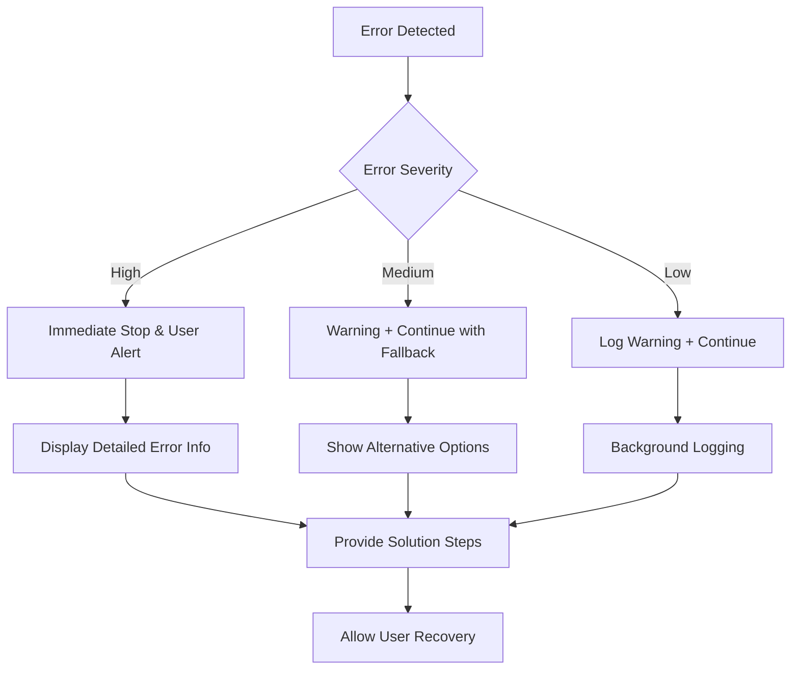

# 📋 a30_011_make_rag_data_customer.py 設計書

## 📝 目次

1. [📖 概要書](#📖-概要書)
2. [🔧 システム構成](#🔧-システム構成)
3. [📋 関数一覧](#📋-関数一覧)
4. [📑 関数詳細設計](#📑-関数詳細設計)
5. [⚙️ 技術仕様](#⚙️-技術仕様)
6. [🚨 エラーハンドリング](#🚨-エラーハンドリング)

---

## 📖 概要書

### 🎯 処理の概要

**カスタマーサポートFAQ専用RAGデータ前処理システム**

本アプリケーションは、カスタマーサポート・FAQ データに特化したRAG（Retrieval-Augmented Generation）用データ前処理システムです。helper_rag.pyの共通機能を活用しながら、カスタマーサポート固有の要件に対応した専門的な前処理を実行します。

#### 🌟 主要機能

| 機能 | 説明 |
|------|------|
| 📄 **CSV前処理** | question・answer列の専門的クレンジング |
| 🔍 **専門検証** | サポート関連用語・質問形式の分析 |
| 🤖 **モデル最適化** | 選択可能なOpenAIモデルに応じたトークン最適化 |
| 📊 **統計分析** | サポート特有の品質メトリクス |
| 💾 **柔軟保存** | ブラウザダウンロード + ローカル保存 |
| ⚙️ **カスタム設定** | 書式保護・質問正規化オプション |

#### 🎨 処理対象データ



### 🔄 mainの処理の流れ



---

## 🔧 システム構成

### 📦 主要コンポーネント



### 📋 データフロー



---

## 📋 関数一覧

### 🏗️ アプリケーション固有関数

| 関数名 | 分類 | 処理概要 | 重要度 |
|--------|------|----------|---------|
| `validate_customer_support_data_specific()` | 🔍 検証 | カスタマーサポート特有のデータ検証 | ⭐⭐⭐ |
| `main()` | 🎯 制御 | アプリケーションメイン制御 | ⭐⭐⭐ |

### 📦 helper_rag.py インポート関数

#### 🔧 設定・管理関数
| 関数名 | 分類 | 処理概要 | 重要度 |
|--------|------|----------|---------|
| `AppConfig` | ⚙️ 設定 | アプリケーション設定管理 | ⭐⭐⭐ |
| `RAGConfig` | ⚙️ 設定 | RAGデータセット設定管理 | ⭐⭐⭐ |
| `TokenManager` | 🔢 管理 | トークン計算・管理 | ⭐⭐ |
| `safe_execute` | 🛡️ 保護 | エラーハンドリングデコレータ | ⭐⭐ |

#### 🎨 UI関数
| 関数名 | 分類 | 処理概要 | 重要度 |
|--------|------|----------|---------|
| `select_model()` | 🤖 選択 | モデル選択UI | ⭐⭐⭐ |
| `show_model_info()` | 📊 表示 | モデル情報表示 | ⭐⭐ |
| `setup_page_config()` | 🎨 設定 | ページ設定 | ⭐⭐ |
| `setup_page_header()` | 🎨 設定 | ページヘッダー設定 | ⭐⭐ |
| `setup_sidebar_header()` | 🎨 設定 | サイドバーヘッダー設定 | ⭐⭐ |

#### 📊 分析・表示関数
| 関数名 | 分類 | 処理概要 | 重要度 |
|--------|------|----------|---------|
| `estimate_token_usage()` | 🔢 推定 | トークン使用量推定 | ⭐⭐⭐ |
| `display_statistics()` | 📈 表示 | 処理統計情報表示 | ⭐⭐⭐ |
| `show_usage_instructions()` | 📖 説明 | 使用方法説明表示 | ⭐ |

#### 📄 データ処理関数
| 関数名 | 分類 | 処理概要 | 重要度 |
|--------|------|----------|---------|
| `validate_data()` | ✅ 検証 | 基本データ検証 | ⭐⭐⭐ |
| `load_dataset()` | 📥 読込 | データセット読み込み | ⭐⭐⭐ |
| `process_rag_data()` | ⚙️ 処理 | RAG用データ前処理 | ⭐⭐⭐ |
| `create_download_data()` | 💾 作成 | ダウンロード用データ作成 | ⭐⭐⭐ |
| `save_files_to_output()` | 💾 保存 | OUTPUTフォルダ保存 | ⭐⭐⭐ |

---

## 📑 関数詳細設計

### 🔍 validate_customer_support_data_specific()

#### 🎯 処理概要
カスタマーサポートFAQデータ特有の品質検証・統計分析を実行

#### 📊 処理の流れ


#### 📋 IPO設計

| 項目 | 内容 |
|------|------|
| **INPUT** | `df: DataFrame` - カスタマーサポートFAQデータフレーム |
| **PROCESS** | キーワード分析 → 回答長分析 → 質問タイプ分析 |
| **OUTPUT** | `List[str]` - 分析結果メッセージリスト |

#### 🔍 分析項目詳細

##### 📝 サポート関連用語分析
```python
support_keywords = [
    # 日本語
    '問題', '解決', 'トラブル', 'エラー', 'サポート', 'ヘルプ', '対応',
    # 英語
    'problem', 'issue', 'error', 'help', 'support', 'solution', 'troubleshoot'
]
```

##### 📊 回答品質メトリクス
```python
# 回答長チェック
if avg_answer_length < 50:
    "⚠️ 平均回答長が短い可能性"
else:
    "✅ 適切な回答長"
```

##### ❓ 質問タイプ分析
```python
question_starters = [
    # 日本語
    'どうすれば', 'なぜ', 'いつ', 'どこで', 'どのように',
    # 英語
    'what', 'how', 'why', 'when', 'where'
]
```

#### 📈 出力例

```python
analysis_results = [
    "サポート関連用語を含む質問: 1,250件 (85.5%)",
    "✅ 適切な回答長: 平均127文字",
    "疑問形質問: 980件 (67.1%)"
]
```

---

### 🎯 main()

#### 🎯 処理概要
カスタマーサポートFAQ前処理アプリケーション全体のオーケストレーション

#### 📊 処理の流れ


#### 📋 IPO設計

| 項目 | 内容 |
|------|------|
| **INPUT** | なし（Streamlitアプリとして起動） |
| **PROCESS** | UI構築 → ファイル処理 → データ分析 → 結果提供 |
| **OUTPUT** | なし（副作用：Streamlit Webアプリ表示） |

#### 🎨 UI レイアウト構成

##### 🔧 サイドバー構成
```python
sidebar_sections = [
    "Model Selection (helper_rag)",
    "Model Information Display (helper_rag)",
    "Processing Settings",
    "Support Data Settings",
    "Debug Information"
]
```

##### 📋 メインエリア構成
```python
main_sections = [
    "Model Info Display",
    "File Upload Area",
    "Data Preview",
    "Validation Results",
    "Processing Controls",
    "Statistics Display (helper_rag)",
    "Support-Specific Analysis",
    "Download & Save (helper_rag)",
    "Usage Instructions (helper_rag)"
]
```

#### ⚙️ カスタマーサポート特有の設定

##### 💬 サポートデータ設定
```python
support_settings = {
    "preserve_formatting": {
        "default": True,
        "help": "回答内の重要な書式を保護"
    },
    "normalize_questions": {
        "default": True,
        "help": "質問文の表記ゆれを統一"
    }
}
```

##### 📊 処理設定
```python
processing_settings = {
    "combine_columns_option": {
        "default": True,
        "help": "複数列を結合してRAG用テキストを作成"
    },
    "show_validation": {
        "default": True,
        "help": "データの品質検証結果を表示"
    }
}
```

#### 💾 セッション状態管理

```python
session_state_structure = {
    "current_file_key": "file_{name}_{size}",
    "original_df": "DataFrame",
    "validation_results": "List[str]",
    "original_rows": "int",
    "file_processed": "bool",
    "processed_df": "DataFrame",
    "download_data": "Tuple[str, str]",
    "download_data_key": "str"
}
```

---

## ⚙️ 技術仕様

### 📦 依存ライブラリ

| ライブラリ | バージョン | 用途 | 重要度 |
|-----------|-----------|------|---------|
| `streamlit` | 最新 | 🎨 Web UIフレームワーク | ⭐⭐⭐ |
| `pandas` | 最新 | 📊 データ処理・表示 | ⭐⭐⭐ |
| `helper_rag` | カスタム | 🔧 共通RAG処理機能 | ⭐⭐⭐ |
| `logging` | 標準 | 📝 ログ管理 | ⭐⭐ |
| `typing` | 標準 | 🔤 型ヒント | ⭐⭐ |
| `pathlib` | 標準 | 📁 パス操作 | ⭐⭐ |

### 🗃️ データセット仕様

#### 📄 必須CSVフォーマット

```yaml
CSV_Requirements:
  encoding: "UTF-8"
  required_columns:
    - "question": "質問テキスト"
    - "answer": "回答テキスト"
  file_format: ".csv"
  max_file_size: "制限なし（メモリ依存）"
```

#### 📊 データ品質指標

```yaml
Quality_Metrics:
  support_term_ratio:
    optimal: "> 80%"
    warning: "< 60%"
    keywords: ["問題", "solution", "help", etc.]

  answer_length:
    optimal: "> 50文字"
    warning: "< 30文字"
    metric: "平均回答長"

  question_type_ratio:
    optimal: "> 50%"
    measure: "疑問形質問の割合"
    patterns: ["どうすれば", "how", "what", etc.]
```

### 🤖 モデル対応

#### 📋 利用可能モデル（helper_rag.AppConfig）

```python
available_models = [
    "gpt-4o",           # 高品質・高コスト
    "gpt-4o-mini",      # バランス型（推奨）
    "gpt-4.1",          # 次世代高品質
    "gpt-4.1-mini",     # 次世代効率型
    "o1", "o1-mini",    # 推論特化
    "o3", "o3-mini",    # 最新推論
    "o4", "o4-mini"     # 最新高性能
]
```

#### 💰 コスト最適化設定

```python
model_recommendations = {
    "customer_support_faq": {
        "recommended": ["gpt-4o-mini", "gpt-4.1-mini"],
        "reason": "FAQ処理に最適なコスト効率",
        "token_estimation": "自動計算・表示"
    }
}
```

### 🔄 処理パイプライン

#### 📋 前処理ステップ

```yaml
Processing_Pipeline:
  step1:
    name: "File Validation"
    function: "load_dataset (helper_rag)"
    checks: ["encoding", "columns", "format"]

  step2:
    name: "Basic Validation"
    function: "validate_data (helper_rag)"
    checks: ["rows", "duplicates", "empty_values"]

  step3:
    name: "Support-Specific Validation"
    function: "validate_customer_support_data_specific"
    checks: ["keywords", "answer_length", "question_types"]

  step4:
    name: "RAG Preprocessing"
    function: "process_rag_data (helper_rag)"
    operations: ["cleaning", "combining", "normalization"]

  step5:
    name: "Token Estimation"
    function: "estimate_token_usage (helper_rag)"
    models: ["selected_model"]

  step6:
    name: "Statistics Display"
    function: "display_statistics (helper_rag)"
    metrics: ["processing_stats", "quality_metrics"]
```

### 💾 出力仕様

#### 📊 生成ファイル

```yaml
Output_Files:
  csv_file:
    name: "preprocessed_customer_support_faq_{rows}rows.csv"
    format: "CSV with all processed columns"
    encoding: "UTF-8"

  text_file:
    name: "customer_support_faq.txt"
    format: "Combined text for RAG/Vector Store"
    content: "One text per line"

  metadata_file:
    name: "metadata_customer_support_faq_{timestamp}.json"
    format: "JSON metadata"
    content: "processing_info, statistics, settings"
```

#### 🗂️ 保存場所

```python
save_locations = {
    "browser_download": "User's default download folder",
    "local_save": "./OUTPUT/ directory",
    "session_cache": "Streamlit session state"
}
```

---

## 🚨 エラーハンドリング

### 📄 ファイル関連エラー

| エラー種別 | 原因 | 対処法 | 影響度 |
|-----------|------|--------|---------|
| **CSV形式エラー** | 🚫 不正なCSV形式 | フォーマット確認指示・サンプル表示 | 🔴 高 |
| **必須列不在** | 📋 question/answer列なし | 必須列説明・フォーマット例提示 | 🔴 高 |
| **エンコーディングエラー** | 🔤 非UTF-8ファイル | UTF-8変換指示・ツール案内 | 🟡 中 |
| **ファイルサイズ過大** | 💾 メモリ不足 | ファイル分割提案・チャンクサイズ調整 | 🟡 中 |
| **空ファイル** | 📄 データなし | ファイル内容確認指示 | 🟠 低 |

### 🔧 処理関連エラー

| エラー種別 | 原因 | 対処法 | 影響度 |
|-----------|------|--------|---------|
| **helper_rag インポートエラー** | 📦 モジュール不在 | インストール指示・依存関係確認 | 🔴 高 |
| **前処理実行エラー** | ⚙️ データ形式問題 | データ確認・修正指示 | 🟡 中 |
| **トークン計算エラー** | 🔢 計算処理問題 | モデル設定確認・代替手段提示 | 🟠 低 |
| **統計計算エラー** | 📊 数値処理問題 | データ品質確認・フィルタリング | 🟠 低 |

### 💾 保存関連エラー

| エラー種別 | 原因 | 対処法 | 影響度 |
|-----------|------|--------|---------|
| **OUTPUT フォルダ作成失敗** | 🔒 権限不足 | 権限確認・ディレクトリ指定変更 | 🟡 中 |
| **ファイル書き込み失敗** | 💾 ディスク容量・権限 | 容量確認・権限設定指示 | 🟡 中 |
| **ダウンロードデータ生成失敗** | 🔄 メモリ・形式問題 | ブラウザ再読込・代替形式提案 | 🟠 低 |

### 🎨 UI関連エラー

| エラー種別 | 原因 | 対処法 | 影響度 |
|-----------|------|--------|---------|
| **セッション状態破損** | 🔄 Streamlit問題 | ページ再読込・キャッシュクリア | 🟡 中 |
| **モデル選択エラー** | 🤖 設定問題 | デフォルトモデル復帰・再選択 | 🟠 低 |
| **UI表示エラー** | 🎨 レンダリング問題 | ブラウザ確認・代替表示 | 🟠 低 |

### 🛠️ エラー処理戦略

#### 🔧 段階的エラー処理



#### ✅ 適切なエラーメッセージ例

```python
# 📄 ファイル形式エラー
st.error("❌ CSVファイルの形式に問題があります")
st.info("💡 必要な列: question, answer")
st.code("question,answer\nパスワードを忘れました,リセットページをご利用ください")

# 🔧 処理エラー
st.error("❌ データ前処理中にエラーが発生しました")
st.warning("⚠️ データの一部に問題がある可能性があります")
st.info("💡 対処法: データを確認して再アップロードしてください")

# 💾 保存エラー
st.error("❌ ファイル保存に失敗しました")
st.info("💡 ブラウザダウンロードは利用可能です")
```

#### 🚨 エラー復旧フロー

```python
error_recovery_flow = {
    "file_error": [
        "Display detailed file requirements",
        "Show sample data format",
        "Provide file conversion tools"
    ],
    "processing_error": [
        "Save partial results if possible",
        "Display error details",
        "Suggest data modifications"
    ],
    "save_error": [
        "Offer alternative download methods",
        "Check disk space and permissions",
        "Provide manual export options"
    ]
}
```

---

## 🎉 まとめ

この設計書は、**a30_011_make_rag_data_customer.py** の完全な技術仕様と実装詳細を網羅した包括的ドキュメントです。

### 🌟 設計のハイライト

- **🎯 特化型設計**: カスタマーサポートFAQに特化した専門処理
- **🔧 共通機能活用**: helper_rag.pyとの効率的な機能分担
- **📊 品質重視**: サポート特有の品質指標による詳細分析
- **🎨 使いやすさ**: 直感的なStreamlit UI + 豊富な設定オプション
- **💾 柔軟な出力**: ブラウザダウンロード + ローカル保存の両対応

### 🔧 アーキテクチャ特徴

- **📦 モジュール分離**: 共通処理はhelper_rag、固有処理は本体で分担
- **🔄 セッション管理**: ファイルアップロード状態の効率的キャッシュ
- **⚙️ 型安全性**: 完全な型ヒント + エラー安全設計
- **🎨 UI一貫性**: helper_ragの共通UI関数による統一インターフェース

### 📈 カスタマーサポート特化機能

- **🔍 専門分析**: サポート関連用語・質問タイプ・回答品質の分析
- **⚙️ カスタム設定**: 書式保護・質問正規化の専門オプション
- **📊 品質メトリクス**: サポートデータに最適化された品質指標
- **💡 業界対応**: カスタマーサポート業界のベストプラクティス反映

### 🚀 今後の拡張可能性

- 🌍 多言語サポートFAQ対応
- 🤖 AI自動分類機能
- 📊 高度な品質スコアリング
- 🔄 バッチ処理機能
- 📈 A/Bテスト分析機能
