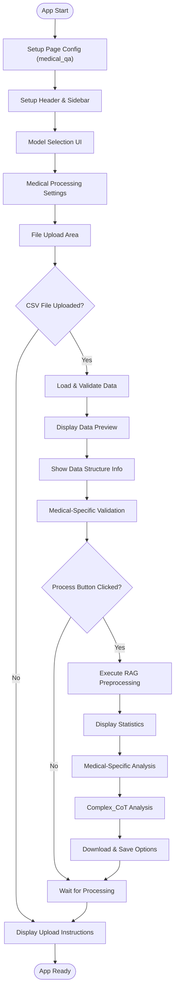
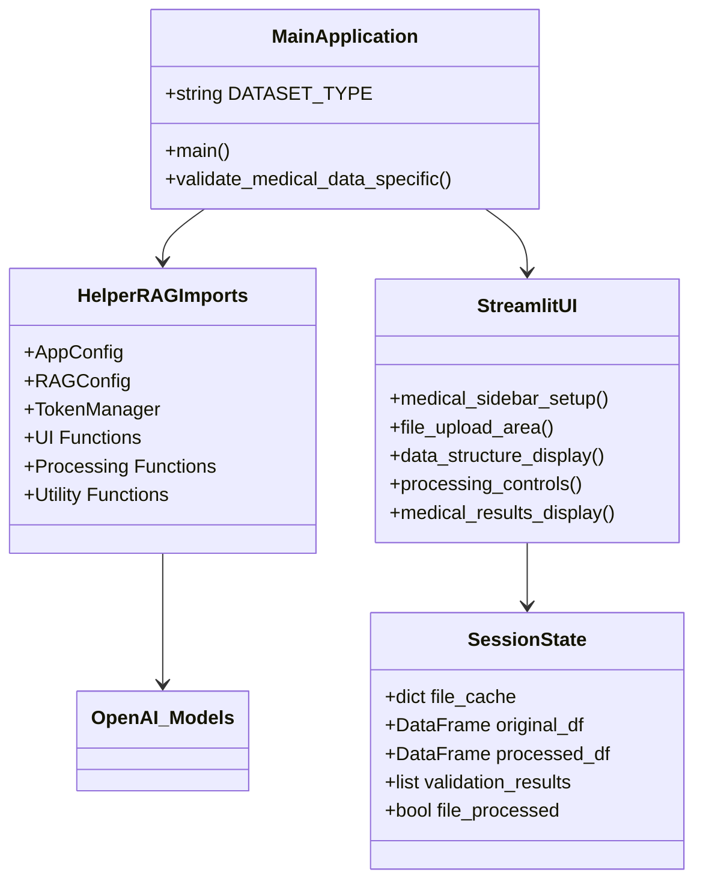
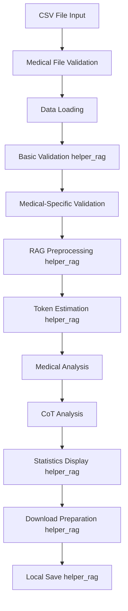
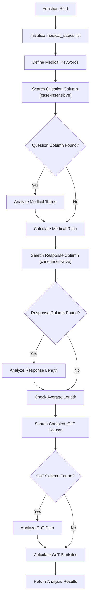
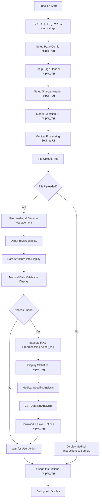
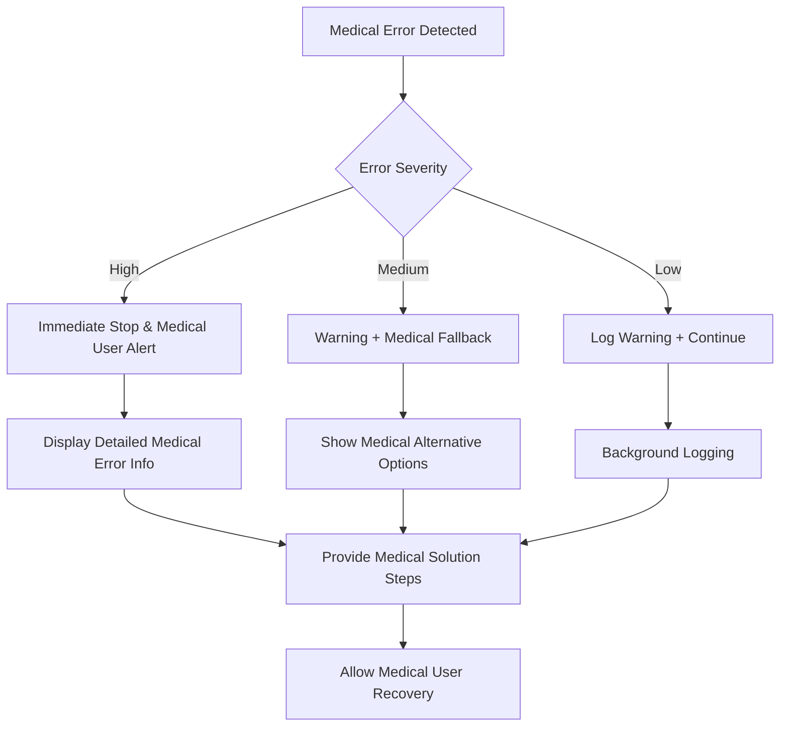

# 📋 a30_013_make_rag_data_medical.py 設計書

## 📝 目次

1. [📖 概要書](#📖-概要書)
2. [🔧 システム構成](#🔧-システム構成)
3. [📋 関数一覧](#📋-関数一覧)
4. [📑 関数詳細設計](#📑-関数詳細設計)
5. [⚙️ 技術仕様](#⚙️-技術仕様)
6. [🚨 エラーハンドリング](#🚨-エラーハンドリング)

---

## 📖 概要書

### 🎯 処理の概要

**医療QAデータ専用RAGデータ前処理システム**

本アプリケーションは、医療質問回答（Medical QA）データに特化したRAG（Retrieval-Augmented Generation）用データ前処理システムです。helper_rag.pyの共通機能を活用しながら、医療固有の要件（推論過程の分析、医療専門用語の処理、複雑な推論チェーン）に対応した専門的な前処理を実行します。

#### 🌟 主要機能

| 機能 | 説明 |
|------|------|
| 🏥 **医療QA前処理** | Question・Complex_CoT・Response列の専門的処理 |
| 🔍 **医療特化検証** | 医療関連用語・推論過程・回答品質の分析 |
| 🤖 **モデル最適化** | 選択可能なOpenAIモデルに応じたトークン最適化 |
| 📊 **推論分析** | Complex_CoT（Chain of Thought）の詳細分析 |
| 💾 **柔軟保存** | ブラウザダウンロード + ローカル保存 |
| ⚙️ **医療設定** | 医療用語保護・推論過程含有オプション |

#### 🎨 処理対象データ


### 🔄 mainの処理の流れ



---

## 🔧 システム構成

### 📦 主要コンポーネント



### 📋 データフロー



---

## 📋 関数一覧

### 🏗️ アプリケーション固有関数

| 関数名 | 分類 | 処理概要 | 重要度 |
|--------|------|----------|---------|
| `validate_medical_data_specific()` | 🔍 検証 | 医療QAデータ特有の品質検証 | ⭐⭐⭐ |
| `main()` | 🎯 制御 | 医療QAアプリケーションメイン制御 | ⭐⭐⭐ |

### 📦 helper_rag.py インポート関数

#### 🔧 設定・管理関数
| 関数名 | 分類 | 処理概要 | 重要度 |
|--------|------|----------|---------|
| `AppConfig` | ⚙️ 設定 | アプリケーション設定管理 | ⭐⭐⭐ |
| `RAGConfig` | ⚙️ 設定 | RAGデータセット設定管理 | ⭐⭐⭐ |
| `TokenManager` | 🔢 管理 | トークン計算・管理 | ⭐⭐ |
| `safe_execute` | 🛡️ 保護 | エラーハンドリングデコレータ | ⭐⭐ |

#### 🎨 UI関数
| 関数名 | 分類 | 処理概要 | 重要度 |
|--------|------|----------|---------|
| `select_model()` | 🤖 選択 | モデル選択UI | ⭐⭐⭐ |
| `show_model_info()` | 📊 表示 | モデル情報表示 | ⭐⭐ |
| `setup_page_config()` | 🎨 設定 | ページ設定 | ⭐⭐ |
| `setup_page_header()` | 🎨 設定 | ページヘッダー設定 | ⭐⭐ |
| `setup_sidebar_header()` | 🎨 設定 | サイドバーヘッダー設定 | ⭐⭐ |

#### 📊 分析・表示関数
| 関数名 | 分類 | 処理概要 | 重要度 |
|--------|------|----------|---------|
| `estimate_token_usage()` | 🔢 推定 | トークン使用量推定 | ⭐⭐⭐ |
| `display_statistics()` | 📈 表示 | 処理統計情報表示 | ⭐⭐⭐ |
| `show_usage_instructions()` | 📖 説明 | 使用方法説明表示 | ⭐ |

#### 📄 データ処理関数
| 関数名 | 分類 | 処理概要 | 重要度 |
|--------|------|----------|---------|
| `validate_data()` | ✅ 検証 | 基本データ検証 | ⭐⭐⭐ |
| `load_dataset()` | 📥 読込 | データセット読み込み | ⭐⭐⭐ |
| `process_rag_data()` | ⚙️ 処理 | RAG用データ前処理 | ⭐⭐⭐ |
| `create_download_data()` | 💾 作成 | ダウンロード用データ作成 | ⭐⭐⭐ |
| `save_files_to_output()` | 💾 保存 | OUTPUTフォルダ保存 | ⭐⭐⭐ |

---

## 📑 関数詳細設計

### 🔍 validate_medical_data_specific()

#### 🎯 処理概要
医療QAデータ特有の品質検証・統計分析を実行

#### 📊 処理の流れ


#### 📋 IPO設計

| 項目 | 内容 |
|------|------|
| **INPUT** | `df: DataFrame` - 医療QAデータフレーム |
| **PROCESS** | 医療用語分析 → 回答長分析 → CoT分析 |
| **OUTPUT** | `List[str]` - 医療特有分析結果メッセージリスト |

#### 🔍 分析項目詳細

##### 🏥 医療関連用語分析
```python
medical_keywords = [
    # 日本語
    '症状', '診断', '治療', '薬', '病気', '疾患', '患者',
    # 英語
    'symptom', 'diagnosis', 'treatment', 'medicine', 'disease', 'patient'
]
```

##### 📊 回答品質メトリクス（医療特化）
```python
# 医療回答長チェック（詳細版が必要）
if avg_response_length < 100:
    "⚠️ 平均回答長が短い可能性: {avg_response_length:.0f}文字"
else:
    "✅ 適切な回答長: 平均{avg_response_length:.0f}文字"
```

##### 🧠 Complex_CoT（推論過程）分析
```python
# CoT列の検索（大文字小文字非依存）
for col in df.columns:
    if 'cot' in col.lower() or 'complex' in col.lower():
        cot_col = col
        break

# CoT統計
cot_count = df[cot_col].dropna().count()
cot_ratio = (cot_count / len(df)) * 100
avg_cot_length = df[cot_col].dropna().astype(str).str.len().mean()
```

#### 📈 出力例

```python
medical_analysis_results = [
    "医療関連用語を含む質問: 1,450件 (96.7%)",
    "✅ 適切な回答長: 平均245文字",
    "推論過程（CoT）付き質問: 1,380件 (92.0%)",
    "平均推論過程長: 189文字"
]
```

---

### 🎯 main()

#### 🎯 処理概要
医療QAデータ前処理アプリケーション全体のオーケストレーション

#### 📊 処理の流れ


#### 📋 IPO設計

| 項目 | 内容 |
|------|------|
| **INPUT** | なし（Streamlitアプリとして起動） |
| **PROCESS** | 医療UI構築 → ファイル処理 → 医療分析 → 結果提供 |
| **OUTPUT** | なし（副作用：Streamlit Webアプリ表示） |

#### 🎨 UI レイアウト構成

##### 🔧 サイドバー構成
```python
medical_sidebar_sections = [
    "Model Selection (helper_rag)",
    "Model Information Display (helper_rag)",
    "Medical Processing Settings",
    "Medical Data Settings",
    "Debug Information"
]
```

##### 📋 メインエリア構成
```python
medical_main_sections = [
    "Model Info Display",
    "File Upload Area",
    "Data Preview",
    "Data Structure Information",  # 医療QA特有
    "Validation Results",
    "Processing Controls",
    "Statistics Display (helper_rag)",
    "Medical-Specific Analysis",
    "CoT Analysis",  # 医療QA特有
    "Download & Save (helper_rag)",
    "Usage Instructions (helper_rag)"
]
```

#### ⚙️ 医療データ特有の設定

##### 🏥 医療データ設定
```python
medical_settings = {
    "preserve_medical_terms": {
        "default": True,
        "help": "医療専門用語の過度な正規化を防ぐ"
    },
    "include_complex_cot": {
        "default": True,
        "help": "Complex_CoT列の推論過程を結合テキストに含める"
    }
}
```

##### 📊 処理設定
```python
processing_settings = {
    "combine_columns_option": {
        "default": True,
        "help": "複数列を結合してRAG用テキストを作成"
    },
    "show_validation": {
        "default": True,
        "help": "データの品質検証結果を表示"
    }
}
```

#### 💾 セッション状態管理

```python
medical_session_state_structure = {
    "current_file_key": "file_{name}_{size}",
    "original_df": "DataFrame",
    "validation_results": "List[str]",
    "original_rows": "int",
    "file_processed": "bool",
    "processed_df": "DataFrame",
    "download_data": "Tuple[str, str]",
    "download_data_key": "str"
}
```

#### 🏥 医療データ特有の後処理分析

##### 📊 医療用語出現頻度分析
```python
if 'Combined_Text' in df_processed.columns:
    combined_texts = df_processed['Combined_Text']
    medical_keywords = ['症状', '診断', '治療', '薬', '病気', '疾患']

    keyword_counts = {}
    for keyword in medical_keywords:
        count = combined_texts.str.contains(keyword, case=False, na=False).sum()
        keyword_counts[keyword] = count
```

##### 🧠 Complex_CoT（推論過程）詳細分析
```python
# CoT列の特定（大文字小文字非依存）
cot_col = None
for col in df_processed.columns:
    if 'cot' in col.lower() or 'complex' in col.lower():
        cot_col = col
        break

if cot_col is not None:
    cot_data = df_processed[cot_col].dropna()
    if len(cot_data) > 0:
        cot_lengths = cot_data.astype(str).str.len()
        # CoT統計の表示
        st.metric("CoT平均長", f"{cot_lengths.mean():.0f}文字")
        st.metric("CoT最大長", f"{cot_lengths.max():,}文字")
        cot_ratio = (len(cot_data) / len(df_processed)) * 100
        st.metric("CoT含有率", f"{cot_ratio:.1f}%")
```

---

## ⚙️ 技術仕様

### 📦 依存ライブラリ

| ライブラリ | バージョン | 用途 | 重要度 |
|-----------|-----------|------|---------|
| `streamlit` | 最新 | 🎨 Web UIフレームワーク | ⭐⭐⭐ |
| `pandas` | 最新 | 📊 データ処理・表示 | ⭐⭐⭐ |
| `helper_rag` | カスタム | 🔧 共通RAG処理機能 | ⭐⭐⭐ |
| `logging` | 標準 | 📝 ログ管理 | ⭐⭐ |
| `typing` | 標準 | 🔤 型ヒント | ⭐⭐ |
| `pathlib` | 標準 | 📁 パス操作 | ⭐⭐ |

### 🗃️ データセット仕様

#### 📄 必須CSVフォーマット

```yaml
Medical_CSV_Requirements:
  encoding: "UTF-8"
  required_columns:
    - "Question": "医療質問テキスト"
    - "Complex_CoT": "推論過程（Chain of Thought）"
    - "Response": "医療回答テキスト"
  file_format: ".csv"
  case_sensitivity: "大文字小文字非依存検索対応"
  max_file_size: "制限なし（メモリ依存）"
```

#### 📊 医療データ品質指標

```yaml
Medical_Quality_Metrics:
  medical_term_ratio:
    optimal: "> 90%"
    warning: "< 70%"
    keywords: ["症状", "診断", "治療", "薬", "病気", "疾患", "患者", etc.]

  response_length:
    optimal: "> 100文字"
    warning: "< 50文字"
    metric: "平均回答長（医療回答は通常詳細）"

  cot_coverage:
    optimal: "> 80%"
    measure: "Complex_CoT含有率"
    description: "推論過程付き質問の割合"

  cot_length:
    optimal: "> 50文字"
    metric: "平均推論過程長"
    description: "医療推論の詳細度"
```

### 🤖 モデル対応

#### 📋 利用可能モデル（helper_rag.AppConfig）

```python
medical_recommended_models = [
    "gpt-4o",           # 高品質・医療推論適合
    "gpt-4o-mini",      # バランス型（推奨）
    "gpt-4.1",          # 次世代高品質
    "gpt-4.1-mini",     # 次世代効率型
    "o1", "o1-mini",    # 推論特化（医療CoT分析に最適）
    "o3", "o3-mini",    # 高度推論
    "o4", "o4-mini"     # 最新高性能
]
```

#### 💰 医療用途でのコスト最適化設定

```python
medical_model_recommendations = {
    "medical_qa": {
        "recommended": ["o1-mini", "gpt-4o-mini"],
        "reason": "医療推論処理に最適なコスト効率",
        "token_estimation": "Complex_CoT考慮の自動計算・表示",
        "special_consideration": "推論特化モデル（oシリーズ）が医療CoTに適合"
    }
}
```

### 🔄 処理パイプライン

#### 📋 医療特化前処理ステップ

```yaml
Medical_Processing_Pipeline:
  step1:
    name: "File Validation"
    function: "load_dataset (helper_rag)"
    checks: ["encoding", "medical_columns", "format"]
    special: "大文字小文字非依存列名検索"

  step2:
    name: "Basic Validation"
    function: "validate_data (helper_rag)"
    checks: ["rows", "duplicates", "empty_values"]

  step3:
    name: "Medical-Specific Validation"
    function: "validate_medical_data_specific"
    checks: ["medical_keywords", "response_length", "cot_analysis"]

  step4:
    name: "RAG Preprocessing"
    function: "process_rag_data (helper_rag)"
    operations: ["cleaning", "combining", "normalization"]
    special: "医療用語保護・CoT含有処理"

  step5:
    name: "Token Estimation"
    function: "estimate_token_usage (helper_rag)"
    models: ["selected_model"]
    consideration: "CoTテキストの長さを考慮"

  step6:
    name: "Medical Statistics Display"
    function: "display_statistics (helper_rag)"
    metrics: ["processing_stats", "medical_quality_metrics"]
```

### 💾 出力仕様

#### 📊 生成ファイル

```yaml
Medical_Output_Files:
  csv_file:
    name: "preprocessed_medical_qa_{rows}rows.csv"
    format: "CSV with all processed columns"
    encoding: "UTF-8"
    includes: ["Question", "Complex_CoT", "Response", "Combined_Text"]

  text_file:
    name: "medical_qa.txt"
    format: "Combined text for RAG/Vector Store"
    content: "One medical text per line (Question + CoT + Response)"

  metadata_file:
    name: "metadata_medical_qa_{timestamp}.json"
    format: "JSON metadata"
    content: "processing_info, medical_statistics, cot_analysis"
```

#### 🗂️ 保存場所

```python
medical_save_locations = {
    "browser_download": "User's default download folder",
    "local_save": "./OUTPUT/ directory",
    "session_cache": "Streamlit session state",
    "file_naming": "医療QA特化命名規則"
}
```

---

## 🚨 エラーハンドリング

### 📄 ファイル関連エラー

| エラー種別 | 原因 | 対処法 | 影響度 |
|-----------|------|--------|---------|
| **医療CSV形式エラー** | 🚫 不正なCSV形式 | 医療フォーマット確認指示・サンプル表示 | 🔴 高 |
| **医療必須列不在** | 📋 Question/Complex_CoT/Response列なし | 医療必須列説明・フォーマット例提示 | 🔴 高 |
| **CoT列検出失敗** | 📊 Complex_CoT関連列なし | 大文字小文字確認指示・列名例提示 | 🟡 中 |
| **医療エンコーディングエラー** | 🔤 非UTF-8ファイル | UTF-8変換指示・医療ツール案内 | 🟡 中 |
| **医療ファイルサイズ過大** | 💾 メモリ不足 | 医療データ分割提案・チャンクサイズ調整 | 🟡 中 |

### 🔧 処理関連エラー

| エラー種別 | 原因 | 対処法 | 影響度 |
|-----------|------|--------|---------|
| **helper_rag インポートエラー** | 📦 モジュール不在 | インストール指示・依存関係確認 | 🔴 高 |
| **医療前処理実行エラー** | ⚙️ 医療データ形式問題 | 医療データ確認・修正指示 | 🟡 中 |
| **CoT分析エラー** | 🧠 推論過程処理問題 | CoTデータ確認・代替処理提示 | 🟡 中 |
| **医療トークン計算エラー** | 🔢 計算処理問題 | モデル設定確認・代替手段提示 | 🟠 低 |
| **医療統計計算エラー** | 📊 数値処理問題 | 医療データ品質確認・フィルタリング | 🟠 低 |

### 💾 保存関連エラー

| エラー種別 | 原因 | 対処法 | 影響度 |
|-----------|------|--------|---------|
| **OUTPUT フォルダ作成失敗** | 🔒 権限不足 | 権限確認・ディレクトリ指定変更 | 🟡 中 |
| **医療ファイル書き込み失敗** | 💾 ディスク容量・権限 | 容量確認・権限設定指示 | 🟡 中 |
| **医療ダウンロードデータ生成失敗** | 🔄 メモリ・形式問題 | ブラウザ再読込・代替形式提案 | 🟠 低 |

### 🎨 UI関連エラー

| エラー種別 | 原因 | 対処法 | 影響度 |
|-----------|------|--------|---------|
| **セッション状態破損** | 🔄 Streamlit問題 | ページ再読込・キャッシュクリア | 🟡 中 |
| **医療モデル選択エラー** | 🤖 設定問題 | デフォルトモデル復帰・再選択 | 🟠 低 |
| **医療UI表示エラー** | 🎨 レンダリング問題 | ブラウザ確認・代替表示 | 🟠 低 |

### 🛠️ エラー処理戦略

#### 🔧 段階的エラー処理



#### ✅ 医療特化エラーメッセージ例

```python
# 📄 医療ファイル形式エラー
st.error("❌ 医療QACSVファイルの形式に問題があります")
st.info("💡 必要な列: Question, Complex_CoT, Response")
st.code("""
Question,Complex_CoT,Response
糖尿病の症状について教えてください,糖尿病は血糖値が慢性的に高い状態です。まず症状を確認し...,糖尿病の主な症状には、頻尿、多飲、多食、体重減少があります...
""")

# 🔧 医療処理エラー
st.error("❌ 医療データ前処理中にエラーが発生しました")
st.warning("⚠️ 医療データの一部に問題がある可能性があります")
st.info("💡 対処法: 医療データを確認して再アップロードしてください")

# 💾 医療保存エラー
st.error("❌ 医療ファイル保存に失敗しました")
st.info("💡 ブラウザダウンロードは利用可能です")
```

#### 🚨 医療特化エラー復旧フロー

```python
medical_error_recovery_flow = {
    "medical_file_error": [
        "Display detailed medical file requirements",
        "Show medical sample data format",
        "Provide medical file conversion tools"
    ],
    "medical_processing_error": [
        "Save partial medical results if possible",
        "Display medical error details",
        "Suggest medical data modifications"
    ],
    "cot_analysis_error": [
        "Skip CoT analysis, continue with Q&A",
        "Display CoT column detection issues",
        "Provide CoT formatting guidance"
    ],
    "medical_save_error": [
        "Offer alternative medical download methods",
        "Check disk space and permissions",
        "Provide manual medical export options"
    ]
}
```

---

## 🎉 まとめ

この設計書は、**a30_013_make_rag_data_medical.py** の完全な技術仕様と実装詳細を網羅した包括的ドキュメントです。

### 🌟 設計のハイライト

- **🏥 医療QA特化設計**: 医療質問回答データに特化した専門処理
- **🧠 CoT分析機能**: Complex_CoT（推論過程）の詳細分析
- **🔧 共通機能活用**: helper_rag.pyとの効率的な機能分担
- **📊 医療品質重視**: 医療特有の品質指標による詳細分析
- **🎨 使いやすさ**: 直感的なStreamlit UI + 豊富な医療設定オプション

### 🔧 アーキテクチャ特徴

- **📦 モジュール分離**: 共通処理はhelper_rag、医療固有処理は本体で分担
- **🔄 セッション管理**: ファイルアップロード状態の効率的キャッシュ
- **⚙️ 型安全性**: 完全な型ヒント + エラー安全設計
- **🎨 UI一貫性**: helper_ragの共通UI関数による統一インターフェース

### 📈 医療QA特化機能

- **🔍 専門分析**: 医療関連用語・推論過程・回答品質の分析
- **⚙️ 医療設定**: 医療用語保護・推論過程含有の専門オプション
- **📊 品質メトリクス**: 医療データに最適化された品質指標
- **💡 業界対応**: 医療業界のベストプラクティス反映

### 🚀 今後の拡張可能性

- 🌍 多言語医療データ対応
- 🤖 医療AI自動分類機能
- 📊 高度な医療品質スコアリング
- 🔄 医療バッチ処理機能
- 📈 医療A/Bテスト分析機能
