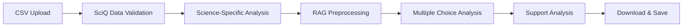
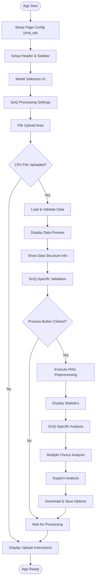
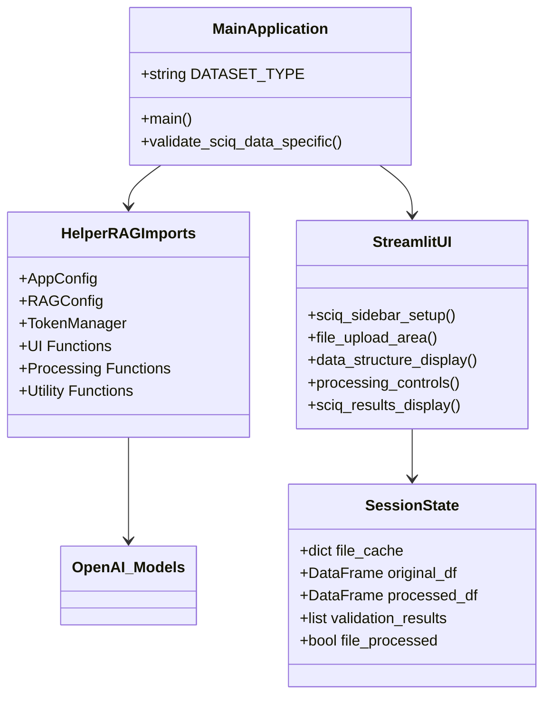
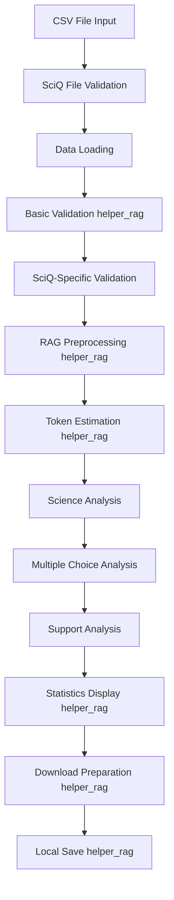
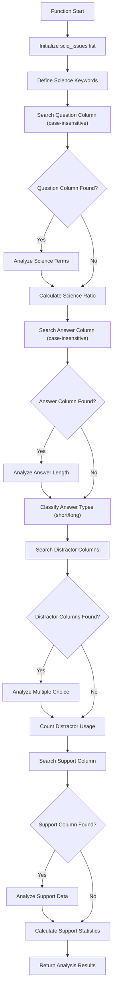
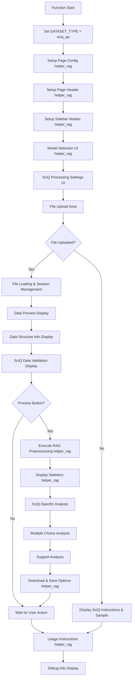
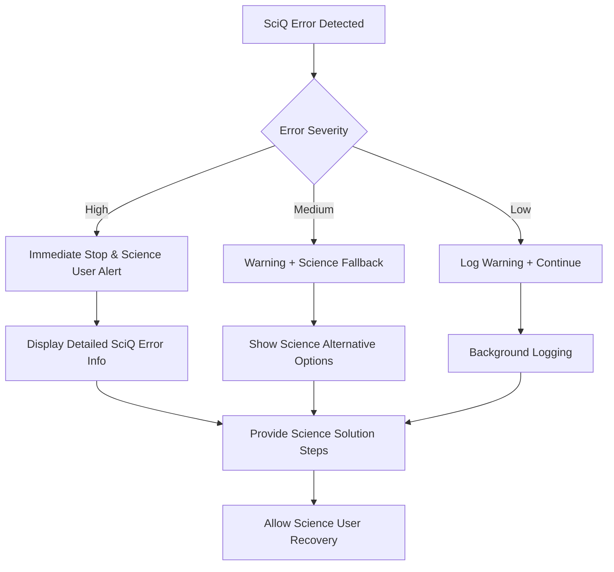

# 📋 a30_014_make_rag_data_sciq.py 設計書

## 📝 目次

1. [📖 概要書](#📖-概要書)
2. [🔧 システム構成](#🔧-システム構成)
3. [📋 関数一覧](#📋-関数一覧)
4. [📑 関数詳細設計](#📑-関数詳細設計)
5. [⚙️ 技術仕様](#⚙️-技術仕様)
6. [🚨 エラーハンドリング](#🚨-エラーハンドリング)

---

## 📖 概要書

### 🎯 処理の概要

**科学・技術QA（SciQ）データ専用RAGデータ前処理システム**

本アプリケーションは、科学・技術質問回答（SciQ）データに特化したRAG（Retrieval-Augmented Generation）用データ前処理システムです。helper_rag.pyの共通機能を活用しながら、科学・技術固有の要件（多肢選択問題の分析、補足説明の処理、科学的記法の保護）に対応した専門的な前処理を実行します。

#### 🌟 主要機能

| 機能 | 説明 |
|------|------|
| 🔬 **SciQ前処理** | question・correct_answer・distractor・support列の専門的処理 |
| 🔍 **科学技術特化検証** | 科学・技術関連用語・多肢選択・補足説明の分析 |
| 🤖 **モデル最適化** | 選択可能なOpenAIモデルに応じたトークン最適化 |
| 📊 **多肢選択分析** | distractor列による選択肢問題の詳細分析 |
| 💾 **柔軟保存** | ブラウザダウンロード + ローカル保存 |
| ⚙️ **科学設定** | 科学的記法保護・選択肢含有・補足説明含有オプション |

#### 🎨 処理対象データ



### 🔄 mainの処理の流れ



---

## 🔧 システム構成

### 📦 主要コンポーネント



### 📋 データフロー



---

## 📋 関数一覧

### 🏗️ アプリケーション固有関数

| 関数名 | 分類 | 処理概要 | 重要度 |
|--------|------|----------|---------|
| `validate_sciq_data_specific()` | 🔍 検証 | SciQ（科学・技術QA）データ特有の品質検証 | ⭐⭐⭐ |
| `main()` | 🎯 制御 | SciQアプリケーションメイン制御 | ⭐⭐⭐ |

### 📦 helper_rag.py インポート関数

#### 🔧 設定・管理関数
| 関数名 | 分類 | 処理概要 | 重要度 |
|--------|------|----------|---------|
| `AppConfig` | ⚙️ 設定 | アプリケーション設定管理 | ⭐⭐⭐ |
| `RAGConfig` | ⚙️ 設定 | RAGデータセット設定管理 | ⭐⭐⭐ |
| `TokenManager` | 🔢 管理 | トークン計算・管理 | ⭐⭐ |
| `safe_execute` | 🛡️ 保護 | エラーハンドリングデコレータ | ⭐⭐ |

#### 🎨 UI関数
| 関数名 | 分類 | 処理概要 | 重要度 |
|--------|------|----------|---------|
| `select_model()` | 🤖 選択 | モデル選択UI | ⭐⭐⭐ |
| `show_model_info()` | 📊 表示 | モデル情報表示 | ⭐⭐ |
| `setup_page_config()` | 🎨 設定 | ページ設定 | ⭐⭐ |
| `setup_page_header()` | 🎨 設定 | ページヘッダー設定 | ⭐⭐ |
| `setup_sidebar_header()` | 🎨 設定 | サイドバーヘッダー設定 | ⭐⭐ |

#### 📊 分析・表示関数
| 関数名 | 分類 | 処理概要 | 重要度 |
|--------|------|----------|---------|
| `estimate_token_usage()` | 🔢 推定 | トークン使用量推定 | ⭐⭐⭐ |
| `display_statistics()` | 📈 表示 | 処理統計情報表示 | ⭐⭐⭐ |
| `show_usage_instructions()` | 📖 説明 | 使用方法説明表示 | ⭐ |

#### 📄 データ処理関数
| 関数名 | 分類 | 処理概要 | 重要度 |
|--------|------|----------|---------|
| `validate_data()` | ✅ 検証 | 基本データ検証 | ⭐⭐⭐ |
| `load_dataset()` | 📥 読込 | データセット読み込み | ⭐⭐⭐ |
| `process_rag_data()` | ⚙️ 処理 | RAG用データ前処理 | ⭐⭐⭐ |
| `create_download_data()` | 💾 作成 | ダウンロード用データ作成 | ⭐⭐⭐ |
| `save_files_to_output()` | 💾 保存 | OUTPUTフォルダ保存 | ⭐⭐⭐ |

---

## 📑 関数詳細設計

### 🔍 validate_sciq_data_specific()

#### 🎯 処理概要
SciQ（科学・技術QA）データ特有の品質検証・統計分析を実行

#### 📊 処理の流れ


#### 📋 IPO設計

| 項目 | 内容 |
|------|------|
| **INPUT** | `df: DataFrame` - SciQ（科学・技術QA）データフレーム |
| **PROCESS** | 科学用語分析 → 回答タイプ分析 → 多肢選択分析 → 補足説明分析 |
| **OUTPUT** | `List[str]` - SciQ特有分析結果メッセージリスト |

#### 🔍 分析項目詳細

##### 🔬 科学・技術関連用語分析
```python
science_keywords = [
    # 日本語
    '化学', '物理', '生物', '数学', '地理', '天文', '医学', '工学',
    # 英語
    'chemistry', 'physics', 'biology', 'math', 'geography', 'astronomy',
    'medicine', 'engineering', 'science', 'theory', 'experiment', 'formula'
]
```

##### 📊 回答タイプ分析（選択肢形式vs記述形式）
```python
# 回答の種類判定
answer_lengths = df[answer_col].astype(str).str.len()
short_answers = (answer_lengths <= 50).sum()  # 選択肢形式
long_answers = (answer_lengths > 50).sum()    # 記述形式

avg_answer_length = answer_lengths.mean()
```

##### 📝 多肢選択問題分析
```python
# distractor列の検出
distractor_columns = [col for col in df.columns if 'distractor' in col.lower()]

if distractor_columns:
    # 各distractor列の使用状況分析
    for col in distractor_columns:
        non_empty = df[col].dropna().count()
        # 選択肢利用率の計算
```

##### 📚 補足説明（support）分析
```python
# support列の検出
support_col = None
for col in df.columns:
    if 'support' in col.lower():
        support_col = col
        break

if support_col is not None:
    support_count = df[support_col].dropna().count()
    support_ratio = (support_count / len(df)) * 100
    avg_support_length = df[support_col].dropna().astype(str).str.len().mean()
```

#### 📈 出力例

```python
sciq_analysis_results = [
    "科学・技術関連用語を含む質問: 1,380件 (92.0%)",
    "短い回答（≤50文字）: 850件",
    "長い回答（>50文字）: 650件",
    "平均回答長: 75文字",
    "✅ 多肢選択形式: 3個の選択肢列が存在",
    "  - distractor1: 1,450件のデータ",
    "  - distractor2: 1,430件のデータ",
    "  - distractor3: 1,380件のデータ",
    "補足説明付き質問: 1,420件 (94.7%)",
    "平均補足説明長: 156文字"
]
```

---

### 🎯 main()

#### 🎯 処理概要
SciQ（科学・技術QA）データ前処理アプリケーション全体のオーケストレーション

#### 📊 処理の流れ


#### 📋 IPO設計

| 項目 | 内容 |
|------|------|
| **INPUT** | なし（Streamlitアプリとして起動） |
| **PROCESS** | SciQ UI構築 → ファイル処理 → 科学技術分析 → 結果提供 |
| **OUTPUT** | なし（副作用：Streamlit Webアプリ表示） |

#### 🎨 UI レイアウト構成

##### 🔧 サイドバー構成
```python
sciq_sidebar_sections = [
    "Model Selection (helper_rag)",
    "Model Information Display (helper_rag)",
    "SciQ Processing Settings",
    "SciQ Data Settings",
    "Debug Information"
]
```

##### 📋 メインエリア構成
```python
sciq_main_sections = [
    "Model Info Display",
    "File Upload Area",
    "Data Preview",
    "Data Structure Information",  # SciQ特有
    "Validation Results",
    "Processing Controls",
    "Statistics Display (helper_rag)",
    "SciQ-Specific Analysis",
    "Multiple Choice Analysis",  # SciQ特有
    "Support Analysis",  # SciQ特有
    "Download & Save (helper_rag)",
    "Usage Instructions (helper_rag)"
]
```

#### ⚙️ SciQデータ特有の設定

##### 🔬 SciQデータ設定
```python
sciq_settings = {
    "include_distractors": {
        "default": False,
        "help": "不正解選択肢も結合テキストに含める"
    },
    "include_support": {
        "default": True,
        "help": "補足説明を結合テキストに含める"
    },
    "preserve_scientific_notation": {
        "default": True,
        "help": "数式や化学式の表記を保護"
    }
}
```

##### 📊 処理設定
```python
processing_settings = {
    "combine_columns_option": {
        "default": True,
        "help": "複数列を結合してRAG用テキストを作成"
    },
    "show_validation": {
        "default": True,
        "help": "データの品質検証結果を表示"
    }
}
```

#### 💾 セッション状態管理

```python
sciq_session_state_structure = {
    "current_file_key": "file_{name}_{size}",
    "original_df": "DataFrame",
    "validation_results": "List[str]",
    "original_rows": "int",
    "file_processed": "bool",
    "processed_df": "DataFrame",
    "download_data": "Tuple[str, str]",
    "download_data_key": "str"
}
```

#### 🔬 SciQデータ特有の後処理分析

##### 📊 科学用語出現頻度分析
```python
if 'Combined_Text' in df_processed.columns:
    combined_texts = df_processed['Combined_Text']
    science_keywords = ['化学', '物理', '生物', '数学', 'chemistry', 'physics', 'biology', 'math']

    keyword_counts = {}
    for keyword in science_keywords:
        count = combined_texts.str.contains(keyword, case=False, na=False).sum()
        keyword_counts[keyword] = count
```

##### 📝 多肢選択問題詳細分析
```python
# distractor列の特定
distractor_columns = [col for col in df_processed.columns if 'distractor' in col.lower()]

if distractor_columns:
    # 選択肢数・利用率の分析
    max_distractors = 0
    total_distractors = 0
    for col in distractor_columns:
        non_empty = df_processed[col].dropna().count()
        max_distractors = max(max_distractors, non_empty)
        total_distractors += non_empty

    # 平均選択肢利用率
    avg_usage = (total_distractors / (len(df_processed) * len(distractor_columns))) * 100
```

##### 📚 補足説明（support）詳細分析
```python
# support列の特定
support_col = None
for col in df_processed.columns:
    if 'support' in col.lower():
        support_col = col
        break

if support_col is not None:
    support_data = df_processed[support_col].dropna()
    if len(support_data) > 0:
        support_lengths = support_data.astype(str).str.len()
        # 補足説明統計の表示
        avg_support_length = support_lengths.mean()
        max_support_length = support_lengths.max()
        support_ratio = (len(support_data) / len(df_processed)) * 100
```

---

## ⚙️ 技術仕様

### 📦 依存ライブラリ

| ライブラリ | バージョン | 用途 | 重要度 |
|-----------|-----------|------|---------|
| `streamlit` | 最新 | 🎨 Web UIフレームワーク | ⭐⭐⭐ |
| `pandas` | 最新 | 📊 データ処理・表示 | ⭐⭐⭐ |
| `helper_rag` | カスタム | 🔧 共通RAG処理機能 | ⭐⭐⭐ |
| `logging` | 標準 | 📝 ログ管理 | ⭐⭐ |
| `typing` | 標準 | 🔤 型ヒント | ⭐⭐ |
| `pathlib` | 標準 | 📁 パス操作 | ⭐⭐ |

### 🗃️ データセット仕様

#### 📄 必須CSVフォーマット

```yaml
SciQ_CSV_Requirements:
  encoding: "UTF-8"
  required_columns:
    - "question": "科学・技術質問テキスト"
    - "correct_answer": "正解テキスト"
  optional_columns:
    - "distractor1": "不正解選択肢1"
    - "distractor2": "不正解選択肢2"
    - "distractor3": "不正解選択肢3"
    - "support": "補足説明テキスト"
  file_format: ".csv"
  case_sensitivity: "大文字小文字非依存検索対応"
  max_file_size: "制限なし（メモリ依存）"
```

#### 📊 SciQデータ品質指標

```yaml
SciQ_Quality_Metrics:
  science_term_ratio:
    optimal: "> 85%"
    warning: "< 70%"
    keywords: ["化学", "物理", "生物", "数学", "chemistry", "physics", etc.]

  answer_type_distribution:
    short_answers: "≤50文字（選択肢形式）"
    long_answers: ">50文字（記述形式）"
    optimal_ratio: "バランス良い分散"

  multiple_choice_coverage:
    optimal: "> 70%"
    measure: "distractor列含有率"
    description: "多肢選択問題の割合"

  support_coverage:
    optimal: "> 80%"
    measure: "support列含有率"
    description: "補足説明付き問題の割合"

  distractor_usage:
    optimal: "> 80%"
    metric: "選択肢利用率"
    description: "各distractor列の使用率"
```

### 🤖 モデル対応

#### 📋 利用可能モデル（helper_rag.AppConfig）

```python
sciq_recommended_models = [
    "gpt-4o",           # 高品質・科学推論適合
    "gpt-4o-mini",      # バランス型（推奨）
    "gpt-4.1",          # 次世代高品質
    "gpt-4.1-mini",     # 次世代効率型
    "o1", "o1-mini",    # 推論特化（科学問題に適合）
    "o3", "o3-mini",    # 高度推論
    "o4", "o4-mini"     # 最新高性能
]
```

#### 💰 科学用途でのコスト最適化設定

```python
sciq_model_recommendations = {
    "sciq_qa": {
        "recommended": ["gpt-4o-mini", "o1-mini"],
        "reason": "科学・技術問題処理に最適なコスト効率",
        "token_estimation": "support・distractor考慮の自動計算・表示",
        "special_consideration": "科学的記法・数式の適切な処理"
    }
}
```

### 🔄 処理パイプライン

#### 📋 SciQ特化前処理ステップ

```yaml
SciQ_Processing_Pipeline:
  step1:
    name: "File Validation"
    function: "load_dataset (helper_rag)"
    checks: ["encoding", "sciq_columns", "format"]
    special: "大文字小文字非依存列名検索"

  step2:
    name: "Basic Validation"
    function: "validate_data (helper_rag)"
    checks: ["rows", "duplicates", "empty_values"]

  step3:
    name: "SciQ-Specific Validation"
    function: "validate_sciq_data_specific"
    checks: ["science_keywords", "answer_types", "multiple_choice", "support"]

  step4:
    name: "RAG Preprocessing"
    function: "process_rag_data (helper_rag)"
    operations: ["cleaning", "combining", "normalization"]
    special: "科学的記法保護・選択肢・補足説明処理"

  step5:
    name: "Token Estimation"
    function: "estimate_token_usage (helper_rag)"
    models: ["selected_model"]
    consideration: "補足説明・選択肢テキストの長さを考慮"

  step6:
    name: "SciQ Statistics Display"
    function: "display_statistics (helper_rag)"
    metrics: ["processing_stats", "sciq_quality_metrics"]
```

### 💾 出力仕様

#### 📊 生成ファイル

```yaml
SciQ_Output_Files:
  csv_file:
    name: "preprocessed_sciq_qa_{rows}rows.csv"
    format: "CSV with all processed columns"
    encoding: "UTF-8"
    includes: ["question", "correct_answer", "distractor*", "support", "Combined_Text"]

  text_file:
    name: "sciq_qa.txt"
    format: "Combined text for RAG/Vector Store"
    content: "One science text per line (question + answer + support)"

  metadata_file:
    name: "metadata_sciq_qa_{timestamp}.json"
    format: "JSON metadata"
    content: "processing_info, sciq_statistics, multiple_choice_analysis"
```

#### 🗂️ 保存場所

```python
sciq_save_locations = {
    "browser_download": "User's default download folder",
    "local_save": "./OUTPUT/ directory",
    "session_cache": "Streamlit session state",
    "file_naming": "SciQ特化命名規則"
}
```

---

## 🚨 エラーハンドリング

### 📄 ファイル関連エラー

| エラー種別 | 原因 | 対処法 | 影響度 |
|-----------|------|--------|---------|
| **SciQCSV形式エラー** | 🚫 不正なCSV形式 | 科学データフォーマット確認指示・サンプル表示 | 🔴 高 |
| **SciQ必須列不在** | 📋 question/correct_answer列なし | SciQ必須列説明・フォーマット例提示 | 🔴 高 |
| **distractor列検出失敗** | 📊 選択肢列なし | 多肢選択対応確認指示・列名例提示 | 🟡 中 |
| **support列検出失敗** | 📚 補足説明列なし | 補足説明確認指示・オプション列説明 | 🟠 低 |
| **科学エンコーディングエラー** | 🔤 非UTF-8ファイル | UTF-8変換指示・科学ツール案内 | 🟡 中 |

### 🔧 処理関連エラー

| エラー種別 | 原因 | 対処法 | 影響度 |
|-----------|------|--------|---------|
| **helper_rag インポートエラー** | 📦 モジュール不在 | インストール指示・依存関係確認 | 🔴 高 |
| **SciQ前処理実行エラー** | ⚙️ 科学データ形式問題 | 科学データ確認・修正指示 | 🟡 中 |
| **多肢選択分析エラー** | 📝 選択肢処理問題 | distractor データ確認・代替処理提示 | 🟡 中 |
| **補足説明分析エラー** | 📚 support処理問題 | support データ確認・スキップ処理 | 🟠 低 |
| **科学トークン計算エラー** | 🔢 計算処理問題 | モデル設定確認・代替手段提示 | 🟠 低 |

### 💾 保存関連エラー

| エラー種別 | 原因 | 対処法 | 影響度 |
|-----------|------|--------|---------|
| **OUTPUT フォルダ作成失敗** | 🔒 権限不足 | 権限確認・ディレクトリ指定変更 | 🟡 中 |
| **SciQファイル書き込み失敗** | 💾 ディスク容量・権限 | 容量確認・権限設定指示 | 🟡 中 |
| **SciQダウンロードデータ生成失敗** | 🔄 メモリ・形式問題 | ブラウザ再読込・代替形式提案 | 🟠 低 |

### 🎨 UI関連エラー

| エラー種別 | 原因 | 対処法 | 影響度 |
|-----------|------|--------|---------|
| **セッション状態破損** | 🔄 Streamlit問題 | ページ再読込・キャッシュクリア | 🟡 中 |
| **SciQモデル選択エラー** | 🤖 設定問題 | デフォルトモデル復帰・再選択 | 🟠 低 |
| **SciQUI表示エラー** | 🎨 レンダリング問題 | ブラウザ確認・代替表示 | 🟠 低 |

### 🛠️ エラー処理戦略

#### 🔧 段階的エラー処理



#### ✅ SciQ特化エラーメッセージ例

```python
# 📄 SciQファイル形式エラー
st.error("❌ SciQ（科学・技術QA）CSVファイルの形式に問題があります")
st.info("💡 必要な列: question, correct_answer")
st.info("💡 オプション列: distractor1, distractor2, distractor3, support")
st.code("""
question,correct_answer,distractor1,support
What is the chemical symbol for water?,H2O,HO2,Water is a chemical compound consisting of two hydrogen atoms and one oxygen atom.
""")

# 🔧 SciQ処理エラー
st.error("❌ SciQ（科学・技術QA）データ前処理中にエラーが発生しました")
st.warning("⚠️ 科学データの一部に問題がある可能性があります")
st.info("💡 対処法: 科学データを確認して再アップロードしてください")

# 💾 SciQ保存エラー
st.error("❌ SciQファイル保存に失敗しました")
st.info("💡 ブラウザダウンロードは利用可能です")
```

#### 🚨 SciQ特化エラー復旧フロー

```python
sciq_error_recovery_flow = {
    "sciq_file_error": [
        "Display detailed SciQ file requirements",
        "Show science sample data format",
        "Provide scientific data conversion tools"
    ],
    "sciq_processing_error": [
        "Save partial SciQ results if possible",
        "Display science error details",
        "Suggest scientific data modifications"
    ],
    "multiple_choice_error": [
        "Skip distractor analysis, continue with Q&A",
        "Display distractor column detection issues",
        "Provide multiple choice formatting guidance"
    ],
    "support_analysis_error": [
        "Skip support analysis, continue with main content",
        "Display support column detection issues",
        "Provide support formatting guidance"
    ],
    "sciq_save_error": [
        "Offer alternative SciQ download methods",
        "Check disk space and permissions",
        "Provide manual SciQ export options"
    ]
}
```

---

## 🎉 まとめ

この設計書は、**a30_014_make_rag_data_sciq.py** の完全な技術仕様と実装詳細を網羅した包括的ドキュメントです。

### 🌟 設計のハイライト

- **🔬 科学・技術QA特化設計**: 科学・技術質問回答データに特化した専門処理
- **📝 多肢選択分析機能**: distractor列による選択肢問題の詳細分析
- **📚 補足説明分析**: support列による背景情報の分析
- **🔧 共通機能活用**: helper_rag.pyとの効率的な機能分担
- **📊 科学品質重視**: 科学・技術特有の品質指標による詳細分析

### 🔧 アーキテクチャ特徴

- **📦 モジュール分離**: 共通処理はhelper_rag、SciQ固有処理は本体で分担
- **🔄 セッション管理**: ファイルアップロード状態の効率的キャッシュ
- **⚙️ 型安全性**: 完全な型ヒント + エラー安全設計
- **🎨 UI一貫性**: helper_ragの共通UI関数による統一インターフェース

### 📈 SciQ特化機能

- **🔍 専門分析**: 科学・技術用語・多肢選択・補足説明の分析
- **⚙️ 科学設定**: 科学的記法保護・選択肢含有・補足説明含有の専門オプション
- **📊 品質メトリクス**: 科学・技術データに最適化された品質指標
- **💡 業界対応**: 科学教育・技術分野のベストプラクティス反映

### 🚀 今後の拡張可能性

- 🌍 多言語科学データ対応
- 🤖 科学分野AI自動分類機能
- 📊 高度な科学品質スコアリング
- 🔄 科学バッチ処理機能
- 📈 科学教育A/Bテスト分析機能
