# 📋 a30_020_make_vsid.py 設計書

## 📝 目次

1. [📖 概要書](#📖-概要書)
2. [🔧 システム構成](#🔧-システム構成)
3. [📋 関数一覧](#📋-関数一覧)
4. [📑 関数詳細設計](#📑-関数詳細設計)
5. [⚙️ 技術仕様](#⚙️-技術仕様)
6. [🚨 エラーハンドリング](#🚨-エラーハンドリング)

---

## 📖 概要書

### 🎯 処理の概要

**OpenAI Vector Store自動作成・管理システム**

本アプリケーションは、複数のテキストデータセットを効率的にOpenAI Vector Storeに変換・管理するStreamlitベースのWebアプリケーションです。

#### 🌟 主要機能

| 機能 | 説明 |
|------|------|
| 🔄 **データ前処理** | テキストのクレンジング・チャンク分割 |
| 📊 **複数データセット対応** | 医療QA、FAQ、科学技術QA、法律QAに対応 |
| 🚀 **自動Vector Store作成** | OpenAI APIを使用した自動作成 |
| 📈 **リアルタイム進捗表示** | 処理状況をリアルタイムで表示 |
| 💾 **結果管理** | 作成結果のダウンロード・一覧表示 |

#### 🎨 対応データセット

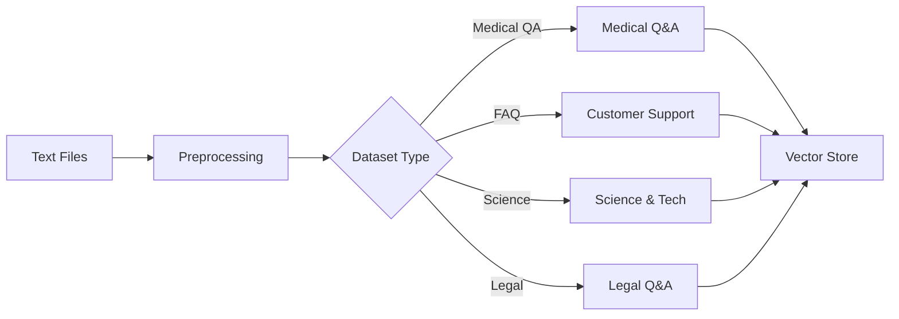

### 🔄 mainの処理の流れ

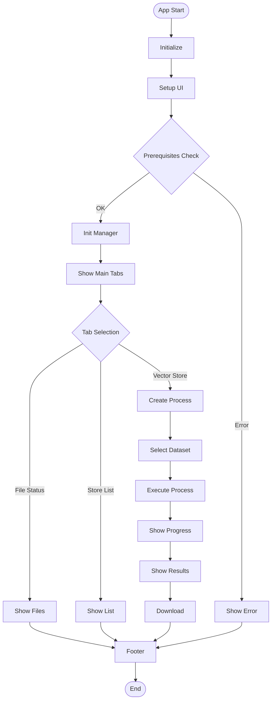

---

## 🔧 システム構成

### 📦 主要コンポーネント

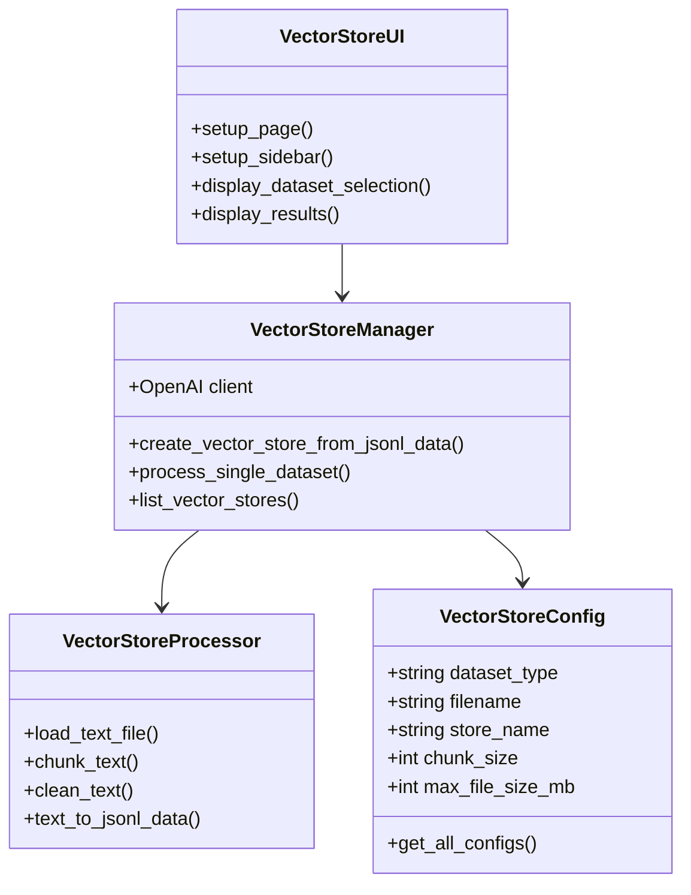

### 📋 データフロー

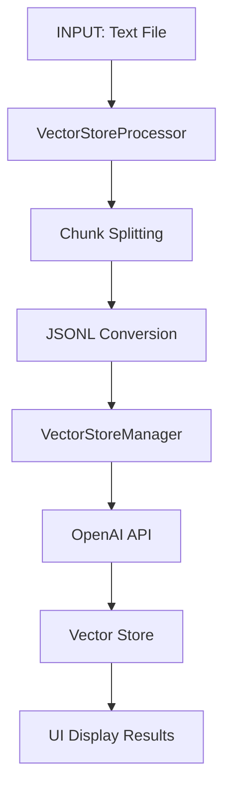

---

## 📋 関数一覧

### 🏗️ 設定・初期化関数

| 関数名 | 分類 | 処理概要 | 重要度 |
|--------|------|----------|---------|
| `VectorStoreConfig.get_all_configs()` | 🔧 設定 | 全データセット設定取得 | ⭐⭐⭐ |
| `VectorStoreProcessor.__init__()` | 🏗️ 初期化 | プロセッサ初期化 | ⭐⭐ |
| `VectorStoreManager.__init__()` | 🏗️ 初期化 | マネージャー初期化 | ⭐⭐⭐ |
| `VectorStoreUI.__init__()` | 🏗️ 初期化 | UI管理クラス初期化 | ⭐⭐ |

### 📄 データ処理関数

| 関数名 | 分類 | 処理概要 | 重要度 |
|--------|------|----------|---------|
| `load_text_file()` | 📥 入力 | テキストファイル読み込み | ⭐⭐⭐ |
| `chunk_text()` | ✂️ 分割 | テキストチャンク分割 | ⭐⭐⭐ |
| `clean_text()` | 🧹 整理 | テキストクレンジング | ⭐⭐ |
| `text_to_jsonl_data()` | 🔄 変換 | JSONL形式変換 | ⭐⭐⭐ |

### 🗃️ Vector Store管理関数

| 関数名 | 分類 | 処理概要 | 重要度 |
|--------|------|----------|---------|
| `create_vector_store_from_jsonl_data()` | 🚀 作成 | Vector Store作成 | ⭐⭐⭐ |
| `process_single_dataset()` | ⚡ 処理 | 単一データセット処理 | ⭐⭐⭐ |
| `list_vector_stores()` | 📚 一覧 | 既存Store一覧取得 | ⭐⭐ |

### 🎨 UI関数

| 関数名 | 分類 | 処理概要 | 重要度 |
|--------|------|----------|---------|
| `setup_page()` | 🎨 表示 | ページ設定 | ⭐⭐ |
| `setup_header()` | 🎨 表示 | ヘッダー設定 | ⭐ |
| `setup_sidebar()` | 🎨 表示 | サイドバー設定 | ⭐⭐⭐ |
| `display_dataset_selection()` | 🎯 選択 | データセット選択UI | ⭐⭐⭐ |
| `display_results()` | 📈 結果 | 処理結果表示 | ⭐⭐⭐ |

### 🔧 ユーティリティ関数

| 関数名 | 分類 | 処理概要 | 重要度 |
|--------|------|----------|---------|
| `initialize_session_state()` | 🔧 初期化 | セッション状態初期化 | ⭐⭐ |
| `main()` | 🎯 制御 | メイン処理制御 | ⭐⭐⭐ |

---

## 📑 関数詳細設計

### 🔧 VectorStoreConfig.get_all_configs()

#### 🎯 処理概要
全データセットの設定情報を定義し、辞書形式で返却する静的メソッド

#### 📊 処理の流れ
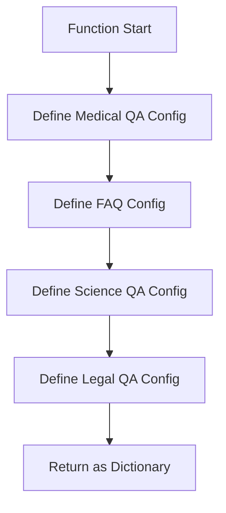

#### 📋 IPO設計

| 項目 | 内容 |
|------|------|
| **🔤 INPUT** | なし |
| **⚙️ PROCESS** | 各データセット設定のVectorStoreConfigインスタンス生成 |
| **📤 OUTPUT** | `Dict[str, VectorStoreConfig]` - データセット設定辞書 |

#### 📝 設定詳細

```python
# 設定例
{
    "medical_qa": VectorStoreConfig(
        chunk_size=16000,      # 🔢 大きなチャンクサイズ
        max_file_size_mb=20,   # 📏 厳格なサイズ制限
        max_chunks_per_file=6000  # 📊 チャンク数制限
    )
}
```

---

### 📄 VectorStoreProcessor.load_text_file()

#### 🎯 処理概要
指定されたテキストファイルを読み込み、クレンジング済みの行リストを返却

#### 📊 処理の流れ
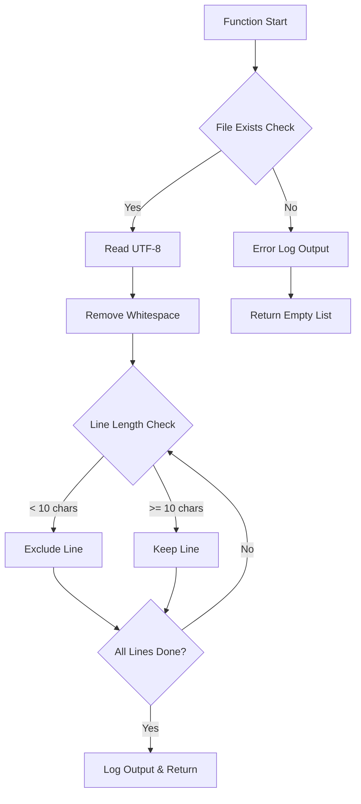

#### 📋 IPO設計

| 項目 | 内容 |
|------|------|
| **🔤 INPUT** | `filepath: Path` - 読み込み対象ファイルパス |
| **⚙️ PROCESS** | ファイル読み込み → 空白除去 → 短行フィルタリング |
| **📤 OUTPUT** | `List[str]` - クレンジング済みテキスト行リスト |

#### 🚨 エラーケース

| エラー種別 | 対処法 |
|------------|--------|
| `FileNotFoundError` | エラーログ出力 + 空リスト返却 |
| `UnicodeDecodeError` | エラーログ出力 + 空リスト返却 |
| `PermissionError` | エラーログ出力 + 空リスト返却 |

---

### ✂️ VectorStoreProcessor.chunk_text()

#### 🎯 処理概要
長いテキストを指定サイズのチャンクに分割し、自然な境界で分割

#### 📊 処理の流れ
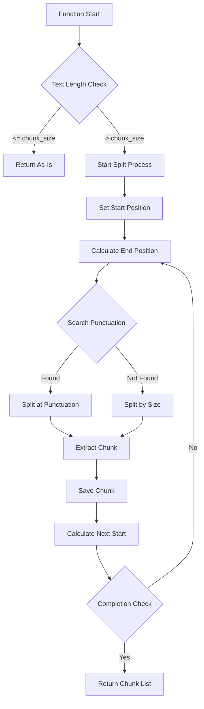

#### 📋 IPO設計

| 項目 | 内容 |
|------|------|
| **🔤 INPUT** | `text: str`, `chunk_size: int`, `overlap: int` |
| **⚙️ PROCESS** | テキスト分割 → 句読点境界調整 → オーバーラップ設定 |
| **📤 OUTPUT** | `List[str]` - 分割されたチャンクリスト |

#### 🔍 境界検索ロジック

```python
# 句読点リスト（優先順位順）
punctuation = ['。', '！', '？', '.', '!', '?']

# 検索範囲：チャンクサイズの50%以上の位置
search_start = start + chunk_size // 2
```

---

### 🔄 VectorStoreProcessor.text_to_jsonl_data()

#### 🎯 処理概要
テキスト行リストをJSONL形式データ構造に変換（制限チェック付き）

#### 📊 処理の流れ
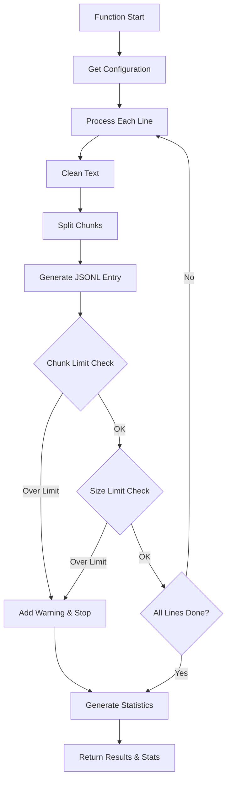

#### 📋 IPO設計

| 項目 | 内容 |
|------|------|
| **🔤 INPUT** | `lines: List[str]`, `dataset_type: str` |
| **⚙️ PROCESS** | チャンク分割 → JSONL形式変換 → 制限チェック → 統計生成 |
| **📤 OUTPUT** | `Tuple[List[Dict[str, Any]], Dict[str, Any]]` |

#### 📊 生成されるJSONLエントリ例

```json
{
    "id": "medical_qa_0_0",
    "text": "糖尿病の症状について説明します...",
    "metadata": {
        "dataset": "medical_qa",
        "original_line": 0,
        "chunk_index": 0,
        "total_chunks": 3
    }
}
```

---

### 🚀 VectorStoreManager.create_vector_store_from_jsonl_data()

#### 🎯 処理概要
JSONL形式データからOpenAI Vector Storeを作成する核心的処理

#### 📊 処理の流れ
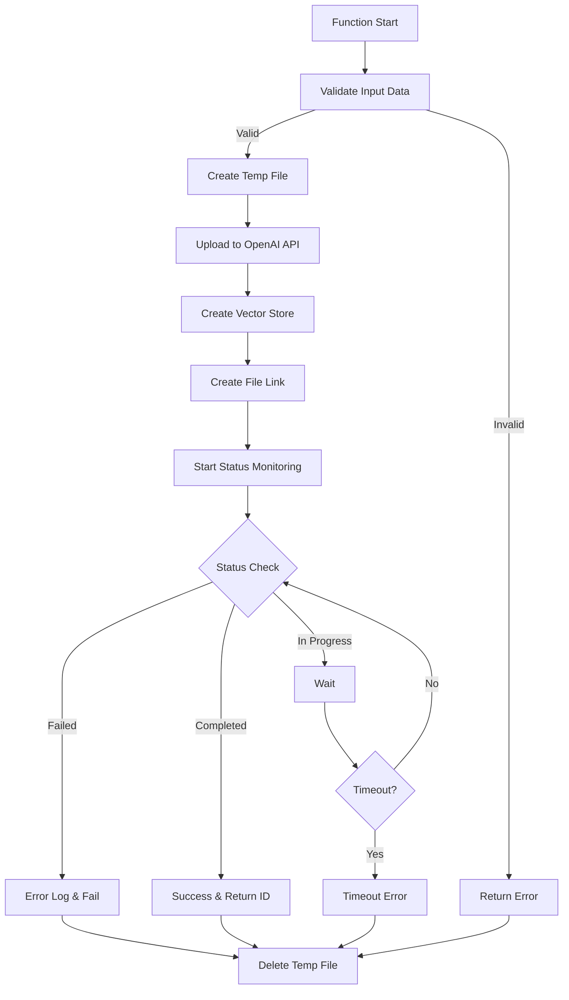

#### 📋 IPO設計

| 項目 | 内容 |
|------|------|
| **🔤 INPUT** | `jsonl_data: List[Dict]`, `store_name: str` |
| **⚙️ PROCESS** | データ検証 → 一時ファイル作成 → API呼び出し → 監視 |
| **📤 OUTPUT** | `Optional[str]` - Vector Store ID（成功時） |

#### ⏱️ 監視パラメータ

| 項目 | 値 | 説明 |
|------|-----|------|
| `max_wait_time` | 600秒 | 最大待機時間（10分） |
| `wait_interval` | 5秒 | ステータスチェック間隔 |
| `timeout_check` | 毎回 | タイムアウト判定 |

---

### ⚡ VectorStoreManager.process_single_dataset()

#### 🎯 処理概要
単一データセットの完全処理パイプライン（最重要関数）

#### 📊 処理の流れ
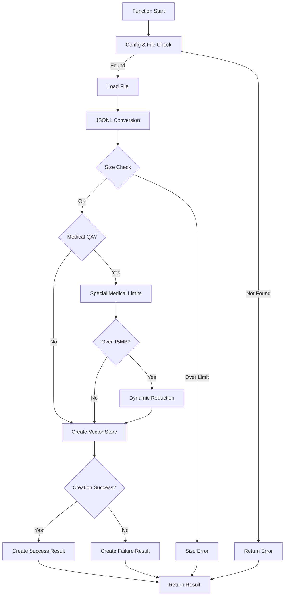

#### 📋 IPO設計

| 項目 | 内容 |
|------|------|
| **🔤 INPUT** | `dataset_type: str`, `output_dir: Path` |
| **⚙️ PROCESS** | ファイル処理 → 制限適用 → Vector Store作成 → 結果生成 |
| **📤 OUTPUT** | `Dict[str, Any]` - 処理結果辞書 |

#### 🏥 医療QA特別制限

```python
# 段階的制限システム
if len(jsonl_data_list) > 5000:        # 第1段階: チャンク数制限
    jsonl_data_list = jsonl_data_list[:5000]

if estimated_size_mb > 15:             # 第2段階: サイズ制限
    target_chunks = int(len(jsonl_data_list) * 15 / estimated_size_mb)
    target_chunks = max(1000, target_chunks)  # 最低保証
    jsonl_data_list = jsonl_data_list[:target_chunks]
```

---

### 🎨 VectorStoreUI.setup_sidebar()

#### 🎯 処理概要
Streamlitサイドバーの構築とユーザー選択値の取得

#### 📊 処理の流れ
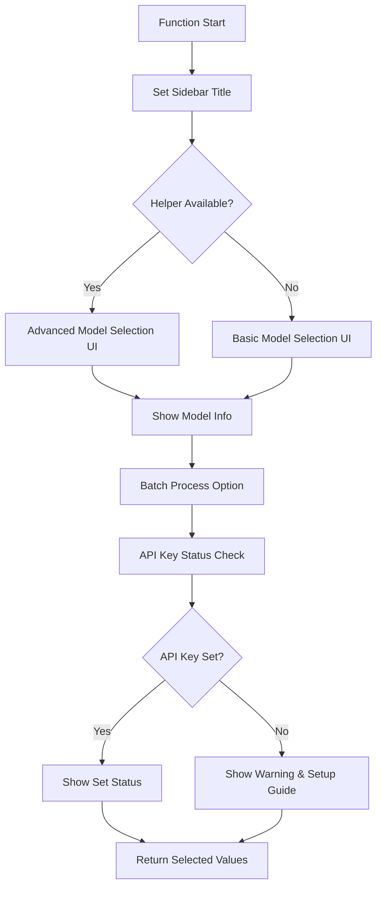

#### 📋 IPO設計

| 項目 | 内容 |
|------|------|
| **🔤 INPUT** | なし |
| **⚙️ PROCESS** | UI要素作成 → ユーザー選択取得 → 状態確認 |
| **📤 OUTPUT** | `Tuple[str, bool]` - (選択モデル, 一括処理フラグ) |

#### 🔑 APIキー確認ロジック

```python
api_key_status = "✅ 設定済み" if os.getenv("OPENAI_API_KEY") else "❌ 未設定"

if not os.getenv("OPENAI_API_KEY"):
    st.error("環境変数 OPENAI_API_KEY を設定してください")
    st.code("export OPENAI_API_KEY='your-api-key-here'")
```

---

### 📈 VectorStoreUI.display_results()

#### 🎯 処理概要
Vector Store作成処理結果の包括的表示とユーザビリティ向上

#### 📊 処理の流れ
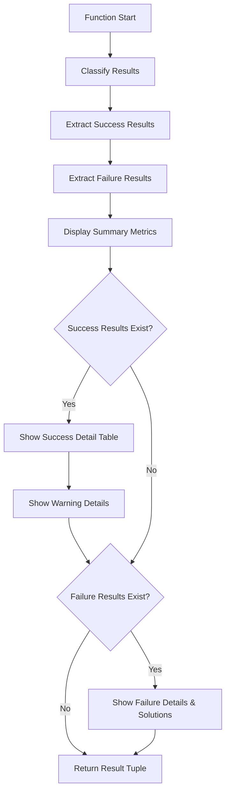

#### 📋 IPO設計

| 項目 | 内容 |
|------|------|
| **🔤 INPUT** | `results: Dict[str, Dict]` - 全処理結果辞書 |
| **⚙️ PROCESS** | 結果分析 → UI表示 → エラー対処法提示 |
| **📤 OUTPUT** | `Tuple[Dict, Dict]` - (成功結果辞書, 失敗結果辞書) |

#### 📊 表示される成功情報テーブル

| 列名 | 内容例 |
|------|--------|
| データセット | 医療質問回答データベース |
| Vector Store ID | `vs_abc123...` |
| Store名 | Medical Q&A Knowledge Base |
| 処理行数 | 15,000 / 19,704 |
| チャンク数 | 3,500 |
| 推定サイズ | 12.3 MB |
| 状態 | 完了 ⚠️ 2件の警告 |

---

### 🔧 initialize_session_state()

#### 🎯 処理概要
Streamlitセッション状態の安全な初期化

#### 📊 処理の流れ
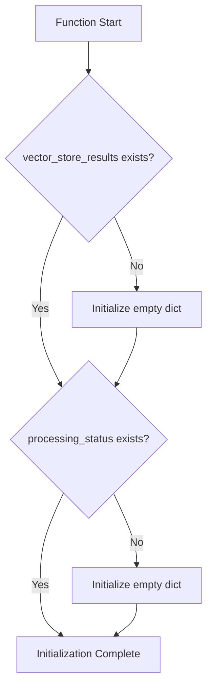

#### 📋 IPO設計

| 項目 | 内容 |
|------|------|
| **🔤 INPUT** | なし |
| **⚙️ PROCESS** | セッション状態存在確認 → 未存在時初期化 |
| **📤 OUTPUT** | なし（副作用: `st.session_state` 更新） |

---

### 🎯 main()

#### 🎯 処理概要
アプリケーション全体のオーケストレーション（指揮統制）

#### 📊 処理の流れ
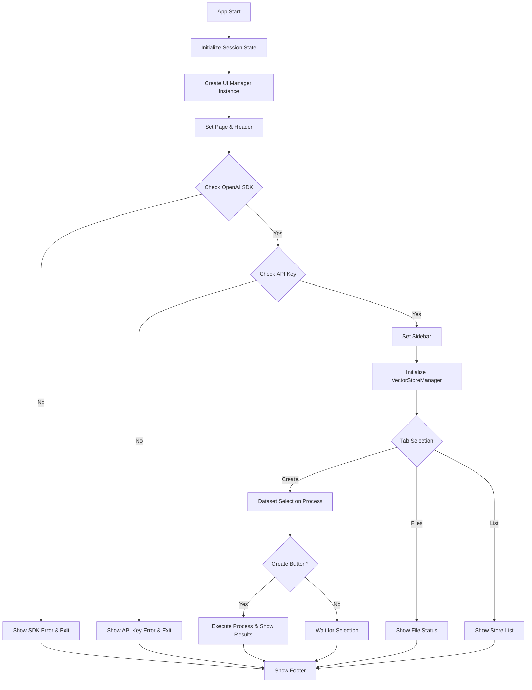

#### 📋 IPO設計

| 項目 | 内容 |
|------|------|
| **🔤 INPUT** | なし（Streamlitアプリとして起動） |
| **⚙️ PROCESS** | 全体初期化 → UI構築 → ユーザー操作対応 → 処理実行制御 |
| **📤 OUTPUT** | なし（副作用: Streamlit Webアプリ表示） |

#### 🔄 処理実行ループ

```python
for idx, dataset_type in enumerate(selected_datasets):
    config = ui.configs[dataset_type]

    # 進捗表示
    dataset_progress = st.progress(0)
    dataset_status = st.empty()

    # 処理実行
    with st.spinner(f"🔄 {config.description} を処理中..."):
        result = manager.process_single_dataset(dataset_type)

    # 結果表示・進捗更新
    if result["success"]:
        dataset_progress.progress(1.0)
        dataset_status.success(f"✅ 完了")
    else:
        dataset_progress.progress(0)
        dataset_status.error(f"❌ 失敗: {result['error']}")
```

---

## ⚙️ 技術仕様

### 📦 依存ライブラリ

| ライブラリ | バージョン | 用途 | 重要度 |
|-----------|-----------|------|---------|
| `streamlit` | 最新 | 🎨 Web UIフレームワーク | ⭐⭐⭐ |
| `openai` | 1.x | ☁️ OpenAI APIクライアント | ⭐⭐⭐ |
| `pandas` | 最新 | 📊 データ処理・テーブル表示 | ⭐⭐ |
| `pathlib` | 標準 | 📁 ファイルパス操作 | ⭐⭐ |
| `tempfile` | 標準 | 📄 一時ファイル管理 | ⭐⭐ |
| `json` | 標準 | 📝 JSON処理 | ⭐⭐ |
| `re` | 標準 | 🔍 正規表現処理 | ⭐ |

### 📊 データセット設定パラメータ

#### 🏥 医療QA（最大データセット）
```yaml
医療QA設定:
  chunk_size: 16000        # 📏 16KB - 最大チャンクサイズ
  overlap: 300            # 🔄 300文字オーバーラップ
  max_file_size_mb: 20    # 📦 20MB制限
  max_chunks_per_file: 6000  # 📊 6,000チャンク制限
  特別制限:
    - 第1段階: 5,000チャンク制限
    - 第2段階: 15MB動的削減
    - 最低保証: 1,000チャンク
```

#### 💬 カスタマーサポートFAQ
```yaml
FAQ設定:
  chunk_size: 2000        # 📏 2KB - 標準サイズ
  overlap: 100           # 🔄 100文字オーバーラップ
  max_file_size_mb: 30   # 📦 30MB制限
  max_chunks_per_file: 4000  # 📊 4,000チャンク制限
```

#### 🔬 科学技術QA
```yaml
科学技術QA設定:
  chunk_size: 2000        # 📏 2KB - 標準サイズ
  overlap: 100           # 🔄 100文字オーバーラップ
  max_file_size_mb: 25   # 📦 25MB制限
  max_chunks_per_file: 8000  # 📊 8,000チャンク制限
```

#### ⚖️ 法律QA
```yaml
法律QA設定:
  chunk_size: 3000        # 📏 3KB - 大きめサイズ
  overlap: 150           # 🔄 150文字オーバーラップ
  max_file_size_mb: 25   # 📦 25MB制限
  max_chunks_per_file: 6000  # 📊 6,000チャンク制限
```

### 🔄 処理パフォーマンス

| 項目 | 値 | 説明 |
|------|-----|------|
| **最大待機時間** | 600秒 | Vector Store作成タイムアウト |
| **ステータス確認間隔** | 5秒 | API監視インターバル |
| **最小行長** | 10文字 | テキスト行フィルタリング基準 |
| **境界検索範囲** | 50% | チャンク境界調整範囲 |

---

## 🚨 エラーハンドリング

### 📁 ファイル関連エラー

| エラー種別 | 原因 | 対処法 | 影響度 |
|-----------|------|--------|---------|
| **FileNotFoundError** | 🚫 必須ファイル不在 | エラーメッセージ表示・空リスト返却 | 🔴 高 |
| **PermissionError** | 🔒 ファイルアクセス権限不足 | 権限確認指示・エラーログ | 🟡 中 |
| **UnicodeDecodeError** | 🔤 文字エンコーディング不正 | UTF-8確認指示・代替処理 | 🟡 中 |
| **OSError** | 💾 ディスク容量不足等 | システム状態確認指示 | 🔴 高 |

### 🔑 API関連エラー

| エラー種別 | 原因 | 対処法 | 影響度 |
|-----------|------|--------|---------|
| **APIキー未設定** | 🚫 環境変数未設定 | 設定方法の詳細表示 | 🔴 高 |
| **API認証エラー** | 🔑 不正なAPIキー | キー確認・再設定指示 | 🔴 高 |
| **レート制限エラー** | ⏱️ API呼び出し上限 | 待機後再試行・使用量確認 | 🟡 中 |
| **ファイルサイズエラー** | 📏 OpenAI制限超過 | チャンクサイズ調整提案 | 🟡 中 |

### 📊 データ処理エラー

| エラー種別 | 原因 | 対処法 | 影響度 |
|-----------|------|--------|---------|
| **データ形式不正** | 📝 予期しないデータ構造 | 形式確認・サンプル提示 | 🟡 中 |
| **メモリ不足** | 💾 大量データ処理 | データ分割・チャンクサイズ縮小 | 🟡 中 |
| **変換エラー** | 🔄 JSONL変換失敗 | データ構造確認・修正提案 | 🟡 中 |
| **サイズ制限超過** | 📏 設定制限超過 | 制限値調整・データ削減提案 | 🟠 低 |

### ⚡ 処理実行エラー

| エラー種別 | 原因 | 対処法 | 影響度 |
|-----------|------|--------|---------|
| **タイムアウトエラー** | ⏰ 処理時間超過 | 待機時間延長・データ削減 | 🟡 中 |
| **Vector Store作成失敗** | ☁️ OpenAI側エラー | 詳細エラー表示・再試行提案 | 🔴 高 |
| **ネットワークエラー** | 🌐 接続不良 | 接続確認・再試行 | 🟡 中 |
| **予期しないエラー** | ❓ 未知のエラー | フルエラーログ・サポート案内 | 🔴 高 |

### 🛠️ エラー対処フロー

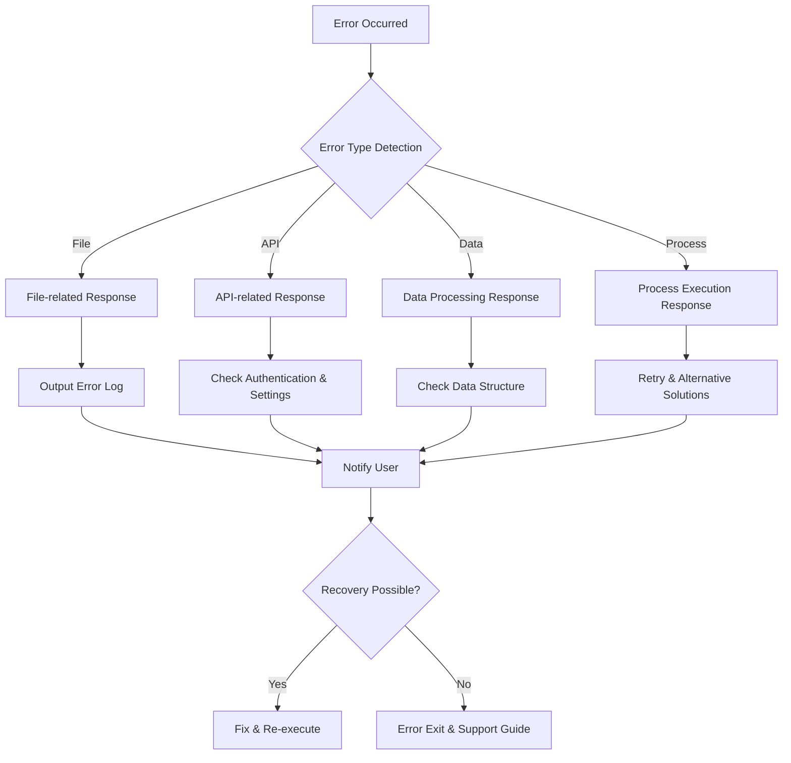

### 🎯 エラー通知メッセージ例

#### ✅ 適切なエラーメッセージ
```python
# 🔴 ファイルサイズエラー
st.error("❌ ファイルサイズが制限を超えています: 34.1MB (制限: 25MB)")
st.info("💡 対処法: チャンクサイズを16000→32000に増加するか、データを分割してください")

# 🔑 APIキーエラー
st.error("🔑 OpenAI APIキーが設定されていません")
st.code("export OPENAI_API_KEY='your-api-key-here'")
st.info("APIキーを設定してからアプリを再起動してください")
```

#### ❌ 避けるべきエラーメッセージ
```python
# 👎 不親切な例
st.error("エラーが発生しました")              # 原因不明
st.error("処理に失敗しました")              # 対処法なし
st.error("internal server error")       # 技術的すぎ
```

---

## 🎉 まとめ

この設計書は、**a30_020_make_vsid.py** の完全な技術仕様と実装詳細を網羅しています。

### 🌟 設計のハイライト

- **📊 段階的制限システム**: 医療QAデータの特別な最適化
- **🔄 リアルタイム進捗表示**: ユーザビリティ重視の設計
- **🚨 包括的エラーハンドリング**: 堅牢性と保守性
- **🎨 直感的UI設計**: Streamlitを活用したモダンWeb UI
- **⚡ 高パフォーマンス処理**: 効率的なデータパイプライン

### 📈 今後の拡張可能性

- 🌐 複数言語対応
- 📊 バッチ処理機能
- 🔄 増分更新機能
- 📈 詳細分析ダッシュボード
- 🤖 AI支援最適化機能
