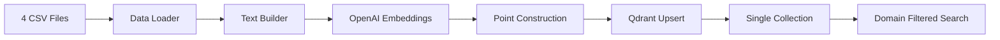
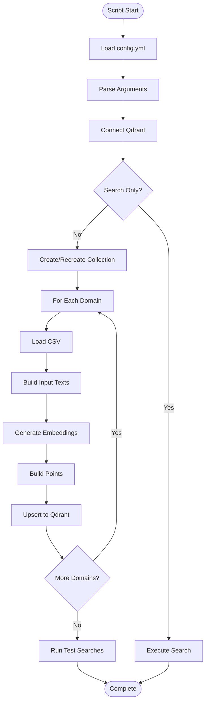
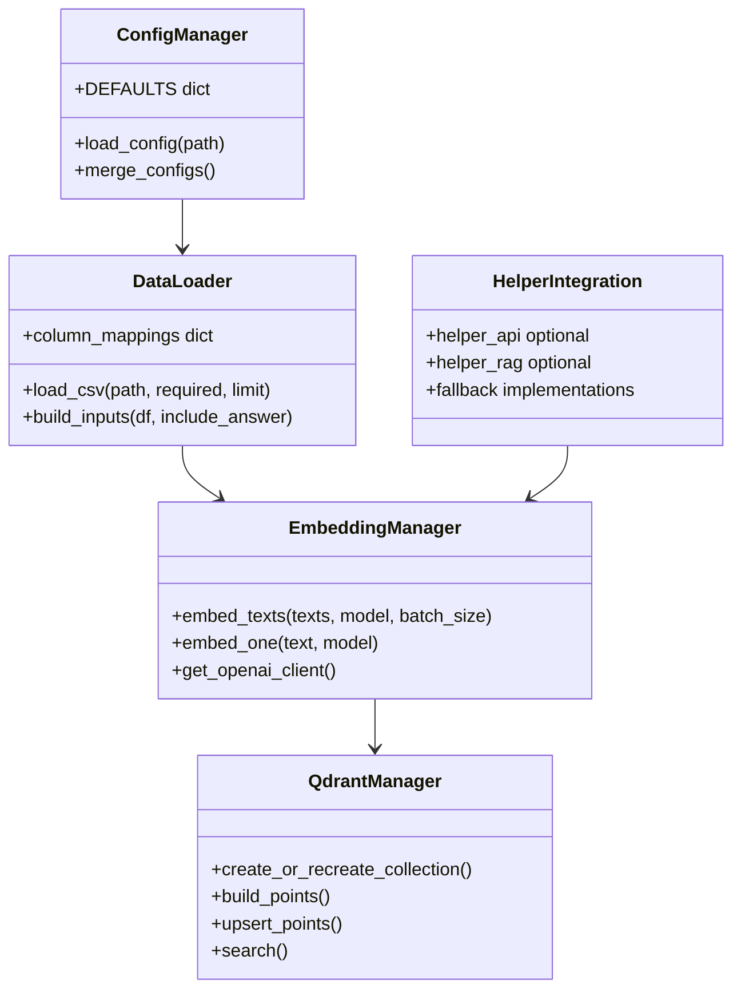

# 📋 a30_qdrant_registration.py 設計書

## 📝 目次

1. [📖 概要書](#📖-概要書)
2. [🔧 システム構成](#🔧-システム構成)
3. [📋 関数一覧](#📋-関数一覧)
4. [📑 関数詳細設計](#📑-関数詳細設計)
5. [⚙️ 技術仕様](#⚙️-技術仕様)
6. [🚨 エラーハンドリング](#🚨-エラーハンドリング)
7. [📊 使用例](#📊-使用例)

---

## 📖 概要書

### 🎯 処理の概要

**Qdrant統合データ登録・Named Vectors対応システム（helper群・config.yml連携版）**

本スクリプトは、4つの専門分野QAデータセット（カスタマーサポート、医療、法律、科学技術）を単一のQdrantコレクションに統合登録し、ドメインフィルタリング可能な高度なベクトル検索システムを構築します。Named Vectors機能により複数の埋め込みモデルを同時活用でき、answer埋め込みオプションによる検索精度向上も実現します。

#### 🌟 主要機能

| 機能 | 説明 |
|------|------|
| 🗃️ **統合データ登録** | 4つのQAデータセットを単一コレクションに統合 |
| 🏷️ **ドメインフィルタ** | payload.domainによる分野別検索 |
| 🔀 **Named Vectors対応** | 複数埋め込みモデルの同時利用 |
| 🎯 **Answer埋め込み切替** | question+answerの結合埋め込みオプション |
| 📋 **設定ファイル連携** | config.ymlからの設定読み込み（fallbackあり） |
| 🤝 **helper群連携** | helper_api.py/helper_rag.pyとの統合 |
| 🔍 **即時検索機能** | 登録後の動作確認検索 |

#### 🗃️ データフロー構成



### 🔄 処理フロー



---

## 🔧 システム構成

### 📦 主要コンポーネント



### 🔗 依存関係

| パッケージ | 用途 | 必須/任意 |
|-----------|------|-----------|
| openai | 埋め込み生成 | 必須 |
| qdrant-client | ベクトルDB操作 | 必須 |
| pandas | データ処理 | 必須 |
| PyYAML | 設定ファイル読込 | 任意 |
| helper_api | API管理 | 任意 |
| helper_rag | RAG処理 | 任意 |

---

## 📋 関数一覧

### 🎯 主要関数

| 関数名 | 役割 | 引数 | 戻り値 |
|--------|------|------|--------|
| `load_config()` | config.yml読み込み | path: str | Dict[str, Any] |
| `load_csv()` | CSVデータ読み込み | path, required, limit | pd.DataFrame |
| `build_inputs()` | 埋め込み入力テキスト構築 | df, include_answer | List[str] |
| `embed_texts()` | バッチ埋め込み生成 | texts, model, batch_size | List[List[float]] |
| `create_or_recreate_collection()` | コレクション作成 | client, name, recreate, embeddings_cfg | None |
| `build_points()` | Qdrantポイント構築 | df, vectors_by_name, domain, source_file | List[PointStruct] |
| `upsert_points()` | ポイント一括登録 | client, collection, points, batch_size | int |
| `search()` | ベクトル検索実行 | client, collection, query, using_vec, model_for_using, topk, domain | List[Hit] |

### 🔧 ユーティリティ関数

| 関数名 | 役割 | 引数 | 戻り値 |
|--------|------|------|--------|
| `batched()` | イテレータバッチ分割 | seq, size | Iterator |
| `get_openai_client()` | OpenAIクライアント取得 | None | OpenAI |
| `embed_one()` | 単一テキスト埋め込み | text, model | List[float] |
| `merge()` | 辞書のマージ | dst, src | None |

---

## 📑 関数詳細設計

### 📊 load_config()

```python
def load_config(path: str = "config.yml") -> Dict[str, Any]:
    """
    設定ファイルの読み込みとデフォルト値のマージ
    
    処理:
    1. YAMLファイルが存在すれば読み込み
    2. デフォルト設定とマージ（再帰的）
    3. 完全な設定辞書を返却
    
    Returns:
        設定辞書（DEFAULTS＋YAML内容）
    """
```

### 🗂️ load_csv()

```python
def load_csv(path: str, required=("question", "answer"), limit: int = 0) -> pd.DataFrame:
    """
    CSVファイルの読み込みとデータ前処理
    
    列名マッピング:
    - 'Question' → 'question'
    - 'Response'/'Answer' → 'answer'
    - 'correct_answer' → 'answer'
    
    処理:
    1. CSVファイル読み込み
    2. 列名の正規化
    3. 必須列の存在確認
    4. 欠損値補完と重複除去
    5. 行数制限（開発用）
    """
```

### 🔐 build_inputs()

```python
def build_inputs(df: pd.DataFrame, include_answer: bool) -> List[str]:
    """
    埋め込み入力テキストの構築
    
    モード:
    - include_answer=False: questionのみ
    - include_answer=True: question + "\n" + answer
    
    Returns:
        埋め込み用テキストリスト
    """
```

### 🏗️ create_or_recreate_collection()

```python
def create_or_recreate_collection(client: QdrantClient, name: str, recreate: bool,
                                  embeddings_cfg: Dict[str, Dict[str, Any]]):
    """
    Qdrantコレクションの作成（Named Vectors対応）
    
    処理:
    1. ベクトル設定の判定（単一/Named Vectors）
    2. recreate時: 削除→新規作成
    3. 通常時: 存在確認→必要なら作成
    4. domainフィールドのインデックス作成
    
    Named Vectors対応:
    - 単一ベクトル: VectorParams使用
    - 複数ベクトル: Dict[name, VectorParams]使用
    """
```

### 🎲 build_points()

```python
def build_points(df: pd.DataFrame, vectors_by_name: Dict[str, List[List[float]]], 
                domain: str, source_file: str) -> List[models.PointStruct]:
    """
    Qdrantポイントの構築
    
    Payload構造:
    {
        "domain": str,          # customer/medical/legal/sciq
        "question": str,        # 質問文
        "answer": str,          # 回答文
        "source": str,          # ソースファイル名
        "created_at": str,      # ISO8601形式
        "schema": "qa:v1"       # スキーマバージョン
    }
    
    Point ID生成:
    - ハッシュベース（domain + インデックス）
    - 32ビット正整数に変換
    """
```

### 🔍 search()

```python
def search(client: QdrantClient, collection: str, query: str, using_vec: str, 
          model_for_using: str, topk: int = 5, domain: Optional[str] = None):
    """
    ベクトル検索の実行
    
    処理:
    1. クエリテキストの埋め込み生成
    2. ドメインフィルタの構築（指定時）
    3. Qdrant検索実行
    4. Named Vectors対応（using指定）
    
    Returns:
        検索結果リスト（スコア順）
    """
```

---

## ⚙️ 技術仕様

### 🗃️ デフォルト設定

```yaml
rag:
  collection: "qa_corpus"
  include_answer_in_embedding: false
  use_named_vectors: false

embeddings:
  primary:
    provider: "openai"
    model: "text-embedding-3-small"
    dims: 1536
  # bge: # コメントアウト例
  #   provider: "openai"
  #   model: "text-embedding-3-large"
  #   dims: 3072

paths:
  customer: "OUTPUT/preprocessed_customer_support_faq_89rows_20250721_092004.csv"
  medical: "OUTPUT/preprocessed_medical_qa_19704rows_20250721_092658.csv"
  legal: "OUTPUT/preprocessed_legal_qa_4rows_20250721_100302.csv"
  sciq: "OUTPUT/preprocessed_sciq_qa_11679rows_20250721_095451.csv"

qdrant:
  url: "http://localhost:6333"
```

### 🏷️ ドメイン定義

| ドメイン | 説明 | データソース |
|----------|------|-------------|
| customer | カスタマーサポート | customer_support_faq.csv |
| medical | 医療QA | medical_qa.csv |
| legal | 法律QA | legal_qa.csv |
| sciq | 科学技術QA | sciq_qa.csv |

### 🔀 Named Vectors仕様

```python
# 単一ベクトル設定
vectors_config = models.VectorParams(size=1536, distance=models.Distance.COSINE)

# Named Vectors設定
vectors_config = {
    "primary": models.VectorParams(size=1536, distance=models.Distance.COSINE),
    "bge": models.VectorParams(size=3072, distance=models.Distance.COSINE)
}
```

### 🎯 Point ID生成ロジック

```python
# 32ビット正整数への変換
pid = hash(f"{domain}-{i}") & 0x7FFFFFFF
```

---

## 🚨 エラーハンドリング

### ❌ エラーパターン

| エラー種別 | 原因 | 対処 |
|-----------|------|------|
| FileNotFoundError | CSVファイル不在 | [WARN]ログ出力、スキップ |
| ValueError | 必須列欠損 | エラー表示、処理中断 |
| ConnectionError | Qdrant接続失敗 | タイムアウト設定（300秒） |
| OpenAI APIエラー | 埋め込み生成失敗 | エラー伝播 |

### 🛡️ フォールバック機構

```python
# helper不在時のフォールバック
if hapi and hasattr(hapi, "get_openai_client"):
    return hapi.get_openai_client()
return OpenAI()  # 直接生成

# YAML不在時のフォールバック
if not yaml or not os.path.exists(path):
    return DEFAULTS  # デフォルト設定使用
```

---

## 📊 使用例

### 🚀 基本的な使用方法

```bash
# 環境変数設定
export OPENAI_API_KEY=sk-...

# Qdrant起動
docker run -p 6333:6333 -p 6334:6334 qdrant/qdrant

# コレクション新規作成＋全データ登録
python a30_qdrant_registration.py --recreate

# Answer埋め込みモードで登録
python a30_qdrant_registration.py --recreate --include-answer

# 開発用：各CSV100件制限
python a30_qdrant_registration.py --recreate --limit 100
```

### 🔍 検索実行

```bash
# 基本検索
python a30_qdrant_registration.py --search "副作用はありますか？"

# ドメイン指定検索
python a30_qdrant_registration.py --search "返金は可能ですか？" --domain customer

# Named Vectors使用
python a30_qdrant_registration.py --search "quantum computing" --using primary --topk 10
```

### 📝 コマンドライン引数

| 引数 | 説明 | デフォルト |
|------|------|-----------|
| --recreate | コレクション削除→新規作成 | False |
| --collection | コレクション名 | YAMLまたは'qa_corpus' |
| --qdrant-url | QdrantサーバーURL | http://localhost:6333 |
| --batch-size | バッチサイズ | 32 |
| --limit | CSV行数制限（開発用） | 0（無制限） |
| --include-answer | Answer埋め込み有効化 | YAMLまたはFalse |
| --search | 検索クエリ（検索のみ実行） | None |
| --domain | 検索ドメイン | None（全体） |
| --topk | 検索結果数 | 5 |
| --using | Named Vectorキー | primary |

### 🎯 動作確認出力例

```
[customer] upserted 89 points
[medical] upserted 19704 points
[legal] upserted 4 points
[sciq] upserted 11679 points
Done. Total upserted: 31476

[Search] using=primary domain=customer query=返金は可能ですか？
  score=0.8523  Q: 商品の返金ポリシーは何ですか？
  score=0.8012  Q: 注文のキャンセル方法は？
  score=0.7891  Q: 返品手続きの方法は？

[Search] using=primary domain=medical query=副作用はありますか？
  score=0.9012  Q: この薬の副作用について教えてください
  score=0.8756  Q: 薬の服用で注意すべき点は？
  score=0.8234  Q: アレルギー反応の可能性はありますか？
```

---

## 🔄 今後の拡張計画

- [ ] 増分更新機能（既存データのスキップ）
- [ ] マルチモーダル埋め込み対応
- [ ] Elasticsearchとの連携
- [ ] Web UI統合（Streamlit）
- [ ] バッチ処理の並列化
- [ ] データ品質チェック機能