# 📋 a30\_30\_rag\_search.py 設計書（改修版）

## 📝 目次

1. [📖 概要書](#📖-概要書)
2. [🔧 システム構成](#🔧-システム構成)
3. [📋 関数一覧](#📋-関数一覧)
4. [📑 関数詳細設計](#📑-関数詳細設計)
5. [⚙️ 技術仕様](#⚙️-技術仕様)
6. [🚨 エラーハンドリング](#🚨-エラーハンドリング)

---

## 📖 概要書

### 🎯 処理の概要

**最新OpenAI Responses API + file\_search RAG検索システム（重複問題修正版）**

本アプリケーションは、OpenAIの最新Responses APIとfile\_searchツールを活用した次世代RAG（Retrieval-Augmented Generation）検索システムです。**重複Vector Store問題を解決**し、動的Vector Store管理機能を追加した改修版です。

#### 🌟 主要機能

| 機能                               | 説明                                    |
| ---------------------------------- | --------------------------------------- |
| 🤖**最新Responses API**            | OpenAI最新APIによる高品質回答生成       |
| 🔍**file\_search ツール**          | Vector Store統合検索機能                |
| 📚**動的Vector Store管理**         | 自動ID更新・重複問題解決                |
| 🔄**重複ID解決（最新優先）**       | 同名Vector Storeの作成日時優先選択      |
| 📁**設定ファイル連携**             | vector_stores.json での永続化           |
| 🔗**a30_020_make_vsid.py連携**     | 新規Vector Store自動認識                |
| 📋**ファイル引用表示**             | 検索結果の出典明示                      |
| 🌐**多言語対応**                   | 英語・日本語質問サポート                |
| 📊**検索オプション**               | カスタマイズ可能な検索設定              |
| 🕒**履歴管理**                     | 検索履歴の保存・再実行                  |
| 🔒**セキュア設計**                 | 環境変数でのAPIキー管理                 |

#### 🆕 改修のハイライト

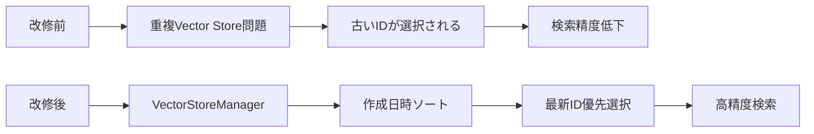

### 🔄 mainの処理の流れ（改修版）

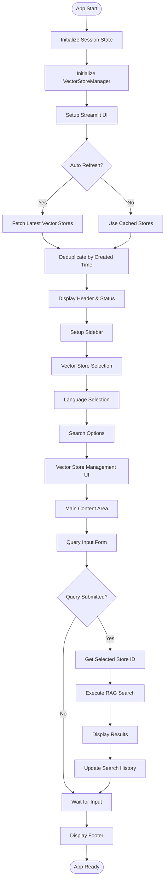

---

## 🔧 システム構成

### 📦 主要コンポーネント（改修版）

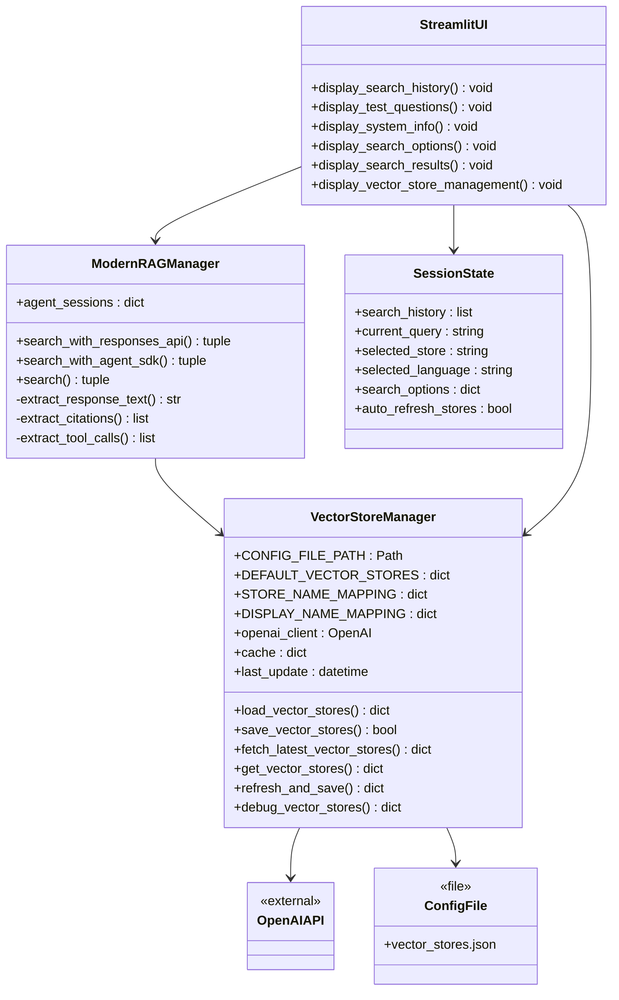

### 📋 データフロー（重複問題解決版）

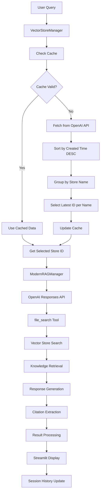

---

## 📋 関数一覧

### 🆕 VectorStoreManager関連

| 関数名                              | 分類          | 処理概要                        | 重要度 |
| ----------------------------------- | ------------- | ------------------------------- | ------ |
| `VectorStoreManager.__init__()`     | 🏗️ 初期化   | Vector Store管理初期化          | ⭐⭐⭐ |
| `load_vector_stores()`              | 📁 設定      | 設定ファイル読み込み            | ⭐⭐⭐ |
| `save_vector_stores()`              | 💾 設定      | 設定ファイル保存                | ⭐⭐⭐ |
| `fetch_latest_vector_stores()`      | 🔄 API       | 最新Vector Store取得・重複解決  | ⭐⭐⭐ |
| `get_vector_stores()`               | 🎯 統合      | キャッシュ付きVector Store取得  | ⭐⭐⭐ |
| `refresh_and_save()`                | 🔄 更新      | 強制更新・保存実行              | ⭐⭐⭐ |
| `debug_vector_stores()`             | 🐛 デバッグ  | デバッグ情報取得                | ⭐⭐   |

### 🏗️ 初期化・設定関数

| 関数名                       | 分類          | 処理概要                        | 重要度 |
| ---------------------------- | ------------- | ------------------------------- | ------ |
| `initialize_session_state()` | 🔧 初期化     | Streamlitセッション状態初期化   | ⭐⭐⭐ |
| `get_vector_store_manager()` | 🏭 ファクトリ | Vector Store Managerシングルトン | ⭐⭐⭐ |
| `get_rag_manager()`          | 🏭 ファクトリ | RAGマネージャーシングルトン取得 | ⭐⭐⭐ |
| `get_current_vector_stores()` | 🔍 検索       | 現在のVector Store設定取得      | ⭐⭐⭐ |

### 🤖 RAG処理関数

| 関数名                        | 分類        | 処理概要              | 重要度 |
| ----------------------------- | ----------- | --------------------- | ------ |
| `ModernRAGManager.__init__()` | 🏗️ 初期化 | RAGマネージャー初期化 | ⭐⭐⭐ |
| `search_with_responses_api()` | 🔍 検索     | Responses API検索実行 | ⭐⭐⭐ |
| `search_with_agent_sdk()`     | 🤖 Agent    | Agent SDK検索実行     | ⭐⭐   |
| `search()`                    | 🎯 統合     | 統合検索メソッド      | ⭐⭐⭐ |

### 🔧 データ抽出関数

| 関数名                     | 分類    | 処理概要               | 重要度 |
| -------------------------- | ------- | ---------------------- | ------ |
| `_extract_response_text()` | 📝 抽出 | レスポンステキスト抽出 | ⭐⭐⭐ |
| `_extract_citations()`     | 📚 抽出 | ファイル引用情報抽出   | ⭐⭐⭐ |
| `_extract_tool_calls()`    | 🔧 抽出 | ツール呼び出し情報抽出 | ⭐⭐   |

### 🎨 UI表示関数

| 関数名                           | 分類        | 処理概要                   | 重要度 |
| -------------------------------- | ----------- | -------------------------- | ------ |
| `display_search_history()`       | 📊 履歴     | 検索履歴表示               | ⭐⭐   |
| `display_test_questions()`       | 💡 質問     | テスト質問表示             | ⭐⭐   |
| `display_system_info()`          | ℹ️ 情報    | システム情報表示           | ⭐     |
| `display_search_options()`       | ⚙️ 設定   | 検索オプション表示         | ⭐⭐   |
| `display_search_results()`       | 📈 結果     | 検索結果表示               | ⭐⭐⭐ |
| `display_vector_store_management()` | 🗄️ 管理 | Vector Store管理UI表示     | ⭐⭐⭐ |

### 🎯 メイン制御関数

| 関数名   | 分類    | 処理概要                   | 重要度 |
| -------- | ------- | -------------------------- | ------ |
| `main()` | 🎯 制御 | アプリケーションメイン制御 | ⭐⭐⭐ |

---

## 📑 関数詳細設計

### 🆕 VectorStoreManager.\_\_init\_\_()

#### 🎯 処理概要

Vector Store管理システムの初期化。OpenAIクライアントとキャッシュシステムの準備。

#### 📊 処理の流れ

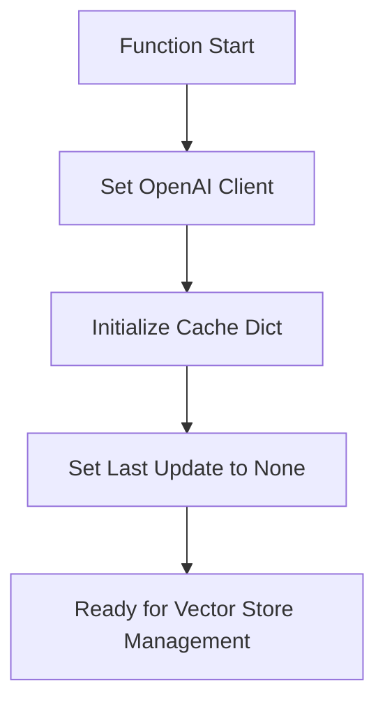

#### 📋 IPO設計

| 項目        | 内容                                           |
| ----------- | ---------------------------------------------- |
| **INPUT**   | `openai_client: OpenAI = None`                 |
| **PROCESS** | クライアント設定 → キャッシュ初期化            |
| **OUTPUT**  | なし（副作用：インスタンス状態設定）           |

---

### 🔄 VectorStoreManager.fetch\_latest\_vector\_stores()

#### 🎯 処理概要

OpenAI APIから最新のVector Store一覧を取得し、重複問題を解決する中核機能。

#### 📊 処理の流れ（重複問題修正版）

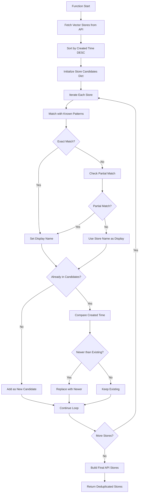

#### 📋 IPO設計

| 項目        | 内容                                                   |
| ----------- | ------------------------------------------------------ |
| **INPUT**   | なし（OpenAI API呼び出し）                             |
| **PROCESS** | API取得 → 日時ソート → 重複解決 → 最新優先選択      |
| **OUTPUT**  | `Dict[str, str]` - (表示名: Vector Store ID)          |

#### 🔧 重複解決ロジック

```python
# 重複解決の具体例
candidates = {
    "Medical Q&A": {
        'id': 'vs_new123',
        'name': 'Medical Q&A Knowledge Base',
        'created_at': 1705567890  # 新しい
    }
    # 古いID 'vs_old456' は除外される
}
```

#### 📊 マッピング例

```python
STORE_NAME_MAPPING = {
    "customer_support_faq": "Customer Support FAQ Knowledge Base",
    "medical_qa": "Medical Q&A Knowledge Base",
    "sciq_qa": "Science & Technology Q&A Knowledge Base",
    "legal_qa": "Legal Q&A Knowledge Base"
}

DISPLAY_NAME_MAPPING = {
    "Customer Support FAQ Knowledge Base": "Customer Support FAQ",
    "Medical Q&A Knowledge Base": "Medical Q&A",
    "Science & Technology Q&A Knowledge Base": "Science & Technology Q&A",
    "Legal Q&A Knowledge Base": "Legal Q&A"
}
```

---

### 🎯 VectorStoreManager.get\_vector\_stores()

#### 🎯 処理概要

キャッシュ機能付きVector Store取得。5分間のキャッシュ有効期限管理。

#### 📊 処理の流れ

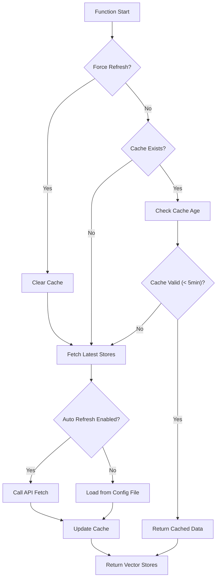

#### 📋 IPO設計

| 項目        | 内容                                                   |
| ----------- | ------------------------------------------------------ |
| **INPUT**   | `force_refresh: bool = False`                          |
| **PROCESS** | キャッシュ確認 → 有効期限チェック → データ取得・更新 |
| **OUTPUT**  | `Dict[str, str]` - (表示名: Vector Store ID)          |

---

### 🔄 VectorStoreManager.refresh\_and\_save()

#### 🎯 処理概要

最新のVector Store情報を強制取得し、設定ファイルに保存する管理機能。

#### 📊 処理の流れ

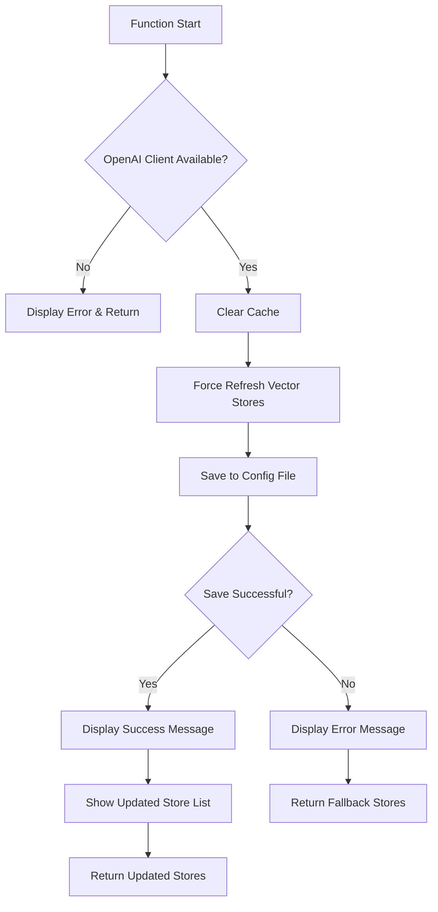

#### 📋 IPO設計

| 項目        | 内容                                                     |
| ----------- | -------------------------------------------------------- |
| **INPUT**   | なし                                                     |
| **PROCESS** | 強制更新 → 設定保存 → UI通知 → 結果表示              |
| **OUTPUT**  | `Dict[str, str]` - 更新されたVector Store設定           |

---

### 🐛 VectorStoreManager.debug\_vector\_stores()

#### 🎯 処理概要

Vector Store管理の詳細な内部状態をデバッグ用に出力。

#### 📊 処理の流れ

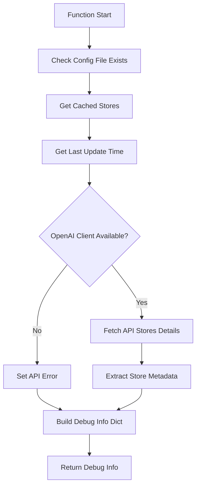

#### 📋 IPO設計

| 項目        | 内容                                               |
| ----------- | -------------------------------------------------- |
| **INPUT**   | なし                                               |
| **PROCESS** | 内部状態収集 → API詳細取得 → デバッグ情報構築   |
| **OUTPUT**  | `Dict[str, Any]` - 包括的なデバッグ情報           |

#### 📊 デバッグ情報例

```json
{
    "config_file_exists": true,
    "cached_stores": {
        "Medical Q&A": "vs_687a060f9ed881918b213bfdeab8241b"
    },
    "last_update": "2025-01-17T10:30:45",
    "api_stores": {
        "Medical Q&A Knowledge Base": {
            "id": "vs_687a060f9ed881918b213bfde",
            "created_at": 1705567890,
            "file_counts": {"completed": 5, "total": 5},
            "usage_bytes": 1024000
        }
    }
}
```

---

### 🗄️ display\_vector\_store\_management()

#### 🎯 処理概要

Vector Store管理用のStreamlit UI。更新、デバッグ、設定表示機能。

#### 📊 処理の流れ

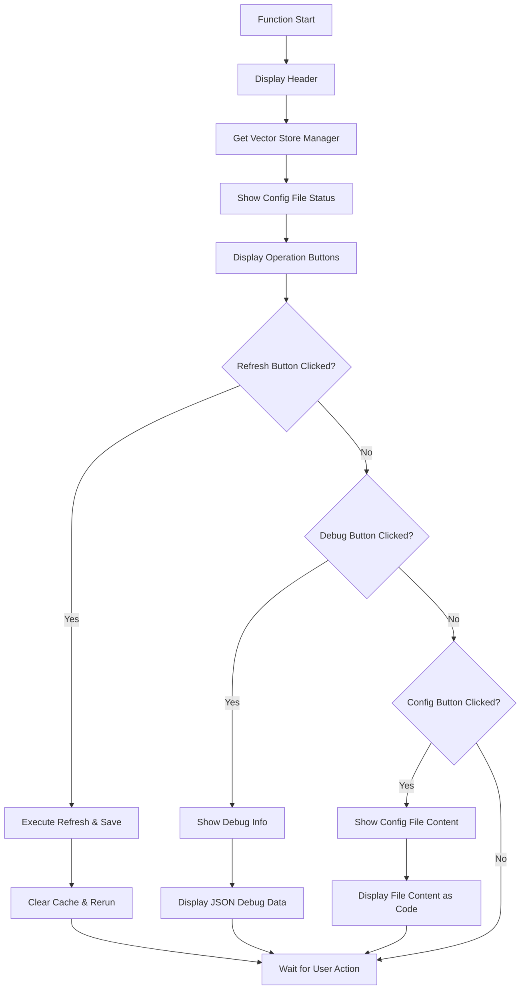

#### 📋 IPO設計

| 項目        | 内容                                           |
| ----------- | ---------------------------------------------- |
| **INPUT**   | なし（Streamlit session state）               |
| **PROCESS** | UI構築 → ボタン処理 → 管理機能実行           |
| **OUTPUT**  | なし（副作用：UI表示・状態更新）               |

---

### 🎯 get\_current\_vector\_stores()

#### 🎯 処理概要

現在のVector Store設定を取得し、UI用のリスト形式も提供する統合関数。

#### 📊 処理の流れ

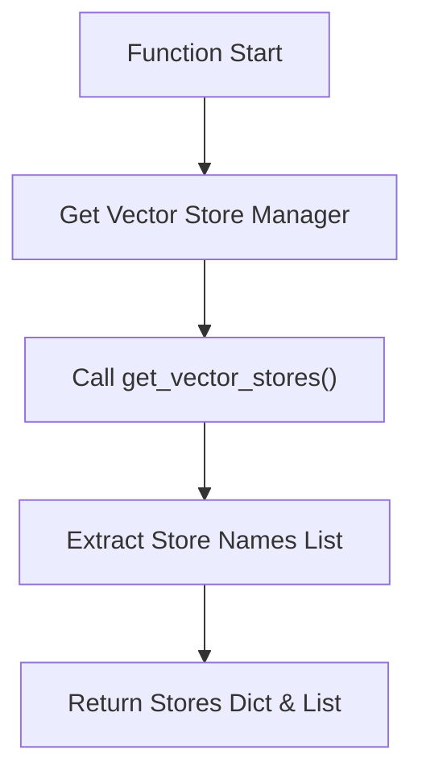

#### 📋 IPO設計

| 項目        | 内容                                                                 |
| ----------- | -------------------------------------------------------------------- |
| **INPUT**   | `force_refresh: bool = False`                                        |
| **PROCESS** | Manager取得 → Vector Store取得 → リスト変換                        |
| **OUTPUT**  | `Tuple[Dict[str, str], List[str]]` - (Stores辞書, Store名リスト)    |

---

### 🔧 get\_test\_questions\_by\_store()

#### 🎯 処理概要

選択されたVector Storeと言語に応じて、動的にテスト質問を取得する改修版関数。

#### 📊 処理の流れ

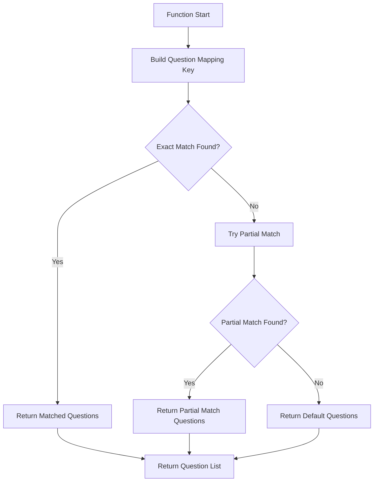

#### 📋 IPO設計

| 項目        | 内容                                                     |
| ----------- | -------------------------------------------------------- |
| **INPUT**   | `store_name: str`, `language: str`                       |
| **PROCESS** | 動的マッピング → 部分一致 → デフォルト処理             |
| **OUTPUT**  | `List[str]` - 対応するテスト質問リスト                   |

#### 🌐 動的マッピング例

```python
store_question_mapping = {
    ("Customer Support FAQ", "English"): test_questions_en,
    ("Medical Q&A", "English"): test_questions_3_en,
    ("Science & Technology Q&A", "English"): test_questions_2_en,
    ("Legal Q&A", "English"): test_questions_4_en,
    # 日本語版
    ("Customer Support FAQ", "日本語"): test_questions_ja,
    ("Medical Q&A", "日本語"): test_questions_3_ja,
}

# 部分一致の例
# "Medical Q&A Knowledge Base" → "Medical Q&A"
```

---

## ⚙️ 技術仕様

### 📦 依存ライブラリ（改修版）

| ライブラリ      | バージョン | 用途                         | 重要度 |
| --------------- | ---------- | ---------------------------- | ------ |
| `streamlit`     | 最新       | 🎨 Web UIフレームワーク      | ⭐⭐⭐ |
| `openai`        | 1.x+       | ☁️ OpenAI API クライアント | ⭐⭐⭐ |
| `openai-agents` | 最新       | 🤖 Agent SDK（オプション）   | ⭐⭐   |
| `logging`       | 標準       | 📝 ログ管理                  | ⭐⭐   |
| `typing`        | 標準       | 🔤 型ヒント                  | ⭐⭐   |
| `datetime`      | 標準       | ⏰ 時刻処理                  | ⭐⭐   |
| `json`          | 標準       | 📄 JSON処理                  | ⭐⭐   |
| `pathlib`       | 標準       | 📁 パス操作                  | ⭐     |

### 🗄️ Vector Store動的管理システム

#### 📊 設定ファイル構造（vector_stores.json）

```json
{
    "vector_stores": {
        "Customer Support FAQ": "vs_687a0604f1508191aaf416d88e266ab7",
        "Medical Q&A": "vs_687a060f9ed881918b213bfdeab8241b",
        "Science & Technology Q&A": "vs_687a061acc908191af7d5d9ba623470b",
        "Legal Q&A": "vs_687a062418ec8191872efdbf8f554836"
    },
    "last_updated": "2025-01-17T10:30:45.123456",
    "source": "a30_30_rag_search.py",
    "version": "1.1"
}
```

#### 🔄 重複解決アルゴリズム

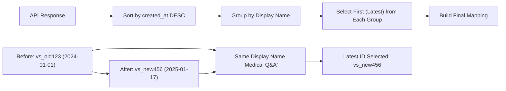

#### 🏭 VectorStoreManagerの設定

```python
# デフォルトVector Store（フォールバック用）
DEFAULT_VECTOR_STORES = {
    "Customer Support FAQ": "vs_687a0604f1508191aaf416d88e266ab7",
    "Science & Technology Q&A": "vs_687a061acc908191af7d5d9ba623470b",
    "Medical Q&A": "vs_687a060f9ed881918b213bfdeab8241b",
    "Legal Q&A": "vs_687a062418ec8191872efdbf8f554836"
}

# a30_020_make_vsid.py との連携マッピング
STORE_NAME_MAPPING = {
    "customer_support_faq": "Customer Support FAQ Knowledge Base",
    "medical_qa": "Medical Q&A Knowledge Base",
    "sciq_qa": "Science & Technology Q&A Knowledge Base",
    "legal_qa": "Legal Q&A Knowledge Base"
}

# UI表示用の逆マッピング
DISPLAY_NAME_MAPPING = {
    "Customer Support FAQ Knowledge Base": "Customer Support FAQ",
    "Medical Q&A Knowledge Base": "Medical Q&A",
    "Science & Technology Q&A Knowledge Base": "Science & Technology Q&A",
    "Legal Q&A Knowledge Base": "Legal Q&A"
}
```

### 🔧 API設定パラメータ（改修版）

#### 🤖 Responses API設定

```python
responses_api_config = {
    "model": "gpt-4o-mini",
    "tools": [{
        "type": "file_search",
        "vector_store_ids": ["vs_xxx..."],  # 動的に取得
        "max_num_results": 20,              # カスタマイズ可能
        "filters": None                     # オプション
    }],
    "include": ["file_search_call.results"],
    "timeout": 30,
    "max_retries": 3
}
```

### 📊 検索オプション（改修版）

| オプション              | デフォルト値 | 説明                           |
| ----------------------- | ------------ | ------------------------------ |
| **max\_results**        | 20           | Vector Store検索最大結果数     |
| **include\_results**    | True         | file\_search\_call.results含有 |
| **show\_citations**     | True         | ファイル引用表示               |
| **use\_agent\_sdk**     | False        | Agent SDK使用フラグ            |
| **auto\_refresh\_stores** | True         | 起動時Vector Store自動更新     |

### 🔄 セッション管理（改修版）

#### 💾 セッション状態構造

```python
session_structure = {
    "search_history": [...],  # 従来通り
    "current_query": "...",
    "selected_store": "Medical Q&A",  # 動的に管理
    "selected_language": "English",
    "search_options": {
        "max_results": 20,
        "include_results": True,
        "show_citations": True
    },
    # 新規追加
    "auto_refresh_stores": True,
    "vector_stores_updated": "2025-01-17T10:30:45",
    "force_initial_refresh": False
}
```

---

## 🚨 エラーハンドリング

### 🆕 Vector Store管理関連エラー

| エラー種別                   | 原因                     | 対処法                         | 影響度 |
| ---------------------------- | ------------------------ | ------------------------------ | ------ |
| **重複Vector Store問題**     | 🔄 同名Store複数存在     | 最新作成日時優先選択・自動解決 | 🟡 中  |
| **設定ファイル破損**         | 📁 JSON形式不正          | デフォルト値にフォールバック   | 🟡 中  |
| **API取得失敗**              | 🌐 OpenAI API障害        | 設定ファイルから読み込み       | 🟡 中  |
| **Vector Store ID不整合**    | 🚫 古いID・無効ID        | 最新情報に自動更新             | 🔴 高  |

### 🔑 API関連エラー（継続）

| エラー種別           | 原因                     | 対処法                         | 影響度 |
| -------------------- | ------------------------ | ------------------------------ | ------ |
| **APIキー未設定**    | 🚫 環境変数未設定        | 設定手順表示・アプリ停止       | 🔴 高  |
| **API認証エラー**    | 🔑 不正なAPIキー         | キー確認指示・再設定案内       | 🔴 高  |
| **API呼び出し失敗**  | 🌐 ネットワーク・API障害 | エラーメッセージ・リトライ提案 | 🟡 中  |
| **レート制限エラー** | ⏱️ 使用量上限到達      | 待機指示・使用量確認案内       | 🟡 中  |

### 🔄 重複問題解決フロー

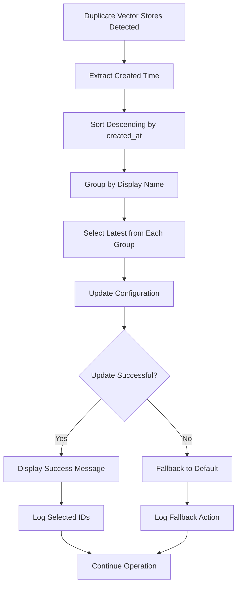

### 🛠️ エラー処理フロー（改修版）

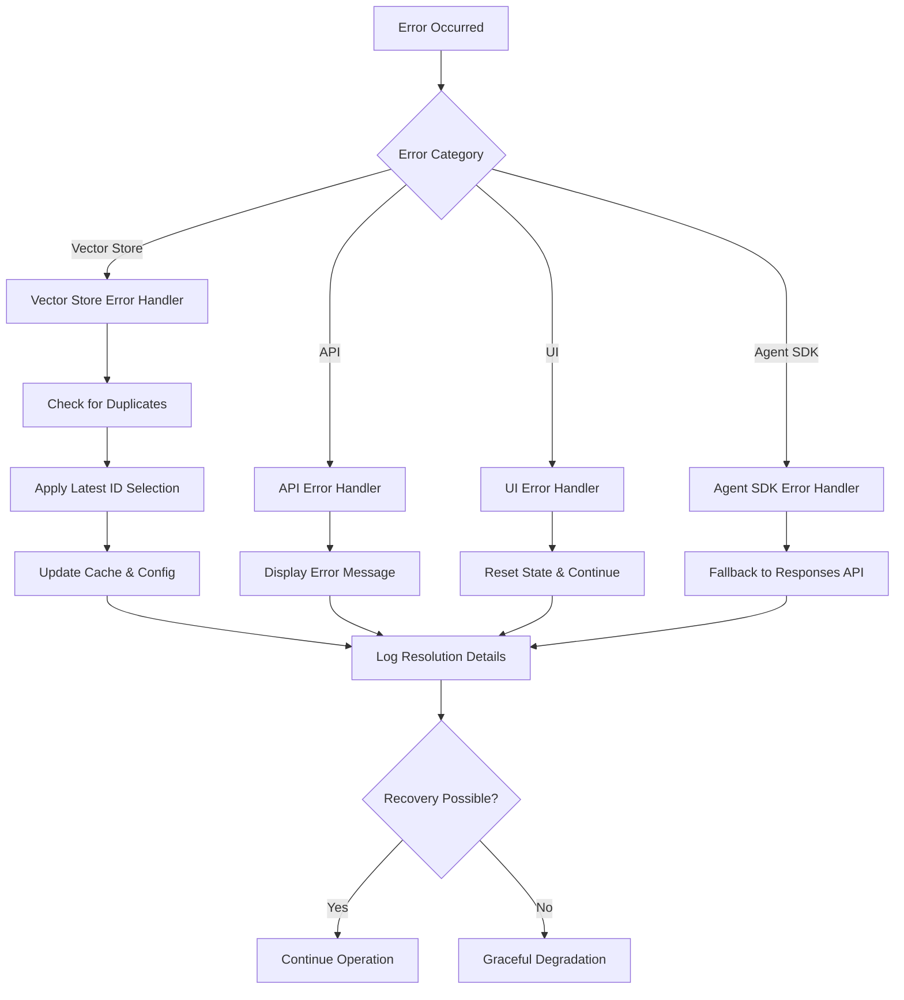

### ✅ エラーメッセージ設計（改修版）

#### 🎯 Vector Store管理エラー通知

```python
# 重複解決成功
st.success("✅ Vector Store設定を更新しました（重複問題解決）")
st.info("🔄 同名Vector Storeが検出されましたが、最新作成日時を優先して自動解決しました")

# 設定ファイル問題
st.warning("⚠️ 設定ファイル形式が不正です。デフォルト値を使用します")
st.info("💡 「最新情報に更新」ボタンで正常な設定ファイルを再生成できます")

# API取得失敗
st.error("❌ 最新情報の取得に失敗しました。設定ファイルから読み込みます")
st.info("🔄 しばらく時間をおいて「最新情報に更新」をお試しください")
```

#### 🔍 デバッグ支援機能

```python
# 重複解決ログ例
logger.info("🔄 更新: 'Medical Q&A' -> 'Medical Q&A Knowledge Base' (vs_new456) [新: 1705567890 > 旧: 1705480000]")
logger.info("✅ 新規候補: 'Legal Q&A' -> 'Legal Q&A Knowledge Base' (vs_abc123)")
logger.info("⏭️ スキップ: 'Customer Support FAQ' -> 'Customer Support FAQ v1' (vs_old789) [新: 1705400000 <= 既存: 1705567890]")
```

---

## 🎉 まとめ（改修版）

この設計書は、**重複Vector Store問題を解決**した **a30\_30\_rag\_search.py** の完全な技術仕様と実装詳細を網羅した包括的ドキュメントです。

### 🌟 改修のハイライト

* **🔄 重複Vector Store問題解決**: 同名Vector Storeの最新作成日時優先選択
* **🗄️ VectorStoreManagerクラス**: 動的Vector Store管理の中核システム
* **📁 設定ファイル連携**: vector_stores.json による永続化・キャッシュ機能
* **🔗 a30_020_make_vsid.py連携**: 新規作成Vector Storeの自動認識
* **🐛 デバッグ機能強化**: 詳細な内部状態確認・ログ出力
* **⚙️ 自動更新システム**: 起動時・手動での最新情報取得

### 📈 技術的特徴（改修版）

* **🔧 重複解決アルゴリズム**: 作成日時ベースの自動選択
* **💾 キャッシュシステム**: 5分間有効期限でのパフォーマンス最適化
* **🔒 フォールバック機能**: API障害時の設定ファイル読み込み
* **📊 UI管理機能**: サイドバーでの包括的Vector Store管理
* **🎯 動的マッピング**: 柔軟な名前解決・部分一致対応

### 🚀 今後の拡張可能性

* 🌍 多重Vector Store環境での高度な重複管理
* 📊 Vector Store使用統計・パフォーマンス分析
* 🤖 AI による最適Vector Store推奨機能
* 🔄 バージョン管理・ロールバック機能
* 📈 A/Bテスト対応Vector Store切り替え機能
* 🔐 Vector Store アクセス権限管理

### 🎯 運用上の利点

* **⚡ 高信頼性**: 重複問題の完全解決により安定した検索品質
* **🔧 メンテナンス性**: 直感的な管理UIによる運用負荷軽減
* **📈 スケーラビリティ**: 新規Vector Store の自動認識・統合
* **🐛 トラブルシューティング**: 詳細なデバッグ情報による迅速な問題解決
* **🔄 継続性**: キャッシュ・フォールバック機能による高可用性
