# 📋 a50_qdrant_registration.py 設計書

## 📝 目次

1. [📖 概要書](#📖-概要書)
2. [🔧 システム構成](#🔧-システム構成)
3. [📋 関数一覧](#📋-関数一覧)
4. [📑 関数詳細設計](#📑-関数詳細設計)
5. [⚙️ 技術仕様](#⚙️-技術仕様)
6. [🚨 エラーハンドリング](#🚨-エラーハンドリング)

---

## 📖 概要書

### 🎯 処理の概要

**Qdrant統合データ登録・Named Vectors対応システム**

本スクリプトは、4つの専門分野QAデータセット（カスタマーサポート、医療、科学技術、法律）を単一のQdrantコレクションに統合登録し、ドメインフィルタリング可能な高度なベクトル検索システムを構築します。Named Vectors機能により複数の埋め込みモデルを同時活用でき、answer埋め込みオプションによる検索精度向上も実現します。

#### 🌟 主要機能

| 機能 | 説明 |
|------|------|
| 🗃️ **統合データ登録** | 4つのQAデータセットを単一コレクションに統合 |
| 🏷️ **ドメインフィルタ** | payload.domainによる分野別検索 |
| 🔀 **Named Vectors対応** | 複数埋め込みモデルの同時利用 |
| 🎯 **Answer埋め込み切替** | question+answerの結合埋め込みオプション |
| 📋 **設定ファイル連携** | config.ymlからの設定読み込み |
| 🔍 **即時検索機能** | 登録後の動作確認検索 |

#### 🗃️ データフロー構成

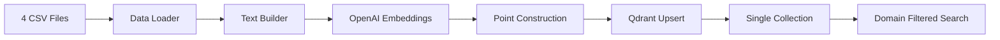

### 🔄 処理フロー

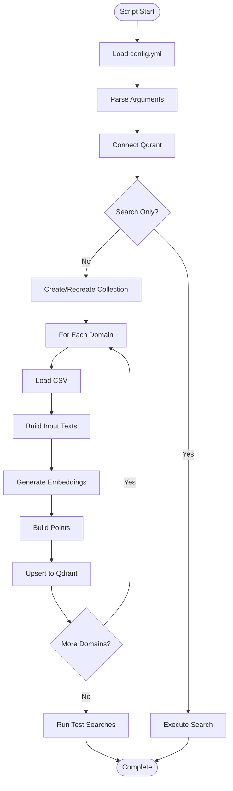

---

## 🔧 システム構成

### 📦 主要コンポーネント

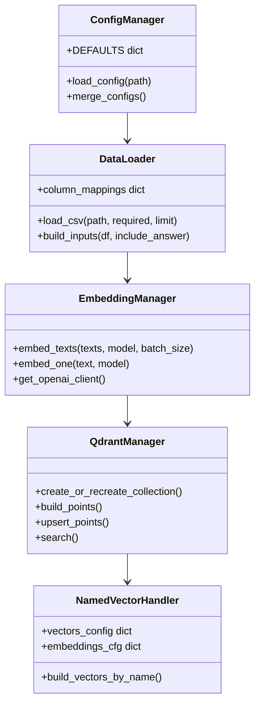

### 📋 データ構造

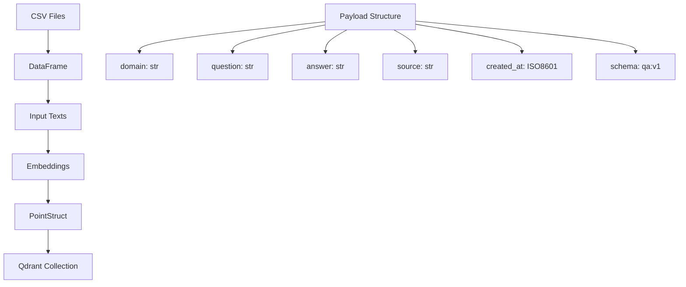

---

## 📋 関数一覧

### 🔧 設定管理関数

| 関数名 | 分類 | 処理概要 | 重要度 |
|--------|------|----------|---------|
| `load_config()` | 📋 設定 | config.yml読み込みとデフォルト値マージ | ⭐⭐⭐ |
| `merge()` | 🔄 統合 | 設定辞書の再帰的マージ | ⭐⭐ |

### 📊 データ処理関数

| 関数名 | 分類 | 処理概要 | 重要度 |
|--------|------|----------|---------|
| `load_csv()` | 📥 読込 | CSVファイル読み込みと列名正規化 | ⭐⭐⭐ |
| `build_inputs()` | 🔨 構築 | 埋め込み用入力テキスト生成 | ⭐⭐⭐ |
| `batched()` | 📦 分割 | イテラブルのバッチ分割 | ⭐⭐ |

### 🤖 埋め込み関数

| 関数名 | 分類 | 処理概要 | 重要度 |
|--------|------|----------|---------|
| `embed_texts()` | 🔢 変換 | テキスト群のベクトル化 | ⭐⭐⭐ |
| `embed_texts_openai()` | 🌐 API | OpenAI埋め込みAPI呼び出し | ⭐⭐⭐ |
| `embed_one()` | 🎯 単一 | 単一テキストの埋め込み | ⭐⭐ |
| `get_openai_client()` | 🔑 接続 | OpenAIクライアント取得 | ⭐⭐ |

### 🔍 Qdrant操作関数

| 関数名 | 分類 | 処理概要 | 重要度 |
|--------|------|----------|---------|
| `create_or_recreate_collection()` | 📦 作成 | コレクション作成/再作成 | ⭐⭐⭐ |
| `build_points()` | 🔨 構築 | PointStruct群の生成 | ⭐⭐⭐ |
| `upsert_points()` | 📤 登録 | ポイントのバッチ登録 | ⭐⭐⭐ |
| `search()` | 🔍 検索 | ベクトル類似検索実行 | ⭐⭐⭐ |

### 🎯 制御関数

| 関数名 | 分類 | 処理概要 | 重要度 |
|--------|------|----------|---------|
| `main()` | 🎯 制御 | メイン処理制御 | ⭐⭐⭐ |

---

## 📑 関数詳細設計

### 📋 load_config()

#### 🎯 処理概要
config.ymlファイルから設定を読み込み、デフォルト値とマージして完全な設定辞書を生成

#### 📊 処理の流れ
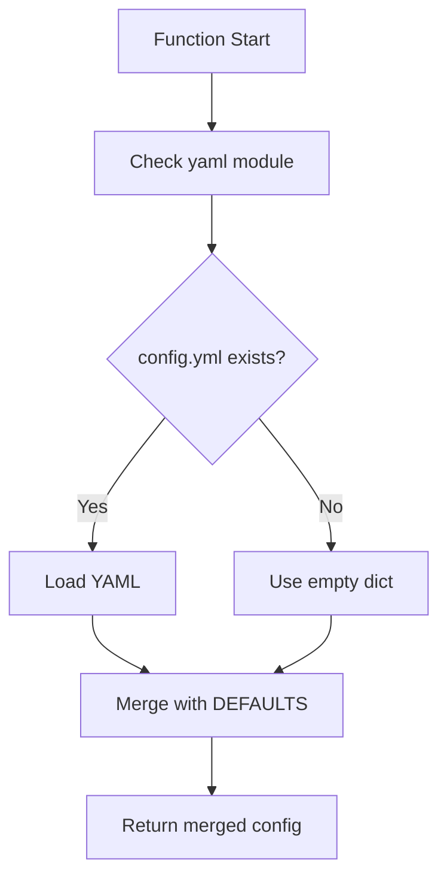

#### 📋 IPO設計

| 項目 | 内容 |
|------|------|
| **INPUT** | path: str = "config.yml" |
| **PROCESS** | YAML読込 → デフォルト値とマージ |
| **OUTPUT** | Dict[str, Any]（完全な設定辞書） |

#### 🔧 デフォルト設定構造

```python
DEFAULTS = {
    "rag": {
        "collection": "qa_corpus",
        "include_answer_in_embedding": False,
        "use_named_vectors": False,
    },
    "embeddings": {
        "primary": {
            "provider": "openai",
            "model": "text-embedding-3-small",
            "dims": 1536
        }
    },
    "paths": {
        "customer": "OUTPUT/preprocessed_customer_support_faq.csv",
        "medical": "OUTPUT/preprocessed_medical_qa.csv",
        "legal": "OUTPUT/preprocessed_legal_qa.csv",
        "sciq": "OUTPUT/preprocessed_sciq_qa.csv"
    },
    "qdrant": {
        "url": "http://localhost:6333"
    }
}
```

---

### 📥 load_csv()

#### 🎯 処理概要
CSVファイルを読み込み、列名を正規化し、必須列の存在確認と重複除去を実施

#### 📊 処理の流れ
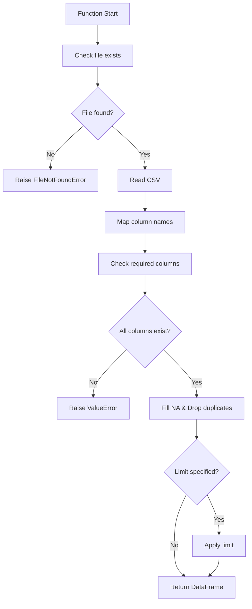

#### 📋 列名マッピング

```python
column_mappings = {
    'Question': 'question',
    'Response': 'answer',
    'Answer': 'answer',
    'correct_answer': 'answer'
}
```

---

### 🔢 embed_texts()

#### 🎯 処理概要
テキストリストをバッチ処理でベクトル化し、helper_rag利用可能時は委譲

#### 📊 処理の流れ
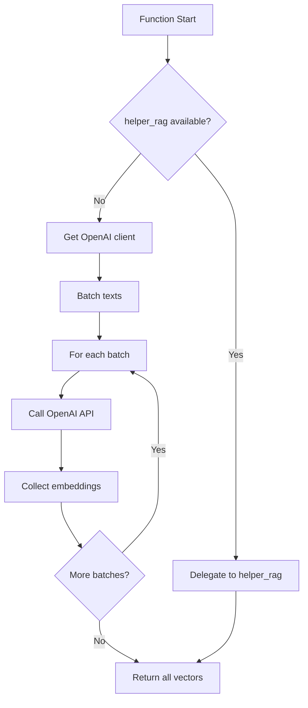

#### 📋 バッチ処理仕様

| 項目 | 内容 |
|------|------|
| **バッチサイズ** | デフォルト 128 |
| **API制限対応** | 自動リトライなし（要改善） |
| **メモリ効率** | ストリーミング処理 |

---

### 📦 create_or_recreate_collection()

#### 🎯 処理概要
Named Vectors対応のQdrantコレクションを作成または再作成

#### 📊 処理の流れ
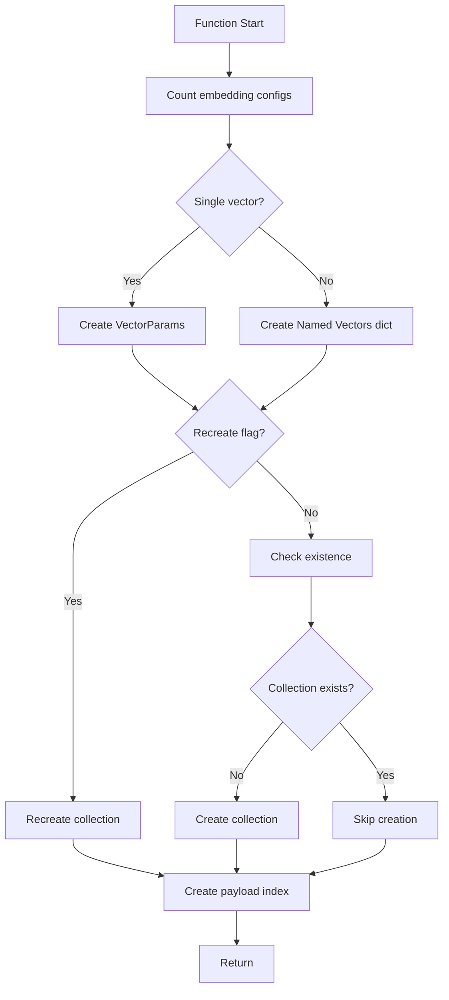

#### 📋 Named Vectors仕様

```python
# 単一ベクトル時
vectors_config = models.VectorParams(
    size=dims,
    distance=models.Distance.COSINE
)

# Named Vectors時
vectors_config = {
    "primary": models.VectorParams(size=1536, distance=models.Distance.COSINE),
    "secondary": models.VectorParams(size=3072, distance=models.Distance.COSINE)
}
```

---

### 🔨 build_points()

#### 🎯 処理概要
DataFrameとベクトル群からQdrant PointStruct群を生成

#### 📊 処理の流れ
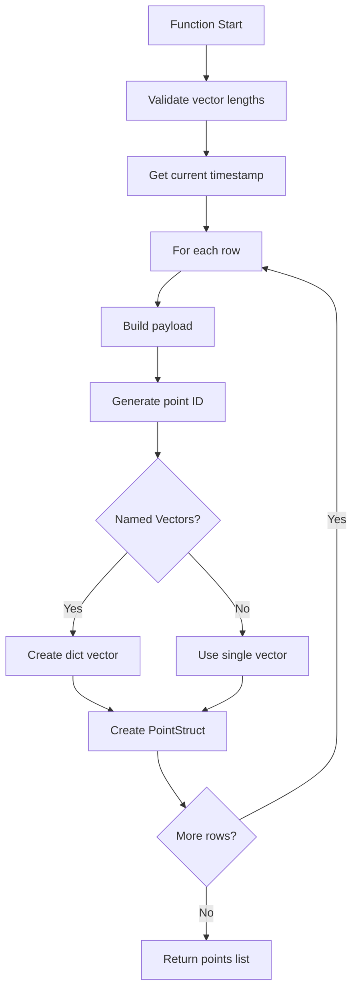

#### 📋 Payload構造

```python
payload = {
    "domain": str,          # ドメイン識別子
    "question": str,        # 質問文
    "answer": str,          # 回答文
    "source": str,          # ソースファイル名
    "created_at": str,      # ISO8601タイムスタンプ
    "schema": "qa:v1"      # スキーマバージョン
}
```

---

### 🔍 search()

#### 🎯 処理概要
クエリテキストを埋め込み、ドメインフィルタ付きベクトル検索を実行

#### 📊 処理の流れ
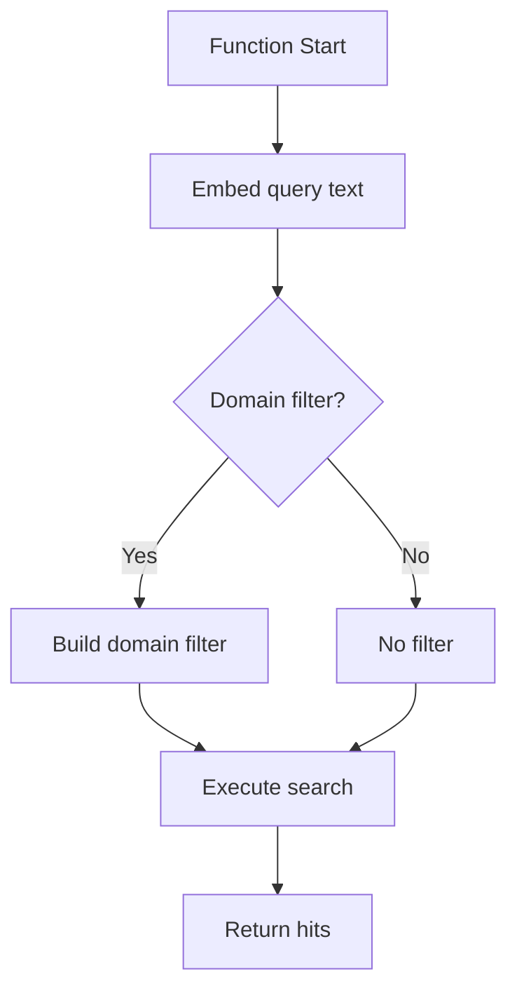

#### 📋 検索パラメータ

| パラメータ | 説明 | デフォルト |
|-----------|------|------------|
| `query` | 検索クエリテキスト | - |
| `using_vec` | 使用するNamed Vector | primary |
| `topk` | 取得件数 | 5 |
| `domain` | フィルタドメイン | None |

---

### 🎯 main()

#### 🎯 処理概要
コマンドライン引数処理とメイン処理フローの制御

#### 📊 処理の流れ
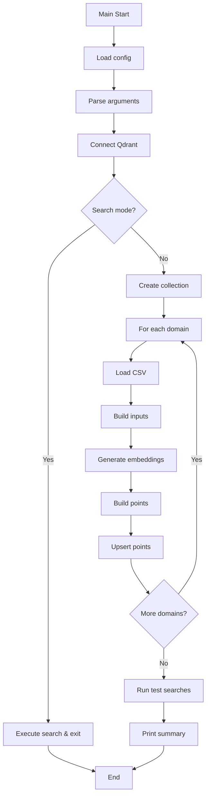

---

## ⚙️ 技術仕様

### 📦 依存ライブラリ

| ライブラリ | バージョン | 用途 | 重要度 |
|-----------|-----------|------|---------|
| `qdrant-client` | ≥1.6.0 | 🔍 ベクトルDB接続 | ⭐⭐⭐ |
| `openai` | ≥1.99.9 | 🤖 埋め込み生成 | ⭐⭐⭐ |
| `pandas` | ≥2.0.0 | 📊 データ処理 | ⭐⭐⭐ |
| `PyYAML` | 最新 | 📋 設定ファイル読込 | ⭐⭐ |
| `helper_api` | optional | 🔧 API補助機能 | ⭐ |
| `helper_rag` | optional | 📋 RAG補助機能 | ⭐ |

### 🗃️ データセット仕様

#### 📋 対応データセット

| ドメイン | ファイルパス | 推定行数 | 特徴 |
|----------|------------|----------|------|
| `customer` | preprocessed_customer_support_faq.csv | 89 | カスタマーサポートFAQ |
| `medical` | preprocessed_medical_qa.csv | 19,704 | 医療Q&A（大規模） |
| `legal` | preprocessed_legal_qa.csv | 4 | 法律Q&A（小規模） |
| `sciq` | preprocessed_sciq_qa.csv | 11,679 | 科学技術Q&A |

### ⚙️ Named Vectors仕様

#### 🔀 複数ベクトル管理

```yaml
embeddings:
  primary:
    provider: openai
    model: text-embedding-3-small
    dims: 1536
  
  secondary:  # オプション
    provider: openai
    model: text-embedding-3-large
    dims: 3072
```

#### 📊 利用シナリオ

```python
# 検索時のベクトル選択
--using primary   # 高速・低精度
--using secondary # 低速・高精度
```

### 🖥️ コマンドライン引数

#### 📡 主要引数

```bash
# 基本操作
--recreate           # コレクション再作成
--collection NAME    # コレクション名指定
--qdrant-url URL     # Qdrant接続先

# データ処理
--batch-size N       # バッチサイズ（デフォルト32）
--limit N            # CSV読込行数制限（開発用）
--include-answer     # answer埋め込み有効化

# 検索機能
--search "query"     # 検索モード
--domain DOMAIN      # ドメインフィルタ
--topk N             # 検索結果数
--using NAME         # Named Vector選択
```

### ⚙️ パフォーマンス最適化

#### ⚡ バッチ処理設定

```python
optimization = {
    "embedding_batch": 128,      # 埋め込みバッチサイズ
    "upsert_batch": 128,         # Upsertバッチサイズ
    "qdrant_timeout": 300,       # タイムアウト（秒）
    "memory_efficient": True     # ストリーミング処理
}
```

#### 📈 処理時間目安

| データセット | 行数 | 処理時間 |
|-------------|------|----------|
| customer | 89 | ~5秒 |
| medical | 19,704 | ~5分 |
| legal | 4 | ~2秒 |
| sciq | 11,679 | ~3分 |

---

## 🚨 エラーハンドリング

### 📁 ファイル関連エラー

| エラー種別 | 原因 | 対処法 | 影響度 |
|-----------|------|--------|---------|
| **CSV不在** | 📄 ファイルパス誤り | パス確認・前処理実行 | 🔴 高 |
| **列名不一致** | 📋 必須列の欠如 | 列名マッピング調整 | 🔴 高 |
| **エンコーディング** | 🔤 文字コード問題 | UTF-8確認 | 🟡 中 |
| **メモリ不足** | 💾 大規模CSV | limit引数使用 | 🟡 中 |

### 🌐 API関連エラー

| エラー種別 | 原因 | 対処法 | 影響度 |
|-----------|------|--------|---------|
| **APIキー不正** | 🔑 環境変数未設定 | OPENAI_API_KEY確認 | 🔴 高 |
| **レート制限** | ⏱️ API制限超過 | batch_size削減 | 🟡 中 |
| **モデル不在** | 🤖 モデル名誤り | モデル名確認 | 🔴 高 |
| **タイムアウト** | 🌐 ネットワーク遅延 | タイムアウト延長 | 🟡 中 |

### 🔍 Qdrant関連エラー

| エラー種別 | 原因 | 対処法 | 影響度 |
|-----------|------|--------|---------|
| **接続失敗** | 🚫 Qdrant未起動 | Docker確認・起動 | 🔴 高 |
| **コレクション競合** | 📦 既存コレクション | --recreate使用 | 🟡 中 |
| **ベクトル次元不一致** | 🔢 設定ミス | dims確認 | 🔴 高 |
| **ペイロードインデックス** | 📋 既存インデックス | 警告無視可 | 🟠 低 |

### 🛠️ エラー処理戦略

#### 🔄 継続処理設計

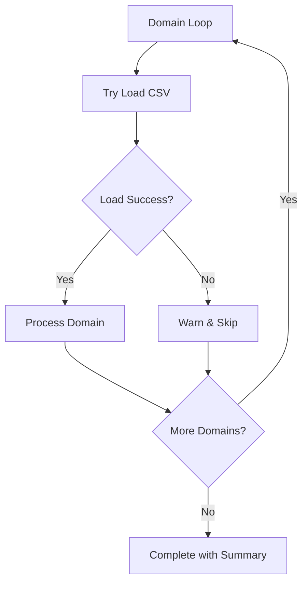

#### ✅ エラーメッセージ例

```python
# CSV不在
print(f"[WARN] Not found: {path} (skip domain={domain})")

# 列不足
raise ValueError(f"{path} には '{col}' 列が必要です（列: {list(df.columns)}）")

# ベクトル長不一致
raise ValueError(f"vectors length mismatch for '{name}': df={n}, vecs={len(vecs)}")

# Named Vector不在
raise ValueError(f"--using '{using_vec}' is not in embeddings config")
```

---

## 🎉 まとめ

この設計書は、**a50_qdrant_registration.py** による高度なベクトルデータベース登録システムの完全な技術仕様を文書化したものです。

### 🌟 設計のハイライト

- **🗃️ 統合管理**: 4つのQAデータセットの一元化
- **🏷️ ドメインフィルタ**: 分野別の効率的検索
- **🔀 Named Vectors**: 複数埋め込みモデル対応
- **🎯 柔軟な埋め込み**: answer結合オプション
- **📋 設定駆動**: config.ymlによる外部化

### 🔧 技術的特徴

- **バッチ処理**: 大規模データの効率的処理
- **ヘルパー統合**: helper_api/helper_rag活用
- **エラー耐性**: ドメイン単位の継続処理
- **即時検証**: 登録後の動作確認検索

### 📈 RAGシステムでの位置づけ

- **データ投入層**: 前処理済みデータのベクトル化
- **検索基盤構築**: ドメイン別検索インフラ
- **品質保証**: 登録データの即時検証

### 🚀 今後の拡張可能性

- 🔄 増分更新機能
- 📊 埋め込み品質評価
- 🌍 多言語対応拡張
- ⚡ 並列処理による高速化
- 📈 メタデータの拡充
- 🔧 動的モデル切替