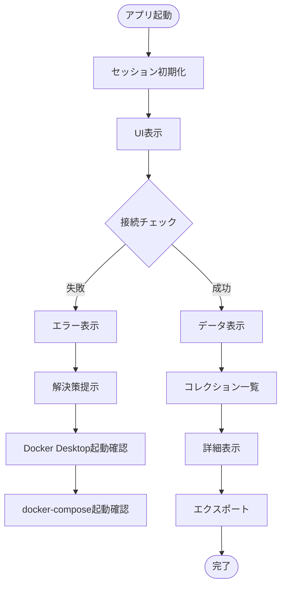
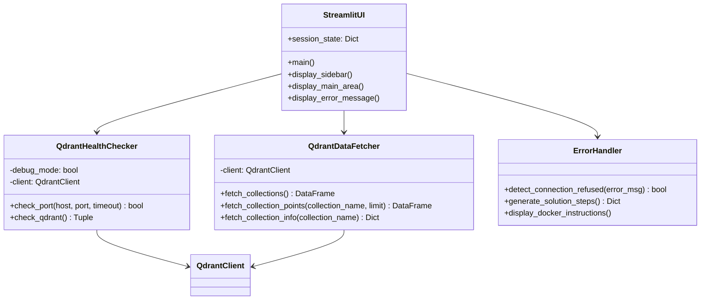
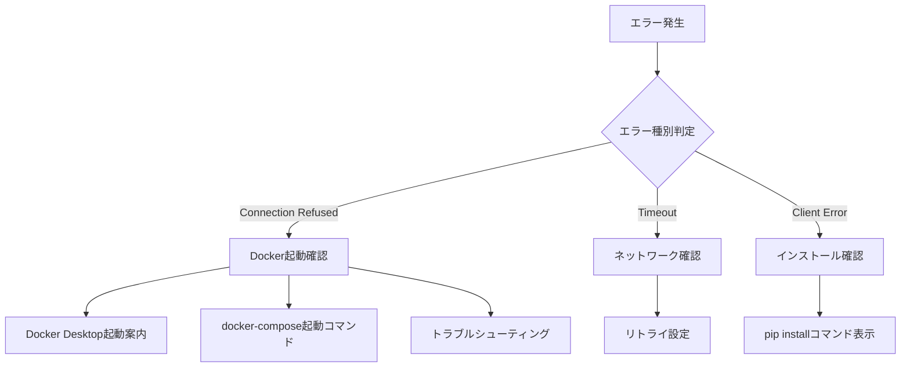

# 📋 a40_show_qdrant_data.py 設計書

## 📝 目次

1. [📖 概要書](#📖-概要書)
2. [🔧 システム構成](#🔧-システム構成)
3. [📋 クラス・関数一覧](#📋-クラス関数一覧)
4. [📑 詳細設計](#📑-詳細設計)
5. [⚙️ 技術仕様](#⚙️-技術仕様)
6. [🚨 エラーハンドリング](#🚨-エラーハンドリング)
7. [📊 使用例](#📊-使用例)

---

## 📖 概要書

### 🎯 処理の概要

**Qdrantデータ表示ツール - Vector Database監視とデータビューア**

本ツールは、Qdrant Vector Databaseの状態監視とデータ表示を行うStreamlitアプリケーションです。Docker Desktopとdocker-composeの起動状態を含む、詳細なエラーメッセージと解決策を提供する改良版です。

### 🌟 主要機能

| 機能 | 説明 |
|------|------|
| 🔍 **接続状態チェック** | Qdrantサーバーの接続状態をリアルタイム監視 |
| 📊 **コレクション一覧表示** | 全コレクションの概要情報を表示 |
| 📋 **ポイントデータ表示** | 各コレクションの詳細データを表示 |
| 💾 **エクスポート機能** | CSV/JSON形式でのデータエクスポート |
| 🐛 **デバッグモード** | 詳細なエラー情報とトラブルシューティング |
| 🔄 **自動更新機能** | 指定間隔での自動データ更新 |
| ⚠️ **エラーメッセージ改良** | Docker Desktop起動案内を含む詳細なエラー対処法 |

### 🔄 処理フロー



---

## 🔧 システム構成

### 📦 主要コンポーネント



### 🔗 依存関係

| パッケージ | 用途 | 必須/任意 |
|-----------|------|-----------|
| streamlit | WebアプリUI | 必須 |
| qdrant-client | Qdrant接続 | 必須 |
| pandas | データ処理 | 必須 |
| socket | ポートチェック | 必須（標準ライブラリ） |
| json | データエクスポート | 必須（標準ライブラリ） |

---

## 📋 クラス・関数一覧

### 🎯 主要クラス

| クラス名 | 役割 | 主要メソッド |
|----------|------|------------|
| `QdrantHealthChecker` | 接続状態チェック | check_port(), check_qdrant() |
| `QdrantDataFetcher` | データ取得 | fetch_collections(), fetch_collection_points(), fetch_collection_info() |

### 🔧 主要関数

| 関数名 | 役割 | 引数 | 戻り値 |
|--------|------|------|--------|
| `main()` | アプリケーションメイン | なし | なし |
| `check_port()` | ポート接続確認 | host, port, timeout | bool |
| `check_qdrant()` | Qdrant接続確認 | なし | Tuple[bool, str, Optional[Dict]] |
| `fetch_collections()` | コレクション一覧取得 | なし | pd.DataFrame |
| `fetch_collection_points()` | ポイントデータ取得 | collection_name, limit | pd.DataFrame |
| `fetch_collection_info()` | コレクション詳細取得 | collection_name | Dict[str, Any] |

---

## 📑 詳細設計

### 🔍 QdrantHealthChecker

```python
class QdrantHealthChecker:
    """
    Qdrantサーバーの接続状態をチェック
    
    Attributes:
        debug_mode: デバッグモードフラグ
        client: Qdrantクライアント
    """
```

#### check_port()

```python
def check_port(self, host: str, port: int, timeout: float = 2.0) -> bool:
    """
    ポートが開いているかチェック
    
    Parameters:
        host: ホスト名
        port: ポート番号
        timeout: タイムアウト秒数
    
    Returns:
        bool: ポートが開いているか
    
    処理:
        1. ソケット作成
        2. タイムアウト設定
        3. 接続試行
        4. 結果返却
    """
```

#### check_qdrant()

```python
def check_qdrant(self) -> Tuple[bool, str, Optional[Dict]]:
    """
    Qdrant接続チェック
    
    Returns:
        Tuple[bool, str, Optional[Dict]]: (接続成功, メッセージ, メトリクス)
    
    処理:
        1. ポートチェック
        2. Qdrantクライアント作成
        3. コレクション取得試行
        4. メトリクス収集
        5. 結果返却
    """
```

### 📊 QdrantDataFetcher

```python
class QdrantDataFetcher:
    """
    Qdrantからデータを取得
    
    Attributes:
        client: Qdrantクライアント
    """
```

#### fetch_collections()

```python
def fetch_collections(self) -> pd.DataFrame:
    """
    コレクション一覧を取得
    
    Returns:
        pd.DataFrame: コレクション情報のDataFrame
        
    列:
        - Collection: コレクション名
        - Vectors Count: ベクトル数
        - Points Count: ポイント数
        - Indexed Vectors: インデックス済みベクトル数
        - Status: ステータス
    """
```

#### fetch_collection_points()

```python
def fetch_collection_points(self, collection_name: str, limit: int = 50) -> pd.DataFrame:
    """
    コレクションの詳細データを取得
    
    Parameters:
        collection_name: コレクション名
        limit: 取得上限数
    
    Returns:
        pd.DataFrame: ポイントデータのDataFrame
    
    処理:
        1. scrollメソッドでポイント取得
        2. payloadの展開
        3. 長い文字列の切り詰め（200文字）
        4. DataFrame変換
    """
```

### 🚨 エラーメッセージ改良

```python
# Connection refusedエラーの詳細表示
if "Connection refused" in error_msg or "[Errno 61]" in error_msg:
    st.error("❌ Qdrantサーバーに接続できません")
    st.warning("""
        **原因:** Qdrantサーバーが起動していない可能性があります。
        
        **解決方法:**
        
        🔄 **ステップ1: Docker Desktopを起動**
        - macOS: アプリケーションフォルダからDocker Desktopを起動
        - 確認: `docker version`
        
        🚀 **ステップ2: Qdrantを起動**
        ```bash
        cd docker-compose
        docker-compose up -d qdrant
        ```
        
        ✅ **ステップ3: 動作確認**
        ```bash
        docker-compose ps
        # Qdrantが'Up'状態であることを確認
        ```
        
        🔧 **トラブルシューティング:**
        - ポート使用中: `lsof -i :6333`
        - ログ確認: `docker-compose logs qdrant`
        - 再起動: `docker-compose restart qdrant`
    """)
```

---

## ⚙️ 技術仕様

### 🗃️ サーバー設定

```python
QDRANT_CONFIG = {
    "name": "Qdrant",
    "host": "localhost",
    "port": 6333,
    "icon": "🎯",
    "url": "http://localhost:6333",
    "health_check_endpoint": "/collections",
    "docker_image": "qdrant/qdrant"
}
```

### 📊 セッション状態管理

| キー | 型 | デフォルト | 説明 |
|-----|---|-----------|------|
| debug_mode | bool | False | デバッグモード有効化 |
| auto_refresh | bool | False | 自動更新有効化 |
| refresh_interval | int | 30 | 自動更新間隔（秒） |
| selected_collection | str | None | 選択中のコレクション |
| display_limit | int | 50 | 表示上限数 |

### 🎨 UI仕様

```
┌────────────────────────────────────────┐
│    🎯 Qdrant データ表示ツール           │
├────────────┬───────────────────────────┤
│            │                           │
│  Sidebar   │    Main Content Area      │
│            │                           │
│ - Status   │  - Collections List       │
│ - Options  │  - Collection Details     │
│ - Debug    │  - Export Options         │
│            │                           │
└────────────┴───────────────────────────┘
```

---

## 🚨 エラーハンドリング

### ❌ エラーパターン

| エラー種別 | エラーメッセージ | 原因 | 対処法 |
|-----------|-----------------|------|--------|
| Connection Refused | [Errno 61] Connection refused | Qdrant未起動 | Docker Desktop起動 → docker-compose起動 |
| Timeout | Connection timeout | ネットワーク遅延 | タイムアウト値調整 |
| Client Not Installed | Qdrant client not installed | パッケージ未インストール | pip install qdrant-client |
| Port Closed | Connection refused (port closed) | ポート未開放 | ポート6333の開放確認 |

### 🛡️ エラー処理フロー



---

## 📊 使用例

### 🚀 起動方法

```bash
# Streamlitアプリ起動
streamlit run a40_show_qdrant_data.py --server.port=8502
```

### 📱 基本的な使用フロー

1. **Docker Desktop起動**
   ```bash
   # macOS: アプリケーションからDocker Desktopを起動
   # 確認
   docker version
   ```

2. **Qdrant起動**
   ```bash
   cd docker-compose
   docker-compose up -d qdrant
   docker-compose ps
   ```

3. **アプリ起動**
   ```bash
   streamlit run a40_show_qdrant_data.py --server.port=8502
   ```

4. **接続確認**
   - サイドバーの「🔍 接続チェック実行」ボタンをクリック
   - 接続成功を確認

5. **データ表示**
   - コレクション一覧から選択
   - 詳細データ表示
   - 必要に応じてエクスポート

### 🔍 デバッグモード使用例

```python
# デバッグモード有効化
1. サイドバーの「🐛 デバッグモード」をチェック
2. 詳細なエラー情報が表示される
3. メトリクス情報も展開可能
```

### 📥 データエクスポート例

```python
# CSV形式でエクスポート
1. コレクション一覧または詳細データを表示
2. 「📥 CSVダウンロード」ボタンクリック
3. ファイル名: qdrant_collections_YYYYMMDD_HHMMSS.csv

# JSON形式でエクスポート  
1. 「📥 JSONダウンロード」ボタンクリック
2. ファイル名: qdrant_collections_YYYYMMDD_HHMMSS.json
```

### 🔄 自動更新設定

```python
# 自動更新の有効化
1. サイドバーの「🔄 自動更新」をチェック
2. 更新間隔を設定（5-300秒）
3. 指定間隔でデータが自動更新
```

---

## 🔄 今後の拡張計画

- [ ] ベクトル検索機能の追加
- [ ] フィルタリング機能の強化
- [ ] グラフ表示機能
- [ ] 複数Qdrantインスタンス対応
- [ ] データインポート機能
- [ ] バックアップ・リストア機能
- [ ] パフォーマンスメトリクス表示
- [ ] アラート機能