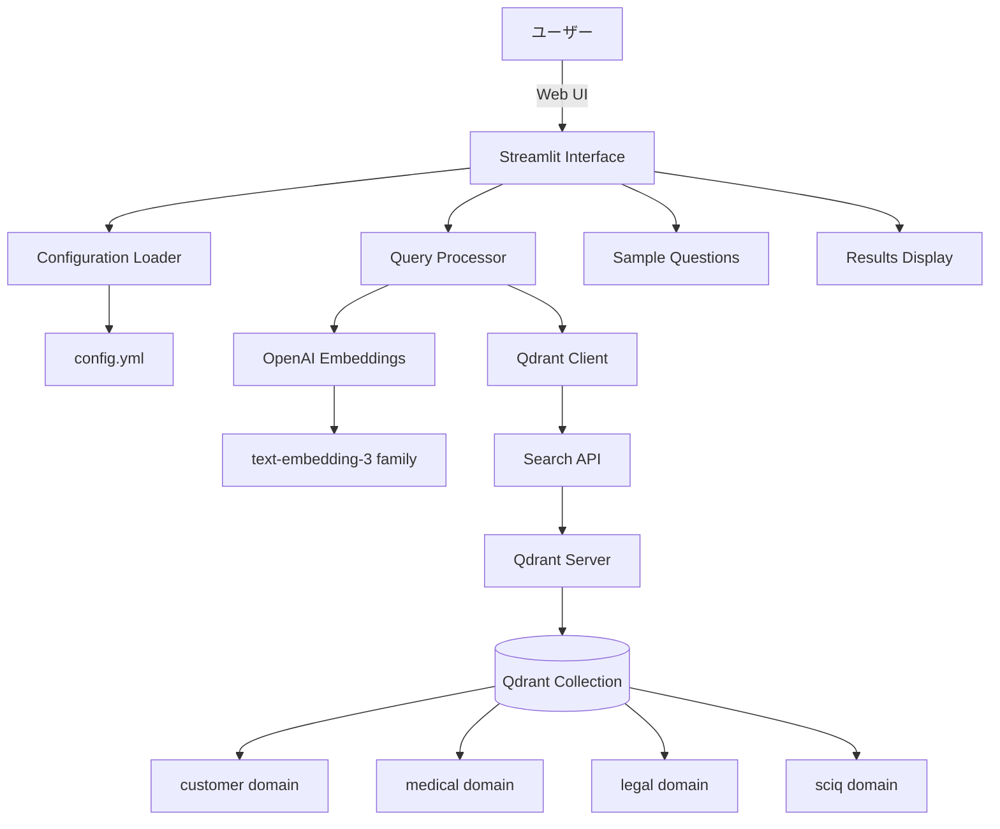
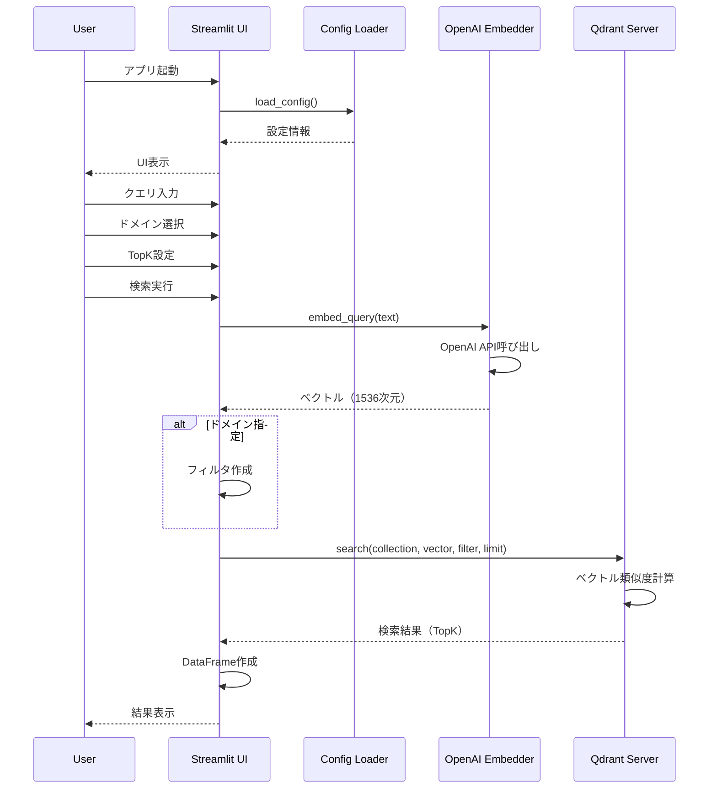
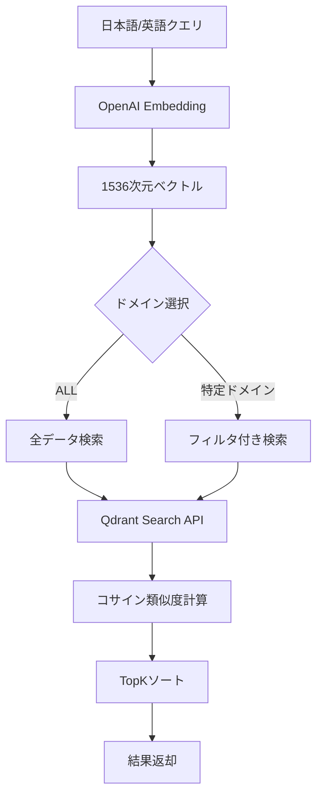

# a50_rag_search_local_qdrant.py 詳細設計書

## 1. 概要書

### 1.1 プログラム名
`a50_rag_search_local_qdrant.py` - Local Qdrant-based RAG検索アプリケーション

### 1.2 目的
ローカルのQdrant Vector Databaseを使用して、多言語対応のベクトル検索を実行し、ドメイン別または横断的な質問応答を提供するStreamlitアプリケーション。

### 1.3 主要機能
- Qdrant Vector Databaseでのベクトル検索（コレクション選択対応）
- ドメイン別フィルタリング（qa_corpus のみ: customer, medical, legal, sciq, trivia）
- ドメイン横断検索（ALL）
- コレクション別の埋め込み設定（例: product_embeddings=384次元, qa_corpus=1536次元）
- TopK設定・スコア表示
- Named Vectors選択（コレクション設定が無い場合に使用）
- 多言語embedding（日本語質問→英語データ検索）
- Qdrant URL上書き入力・Debugモード（payloadプレビュー）
- ドメイン別/製品向けの質問例表示

### 1.4 実行環境
- Python 3.12以上（本リポジトリのガイドライン準拠）
- requirements.txt に準拠（`pip install -r requirements.txt`）
- qdrant-client / Streamlit / OpenAI SDK を使用
- Qdrantサーバー（localhost:6333）

### 1.5 起動方法
```bash
# Qdrantサーバー起動（推奨: docker-compose）
cd docker-compose && docker-compose up -d

# データ登録（事前準備）
python a30_qdrant_registration.py

# アプリケーション起動
streamlit run a50_rag_search_local_qdrant.py --server.port=8504

# （参考）docker 単体起動の代替手段
# docker run -p 6333:6333 qdrant/qdrant
```

## 2. システム構成

### 2.1 アーキテクチャ図



### 2.2 データフロー図



## 3. 設定とデータ構造

### 3.1 設定ファイル（config.yml）

```yaml
rag:
  # 既定コレクション（ドメイン絞りは qa_corpus のみ対応）
  collection: product_embeddings

embeddings:
  primary:
    provider: openai
    model: text-embedding-3-small
    dims: 1536

qdrant:
  url: http://localhost:6333
```

### 3.2 デフォルト設定

```python
DEFAULTS = {
    "rag": {"collection": "product_embeddings"},
    "embeddings": {
        "primary": {
            "provider": "openai",
            "model": "text-embedding-3-small",
            "dims": 1536
        }
    },
    "qdrant": {"url": "http://localhost:6333"},
}

# コレクション毎の埋め込み設定（アプリ側で上書き適用）
COLLECTION_EMBEDDINGS = {
    "product_embeddings": {"model": "text-embedding-3-small", "dims": 384},
    "qa_corpus": {"model": "text-embedding-3-small", "dims": 1536},
}
```

### 3.3 サンプル質問データ構造

```python
SAMPLE_QUESTIONS = {
    "customer": [
        "返金は可能ですか？",
        "配送にはどのくらい時間がかかりますか？",
        "アカウントを作成するにはどうすればよいですか？"
    ],
    "medical": [...],
    "legal": [...],
    "sciq": [...]
}
```

## 4. 関数詳細設計

### 4.1 load_config

```python
def load_config(path="config.yml") -> Dict[str, Any]:
    """
    設定ファイルをロード
    
    Processing:
        1. yamlファイルが存在すれば読み込み
        2. デフォルト設定とマージ（浅いマージ）
        3. 辞書型の値は更新、それ以外は置換
        
    Returns:
        マージされた設定辞書
        
    Error Handling:
        - yamlモジュール不在時はデフォルト使用
        - ファイル不在時はデフォルト使用
    """
```

### 4.2 embed_query

```python
def embed_query(text: str, model: str) -> List[float]:
    """
    テキストをベクトル化
    
    Parameters:
        text: 入力テキスト（日本語/英語）
        model: OpenAI embeddingモデル名
        
    Returns:
        1536次元のfloatリスト
        
    API Call:
        client.embeddings.create(
            model=model, 
            input=[text]
        ).data[0].embedding
        
    Note:
        多言語対応のため、日本語質問も
        英語データと同じベクトル空間で比較可能
    """
```

## 5. UI仕様

### 5.1 画面レイアウト

```
┌──────────────────────────────────────────────┐
│  🔎 Qdrant RAG UI (domain filter / named vectors) │
├────────────┬─────────────────────────────────┤
│            │                                 │
│  Sidebar   │        Main Content Area        │
│            │                                 │
│ Settings:  │  Multi-language Note:           │
│ - Vector   │  ┌───────────────────────┐      │
│ - Domain   │  │ 日英embedding説明      │      │
│ - TopK     │  └───────────────────────┘      │
│ - URL      │                                 │
│            │  Query Input:                   │
│ 💡質問例:   │  ┌───────────────────────┐      │
│ - Q1       │  │ [返金は可能ですか？]   │      │
│ - Q2       │  └───────────────────────┘      │
│ - Q3       │  [Search]                       │
│            │                                 │
│            │  Results:                       │
│            │  ┌───────────────────────┐      │
│            │  │ DataFrame             │      │
│            │  └───────────────────────┘      │
│            │                                 │
│            │  🏆 Highest Score Result        │
│            │                                 │
└────────────┴─────────────────────────────────┘
```

### 5.2 サイドバー設定

#### 5.2.1 基本設定
```python
# コレクション名表示（読み取り専用）
st.write(f"Collection: `{collection}`")

# Named Vector選択
vec_name = st.selectbox(
    "Using vector (named)", 
    options=list(embeddings_cfg.keys())
)

# ドメイン選択（qa_corpus のみ）。trivia を含む
domain = st.selectbox(
    "Domain",
    options=["ALL", "customer", "medical", "legal", "sciq", "trivia"]
)

# TopK設定
topk = st.slider(
    "TopK", 
    min_value=1, 
    max_value=20, 
    value=5, 
    step=1
)
```

注記:
- コレクションに `COLLECTION_EMBEDDINGS` の設定がある場合、埋め込みはその設定（モデル/次元）で実行されます。
- その場合、上記の `vec_name` 選択は表示用で、検索ベクトル生成には使われません（フォールバック時のみ使用）。

#### 5.2.2 質問例表示
```python
if domain != "ALL":
    st.write(f"**{domain.upper()}ドメインの質問例:**")
    for i, question in enumerate(SAMPLE_QUESTIONS.get(domain, []), 1):
        if st.button(f"{i}. {question[:30]}...", key=f"sample_{domain}_{i}"):
            st.session_state['selected_query'] = question
```

### 5.3 メインエリア機能

#### 5.3.1 多言語embedding説明
```python
st.code("""
- OpenAIのembeddingモデルが多言語対応のため、
  日本語質問と英語データが同じベクトル空間で比較可能
- 例: 日本語「返金は可能ですか？」と
  英語「Can I get a refund?」の類似度が0.4957
- 翻訳なしで日英間の意味的検索が実現
""")
```

#### 5.3.2 検索実行
```python
if do_search and query.strip():
    # ベクトル化
    qvec = embed_query(query, model_for_using)
    
    # フィルタ設定
    if domain != "ALL":
        qfilter = models.Filter(
            must=[
                models.FieldCondition(
                    key="domain", 
                    match=models.MatchValue(value=domain)
                )
            ]
        )
    
    # 検索実行
    hits = client.search(
        collection_name=collection,
        query_vector=qvec,
        limit=topk,
        query_filter=qfilter
    )
```

#### 5.3.3 結果表示
```python
# DataFrame形式での表示
rows = []
for h in hits:
    rows.append({
        "score": h.score,
        "domain": h.payload.get("domain"),
        "question": h.payload.get("question"),
        "answer": h.payload.get("answer"),
        "source": h.payload.get("source"),
    })
st.dataframe(pd.DataFrame(rows))

# 最高スコア結果の詳細表示
if rows:
    best_result = max(rows, key=lambda x: x["score"])
    st.subheader("🏆 Highest Score Result")
    st.write(f"**Score:** {best_result['score']:.4f}")
    st.write(f"**Question:** {best_result['question']}")
    st.write(f"**Answer:** {best_result['answer']}")
```

## 6. エラーハンドリング

### 6.1 接続エラー処理

```python
try:
    client.get_collections()
except Exception as conn_err:
    st.error(f"❌ Qdrantサーバーに接続できません: {qdrant_url}")
    st.error("以下を確認してください:")
    st.error("1. Qdrantサーバーが起動しているか確認")
    st.error("2. URLが正しいか確認")
    st.error(f"エラー詳細: {str(conn_err)}")
    st.stop()
```

### 6.2 エラー種別と対処

| エラー種別 | 判定条件 | 対処表示 |
|-----------|---------|----------|
| Connection refused | "Connection refused" in str(e) | Docker起動コマンド表示 |
| Collection not found | "collection" and "not found" in str(e) | a30_qdrant_registration.py実行案内 |
| 一般エラー | その他 | エラー詳細とスタックトレース |

### 6.3 エラー処理実装

```python
except ConnectionRefusedError:
    st.error(f"❌ Qdrantサーバーへの接続が拒否されました")
    st.code("cd docker-compose && docker-compose up -d", language="bash")
    
except Exception as e:
    if "Connection refused" in str(e):
        # 接続拒否の処理
    elif "collection" in str(e).lower() and "not found" in str(e).lower():
        # コレクション不在の処理
    else:
        # 一般エラーの処理
        st.exception(e)
```

## 7. 検索アルゴリズム

### 7.1 ベクトル検索プロセス



### 7.2 フィルタリング仕様

```python
# qa_corpus のみ domain フィルタ対応
if collection == "qa_corpus" and domain != "ALL":
    qfilter = models.Filter(must=[
        models.FieldCondition(key="domain", match=models.MatchValue(value=domain))
    ])
else:
    qfilter = None
```

### 7.3 スコアリング
- コサイン類似度使用（0.0〜1.0）
- 高スコア = 高い意味的類似性
- 日英間でも有効な類似度計算

## 8. データ構造

### 8.1 Qdrant Collection構造

```yaml
collection: qa_corpus  # ドメイン絞り対応（payload.domain あり）
  # または product_embeddings（ドメインなし、一般製品検索用）
vectors:
  size: 1536
  distance: Cosine
  
payload:
  domain: str  # customer, medical, legal, sciq, trivia（qa_corpus のみ）
  question: str
  answer: str
  source: str
```

### 8.2 検索結果構造

```python
{
    "score": float,      # 類似度スコア（0-1）
    "domain": str,       # ドメイン識別子
    "question": str,     # 質問テキスト
    "answer": str,       # 回答テキスト
    "source": str        # ソース情報
}
```

## 9. パフォーマンス最適化

### 9.1 検索最適化
- ベクトルデータ除外（with_vectors=False相当）
- limit設定による結果数制限
- ドメインフィルタによる検索範囲限定

### 9.2 UI最適化
- セッション状態でクエリ管理
- ボタンクリックで質問自動入力
- DataFrameで効率的な結果表示

### 9.3 接続管理
- Qdrantクライアント再利用
- タイムアウト設定（5秒）
- 接続エラーの早期検出

## 10. 使用例

### 10.1 基本的な使用フロー

```
1. Qdrantサーバー確認
   docker ps | grep qdrant

2. アプリ起動
   streamlit run a50_rag_search_local_qdrant.py --server.port=8504

3. ドメイン選択
   サイドバーで "customer" 選択

4. 質問入力
   日本語: "返金は可能ですか？"
   または質問例から選択

5. 検索実行
   [Search] ボタンクリック

6. 結果確認
   - DataFrame形式で結果一覧
   - 最高スコア結果の詳細
```

### 10.2 ドメイン横断検索

```python
# ドメイン: ALL選択
# 質問: "副作用について教えてください"

# 結果: 全ドメインから関連情報検索
# medical ドメインの結果が高スコアで表示される
```

### 10.3 多言語検索例

```python
# 日本語質問
query = "アカウントを作成するには？"
# → 英語データ "How to create an account?" と高い類似度

# 英語質問
query = "How do I reset my password?"
# → 直接英語データとマッチング
```

## 11. トラブルシューティング

### 11.1 よくある問題と解決方法

| 問題 | 原因 | 解決方法 |
|------|------|----------|
| 接続エラー | Qdrant未起動 | docker-compose up -d 実行 |
| コレクション不在 | データ未登録 | a30_qdrant_registration.py実行 |
| 検索結果なし | フィルタ不一致 | ドメイン選択確認 |
| 低スコア | クエリ不適切 | 質問を具体化 |
| OpenAI APIエラー | APIキー未設定 | 環境変数設定 |

### 11.2 デバッグ方法

```python
# Qdrant接続確認
import requests
response = requests.get("http://localhost:6333/collections")
print(response.json())

# ベクトル確認（コレクション別の次元）
vec = embed_query("test", model, dims=COLLECTION_EMBEDDINGS[collection]["dims"])  # 例: 384 or 1536
print(f"Vector dims: {len(vec)}")

# 検索デバッグ
st.write("Query vector:", qvec[:10])  # 最初の10要素
st.write("Filter:", qfilter)
```

## 12. セキュリティ考慮事項

### 12.1 API Key管理
- OpenAI API Keyは環境変数管理
- コード内ハードコード禁止

### 12.2 ネットワークセキュリティ
- Qdrantはlocalhost接続のみ
- 本番環境では認証設定推奨

### 12.3 データ保護
- 検索クエリのログ記録注意
- 個人情報を含む質問の警告

## 13. 制限事項

### 13.1 技術的制限
- 最大TopK: 20件
- ベクトル次元: 1536固定
- 単一コレクションのみ対応

### 13.2 データ制限
- 英語データベース（日本語質問は可能）
- 4ドメインに限定
- Named Vectors未実装（UIのみ）

## 14. 今後の拡張計画

### 14.1 機能拡張
- [ ] 複数コレクション対応
- [ ] Named Vectors完全実装
- [ ] リランキング機能
- [ ] 検索履歴保存
- [ ] バッチ検索対応

### 14.2 UI/UX改善
- [ ] 検索結果のハイライト
- [ ] グラフィカルなスコア表示
- [ ] 音声入力対応
- [ ] 多言語UI対応

### 14.3 性能改善
- [ ] 非同期検索
- [ ] キャッシング機能
- [ ] インデックス最適化
