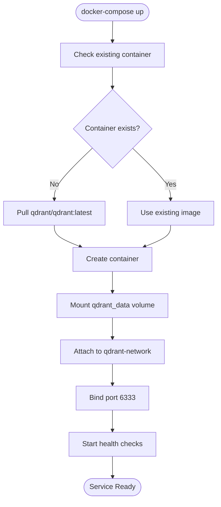

# 📋 docker-compose.yml 設計書

## 📝 目次

1. [📖 概要書](#📖-概要書)
2. [🔧 システム構成](#🔧-システム構成)
3. [📋 サービス定義](#📋-サービス定義)
4. [📑 設定詳細](#📑-設定詳細)
5. [⚙️ 技術仕様](#⚙️-技術仕様)
6. [🚨 エラーハンドリング](#🚨-エラーハンドリング)

---

## 📖 概要書

### 🎯 処理の概要

**Qdrant Vector Database Docker コンテナ構成**

本設定ファイルは、RAGシステムのベクトル検索基盤となるQdrant Vector Databaseを、Dockerコンテナとして構成・管理するための設定定義です。永続化ボリューム、ヘルスチェック、ネットワーク設定を含む本番運用レベルの構成を提供します。

#### 🌟 主要機能

| 機能 | 説明 |
|------|------|
| 🐳 **Dockerコンテナ管理** | Qdrantサービスのコンテナ化とライフサイクル管理 |
| 💾 **データ永続化** | Named Volumeによるベクトルデータの永続保存 |
| 🔍 **ヘルスチェック** | HTTPエンドポイントによる自動健全性監視 |
| 🌐 **ネットワーク隔離** | カスタムネットワークによるセキュアな通信 |
| ⚡ **自動リスタート** | 異常終了時の自動復旧機能 |
| 📡 **API公開** | ポート6333でのHTTP API提供 |

#### 🗃️ サービス構成図


### 🔄 起動フロー



---

## 🔧 システム構成

### 📦 主要コンポーネント


### 📋 コンテナアーキテクチャ


---

## 📋 サービス定義

### 🐳 Qdrantサービス仕様

| 項目 | 設定値 | 説明 | 重要度 |
|------|--------|------|---------|
| `image` | `qdrant/qdrant:latest` | 最新版Qdrantイメージ | ⭐⭐⭐ |
| `container_name` | `qdrant` | コンテナ識別名 | ⭐⭐ |
| `ports` | `6333:6333` | ホスト:コンテナのポートマッピング | ⭐⭐⭐ |
| `restart` | `always` | 自動再起動ポリシー | ⭐⭐⭐ |
| `volumes` | `qdrant_data:/qdrant/storage` | データ永続化マウント | ⭐⭐⭐ |
| `networks` | `qdrant-network` | カスタムネットワーク接続 | ⭐⭐ |

### 🏥 ヘルスチェック設定

| 項目 | 設定値 | 説明 | 重要度 |
|------|--------|------|---------|
| `test` | `curl -f http://localhost:6333/readyz` | 準備状態確認コマンド | ⭐⭐⭐ |
| `interval` | `30s` | チェック間隔 | ⭐⭐ |
| `timeout` | `10s` | タイムアウト時間 | ⭐⭐ |
| `retries` | `5` | 失敗時のリトライ回数 | ⭐⭐ |
| `start_period` | `20s` | 起動猶予時間 | ⭐⭐ |

---

## 📑 設定詳細

### 💾 ボリューム設定

#### 🎯 ボリューム仕様

```yaml
volumes:
  qdrant_data:
    driver: local
    driver_opts:
      type: none
      o: bind
      device: ${PWD}/qdrant_storage  # 環境変数で指定可能
```

#### 📊 データ永続化構造


#### 📂 ボリューム内部構造

```
/qdrant/storage/
├── collections/
│   ├── customer_support/
│   ├── medical_qa/
│   ├── science_qa/
│   └── legal_qa/
├── snapshots/
│   └── backup_*.snapshot
├── wal/
│   └── *.wal
└── config/
    └── config.yaml
```

### 🌐 ネットワーク設定

#### 🎯 ネットワーク仕様

```yaml
networks:
  qdrant-network:
    driver: bridge
    ipam:
      config:
        - subnet: 172.20.0.0/16
          gateway: 172.20.0.1
```

#### 📊 ネットワークトポロジー


---

## ⚙️ 技術仕様

### 📦 依存要件

| コンポーネント | バージョン | 用途 | 重要度 |
|---------------|------------|------|---------|
| `Docker Engine` | 20.10+ | コンテナランタイム | ⭐⭐⭐ |
| `Docker Compose` | 2.0+ | オーケストレーション | ⭐⭐⭐ |
| `Qdrant` | latest | ベクトルデータベース | ⭐⭐⭐ |

### 🗃️ Qdrant API エンドポイント

#### 📋 主要エンドポイント

```yaml
API_Endpoints:
  health:
    - GET /readyz          # 準備状態確認
    - GET /livez           # 生存確認
    - GET /metrics         # メトリクス取得

  collections:
    - GET /collections     # コレクション一覧
    - PUT /collections/{name}  # コレクション作成
    - DELETE /collections/{name}  # コレクション削除

  points:
    - PUT /collections/{name}/points  # ポイント追加
    - POST /collections/{name}/points/search  # 検索実行
    - DELETE /collections/{name}/points  # ポイント削除

  snapshots:
    - POST /collections/{name}/snapshots  # スナップショット作成
    - GET /snapshots  # スナップショット一覧
```

### ⚙️ パフォーマンス設定

#### 🖥️ リソース制限（推奨）

```yaml
services:
  qdrant:
    deploy:
      resources:
        limits:
          cpus: '2.0'
          memory: 4GB
        reservations:
          cpus: '1.0'
          memory: 2GB
```

#### ⚡ 最適化設定

```yaml
environment:
  QDRANT__SERVICE__GRPC_PORT: 6334
  QDRANT__SERVICE__HTTP_PORT: 6333
  QDRANT__SERVICE__MAX_REQUEST_SIZE_MB: 32
  QDRANT__STORAGE__STORAGE_PATH: /qdrant/storage
  QDRANT__STORAGE__OPTIMIZERS_CONFIG__INDEXING_THRESHOLD: 20000
  QDRANT__STORAGE__OPTIMIZERS_CONFIG__MEMMAP_THRESHOLD: 50000
  QDRANT__STORAGE__OPTIMIZERS_CONFIG__PAYLOAD_INDEXING_THRESHOLD: 10000
```

### 🔧 運用コマンド

#### 📡 基本操作

```bash
# サービス起動
docker-compose up -d

# サービス停止
docker-compose down

# ログ確認
docker-compose logs -f qdrant

# コンテナ状態確認
docker-compose ps

# ヘルスチェック確認
docker inspect qdrant --format='{{.State.Health.Status}}'

# ボリューム確認
docker volume inspect docker-compose_qdrant_data

# ネットワーク確認
docker network inspect docker-compose_qdrant-network
```

#### 🔄 メンテナンス操作

```bash
# サービス再起動
docker-compose restart qdrant

# イメージ更新
docker-compose pull
docker-compose up -d

# ボリュームバックアップ
docker run --rm -v docker-compose_qdrant_data:/data \
  -v $(pwd):/backup alpine tar czf /backup/qdrant_backup.tar.gz -C /data .

# ボリューム復元
docker run --rm -v docker-compose_qdrant_data:/data \
  -v $(pwd):/backup alpine tar xzf /backup/qdrant_backup.tar.gz -C /data
```

---

## 🚨 エラーハンドリング

### 🐳 Docker関連エラー

| エラー種別 | 原因 | 対処法 | 影響度 |
|-----------|------|--------|---------|
| **Docker未インストール** | 🐳 Dockerがインストールされていない | Docker Desktopインストール指示 | 🔴 高 |
| **Docker未起動** | 🚫 Dockerデーモンが起動していない | Docker起動指示 | 🔴 高 |
| **ポート競合** | 🔌 6333ポートが使用中 | 使用プロセス確認・停止 | 🟡 中 |
| **権限エラー** | 🔒 Docker権限不足 | sudoまたはDockerグループ追加 | 🟡 中 |

### 💾 ボリューム関連エラー

| エラー種別 | 原因 | 対処法 | 影響度 |
|-----------|------|--------|---------|
| **ディスク容量不足** | 💾 ホストのディスク容量不足 | 容量確認・不要データ削除 | 🔴 高 |
| **マウントエラー** | 📁 ボリュームマウント失敗 | ボリューム再作成・権限確認 | 🟡 中 |
| **データ破損** | 🔨 ボリュームデータ破損 | バックアップから復元 | 🔴 高 |
| **権限エラー** | 🔐 ボリュームアクセス権限不足 | chown/chmod実行 | 🟡 中 |

### 🌐 ネットワーク関連エラー

| エラー種別 | 原因 | 対処法 | 影響度 |
|-----------|------|--------|---------|
| **ネットワーク作成失敗** | 🌐 ネットワーク名競合 | 既存ネットワーク削除・名前変更 | 🟡 中 |
| **接続エラー** | 🔌 コンテナ間通信失敗 | ネットワーク設定確認 | 🟡 中 |
| **DNS解決エラー** | 📡 コンテナ名解決失敗 | Docker DNS確認・再起動 | 🟠 低 |
| **ポートフォワードエラー** | 🚫 ポート転送失敗 | ファイアウォール設定確認 | 🟡 中 |

### 🏥 ヘルスチェック関連エラー

| エラー種別 | 原因 | 対処法 | 影響度 |
|-----------|------|--------|---------|
| **起動タイムアウト** | ⏱️ start_period内に起動完了せず | start_period延長 | 🟡 中 |
| **ヘルスチェック失敗** | ❌ /readyzエンドポイント応答なし | Qdrantログ確認・再起動 | 🟡 中 |
| **過度なリトライ** | 🔄 retries超過 | retries値増加・根本原因調査 | 🟡 中 |
| **curlコマンドなし** | 🚫 コンテナ内にcurl未インストール | wgetまたは別の方法に変更 | 🟠 低 |

### 🛠️ トラブルシューティング手順

#### 🔍 診断フロー


#### ✅ 確認コマンド集

```bash
# Docker状態確認
docker info
docker version

# ポート使用状況確認
lsof -i :6333  # macOS/Linux
netstat -an | grep 6333  # Windows

# コンテナログ詳細確認
docker logs qdrant --tail 100 --follow

# コンテナ内部調査
docker exec -it qdrant /bin/bash

# ヘルスステータス詳細
docker inspect qdrant | jq '.[0].State.Health'

# リソース使用状況
docker stats qdrant --no-stream

# ネットワーク診断
docker network inspect qdrant-network
docker exec qdrant ping -c 3 google.com
```

---

## 🎉 まとめ

この設計書は、**docker-compose.yml** によるQdrant Vector Databaseのコンテナ構成を完全に文書化したものです。

### 🌟 設計のハイライト

- **🐳 完全コンテナ化**: Dockerによる環境独立性と移植性
- **💾 データ永続化**: Named Volumeによる安全なデータ保存
- **🏥 自動健全性監視**: ヘルスチェックによる可用性向上
- **🌐 ネットワーク隔離**: セキュアな通信環境の実現
- **⚡ 自動復旧**: restart: alwaysによる高可用性

### 🔧 運用上の利点

- **簡単な起動**: `docker-compose up -d` 一発起動
- **環境統一**: 開発・本番環境の一貫性
- **スケーラビリティ**: リソース制限による予測可能な動作
- **保守性**: ログ・メトリクスによる監視容易性

### 📈 RAGシステムでの役割

- **ベクトル検索基盤**: 高速類似検索エンジン
- **マルチコレクション対応**: 複数ドメインのデータ管理
- **API統合**: RESTful APIによる言語非依存アクセス
- **永続化保証**: システム再起動後のデータ保持

### 🚀 今後の拡張可能性

- 🔄 レプリケーション構成（高可用性）
- 📊 Prometheusメトリクス統合
- 🔐 TLS/SSL暗号化通信
- ⚡ クラスタリング構成
- 📈 自動バックアップ機能
- 🔧 環境別設定の外部化