# 📋 helper_api.py 設計書

## 📝 目次

1. [📖 概要書](#📖-概要書)
2. [🔧 システム構成](#🔧-システム構成)
3. [📋 関数一覧](#📋-関数一覧)
4. [📑 関数詳細設計](#📑-関数詳細設計)
5. [⚙️ 技術仕様](#⚙️-技術仕様)
6. [🚨 エラーハンドリング](#🚨-エラーハンドリング)

---

## 📖 概要書

### 🎯 処理の概要

**OpenAI API関連とコア機能ライブラリ**

helper_api.pyは、OpenAI APIとの連携を行うアプリケーション向けの包括的なコア機能ライブラリです。API通信、設定管理、キャッシング、エラーハンドリング、メッセージ管理など、OpenAI APIを活用したアプリケーション開発に必要な基盤機能を統一的に提供します。

#### 🌟 主要機能カテゴリ

| カテゴリ | 機能群 | 説明 |
|---------|--------|------|
| ⚙️ **設定管理** | ConfigManager | YAML設定ファイル・環境変数による統一設定管理 |
| 💾 **キャッシュシステム** | MemoryCache | メモリベースキャッシュによる効率化 |
| 📊 **JSON処理** | safe_json_* | OpenAI APIレスポンス対応の安全なJSON処理 |
| 🔧 **デコレータ** | error_handler・timer・cache_result | 横断的機能の効率的な適用 |
| 💬 **メッセージ管理** | MessageManager | 会話履歴・デフォルトプロンプト管理 |
| 🔢 **トークン管理** | TokenManager | 精密なトークン計算・コスト推定 |
| 📋 **レスポンス処理** | ResponseProcessor | APIレスポンスの安全な処理・保存 |
| 🤖 **APIクライアント** | OpenAIClient | Responses API・Chat Completions API統一クライアント |

#### 🔄 API処理フロー

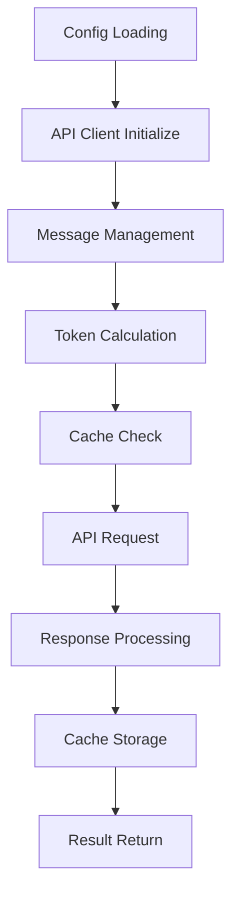

### 🔄 主要処理の流れ（OpenAI API連携）

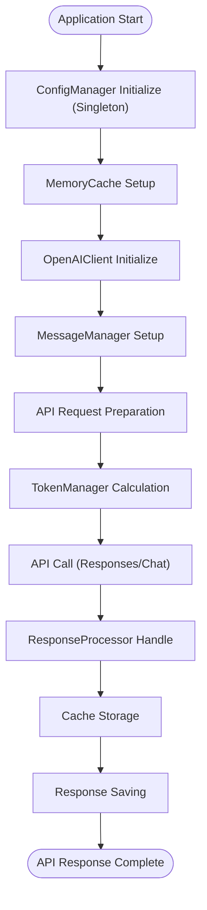

---

## 🔧 システム構成

### 📦 主要コンポーネント

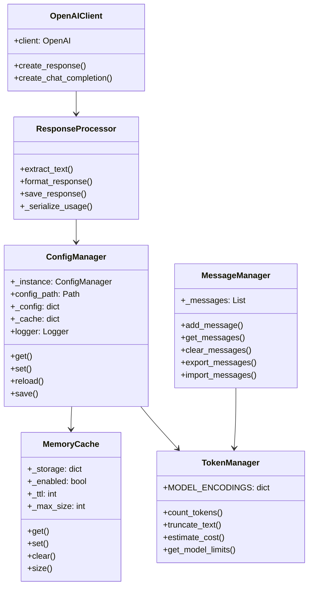

### 📋 データフロー（API処理）

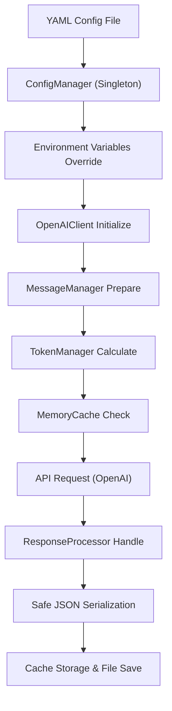

---

## 📋 関数一覧

### ⚙️ 設定管理クラス

| 関数名 | 分類 | 処理概要 | 重要度 |
|--------|------|----------|---------|
| `ConfigManager.__new__()` | 🏗️ 生成 | シングルトンパターンでインスタンス管理 | ⭐⭐⭐ |
| `ConfigManager.__init__()` | 🎛️ 初期化 | 設定ファイル読み込み・ロガー設定 | ⭐⭐⭐ |
| `ConfigManager.get()` | 📊 取得 | ドット記法による設定値取得（キャッシュ付き） | ⭐⭐⭐ |
| `ConfigManager.set()` | ✏️ 設定 | 設定値の動的更新・キャッシュクリア | ⭐⭐ |
| `ConfigManager.reload()` | 🔄 再読込 | 設定ファイルの再読み込み | ⭐⭐ |
| `ConfigManager.save()` | 💾 保存 | 設定のYAMLファイル保存 | ⭐⭐ |
| `ConfigManager._load_config()` | 📥 内部 | YAML設定ファイル読み込み処理 | ⭐⭐⭐ |
| `ConfigManager._apply_env_overrides()` | 🔄 内部 | 環境変数による設定オーバーライド | ⭐⭐⭐ |
| `ConfigManager._get_default_config()` | 🏭 内部 | デフォルト設定の生成 | ⭐⭐ |

### 💾 キャッシュシステム

| 関数名 | 分類 | 処理概要 | 重要度 |
|--------|------|----------|---------|
| `MemoryCache.get()` | 📊 取得 | TTL付きキャッシュ値取得 | ⭐⭐⭐ |
| `MemoryCache.set()` | 💾 設定 | サイズ制限付きキャッシュ保存 | ⭐⭐⭐ |
| `MemoryCache.clear()` | 🗑️ クリア | 全キャッシュクリア | ⭐⭐ |
| `MemoryCache.size()` | 📏 サイズ | 現在のキャッシュサイズ取得 | ⭐ |

### 📊 JSON処理関数

| 関数名 | 分類 | 処理概要 | 重要度 |
|--------|------|----------|---------|
| `safe_json_serializer()` | 🔄 変換 | OpenAI APIオブジェクト対応シリアライザー | ⭐⭐⭐ |
| `safe_json_dumps()` | 📄 出力 | 安全なJSON文字列化（フォールバック付き） | ⭐⭐⭐ |

### 🔧 デコレータ関数

| 関数名 | 分類 | 処理概要 | 重要度 |
|--------|------|----------|---------|
| `error_handler()` | 🛡️ エラー | API用エラーハンドリングデコレータ | ⭐⭐⭐ |
| `timer()` | ⏱️ 計測 | 実行時間計測デコレータ | ⭐⭐ |
| `cache_result()` | 💾 キャッシュ | 結果キャッシュデコレータ（メモリベース） | ⭐⭐⭐ |

### 💬 メッセージ管理クラス

| 関数名 | 分類 | 処理概要 | 重要度 |
|--------|------|----------|---------|
| `MessageManager.add_message()` | ➕ 追加 | メッセージ履歴への安全な追加 | ⭐⭐⭐ |
| `MessageManager.get_messages()` | 📊 取得 | メッセージ履歴のコピー取得 | ⭐⭐⭐ |
| `MessageManager.clear_messages()` | 🗑️ クリア | メッセージ履歴のリセット | ⭐⭐ |
| `MessageManager.export_messages()` | 📤 エクスポート | メッセージ履歴のJSON出力 | ⭐⭐ |
| `MessageManager.import_messages()` | 📥 インポート | メッセージ履歴のJSON読み込み | ⭐⭐ |
| `MessageManager.get_default_messages()` | 🏭 デフォルト | デフォルトメッセージの生成 | ⭐⭐ |

### 🔢 トークン管理クラス

| 関数名 | 分類 | 処理概要 | 重要度 |
|--------|------|----------|---------|
| `TokenManager.count_tokens()` | 🔢 計算 | 精密なトークン数計算（tiktoken使用） | ⭐⭐⭐ |
| `TokenManager.truncate_text()` | ✂️ 切り詰め | 指定トークン数でのテキスト切り詰め | ⭐⭐⭐ |
| `TokenManager.estimate_cost()` | 💰 推定 | モデル別API使用コスト推定 | ⭐⭐⭐ |
| `TokenManager.get_model_limits()` | 📊 制限 | モデル別トークン制限取得 | ⭐⭐⭐ |

### 📋 レスポンス処理クラス

| 関数名 | 分類 | 処理概要 | 重要度 |
|--------|------|----------|---------|
| `ResponseProcessor.extract_text()` | 📝 抽出 | Responseオブジェクトからテキスト抽出 | ⭐⭐⭐ |
| `ResponseProcessor.format_response()` | 🎨 整形 | レスポンスのJSON serializable変換 | ⭐⭐⭐ |
| `ResponseProcessor.save_response()` | 💾 保存 | レスポンスのファイル保存（タイムスタンプ付き） | ⭐⭐ |
| `ResponseProcessor._serialize_usage()` | 🔄 内部 | ResponseUsageオブジェクトの辞書変換 | ⭐⭐⭐ |

### 🤖 APIクライアントクラス

| 関数名 | 分類 | 処理概要 | 重要度 |
|--------|------|----------|---------|
| `OpenAIClient.create_response()` | 🆕 API | Responses API呼び出し（新旧仕様対応） | ⭐⭐⭐ |
| `OpenAIClient.create_chat_completion()` | 💬 API | Chat Completions API呼び出し | ⭐⭐⭐ |

### 🔧 ユーティリティ関数

| 関数名 | 分類 | 処理概要 | 重要度 |
|--------|------|----------|---------|
| `sanitize_key()` | 🔤 変換 | キー文字列の安全化（正規表現） | ⭐⭐ |
| `load_json_file()` | 📥 読込 | 安全なJSONファイル読み込み | ⭐⭐ |
| `save_json_file()` | 💾 保存 | 安全なJSONファイル保存 | ⭐⭐ |
| `format_timestamp()` | 📅 変換 | タイムスタンプの標準フォーマット | ⭐ |
| `create_session_id()` | 🆔 生成 | ユニークなセッションID生成 | ⭐ |

### 🏭 デフォルトプロンプト関数

| 関数名 | 分類 | 処理概要 | 重要度 |
|--------|------|----------|---------|
| `get_default_messages()` | 📝 生成 | デフォルトメッセージセットの生成 | ⭐⭐ |
| `append_user_message()` | ➕ 追加 | ユーザーメッセージ追加版の生成 | ⭐⭐ |
| `append_developer_message()` | ➕ 追加 | 開発者メッセージ追加版の生成 | ⭐⭐ |
| `append_assistant_message()` | ➕ 追加 | アシスタントメッセージ追加版の生成 | ⭐⭐ |

---

## 📑 関数詳細設計

### ⚙️ ConfigManager.__new__()

#### 🎯 処理概要
シングルトンパターンによるConfigManagerインスタンスの一意性保証

#### 📊 処理の流れ
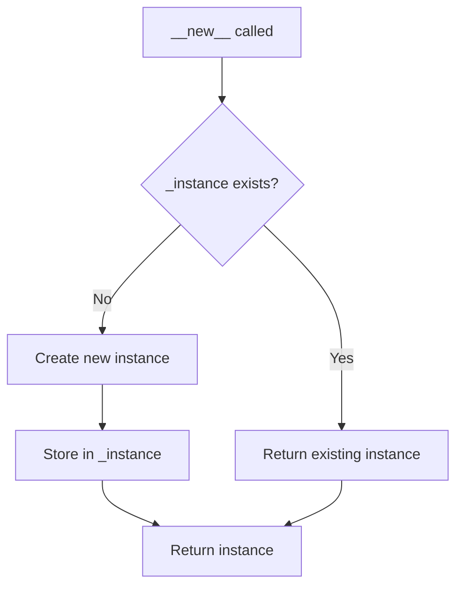

#### 📋 IPO設計

| 項目 | 内容 |
|------|------|
| **INPUT** | `cls: type` - ConfigManagerクラス<br>`config_path: str = "config.yml"` - 設定ファイルパス |
| **PROCESS** | インスタンス存在確認 → 新規作成または既存返却 |
| **OUTPUT** | `ConfigManager` - シングルトンインスタンス |

#### 🔧 シングルトンパターン実装

```python
def __new__(cls, config_path: str = "config.yml"):
    if cls._instance is None:
        cls._instance = super().__new__(cls)
    return cls._instance
```

---

### 📊 ConfigManager.get()

#### 🎯 処理概要
ドット記法による階層設定値の取得（キャッシュ機能付き）

#### 📊 処理の流れ
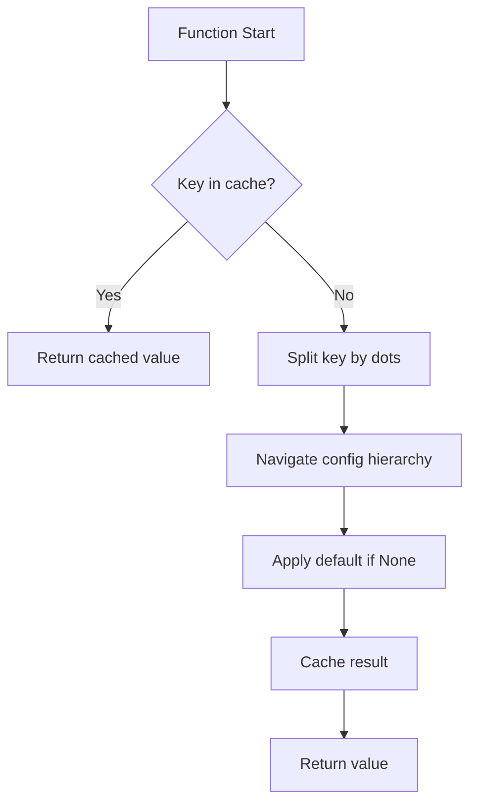

#### 📋 IPO設計

| 項目 | 内容 |
|------|------|
| **INPUT** | `key: str` - ドット記法設定キー（例: "api.timeout"）<br>`default: Any = None` - デフォルト値 |
| **PROCESS** | キャッシュ確認 → 階層ナビゲーション → デフォルト適用 → キャッシュ保存 |
| **OUTPUT** | `Any` - 設定値またはデフォルト値 |

#### 🔍 設定値取得例

```python
# 設定ファイル例
api:
  timeout: 30
  max_retries: 3
  openai_api_key: null

# 取得例
timeout = config.get("api.timeout", 60)          # → 30
api_key = config.get("api.openai_api_key", "")   # → ""
unknown = config.get("unknown.setting", "default") # → "default"
```

---

### 💾 MemoryCache.get()

#### 🎯 処理概要
TTL（Time To Live）機能付きメモリキャッシュからの値取得

#### 📊 処理の流れ
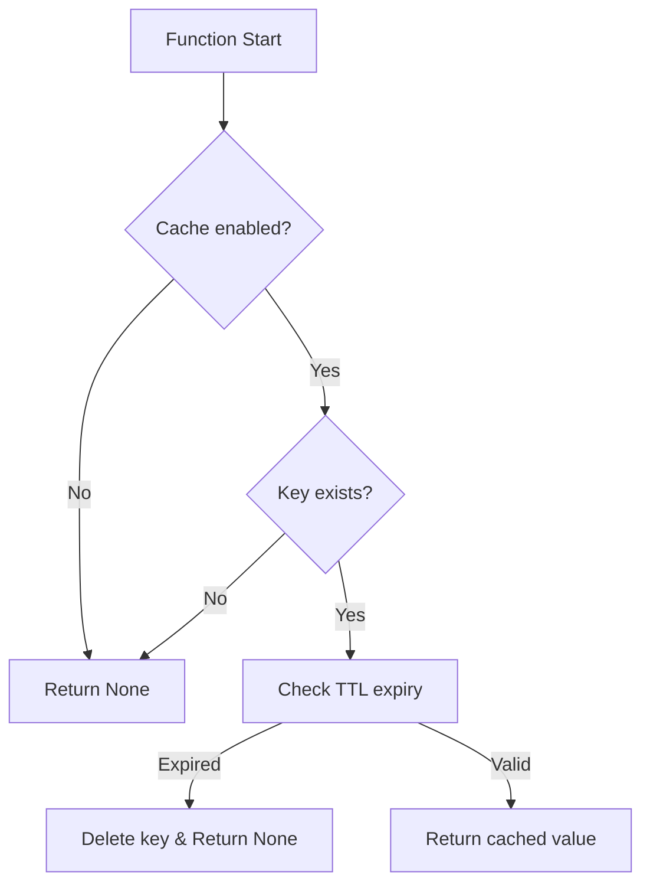

#### 📋 IPO設計

| 項目 | 内容 |
|------|------|
| **INPUT** | `key: str` - キャッシュキー |
| **PROCESS** | 有効性確認 → TTL期限確認 → 値返却/削除 |
| **OUTPUT** | `Any | None` - キャッシュ値またはNone |

#### 🔧 TTL管理機能

```python
# キャッシュ構造
_storage = {
    "key": {
        "result": "cached_value",
        "timestamp": 1640995200.0
    }
}

# TTL確認
if time.time() - cached_data['timestamp'] > self._ttl:
    del self._storage[key]
    return None
```

---

### 📊 safe_json_serializer()

#### 🎯 処理概要
OpenAI APIレスポンスオブジェクト対応のカスタムJSONシリアライザー

#### 📊 処理の流れ
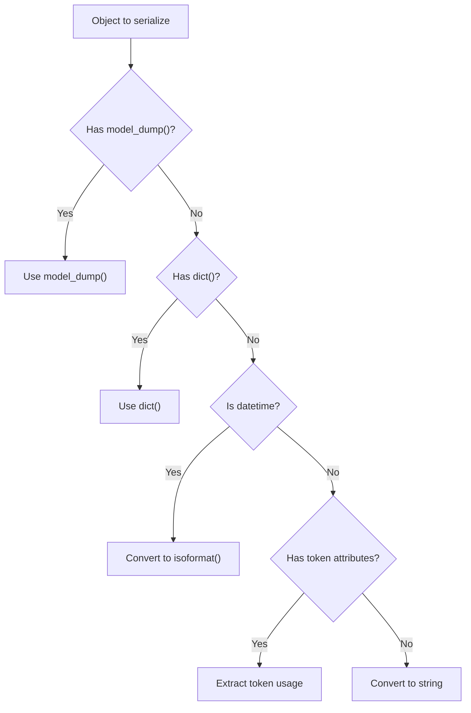

#### 📋 IPO設計

| 項目 | 内容 |
|------|------|
| **INPUT** | `obj: Any` - シリアライズ対象オブジェクト |
| **PROCESS** | オブジェクト型判定 → 適切な変換方法選択 → 辞書/文字列変換 |
| **OUTPUT** | `Any` - JSON serializable オブジェクト |

#### 🔧 対応オブジェクト種別

```python
対応パターン:
1. Pydantic Model: obj.model_dump()
2. Dict Protocol: obj.dict()
3. Datetime: obj.isoformat()
4. OpenAI ResponseUsage: 手動属性抽出
   {
       'prompt_tokens': obj.prompt_tokens,
       'completion_tokens': obj.completion_tokens,
       'total_tokens': obj.total_tokens
   }
5. その他: str(obj)
```

---

### 🔧 error_handler()

#### 🎯 処理概要
API用エラーハンドリングデコレータ（例外再発生型）

#### 📊 処理の流れ
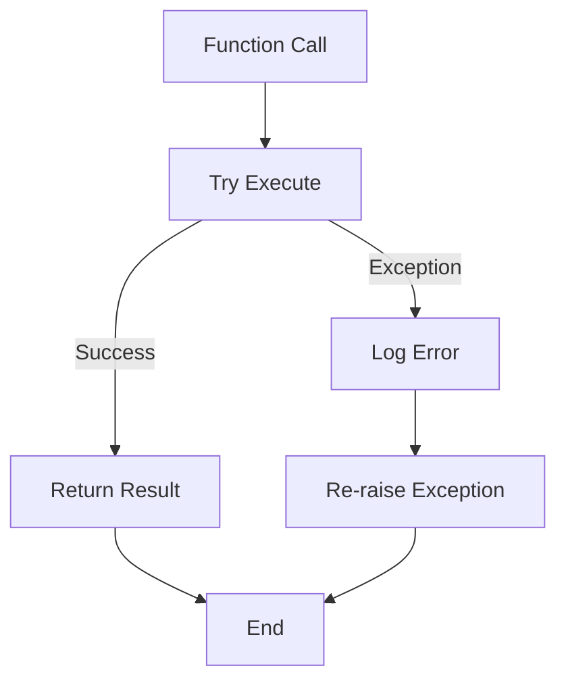

#### 📋 IPO設計

| 項目 | 内容 |
|------|------|
| **INPUT** | `func: Callable` - デコレート対象関数 |
| **PROCESS** | 関数実行 → 例外キャッチ → ログ出力 → 例外再発生 |
| **OUTPUT** | `Callable` - エラーハンドリング付き関数 |

#### 🛡️ エラーハンドリング戦略

```python
@error_handler
def api_function():
    # API処理
    pass

# 自動適用される処理:
try:
    return api_function()
except Exception as e:
    logger.error(f"Error in api_function: {str(e)}")
    raise  # API用では例外を再発生
```

---

### ⏱️ timer()

#### 🎯 処理概要
関数実行時間の計測・ログ出力デコレータ

#### 📊 処理の流れ
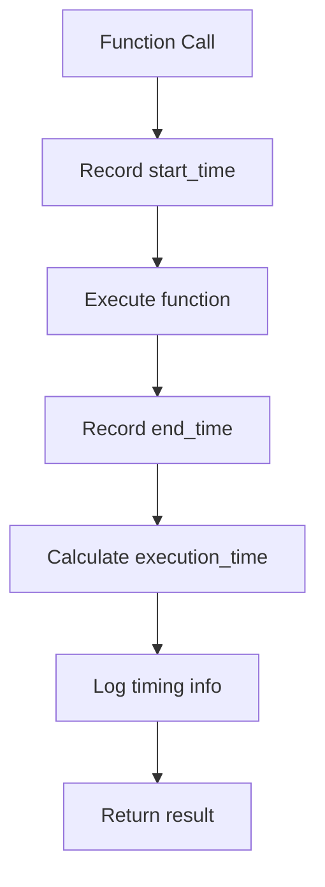

#### 📋 IPO設計

| 項目 | 内容 |
|------|------|
| **INPUT** | `func: Callable` - 計測対象関数 |
| **PROCESS** | 開始時刻記録 → 関数実行 → 終了時刻記録 → 実行時間計算・ログ |
| **OUTPUT** | `Callable` - 実行時間計測付き関数 |

#### ⏱️ パフォーマンス監視

```python
@timer
def slow_api_call():
    # 重い処理
    pass

# ログ出力例:
# INFO - slow_api_call took 2.34 seconds
```

---

### 💾 cache_result()

#### 🎯 処理概要
関数結果のメモリキャッシュ化デコレータ

#### 📊 処理の流れ
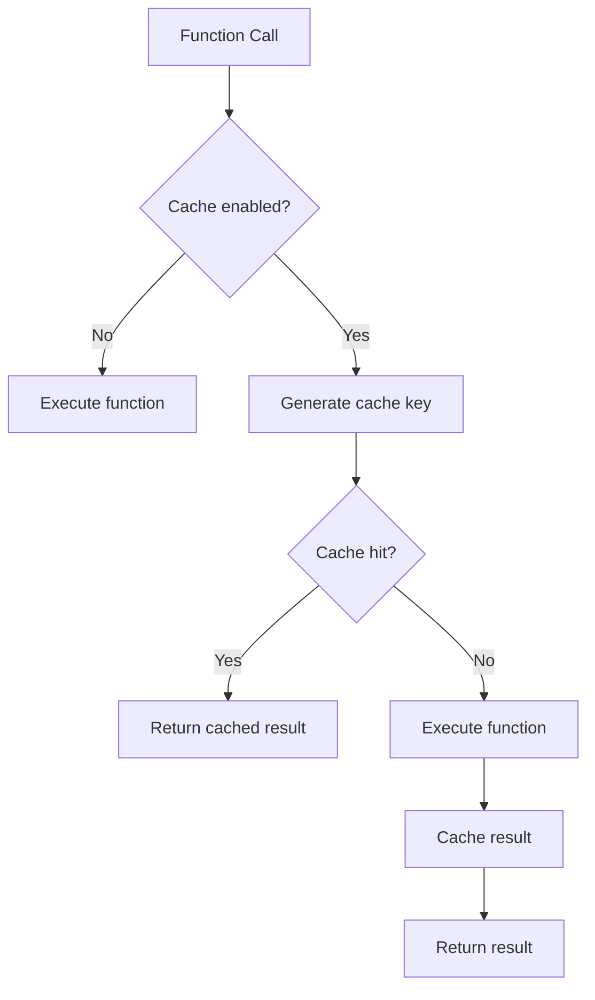

#### 📋 IPO設計

| 項目 | 内容 |
|------|------|
| **INPUT** | `ttl: int = None` - TTL設定（未使用）<br>`func: Callable` - キャッシュ対象関数 |
| **PROCESS** | キャッシュキー生成 → キャッシュ確認 → 関数実行/キャッシュ返却 |
| **OUTPUT** | `Callable` - キャッシュ機能付き関数 |

#### 🔑 キャッシュキー生成

```python
# キャッシュキー生成ロジック
cache_key = f"{func.__name__}_{hashlib.md5(str(args).encode() + str(kwargs).encode()).hexdigest()}"

# 例: get_user_data(123, active=True)
# → "get_user_data_a1b2c3d4e5f6..."
```

---

### 💬 MessageManager.add_message()

#### 🎯 処理概要
メッセージ履歴への安全な追加（型検証・制限管理付き）

#### 📊 処理の流れ
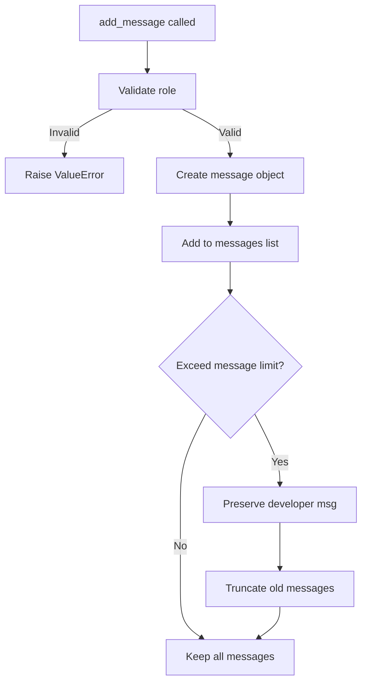

#### 📋 IPO設計

| 項目 | 内容 |
|------|------|
| **INPUT** | `role: RoleType` - メッセージ役割<br>`content: str` - メッセージ内容 |
| **PROCESS** | 役割検証 → メッセージ作成 → 追加 → 制限確認 → 必要に応じて切り詰め |
| **OUTPUT** | `None` - 副作用としてメッセージ履歴更新 |

#### 🎭 役割検証・制限管理

```python
valid_roles: List[RoleType] = ["user", "assistant", "system", "developer"]

# メッセージ制限管理
limit = config.get("api.message_limit", 50)
if len(self._messages) > limit:
    # 最初のdeveloperメッセージは保持
    developer_msg = self._messages[0] if self._messages[0]['role'] == 'developer' else None
    self._messages = self._messages[-limit:]
    if developer_msg and self._messages[0]['role'] != 'developer':
        self._messages.insert(0, developer_msg)
```

---

### 🔢 TokenManager.count_tokens()

#### 🎯 処理概要
tiktokenライブラリを使用した精密なトークン数計算

#### 📊 処理の流れ
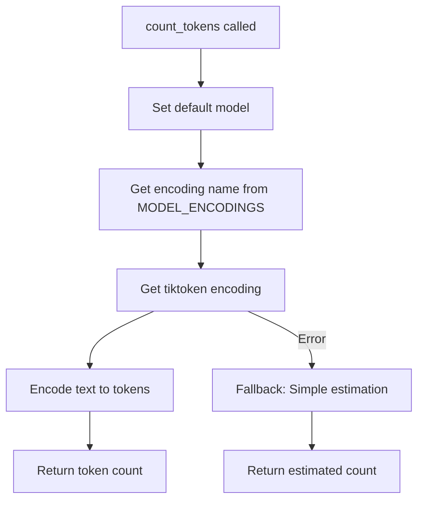

#### 📋 IPO設計

| 項目 | 内容 |
|------|------|
| **INPUT** | `text: str` - トークン計算対象テキスト<br>`model: str = None` - 使用モデル名 |
| **PROCESS** | モデル確認 → エンコーディング取得 → tiktoken計算 → フォールバック対応 |
| **OUTPUT** | `int` - 精密なトークン数 |

#### 🎯 モデル対応・フォールバック

```python
MODEL_ENCODINGS = {
    "gpt-4o": "cl100k_base",
    "gpt-4o-mini": "cl100k_base",
    "gpt-4.1": "cl100k_base",
    "gpt-4.1-mini": "cl100k_base",
    "o1": "cl100k_base",
    # ... 他のモデル
}

# フォールバック計算
try:
    enc = tiktoken.get_encoding(encoding_name)
    return len(enc.encode(text))
except Exception:
    # 簡易推定（1文字 = 0.5トークン）
    return len(text) // 2
```

---

### 📋 ResponseProcessor.extract_text()

#### 🎯 処理概要
OpenAI Responses APIレスポンスからテキスト内容の抽出

#### 📊 処理の流れ
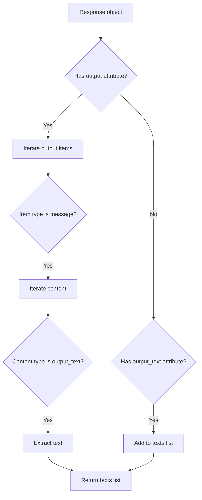

#### 📋 IPO設計

| 項目 | 内容 |
|------|------|
| **INPUT** | `response: Response` - OpenAI Responses APIレスポンス |
| **PROCESS** | 階層構造ナビゲーション → テキスト要素抽出 → リスト集約 |
| **OUTPUT** | `List[str]` - 抽出されたテキストリスト |

#### 🔍 レスポンス構造解析

```python
# Responses API構造
response.output[i].content[j].text
                    ↓
# 抽出対象：type="output_text" のテキスト

# フォールバック
response.output_text  # 直接属性がある場合
```

---

### 🤖 OpenAIClient.create_response()

#### 🎯 処理概要
Responses API呼び出し（新旧パラメータ仕様対応）

#### 📊 処理の流れ
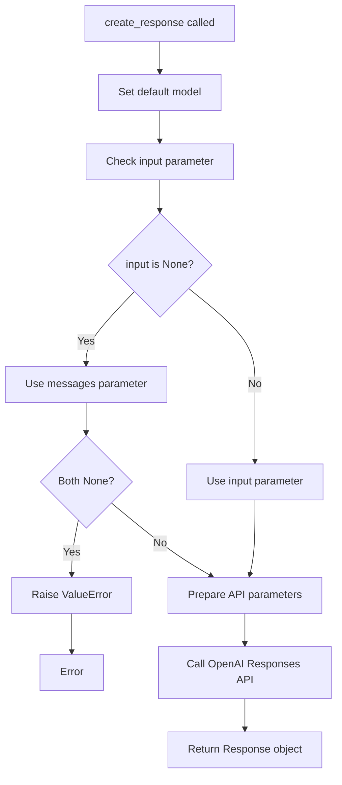

#### 📋 IPO設計

| 項目 | 内容 |
|------|------|
| **INPUT** | `messages: List[EasyInputMessageParam] = None` - 旧仕様<br>`input: List[EasyInputMessageParam] = None` - 新仕様<br>`model: str = None` - 使用モデル<br>`**kwargs` - その他APIパラメータ |
| **PROCESS** | パラメータ統一 → モデル設定 → API呼び出し |
| **OUTPUT** | `Response` - OpenAI Responses APIレスポンス |

#### 🔄 新旧仕様対応

```python
# 新旧両方の引数名をサポート
if input is None:
    input = messages  # 旧仕様 → 新仕様変換
if input is None:
    raise ValueError("messages or input must be provided")

params = {
    "model": model,
    "input": input,  # 統一後のパラメータ
}
```

---

## ⚙️ 技術仕様

### 📦 依存ライブラリ

| ライブラリ | バージョン | 用途 | 重要度 |
|-----------|-----------|------|---------|
| `openai` | 最新 | 🤖 OpenAI API公式クライアント | ⭐⭐⭐ |
| `tiktoken` | 最新 | 🔢 精密なトークン計算 | ⭐⭐⭐ |
| `yaml` | 最新 | ⚙️ 設定ファイル処理 | ⭐⭐⭐ |
| `re` | 標準 | 🔤 正規表現処理 | ⭐⭐ |
| `time` | 標準 | ⏰ 時間処理・TTL管理 | ⭐⭐⭐ |
| `json` | 標準 | 📋 JSON処理 | ⭐⭐⭐ |
| `logging` | 標準 | 📝 ログ管理 | ⭐⭐⭐ |
| `os` | 標準 | 🔧 環境変数・OS操作 | ⭐⭐ |
| `pathlib` | 標準 | 📁 パス操作 | ⭐⭐ |
| `dataclasses` | 標準 | 📊 データクラス定義 | ⭐ |
| `functools` | 標準 | 🔧 関数デコレータ | ⭐⭐ |
| `datetime` | 標準 | 📅 日時処理 | ⭐⭐ |
| `abc` | 標準 | 🏗️ 抽象基底クラス | ⭐ |
| `hashlib` | 標準 | 🔐 ハッシュ計算 | ⭐⭐ |

### 🤖 OpenAI API対応仕様

#### 📋 対応API

```yaml
Supported_APIs:
  responses_api:
    description: "OpenAI Responses API (新仕様)"
    method: "client.responses.create()"
    input_format: "List[EasyInputMessageParam]"
    backward_compatibility: "messages parameter支援"

  chat_completions_api:
    description: "OpenAI Chat Completions API"
    method: "client.chat.completions.create()"
    input_format: "List[ChatCompletionMessageParam]"
    features: "標準的な会話API"
```

#### 🎭 メッセージ型定義

```python
# Responses API用
EasyInputMessageParam: 新仕様メッセージ型
ResponseInputTextParam: テキスト入力型
ResponseInputImageParam: 画像入力型

# Chat Completions API用
ChatCompletionSystemMessageParam: システムメッセージ
ChatCompletionUserMessageParam: ユーザーメッセージ
ChatCompletionAssistantMessageParam: アシスタントメッセージ

# 役割型
RoleType = Literal["user", "assistant", "system", "developer"]
```

### ⚙️ 設定管理仕様

#### 📄 設定ファイル構造（config.yml）

```yaml
models:
  default: "gpt-4o-mini"
  available: ["gpt-4o-mini", "gpt-4o", "gpt-4.1", "gpt-4.1-mini"]

api:
  timeout: 30
  max_retries: 3
  openai_api_key: null  # 環境変数から取得

ui:
  page_title: "OpenAI API Demo"
  page_icon: "🤖"
  layout: "wide"

cache:
  enabled: true
  ttl: 3600
  max_size: 100

logging:
  level: "INFO"
  format: "%(asctime)s - %(name)s - %(levelname)s - %(message)s"
  file: null
  max_bytes: 10485760
  backup_count: 5

error_messages:
  general_error: "エラーが発生しました"
  api_key_missing: "APIキーが設定されていません"
  network_error: "ネットワークエラーが発生しました"

experimental:
  debug_mode: false
  performance_monitoring: true
```

#### 🔧 環境変数オーバーライド

```yaml
Environment_Variables:
  OPENAI_API_KEY: "api.openai_api_key"
  LOG_LEVEL: "logging.level"
  DEBUG_MODE: "experimental.debug_mode"
```

### 💾 キャッシュシステム仕様

#### 🔧 キャッシュ設定

```yaml
Cache_Configuration:
  type: "Memory-based"
  ttl: 3600  # seconds
  max_size: 100  # entries
  eviction_policy: "LRU (oldest timestamp)"
  storage_format:
    key: "function_name_hash"
    value:
      result: "Any"
      timestamp: "float"
```

#### 📊 キャッシュキー生成

```python
キャッシュキー生成ロジック:
1. 関数名取得: func.__name__
2. 引数ハッシュ化: hashlib.md5(str(args) + str(kwargs))
3. 結合: f"{function_name}_{hash}"

例: get_completion(model="gpt-4o", temp=0.7)
→ "get_completion_a1b2c3d4e5f6789..."
```

### 🔢 トークン管理仕様

#### 📋 モデル対応表

```yaml
Model_Encodings:
  gpt-4o: "cl100k_base"
  gpt-4o-mini: "cl100k_base"
  gpt-4o-audio-preview: "cl100k_base"
  gpt-4o-mini-audio-preview: "cl100k_base"
  gpt-4.1: "cl100k_base"
  gpt-4.1-mini: "cl100k_base"
  o1: "cl100k_base"
  o1-mini: "cl100k_base"
  o3: "cl100k_base"
  o3-mini: "cl100k_base"
  o4: "cl100k_base"
  o4-mini: "cl100k_base"
```

#### 💰 料金計算仕様

```python
料金計算ロジック:
input_cost = (input_tokens / 1000) * model_pricing["input"]
output_cost = (output_tokens / 1000) * model_pricing["output"]
total_cost = input_cost + output_cost

# モデル料金は設定ファイルまたはAppConfigから取得
```

### 📊 レスポンス処理仕様

#### 🔄 JSON シリアライゼーション

```yaml
Serialization_Rules:
  pydantic_model: "obj.model_dump()"
  dict_protocol: "obj.dict()"
  datetime_object: "obj.isoformat()"
  openai_usage: "manual_attribute_extraction"
  fallback: "str(obj)"
```

#### 💾 レスポンス保存

```yaml
Response_Save_Format:
  filename: "response_{timestamp}.json"
  directory: "logs/"
  structure:
    id: "response.id"
    model: "response.model"
    created_at: "response.created_at"
    text: "List[extracted_text]"
    usage: "serialized_usage_object"
```

---

## 🚨 エラーハンドリング

### 📋 エラーカテゴリ

#### ⚙️ 設定関連エラー

| エラー種別 | 原因 | 対処法 | 影響度 |
|-----------|------|--------|---------|
| **設定ファイル不在** | 📄 config.ymlファイルなし | デフォルト設定で動作継続・警告表示 | 🟡 中 |
| **YAML形式エラー** | 🔤 不正なYAML記法 | デフォルト設定フォールバック・エラー詳細表示 | 🟡 中 |
| **APIキー未設定** | 🔑 環境変数・設定ファイル両方なし | 明確なエラーメッセージ・設定指示 | 🔴 高 |
| **設定値型エラー** | 🔢 期待しない型の設定値 | デフォルト値使用・警告ログ | 🟠 低 |

#### 🤖 API関連エラー

| エラー種別 | 原因 | 対処法 | 影響度 |
|-----------|------|--------|---------|
| **認証エラー** | 🔑 不正なAPIキー | APIキー確認指示・例外再発生 | 🔴 高 |
| **ネットワークエラー** | 🌐 接続・タイムアウト | リトライ機能・ネットワーク確認指示 | 🟡 中 |
| **APIレート制限** | ⏱️ OpenAIレート制限到達 | 適切な待機時間・指数バックオフ | 🟡 中 |
| **無効なリクエスト** | 📋 パラメータ・形式エラー | パラメータ検証・詳細エラー情報 | 🟡 中 |
| **モデル不存在** | 🤖 指定モデル利用不可 | モデル一覧表示・代替提案 | 🟡 中 |

#### 💾 データ処理関連エラー

| エラー種別 | 原因 | 対処法 | 影響度 |
|-----------|------|--------|---------|
| **JSON処理エラー** | 📋 シリアライゼーション失敗 | safe_json_serializer使用・フォールバック | 🟡 中 |
| **ファイルI/Oエラー** | 📁 権限・存在・容量エラー | 権限確認・パス検証・容量確認 | 🟡 中 |
| **メモリ不足** | 💾 大量データ処理 | キャッシュクリア・チャンク処理提案 | 🟡 中 |
| **エンコーディングエラー** | 🔤 文字コード問題 | UTF-8強制・エラー詳細表示 | 🟠 低 |

#### 🔧 システム関連エラー

| エラー種別 | 原因 | 対処法 | 影響度 |
|-----------|------|--------|---------|
| **ライブラリ不在** | 📦 必要ライブラリ未インストール | インストール指示・依存関係確認 | 🔴 高 |
| **Python環境エラー** | 🐍 互換性・バージョン問題 | 環境確認指示・要件表示 | 🔴 高 |
| **権限エラー** | 🔒 ファイル・ディレクトリ権限不足 | 権限設定指示・代替パス提案 | 🟡 中 |

### 🛠️ エラーハンドリング戦略

#### 🔧 段階的エラー処理

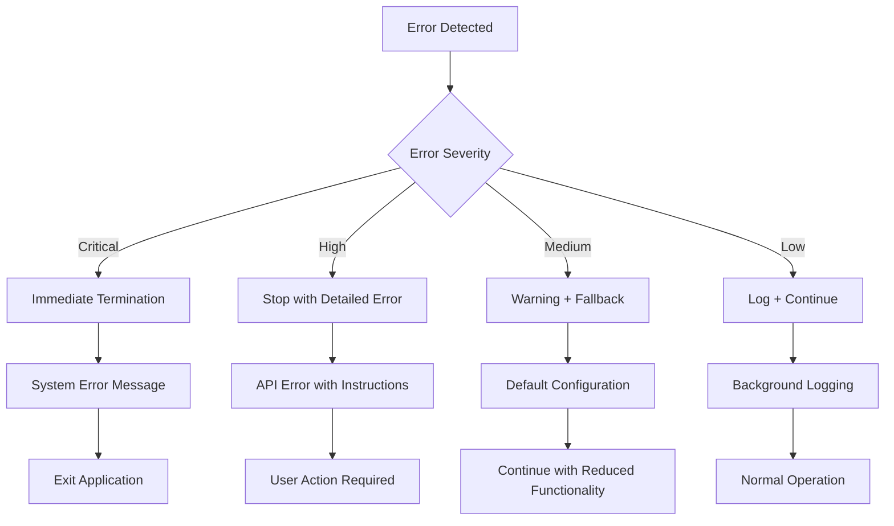

#### 🎯 デコレータ別エラー処理

```python
# API用エラーハンドリング（例外再発生）
@error_handler
def api_function():
    pass
# → ログ出力 + 例外再発生（呼び出し元で処理）

# 一般用エラーハンドリング（None返却）
@safe_execute  # helper_rag.py版
def safe_function():
    pass
# → ログ出力 + None返却（処理継続）

# キャッシュ機能（エラー時はキャッシュ無効化）
@cache_result()
def cached_function():
    pass
# → エラー時は関数を直接実行
```

#### ✅ 適切なエラーメッセージ例

```python
# 設定関連エラー
logger.error("設定ファイルの読み込みに失敗: config.yml")
print("デフォルト設定で動作を継続します")

# API関連エラー
logger.error(f"OpenAI API エラー: {str(e)}")
raise ValueError("APIキーが正しく設定されているか確認してください")

# データ処理エラー
logger.error(f"JSON serialization error: {e}")
# フォールバック処理で継続

# システム関連エラー
logger.error(f"必要ライブラリが不足: {missing_lib}")
raise ImportError(f"pip install {missing_lib} を実行してください")
```

#### 🚨 フォールバック戦略

```python
fallback_strategies = {
    "config_loading": {
        "action": "Use hardcoded defaults",
        "message": "設定ファイル不在 → デフォルト設定で動作"
    },
    "api_key_missing": {
        "action": "Raise clear error with instructions",
        "message": "環境変数 OPENAI_API_KEY を設定してください"
    },
    "tiktoken_error": {
        "action": "Simple character-based estimation",
        "message": "tiktoken失敗 → 簡易推定に切り替え"
    },
    "json_serialization": {
        "action": "Convert to string representation",
        "message": "複雑オブジェクト → 文字列変換で保存"
    },
    "cache_failure": {
        "action": "Disable caching, direct execution",
        "message": "キャッシュ無効化 → 直接実行で継続"
    },
    "network_timeout": {
        "action": "Retry with exponential backoff",
        "message": "ネットワーク再試行 → 指数バックオフ"
    }
}
```

#### 📊 ログレベル別処理

```yaml
Log_Level_Strategy:
  CRITICAL:
    action: "System termination"
    notification: "Immediate alert"
    example: "OpenAI library not installed"

  ERROR:
    action: "Function failure"
    notification: "Error message display"
    example: "API authentication failed"

  WARNING:
    action: "Fallback execution"
    notification: "Warning display"
    example: "Config file not found, using defaults"

  INFO:
    action: "Normal operation"
    notification: "Progress logging"
    example: "API request completed in 2.3s"

  DEBUG:
    action: "Detailed tracing"
    notification: "Development logging"
    example: "Cache hit for key: user_123"
```

#### 🔄 リトライ機構

```python
retry_configuration = {
    "api_requests": {
        "max_retries": 3,
        "backoff_factor": 2,
        "retry_conditions": ["NetworkError", "TimeoutError", "RateLimitError"]
    },
    "file_operations": {
        "max_retries": 2,
        "backoff_factor": 1,
        "retry_conditions": ["PermissionError", "IOError"]
    },
    "json_operations": {
        "max_retries": 1,
        "backoff_factor": 1,
        "retry_conditions": ["UnicodeDecodeError"]
    }
}
```

---

## 🎉 まとめ

この設計書は、**helper_api.py** の包括的な技術仕様と実装詳細を記載した完全なドキュメントです。

### 🌟 設計のハイライト

- **🤖 OpenAI API特化**: Responses API・Chat Completions API完全対応
- **⚙️ シングルトン設定管理**: YAML設定ファイル・環境変数統合管理
- **💾 効率的キャッシング**: TTL・サイズ制限付きメモリキャッシュ
- **🛡️ 堅牢なエラー処理**: 段階的エラーハンドリング・フォールバック戦略
- **🔢 精密トークン管理**: tiktoken使用・モデル対応・コスト推定

### 🔧 アーキテクチャ特徴

- **📦 モジュール化設計**: 機能別クラス・責務分離・再利用性
- **🎯 デコレータ活用**: 横断的関心事の効率的適用
- **🔄 後方互換性**: 新旧API仕様両対応・段階的移行支援
- **📊 JSON安全処理**: OpenAI独特オブジェクトの完全対応

### 📈 OpenAI API最適化機能

- **🎭 メッセージ管理**: 役割検証・履歴制限・デフォルトプロンプト
- **⏱️ パフォーマンス監視**: 実行時間計測・キャッシュ効率化
- **💰 コスト管理**: 精密なトークン計算・料金推定
- **📋 レスポンス処理**: 構造化データ抽出・安全保存

### 🚀 今後の拡張可能性

- 🔄 ストリーミングAPI対応
- 📊 高度な分析・監視機能
- 🌐 分散キャッシュ対応
- 📱 モバイル環境最適化
- 🔐 セキュリティ強化機能
