# 📋 helper_rag.py 設計書

## 📝 目次

1. [📖 概要書](#📖-概要書)
2. [🔧 システム構成](#🔧-システム構成)
3. [📋 関数一覧](#📋-関数一覧)
4. [📑 関数詳細設計](#📑-関数詳細設計)
5. [⚙️ 技術仕様](#⚙️-技術仕様)
6. [🚨 エラーハンドリング](#🚨-エラーハンドリング)

---

## 📖 概要書

### 🎯 処理の概要

**RAGデータ前処理の共通機能ライブラリ**

helper_rag.pyは、RAG（Retrieval-Augmented Generation）用データの前処理を行う複数のStreamlitアプリケーション間で共有される共通機能ライブラリです。複数のデータセット（カスタマーサポートFAQ、医療QA、科学技術QA、法律判例QA）に対応した統一的なインターフェースを提供し、効率的なRAGデータ前処理を実現します。

#### 🌟 主要機能カテゴリ

| カテゴリ | 機能群 | 説明 |
|---------|--------|------|
| 🎛️ **設定管理** | AppConfig・RAGConfig | OpenAIモデル設定・データセット設定の一元管理 |
| 🎨 **UI共通機能** | select_model・show_model_info | Streamlit UI コンポーネントの標準化 |
| 📄 **データ処理** | load_dataset・process_rag_data | CSV読み込み・前処理の共通化 |
| 🔢 **トークン管理** | TokenManager・estimate_token_usage | トークン計算・コスト推定 |
| 💾 **ファイル保存** | save_files_to_output・create_download_data | 処理結果の標準的な保存機能 |
| 🔧 **ユーティリティ** | safe_execute・setup_page_config | エラーハンドリング・ページ設定 |

#### 🔄 共通処理フロー

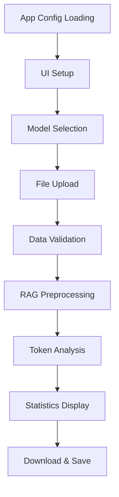

### 🔄 主要処理の流れ（共通機能として）

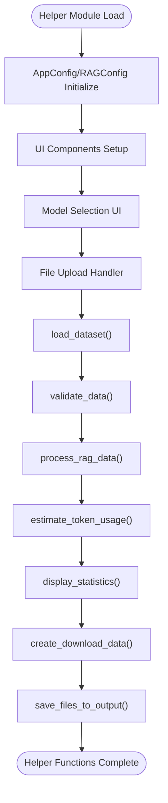

---

## 🔧 システム構成

### 📦 主要コンポーネント

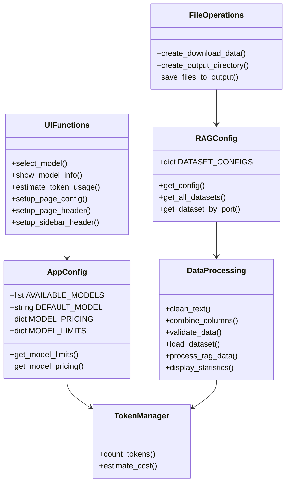

### 📋 データフロー（共通処理）

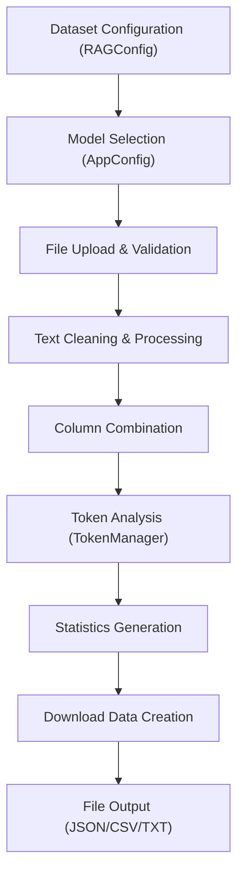

---

## 📋 関数一覧

### 🎛️ 設定管理クラス

| 関数名 | 分類 | 処理概要 | 重要度 |
|--------|------|----------|---------|
| `AppConfig.get_model_limits()` | ⚙️ 設定 | モデル別制限（最大トークン数）取得 | ⭐⭐⭐ |
| `AppConfig.get_model_pricing()` | 💰 設定 | モデル別料金情報取得 | ⭐⭐⭐ |
| `RAGConfig.get_config()` | 📊 設定 | データセット別設定取得 | ⭐⭐⭐ |
| `RAGConfig.get_all_datasets()` | 📋 設定 | 全データセットリスト取得 | ⭐⭐ |
| `RAGConfig.get_dataset_by_port()` | 🔍 設定 | ポート番号からデータセット特定 | ⭐⭐ |

### 🔢 トークン管理クラス

| 関数名 | 分類 | 処理概要 | 重要度 |
|--------|------|----------|---------|
| `TokenManager.count_tokens()` | 🔢 計算 | テキストのトークン数推定 | ⭐⭐⭐ |
| `TokenManager.estimate_cost()` | 💰 計算 | API使用コスト推定 | ⭐⭐⭐ |

### 🎨 UI関数群

| 関数名 | 分類 | 処理概要 | 重要度 |
|--------|------|----------|---------|
| `select_model()` | 🤖 UI | モデル選択セレクトボックス表示 | ⭐⭐⭐ |
| `show_model_info()` | 📊 UI | 選択モデルの詳細情報表示 | ⭐⭐⭐ |
| `estimate_token_usage()` | 🔢 UI | トークン使用量・コスト推定表示 | ⭐⭐⭐ |
| `setup_page_config()` | 🎨 UI | Streamlitページ設定初期化 | ⭐⭐ |
| `setup_page_header()` | 🎨 UI | ページヘッダー設定 | ⭐⭐ |
| `setup_sidebar_header()` | 🎨 UI | サイドバーヘッダー設定 | ⭐⭐ |

### 📄 データ処理関数群

| 関数名 | 分類 | 処理概要 | 重要度 |
|--------|------|----------|---------|
| `clean_text()` | 🧹 処理 | テキストクレンジング（改行・空白正規化） | ⭐⭐⭐ |
| `combine_columns()` | 🔗 処理 | データセット対応の列結合処理 | ⭐⭐⭐ |
| `validate_data()` | ✅ 検証 | データ品質検証・統計情報生成 | ⭐⭐⭐ |
| `load_dataset()` | 📥 処理 | CSVファイル読み込み・基本検証 | ⭐⭐⭐ |
| `process_rag_data()` | ⚙️ 処理 | RAG用データ前処理パイプライン | ⭐⭐⭐ |
| `display_statistics()` | 📊 表示 | 処理前後統計情報表示 | ⭐⭐⭐ |

### 💾 ファイル操作関数群

| 関数名 | 分類 | 処理概要 | 重要度 |
|--------|------|----------|---------|
| `create_download_data()` | 📦 作成 | ダウンロード用データ作成（CSV・TXT） | ⭐⭐⭐ |
| `create_output_directory()` | 📁 作成 | OUTPUTディレクトリ作成・権限確認 | ⭐⭐ |
| `save_files_to_output()` | 💾 保存 | 処理済みデータの標準的な保存 | ⭐⭐⭐ |

### 🔧 ユーティリティ関数

| 関数名 | 分類 | 処理概要 | 重要度 |
|--------|------|----------|---------|
| `safe_execute()` | 🛡️ デコレータ | エラーハンドリングデコレータ | ⭐⭐⭐ |
| `show_usage_instructions()` | 📖 説明 | データセット別使用方法説明表示 | ⭐⭐ |

---

## 📑 関数詳細設計

### 🎛️ AppConfig.get_model_limits()

#### 🎯 処理概要
指定されたOpenAIモデルのトークン制限（最大入力・出力トークン数）を取得

#### 📊 処理の流れ
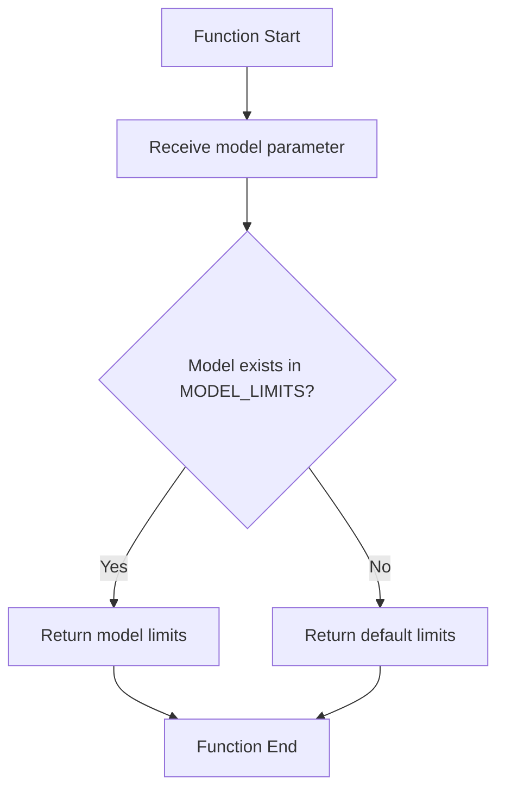

#### 📋 IPO設計

| 項目 | 内容 |
|------|------|
| **INPUT** | `model: str` - OpenAIモデル名 |
| **PROCESS** | MODEL_LIMITS辞書から該当モデルの制限を検索 |
| **OUTPUT** | `Dict[str, int]` - {"max_tokens": int, "max_output": int} |

#### 📊 対応モデル詳細

```python
MODEL_LIMITS = {
    "gpt-4o": {"max_tokens": 128000, "max_output": 4096},
    "gpt-4o-mini": {"max_tokens": 128000, "max_output": 4096},
    "gpt-4.1": {"max_tokens": 128000, "max_output": 4096},
    "gpt-4.1-mini": {"max_tokens": 128000, "max_output": 4096},
    "o1": {"max_tokens": 128000, "max_output": 32768},
    "o1-mini": {"max_tokens": 128000, "max_output": 65536},
    "o3": {"max_tokens": 200000, "max_output": 100000},
    "o3-mini": {"max_tokens": 200000, "max_output": 100000},
    "o4": {"max_tokens": 256000, "max_output": 128000},
    "o4-mini": {"max_tokens": 256000, "max_output": 128000},
}
```

---

### 📊 RAGConfig.get_config()

#### 🎯 処理概要
データセットタイプに応じた設定情報（必須列・アイコン・説明等）を取得

#### 📊 処理の流れ
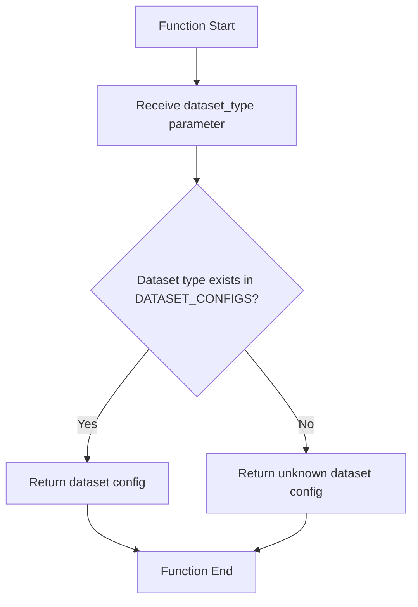

#### 📋 IPO設計

| 項目 | 内容 |
|------|------|
| **INPUT** | `dataset_type: str` - データセットタイプ識別子 |
| **PROCESS** | DATASET_CONFIGS辞書から該当データセット設定を検索 |
| **OUTPUT** | `Dict[str, Any]` - データセット設定情報 |

#### 📊 対応データセット

```python
DATASET_CONFIGS = {
    "customer_support_faq": {
        "name": "カスタマーサポート・FAQ",
        "icon": "💬",
        "required_columns": ["question", "answer"],
        "description": "カスタマーサポートFAQデータセット",
        "combine_template": "{question} {answer}",
        "port": 8501
    },
    "medical_qa": {
        "name": "医療QAデータ",
        "icon": "🏥",
        "required_columns": ["Question", "Complex_CoT", "Response"],
        "description": "医療質問回答データセット",
        "combine_template": "{question} {complex_cot} {response}",
        "port": 8503
    }
    # 他のデータセット設定...
}
```

---

### 🔢 TokenManager.count_tokens()

#### 🎯 処理概要
テキストのトークン数を簡易推定（日本語・英語文字数ベース）

#### 📊 処理の流れ
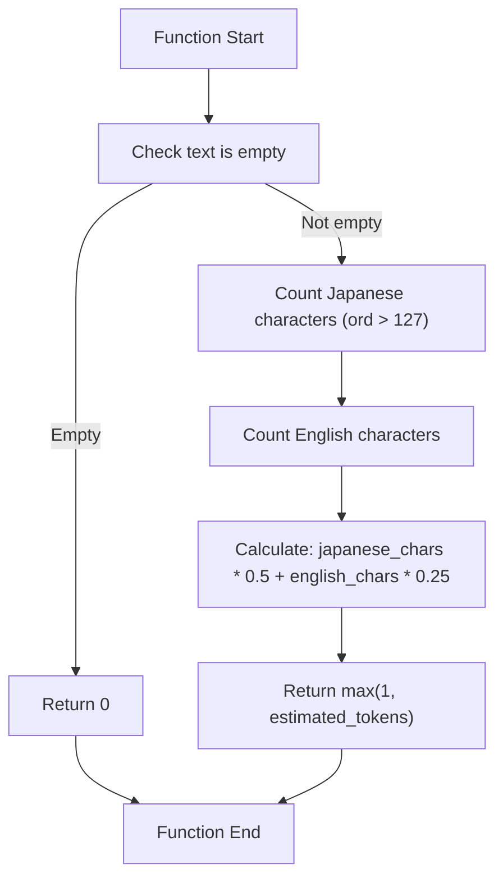

#### 📋 IPO設計

| 項目 | 内容 |
|------|------|
| **INPUT** | `text: str` - トークン数を計算するテキスト<br>`model: str = None` - モデル名（現在未使用） |
| **PROCESS** | 文字種別カウント → 重み付け計算 → 最小値保証 |
| **OUTPUT** | `int` - 推定トークン数 |

#### 🔍 推定アルゴリズム

```python
推定式:
japanese_chars = len([c for c in text if ord(c) > 127])
english_chars = len(text) - japanese_chars
estimated_tokens = int(japanese_chars * 0.5 + english_chars * 0.25)
return max(1, estimated_tokens)
```

---

### 🤖 select_model()

#### 🎯 処理概要
OpenAIモデル選択用のStreamlitセレクトボックスUI表示

#### 📊 処理の流れ
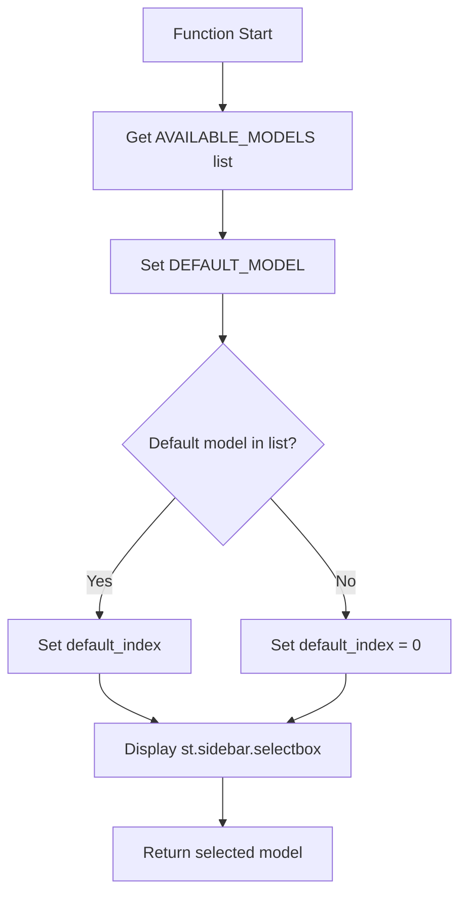

#### 📋 IPO設計

| 項目 | 内容 |
|------|------|
| **INPUT** | `key: str = "model_selection"` - Streamlit コンポーネントキー |
| **PROCESS** | モデルリスト取得 → デフォルト設定 → セレクトボックス表示 |
| **OUTPUT** | `str` - 選択されたモデル名 |

#### 🎨 UI仕様

```python
st.sidebar.selectbox(
    "🤖 モデルを選択",
    models,
    index=default_index,
    key=key,
    help="利用するOpenAIモデルを選択してください"
)
```

---

### 🧹 clean_text()

#### 🎯 処理概要
RAG用テキストの標準的なクレンジング（改行・空白・引用符の正規化）

#### 📊 処理の流れ
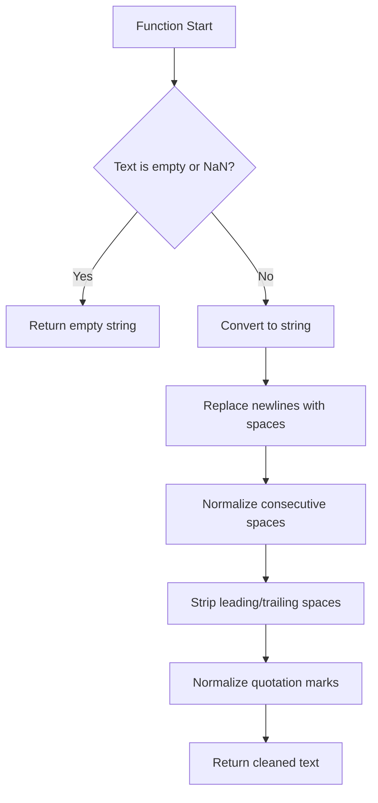

#### 📋 IPO設計

| 項目 | 内容 |
|------|------|
| **INPUT** | `text: str` - クレンジング対象テキスト |
| **PROCESS** | 改行除去 → 空白正規化 → 引用符正規化 → トリム |
| **OUTPUT** | `str` - クレンジング済みテキスト |

#### 🔧 クレンジング処理詳細

```python
処理ステップ:
1. 改行・復帰文字を空白に変換: '\n', '\r' → ' '
2. 連続空白を単一空白に統一: r'\s+' → ' '
3. 先頭・末尾空白を除去: strip()
4. 引用符の正規化:
   - '"' , '"' → '"'
   - ''' , ''' → "'"
```

---

### 🔗 combine_columns()

#### 🎯 処理概要
データセット対応の複数列結合（RAG用自然文作成）

#### 📊 処理の流れ
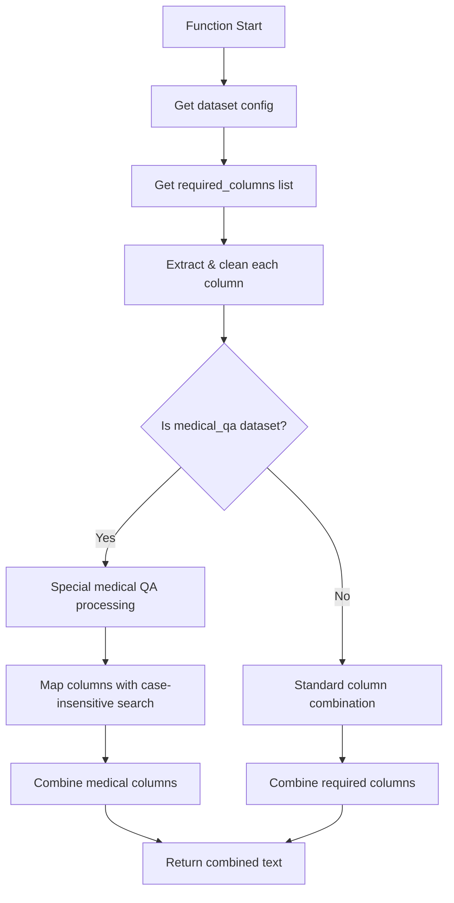

#### 📋 IPO設計

| 項目 | 内容 |
|------|------|
| **INPUT** | `row: pd.Series` - データフレーム行<br>`dataset_type: str` - データセット識別子 |
| **PROCESS** | 設定取得 → 列抽出・クリーニング → データセット別結合 |
| **OUTPUT** | `str` - 結合済みテキスト |

#### 🔍 データセット別処理

##### 🏥 医療QA特別処理
```python
# 大文字小文字を考慮した列名マッピング
medical_cols = {}
for col in row.index:
    col_lower = col.lower()
    if 'question' in col_lower:
        medical_cols['question'] = clean_text(str(row.get(col, '')))
    elif 'complex_cot' in col_lower or 'cot' in col_lower:
        medical_cols['complex_cot'] = clean_text(str(row.get(col, '')))
    elif 'response' in col_lower:
        medical_cols['response'] = clean_text(str(row.get(col, '')))
```

##### 💬 標準処理
```python
# 設定された required_columns を順序通りに結合
cleaned_values = []
for col in required_columns:
    if col in row.index:
        value = row.get(col, '')
        cleaned_text = clean_text(str(value))
        if cleaned_text:
            cleaned_values.append(cleaned_text)
```

---

### ✅ validate_data()

#### 🎯 処理概要
データセット対応の品質検証・統計情報生成

#### 📊 処理の流れ
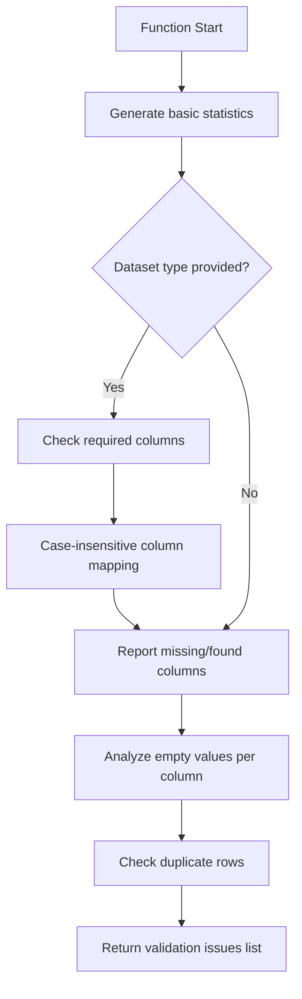

#### 📋 IPO設計

| 項目 | 内容 |
|------|------|
| **INPUT** | `df: pd.DataFrame` - 検証対象データフレーム<br>`dataset_type: str = None` - データセット識別子 |
| **PROCESS** | 基本統計 → 必須列確認 → 空値分析 → 重複確認 |
| **OUTPUT** | `List[str]` - 検証結果メッセージリスト |

#### 📊 検証項目詳細

```python
検証項目:
1. 基本統計: 総行数, 総列数
2. 必須列確認: データセット別必須列の存在確認
3. 空値分析: 各列の空値数・割合
4. 重複行確認: 完全重複行の検出

出力例:
[
    "総行数: 1,500",
    "総列数: 3",
    "✅ 必須列確認済み: ['question', 'answer']",
    "question列: 空値 5個 (0.3%)",
    "answer列: 空値 12個 (0.8%)",
    "✅ 重複行なし"
]
```

---

### ⚙️ process_rag_data()

#### 🎯 処理概要
RAG用データの包括的前処理パイプライン実行

#### 📊 処理の流れ
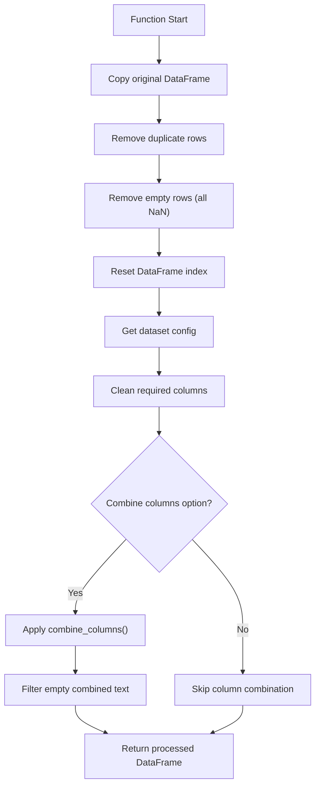

#### 📋 IPO設計

| 項目 | 内容 |
|------|------|
| **INPUT** | `df: pd.DataFrame` - 元データフレーム<br>`dataset_type: str` - データセット識別子<br>`combine_columns_option: bool = True` - 列結合オプション |
| **PROCESS** | 重複除去 → 空行除去 → クレンジング → 列結合 → フィルタリング |
| **OUTPUT** | `pd.DataFrame` - 前処理済みデータフレーム |

#### 🔧 前処理ステップ詳細

```python
前処理パイプライン:
1. データコピー: df.copy()
2. 重複除去: drop_duplicates()
3. 空行除去: dropna(how='all')
4. インデックスリセット: reset_index(drop=True)
5. 列クレンジング: clean_text() 各必須列に適用
6. 列結合: combine_columns() (オプション)
7. 空結合除去: Combined_Text が空の行を除去
```

---

### 💾 save_files_to_output()

#### 🎯 処理概要
処理済みデータの標準的な保存（CSV・TXT・メタデータJSON）

#### 📊 処理の流れ
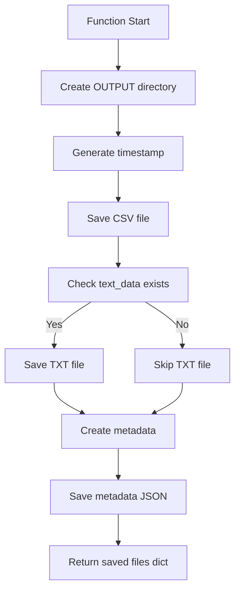

#### 📋 IPO設計

| 項目 | 内容 |
|------|------|
| **INPUT** | `df_processed: pd.DataFrame` - 処理済みデータ<br>`dataset_type: str` - データセット識別子<br>`csv_data: str` - CSV文字列<br>`text_data: str = None` - テキスト文字列 |
| **PROCESS** | ディレクトリ作成 → ファイル保存 → メタデータ作成 |
| **OUTPUT** | `Dict[str, str]` - 保存されたファイルパス辞書 |

#### 📁 保存ファイル仕様

```python
保存ファイル構成:
1. CSV: "preprocessed_{dataset_type}_{rows}rows_{timestamp}.csv"
2. TXT: "{dataset_type}.txt" (結合テキスト)
3. JSON: "metadata_{dataset_type}_{timestamp}.json"

メタデータ構造:
{
    "dataset_type": str,
    "processed_rows": int,
    "processing_timestamp": str,
    "created_at": str (ISO format),
    "files_created": List[str],
    "processing_info": {
        "original_rows": int,
        "removed_rows": int
    }
}
```

---

## ⚙️ 技術仕様

### 📦 依存ライブラリ

| ライブラリ | バージョン | 用途 | 重要度 |
|-----------|-----------|------|---------|
| `streamlit` | 最新 | 🎨 Web UIフレームワーク | ⭐⭐⭐ |
| `pandas` | 最新 | 📊 データ処理・分析 | ⭐⭐⭐ |
| `re` | 標準 | 🔤 正規表現処理 | ⭐⭐⭐ |
| `io` | 標準 | 📄 ファイルI/O操作 | ⭐⭐ |
| `logging` | 標準 | 📝 ログ管理 | ⭐⭐ |
| `json` | 標準 | 📋 JSON処理 | ⭐⭐ |
| `pathlib` | 標準 | 📁 パス操作 | ⭐⭐ |
| `datetime` | 標準 | 📅 日時処理 | ⭐⭐ |
| `functools` | 標準 | 🔧 関数デコレータ | ⭐⭐ |

### 🗃️ データセット対応仕様

#### 📊 サポートデータセット

```yaml
Supported_Datasets:
  customer_support_faq:
    name: "カスタマーサポート・FAQ"
    icon: "💬"
    required_columns: ["question", "answer"]
    port: 8501
    combine_template: "{question} {answer}"

  medical_qa:
    name: "医療QAデータ"
    icon: "🏥"
    required_columns: ["Question", "Complex_CoT", "Response"]
    port: 8503
    combine_template: "{question} {complex_cot} {response}"

  sciq_qa:
    name: "科学・技術QA（SciQ）"
    icon: "🔬"
    required_columns: ["question", "correct_answer"]
    port: 8504
    combine_template: "{question} {correct_answer}"

  legal_qa:
    name: "法律・判例QA"
    icon: "⚖️"
    required_columns: ["question", "answer"]
    port: 8505
    combine_template: "{question} {answer}"
```

### 🤖 OpenAIモデル仕様

#### 📋 対応モデル一覧

```yaml
Available_Models:
  standard_models:
    - "gpt-4o"           # 高品質マルチモーダル
    - "gpt-4o-mini"      # 効率型マルチモーダル
    - "gpt-4.1"          # 次世代高品質
    - "gpt-4.1-mini"     # 次世代効率型

  audio_models:
    - "gpt-4o-audio-preview"      # 音声対応プレビュー
    - "gpt-4o-mini-audio-preview" # 音声対応効率型

  reasoning_models:
    - "o1"      # 推論特化
    - "o1-mini" # 推論効率型
    - "o3"      # 高度推論
    - "o3-mini" # 高度推論効率型
    - "o4"      # 最新推論
    - "o4-mini" # 最新推論効率型
```

#### 💰 料金設定（1000トークンあたり）

```yaml
Model_Pricing:
  gpt-4o: {input: 0.005, output: 0.015}
  gpt-4o-mini: {input: 0.00015, output: 0.0006}
  gpt-4.1: {input: 0.0025, output: 0.01}
  gpt-4.1-mini: {input: 0.0001, output: 0.0004}
  o1: {input: 0.015, output: 0.06}
  o1-mini: {input: 0.003, output: 0.012}
  o3: {input: 0.03, output: 0.12}
  o3-mini: {input: 0.006, output: 0.024}
  o4: {input: 0.05, output: 0.20}
  o4-mini: {input: 0.01, output: 0.04}
```

### 🔧 前処理パイプライン仕様

#### 📋 処理ステップ

```yaml
Processing_Pipeline:
  step1_validation:
    name: "Data Validation"
    function: "validate_data()"
    checks: ["rows", "columns", "required_fields", "empty_values", "duplicates"]

  step2_cleaning:
    name: "Text Cleaning"
    function: "clean_text()"
    operations: ["newline_removal", "space_normalization", "quote_normalization"]

  step3_deduplication:
    name: "Data Deduplication"
    operations: ["drop_duplicates", "dropna_all", "reset_index"]

  step4_combination:
    name: "Column Combination"
    function: "combine_columns()"
    condition: "combine_columns_option == True"
    output: "Combined_Text column"

  step5_filtering:
    name: "Empty Text Filtering"
    operations: ["remove_empty_combined_text"]
```

### 📊 出力仕様

#### 🗂️ 生成ファイル

```yaml
Output_Files:
  csv_file:
    name_pattern: "preprocessed_{dataset_type}_{rows}rows_{timestamp}.csv"
    encoding: "UTF-8"
    format: "Pandas DataFrame to CSV"
    includes: ["all_processed_columns", "Combined_Text"]

  text_file:
    name_pattern: "{dataset_type}.txt"
    encoding: "UTF-8"
    format: "Plain text, one record per line"
    content: "Combined_Text column only"

  metadata_file:
    name_pattern: "metadata_{dataset_type}_{timestamp}.json"
    encoding: "UTF-8"
    format: "JSON"
    content:
      - dataset_type
      - processed_rows
      - processing_timestamp
      - created_at
      - files_created
      - processing_info
```

---

## 🚨 エラーハンドリング

### 📋 エラーカテゴリ

#### 🔧 設定関連エラー

| エラー種別 | 原因 | 対処法 | 影響度 |
|-----------|------|--------|---------|
| **未知のモデル指定** | 🤖 サポート外モデル名 | デフォルトモデルにフォールバック | 🟡 中 |
| **未知のデータセット** | 📊 未定義データセット | デフォルト設定で継続 | 🟡 中 |
| **設定値不正** | ⚙️ 不正な設定値 | デフォルト値使用・警告表示 | 🟠 低 |

#### 📄 データ処理関連エラー

| エラー種別 | 原因 | 対処法 | 影響度 |
|-----------|------|--------|---------|
| **CSV読み込み失敗** | 📋 ファイル形式・エンコーディング | エラー詳細表示・修正指示 | 🔴 高 |
| **必須列不在** | 📊 データ構造不整合 | 必須列リスト表示・修正指示 | 🔴 高 |
| **データ型エラー** | 🔢 予期しないデータ型 | 文字列変換・継続処理 | 🟡 中 |
| **空データセット** | 📄 データ行なし | 処理停止・エラー表示 | 🔴 高 |
| **メモリ不足** | 💾 大容量ファイル | チャンク処理提案・分割指示 | 🟡 中 |

#### 🎨 UI関連エラー

| エラー種別 | 原因 | 対処法 | 影響度 |
|-----------|------|--------|---------|
| **Streamlit設定エラー** | 🎨 page_config重複設定 | 例外キャッチ・継続処理 | 🟠 低 |
| **セッション状態破損** | 🔄 不正なセッション操作 | セッション状態初期化 | 🟡 中 |
| **UI表示エラー** | 🖥️ レンダリング問題 | エラー表示・代替UI提供 | 🟠 低 |

#### 💾 ファイル操作関連エラー

| エラー種別 | 原因 | 対処法 | 影響度 |
|-----------|------|--------|---------|
| **ディレクトリ作成失敗** | 🔒 権限不足・ディスク容量 | 権限確認指示・代替パス提案 | 🟡 中 |
| **ファイル書き込み失敗** | 💾 権限・容量・I/Oエラー | 詳細診断・代替保存方法提案 | 🟡 中 |
| **JSON作成エラー** | 📋 シリアライゼーション失敗 | 簡易メタデータで継続 | 🟠 低 |

### 🛠️ エラーハンドリング戦略

#### 🔧 safe_execute デコレータ

```python
@safe_execute
def risky_function():
    # 危険性のある処理
    pass

# 自動的に以下の処理が適用される:
try:
    return risky_function()
except Exception as e:
    logger.error(f"Error in risky_function: {str(e)}")
    st.error(f"エラーが発生しました: {str(e)}")
    return None
```

#### 📊 段階的エラー処理

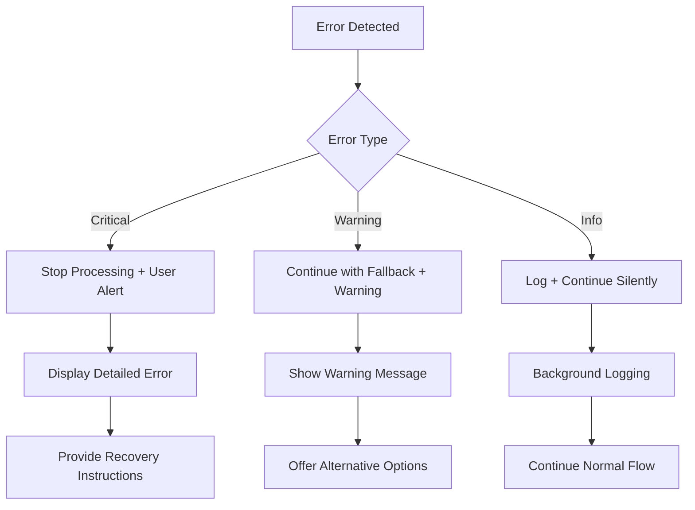

#### ✅ 適切なエラーメッセージ例

```python
# 📄 データ関連エラー
st.error("❌ CSVファイルの読み込みに失敗しました")
st.info("💡 ファイルがUTF-8エンコーディングかご確認ください")
with st.expander("🔧 詳細エラー情報"):
    st.code(str(error))

# 🔧 処理関連エラー
st.warning("⚠️ 一部のデータ処理でエラーが発生しました")
st.info("💡 処理可能な部分のみで継続します")

# 💾 保存関連エラー
st.error("❌ ローカル保存に失敗しました")
st.info("💡 ブラウザダウンロードは正常に利用できます")
```

#### 🚨 フォールバック戦略

```python
fallback_strategies = {
    "unknown_model": {
        "action": "Use DEFAULT_MODEL",
        "message": "指定モデルが見つからないため、デフォルトモデルを使用"
    },
    "missing_columns": {
        "action": "Partial processing with available columns",
        "message": "利用可能な列のみで処理を継続"
    },
    "text_cleaning_error": {
        "action": "Skip cleaning, use original text",
        "message": "テキストクレンジングをスキップして元テキストを使用"
    },
    "file_save_error": {
        "action": "Offer browser download only",
        "message": "ローカル保存不可、ブラウザダウンロードのみ提供"
    }
}
```

---

## 🎉 まとめ

この設計書は、**helper_rag.py** の包括的な技術仕様と実装詳細を記載した完全なドキュメントです。

### 🌟 設計のハイライト

- **🔧 共通機能集約**: 複数RAGアプリ間での機能重複を排除
- **📊 多データセット対応**: 4種類のデータセット（FAQ・医療・科学・法律）に統一対応
- **🤖 最新モデル対応**: OpenAI最新モデル（o4シリーズまで）完全サポート
- **🎨 UI統一化**: Streamlit UIコンポーネントの標準化・再利用化
- **💾 柔軟な出力**: CSV・TXT・JSONメタデータの標準的な保存

### 🔧 アーキテクチャ特徴

- **📦 モジュール化設計**: 機能別クラス・関数の明確な分離
- **⚙️ 設定駆動**: データセット別設定による柔軟な対応
- **🛡️ 堅牢性重視**: 包括的なエラーハンドリング・フォールバック
- **🔄 拡張性**: 新規データセット・モデルの容易な追加

### 📈 RAG最適化機能

- **🧹 専門クレンジング**: RAGに特化したテキスト前処理
- **🔗 インテリジェント結合**: データセット特性を考慮した列結合
- **🔢 精密トークン管理**: 日本語・英語を考慮したトークン推定
- **📊 品質分析**: データセット品質の定量的評価

### 🚀 今後の拡張可能性

- 🌍 多言語データセット対応
- 🤖 追加OpenAIモデル対応
- 📈 高度な品質メトリクス
- 🔄 ストリーミング処理対応
- 📊 可視化機能強化
