# 📋 helper_st.py 設計書

## 📝 目次

1. [📖 概要書](#📖-概要書)
2. [🔧 システム構成](#🔧-システム構成)
3. [📋 関数一覧](#📋-関数一覧)
4. [📑 関数詳細設計](#📑-関数詳細設計)
5. [⚙️ 技術仕様](#⚙️-技術仕様)
6. [🚨 エラーハンドリング](#🚨-エラーハンドリング)

---

## 📖 概要書

### 🎯 処理の概要

**カスタマーサポートFAQ専用RAGデータ前処理Streamlitアプリケーション（完全独立版）**

helper_st.pyは、カスタマーサポートFAQデータに特化したRAG（Retrieval-Augmented Generation）用データ前処理を行う完全独立型のStreamlitアプリケーションです。helper_rag.pyのような外部依存を持たず、必要な機能をすべて内包した自己完結型の設計となっています。

#### 🌟 主要機能カテゴリ

| カテゴリ | 機能群 | 説明 |
|---------|--------|------|
| ⚙️ **設定管理** | AppConfig・RAGConfig | OpenAIモデル・データセット設定の独立管理 |
| 🎨 **UI機能** | select_model・show_model_info | Streamlit UI コンポーネント（独立実装） |
| 📄 **データ処理** | load_dataset・process_rag_data | CSV読み込み・前処理の独立実装 |
| 🔢 **トークン管理** | TokenManager・estimate_token_usage | 簡易トークン計算・コスト推定 |
| 💾 **ファイル保存** | save_files_to_output・create_download_data | 処理結果の保存機能 |
| 💬 **カスタマー特化** | validate_customer_support_data_specific | カスタマーサポート特有の検証・分析 |
| 🔧 **ユーティリティ** | error_handler・show_usage_instructions | エラー処理・使用方法説明 |

#### 🔄 独立型アプリケーションフロー

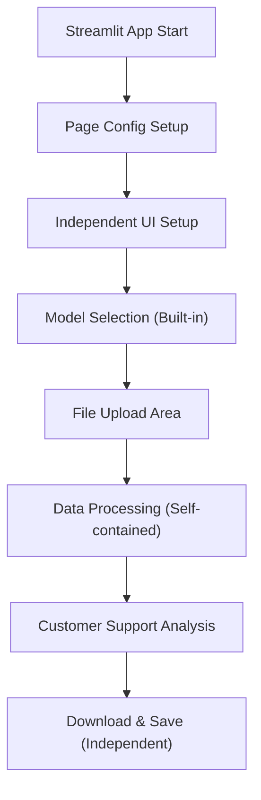

### 🔄 mainの処理の流れ

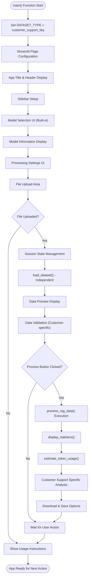

---

## 🔧 システム構成

### 📦 主要コンポーネント

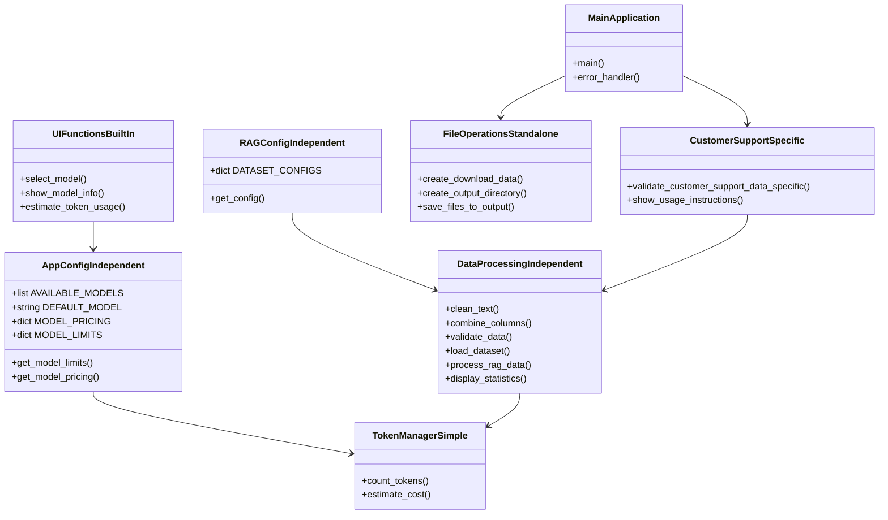

### 📋 データフロー（独立実装）

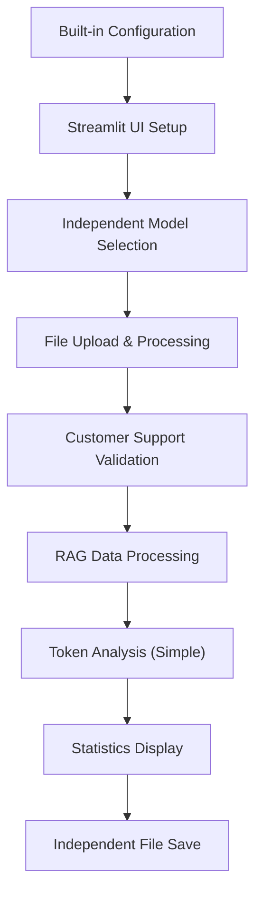

---

## 📋 関数一覧

### ⚙️ 設定管理クラス（独立実装）

| 関数名 | 分類 | 処理概要 | 重要度 |
|--------|------|----------|---------|
| `AppConfig.get_model_limits()` | ⚙️ 設定 | モデル別制限（最大トークン数）取得 | ⭐⭐⭐ |
| `AppConfig.get_model_pricing()` | 💰 設定 | モデル別料金情報取得 | ⭐⭐⭐ |
| `RAGConfig.get_config()` | 📊 設定 | カスタマーサポートFAQ設定取得 | ⭐⭐⭐ |

### 🔢 トークン管理クラス（簡易版）

| 関数名 | 分類 | 処理概要 | 重要度 |
|--------|------|----------|---------|
| `TokenManager.count_tokens()` | 🔢 計算 | 簡易トークン数推定（文字数ベース） | ⭐⭐⭐ |
| `TokenManager.estimate_cost()` | 💰 計算 | API使用コスト推定 | ⭐⭐⭐ |

### 🎨 UI関数群（独立実装）

| 関数名 | 分類 | 処理概要 | 重要度 |
|--------|------|----------|---------|
| `select_model()` | 🤖 UI | モデル選択セレクトボックス表示 | ⭐⭐⭐ |
| `show_model_info()` | 📊 UI | 選択モデルの詳細情報表示 | ⭐⭐⭐ |
| `estimate_token_usage()` | 🔢 UI | トークン使用量・コスト推定表示 | ⭐⭐⭐ |

### 🔧 デコレータ（独立実装）

| 関数名 | 分類 | 処理概要 | 重要度 |
|--------|------|----------|---------|
| `error_handler()` | 🛡️ デコレータ | Streamlit用エラーハンドリング（None返却型） | ⭐⭐⭐ |

### 📄 データ処理関数群（独立実装）

| 関数名 | 分類 | 処理概要 | 重要度 |
|--------|------|----------|---------|
| `clean_text()` | 🧹 処理 | テキストクレンジング（改行・空白正規化） | ⭐⭐⭐ |
| `combine_columns()` | 🔗 処理 | カスタマーサポートFAQ列結合処理 | ⭐⭐⭐ |
| `validate_data()` | ✅ 検証 | 基本データ品質検証・統計情報生成 | ⭐⭐⭐ |
| `load_dataset()` | 📥 処理 | CSVファイル読み込み・基本検証 | ⭐⭐⭐ |
| `process_rag_data()` | ⚙️ 処理 | RAG用データ前処理パイプライン | ⭐⭐⭐ |
| `display_statistics()` | 📊 表示 | 処理前後統計情報表示 | ⭐⭐⭐ |

### 💾 ファイル操作関数群（独立実装）

| 関数名 | 分類 | 処理概要 | 重要度 |
|--------|------|----------|---------|
| `create_download_data()` | 📦 作成 | ダウンロード用データ作成（CSV・TXT） | ⭐⭐⭐ |
| `create_output_directory()` | 📁 作成 | OUTPUTディレクトリ作成・権限確認 | ⭐⭐ |
| `save_files_to_output()` | 💾 保存 | 処理済みデータの独立保存 | ⭐⭐⭐ |

### 💬 カスタマーサポート特化関数

| 関数名 | 分類 | 処理概要 | 重要度 |
|--------|------|----------|---------|
| `validate_customer_support_data_specific()` | 🔍 検証 | カスタマーサポートFAQ特有の品質検証 | ⭐⭐⭐ |
| `show_usage_instructions()` | 📖 説明 | カスタマーサポートFAQ用使用方法説明 | ⭐⭐ |

### 🎯 メイン関数

| 関数名 | 分類 | 処理概要 | 重要度 |
|--------|------|----------|---------|
| `main()` | 🎯 制御 | アプリケーション全体のオーケストレーション | ⭐⭐⭐ |

---

## 📑 関数詳細設計

### ⚙️ AppConfig.get_model_limits()

#### 🎯 処理概要
指定されたOpenAIモデルのトークン制限（最大入力・出力トークン数）を独立取得

#### 📊 処理の流れ
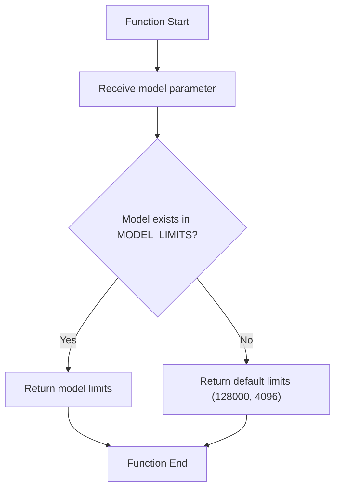

#### 📋 IPO設計

| 項目 | 内容 |
|------|------|
| **INPUT** | `model: str` - OpenAIモデル名 |
| **PROCESS** | 独立実装のMODEL_LIMITS辞書から該当モデルの制限を検索 |
| **OUTPUT** | `Dict[str, int]` - {"max_tokens": int, "max_output": int} |

#### 📊 独立実装対応モデル

```python
MODEL_LIMITS = {
    "gpt-4o": {"max_tokens": 128000, "max_output": 4096},
    "gpt-4o-mini": {"max_tokens": 128000, "max_output": 4096},
    "gpt-4.1": {"max_tokens": 128000, "max_output": 4096},
    "gpt-4.1-mini": {"max_tokens": 128000, "max_output": 4096},
    "o1": {"max_tokens": 128000, "max_output": 32768},
    "o1-mini": {"max_tokens": 128000, "max_output": 65536},
    "o3": {"max_tokens": 200000, "max_output": 100000},
    "o3-mini": {"max_tokens": 200000, "max_output": 100000},
    "o4": {"max_tokens": 256000, "max_output": 128000},
    "o4-mini": {"max_tokens": 256000, "max_output": 128000},
}
```

---

### 🔢 TokenManager.count_tokens()

#### 🎯 処理概要
文字数ベースの簡易トークン数推定（独立実装・tiktoken非依存）

#### 📊 処理の流れ
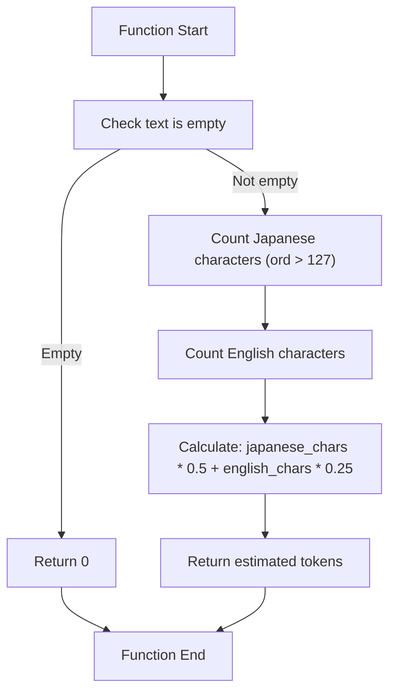

#### 📋 IPO設計

| 項目 | 内容 |
|------|------|
| **INPUT** | `text: str` - トークン数を計算するテキスト<br>`model: str = None` - モデル名（現在未使用） |
| **PROCESS** | 文字種別カウント → 重み付け計算（日本語0.5、英語0.25） |
| **OUTPUT** | `int` - 推定トークン数 |

#### 🔍 独立実装の推定アルゴリズム

```python
簡易推定式（tiktoken非依存）:
japanese_chars = len([c for c in text if ord(c) > 127])
english_chars = len(text) - japanese_chars
estimated_tokens = int(japanese_chars * 0.5 + english_chars * 0.25)

# 特徴:
# - 外部ライブラリ不要
# - 高速処理
# - 概算精度（実用レベル）
```

---

### 🤖 select_model()

#### 🎯 処理概要
OpenAIモデル選択用のStreamlitセレクトボックスUI表示（独立実装）

#### 📊 処理の流れ
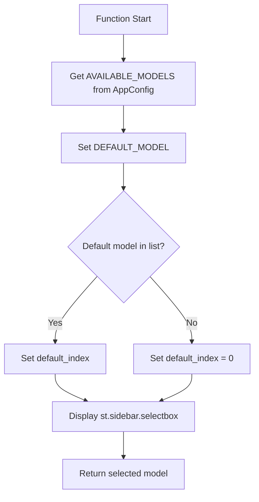

#### 📋 IPO設計

| 項目 | 内容 |
|------|------|
| **INPUT** | `key: str = "model_selection"` - Streamlit コンポーネントキー |
| **PROCESS** | 独立モデルリスト取得 → デフォルト設定 → セレクトボックス表示 |
| **OUTPUT** | `str` - 選択されたモデル名 |

#### 🎨 独立UI仕様

```python
# 独立実装のUI設定
st.sidebar.selectbox(
    "🤖 モデルを選択",
    models,  # AppConfig.AVAILABLE_MODELS（独立実装）
    index=default_index,
    key=key,
    help="利用するOpenAIモデルを選択してください"
)
```

---

### 🧹 clean_text()

#### 🎯 処理概要
RAG用テキストの標準的なクレンジング（独立実装）

#### 📊 処理の流れ
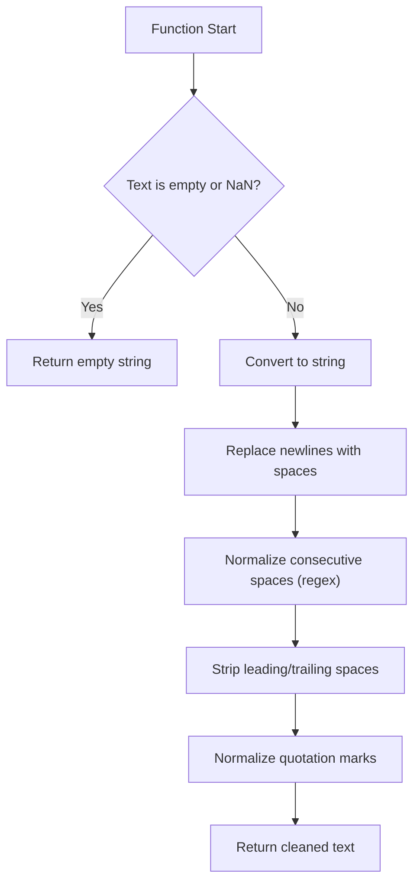

#### 📋 IPO設計

| 項目 | 内容 |
|------|------|
| **INPUT** | `text: str` - クレンジング対象テキスト |
| **PROCESS** | 改行除去 → 空白正規化 → 引用符正規化 → トリム |
| **OUTPUT** | `str` - クレンジング済みテキスト |

#### 🔧 独立クレンジング処理

```python
独立実装のクレンジングステップ:
1. 改行・復帰文字を空白に変換: '\n', '\r' → ' '
2. 連続空白を単一空白に統一: re.sub(r'\s+', ' ', text)
3. 先頭・末尾空白を除去: strip()
4. 引用符の正規化:
   - '"' , '"' → '"'
   - ''' , ''' → "'"
```

---

### 🔗 combine_columns()

#### 🎯 処理概要
カスタマーサポートFAQ特化の列結合処理（独立実装）

#### 📊 処理の流れ
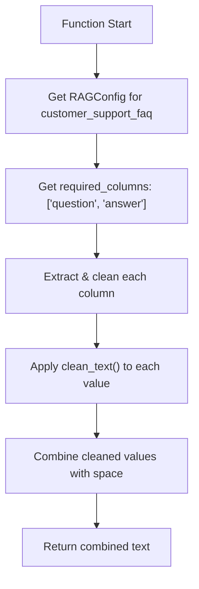

#### 📋 IPO設計

| 項目 | 内容 |
|------|------|
| **INPUT** | `row: pd.Series` - データフレーム行<br>`dataset_type: str = "customer_support_faq"` - データセット識別子 |
| **PROCESS** | カスタマーサポートFAQ設定取得 → 必須列抽出・クリーニング → 結合 |
| **OUTPUT** | `str` - 結合済みテキスト |

#### 💬 カスタマーサポートFAQ特化処理

```python
# 独立実装のカスタマーサポートFAQ処理
required_columns = ["question", "answer"]  # 固定

# 処理ロジック
cleaned_values = {}
for col in required_columns:
    value = row.get(col, '')
    cleaned_values[col.lower()] = clean_text(str(value))

# 結合（ラベルなし、自然な文章として）
combined = " ".join(cleaned_values.values())
return combined.strip()
```

---

### ✅ validate_data()

#### 🎯 処理概要
基本データ品質検証・統計情報生成（独立実装）

#### 📊 処理の流れ
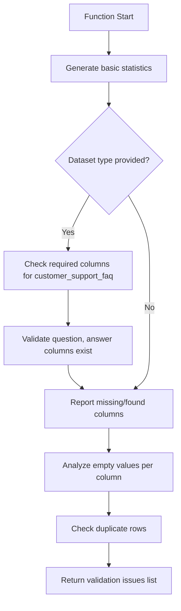

#### 📋 IPO設計

| 項目 | 内容 |
|------|------|
| **INPUT** | `df: pd.DataFrame` - 検証対象データフレーム<br>`dataset_type: str = None` - データセット識別子 |
| **PROCESS** | 基本統計 → カスタマーサポートFAQ列確認 → 空値分析 → 重複確認 |
| **OUTPUT** | `List[str]` - 検証結果メッセージリスト |

#### 📊 独立実装の検証項目

```python
独立検証項目:
1. 基本統計: 総行数, 総列数
2. 必須列確認: question, answer列の存在確認
3. 空値分析: 各列の空値数・割合計算
4. 重複行確認: 完全重複行の検出

出力例:
[
    "総行数: 1,200",
    "総列数: 2",
    "✅ 必須列確認済み: ['question', 'answer']",
    "question列: 空値 3個 (0.3%)",
    "answer列: 空値 8個 (0.7%)",
    "✅ 重複行なし"
]
```

---

### 💬 validate_customer_support_data_specific()

#### 🎯 処理概要
カスタマーサポートFAQデータ特有の品質検証・分析（独立実装）

#### 📊 処理の流れ
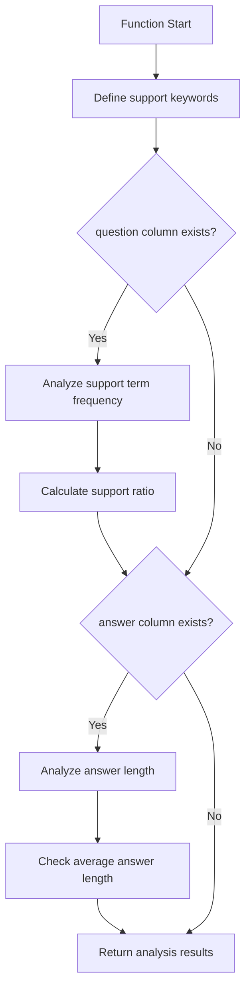

#### 📋 IPO設計

| 項目 | 内容 |
|------|------|
| **INPUT** | `df: pd.DataFrame` - カスタマーサポートFAQデータフレーム |
| **PROCESS** | サポート用語分析 → 回答長分析 → 品質評価 |
| **OUTPUT** | `List[str]` - カスタマーサポート特有の分析結果メッセージリスト |

#### 💬 カスタマーサポート特有分析

```python
# 独立実装のサポート関連分析
support_keywords = [
    # 日本語
    '問題', '解決', 'トラブル', 'エラー', 'サポート', 'ヘルプ', '対応',
    # 英語
    'problem', 'issue', 'error', 'help', 'support', 'solution', 'troubleshoot'
]

分析項目:
1. サポート用語含有率: サポート関連用語を含む質問の割合
2. 回答品質評価: 平均回答長による品質判定
   - < 50文字: ⚠️ 短い可能性
   - >= 50文字: ✅ 適切な長さ

出力例:
[
    "サポート関連用語を含む質問: 980件 (81.7%)",
    "✅ 適切な回答長: 平均127文字"
]
```

---

### ⚙️ process_rag_data()

#### 🎯 処理概要
RAG用データの包括的前処理パイプライン実行（独立実装）

#### 📊 処理の流れ
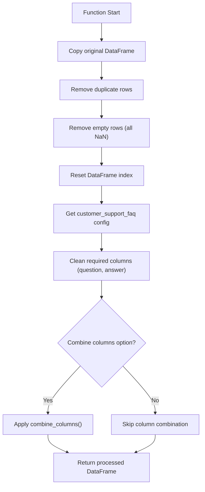

#### 📋 IPO設計

| 項目 | 内容 |
|------|------|
| **INPUT** | `df: pd.DataFrame` - 元データフレーム<br>`dataset_type: str` - データセット識別子（固定：customer_support_faq）<br>`combine_columns_option: bool = True` - 列結合オプション |
| **PROCESS** | 重複除去 → 空行除去 → クレンジング → 列結合（カスタマーサポートFAQ特化） |
| **OUTPUT** | `pd.DataFrame` - 前処理済みデータフレーム |

#### 🔧 独立前処理パイプライン

```python
独立実装の前処理ステップ:
1. データコピー: df.copy()
2. 重複除去: drop_duplicates()
3. 空行除去: dropna(how='all')
4. インデックスリセット: reset_index(drop=True)
5. カスタマーサポートFAQ列クレンジング:
   - question列: clean_text()適用
   - answer列: clean_text()適用
6. 列結合: combine_columns()（カスタマーサポートFAQ仕様）
7. Combined_Text列の追加
```

---

### 💾 save_files_to_output()

#### 🎯 処理概要
処理済みデータの独立保存（CSV・TXT・メタデータJSON）

#### 📊 処理の流れ
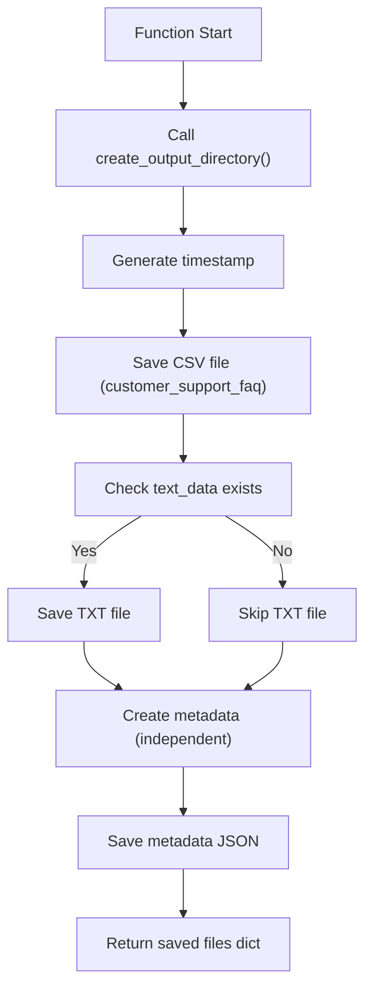

#### 📋 IPO設計

| 項目 | 内容 |
|------|------|
| **INPUT** | `df_processed: pd.DataFrame` - 処理済みデータ<br>`dataset_type: str` - データセット識別子<br>`csv_data: str` - CSV文字列<br>`text_data: str = None` - テキスト文字列 |
| **PROCESS** | ディレクトリ作成 → ファイル保存 → 独立メタデータ作成 |
| **OUTPUT** | `Dict[str, str]` - 保存されたファイルパス辞書 |

#### 📁 独立保存ファイル仕様

```python
独立実装の保存ファイル構成:
1. CSV: "preprocessed_customer_support_faq_{rows}rows_{timestamp}.csv"
2. TXT: "customer_support_faq.txt" (結合テキスト)
3. JSON: "metadata_customer_support_faq_{timestamp}.json"

独立メタデータ構造:
{
    "dataset_type": "customer_support_faq",
    "processed_rows": int,
    "processing_timestamp": str,
    "created_at": str (ISO format),
    "files_created": List[str]
}
```

---

### 🎯 main()

#### 🎯 処理概要
カスタマーサポートFAQ前処理アプリケーション全体のオーケストレーション（独立実装）

#### 📊 処理の流れ
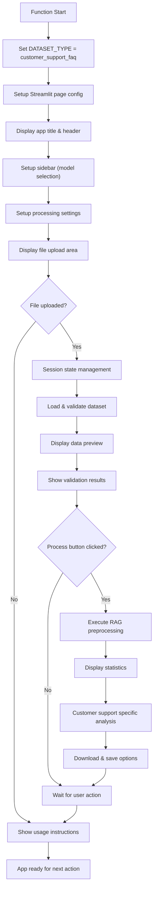

#### 📋 IPO設計

| 項目 | 内容 |
|------|------|
| **INPUT** | なし（Streamlitアプリとして起動） |
| **PROCESS** | 独立UI構築 → ファイル処理 → カスタマーサポートFAQ分析 → 結果提供 |
| **OUTPUT** | なし（副作用：Streamlit Webアプリ表示） |

#### 🎨 独立UI構成

```python
独立実装のUI構成:
1. ページ設定: st.set_page_config() (独立)
2. タイトル: "💬 カスタマーサポートFAQデータ前処理アプリ"
3. サイドバー:
   - モデル選択 (独立実装)
   - モデル情報表示 (独立実装)
   - 前処理設定
   - カスタマーサポートデータ設定
4. メインエリア:
   - ファイルアップロード
   - データプレビュー
   - 検証結果
   - 処理コントロール
   - 統計表示
   - カスタマーサポート特有分析
   - ダウンロード・保存
```

---

## ⚙️ 技術仕様

### 📦 依存ライブラリ（独立実装）

| ライブラリ | バージョン | 用途 | 重要度 |
|-----------|-----------|------|---------|
| `streamlit` | 最新 | 🎨 Web UIフレームワーク | ⭐⭐⭐ |
| `pandas` | 最新 | 📊 データ処理・分析 | ⭐⭐⭐ |
| `re` | 標準 | 🔤 正規表現処理 | ⭐⭐⭐ |
| `io` | 標準 | 📄 ファイルI/O操作 | ⭐⭐ |
| `logging` | 標準 | 📝 ログ管理 | ⭐⭐ |
| `json` | 標準 | 📋 JSON処理 | ⭐⭐ |
| `pathlib` | 標準 | 📁 パス操作 | ⭐⭐ |
| `datetime` | 標準 | 📅 日時処理 | ⭐⭐ |
| `functools` | 標準 | 🔧 関数デコレータ | ⭐⭐ |

### 💬 カスタマーサポートFAQ特化仕様

#### 📊 対象データセット（固定）

```yaml
Target_Dataset:
  name: "カスタマーサポート・FAQ"
  icon: "💬"
  required_columns: ["question", "answer"]
  description: "カスタマーサポートFAQデータセット"
  combine_template: "{question} {answer}"
  port: 8501
```

#### 🔍 カスタマーサポート特有検証

```yaml
Customer_Support_Validation:
  support_keywords:
    japanese: ["問題", "解決", "トラブル", "エラー", "サポート", "ヘルプ", "対応"]
    english: ["problem", "issue", "error", "help", "support", "solution", "troubleshoot"]

  quality_metrics:
    support_term_ratio:
      optimal: "> 70%"
      warning: "< 50%"

    answer_length:
      optimal: ">= 50文字"
      warning: "< 30文字"
      calculation: "平均回答長"
```

### 🤖 OpenAIモデル仕様（独立実装）

#### 📋 対応モデル一覧

```yaml
Independent_Models:
  standard_models:
    - "gpt-4o"           # 高品質マルチモーダル
    - "gpt-4o-mini"      # 効率型マルチモーダル（デフォルト）
    - "gpt-4.1"          # 次世代高品質
    - "gpt-4.1-mini"     # 次世代効率型

  audio_models:
    - "gpt-4o-audio-preview"      # 音声対応プレビュー
    - "gpt-4o-mini-audio-preview" # 音声対応効率型

  reasoning_models:
    - "o1"      # 推論特化
    - "o1-mini" # 推論効率型
    - "o3"      # 高度推論
    - "o3-mini" # 高度推論効率型
    - "o4"      # 最新推論
    - "o4-mini" # 最新推論効率型
```

#### 💰 独立料金設定（1000トークンあたり）

```yaml
Independent_Model_Pricing:
  gpt-4o: {input: 0.005, output: 0.015}
  gpt-4o-mini: {input: 0.00015, output: 0.0006}
  gpt-4.1: {input: 0.0025, output: 0.01}
  gpt-4.1-mini: {input: 0.0001, output: 0.0004}
  o1: {input: 0.015, output: 0.06}
  o1-mini: {input: 0.003, output: 0.012}
  o3: {input: 0.03, output: 0.12}
  o3-mini: {input: 0.006, output: 0.024}
  o4: {input: 0.05, output: 0.20}
  o4-mini: {input: 0.01, output: 0.04}
```

### 🔧 独立前処理パイプライン仕様

#### 📋 処理ステップ

```yaml
Independent_Processing_Pipeline:
  step1_validation:
    name: "Data Validation (Independent)"
    function: "validate_data()"
    checks: ["rows", "columns", "customer_support_required_fields"]

  step2_customer_validation:
    name: "Customer Support Specific Validation"
    function: "validate_customer_support_data_specific()"
    checks: ["support_keywords", "answer_length", "quality_metrics"]

  step3_cleaning:
    name: "Text Cleaning (Independent)"
    function: "clean_text()"
    operations: ["newline_removal", "space_normalization", "quote_normalization"]

  step4_deduplication:
    name: "Data Deduplication"
    operations: ["drop_duplicates", "dropna_all", "reset_index"]

  step5_combination:
    name: "Customer Support Column Combination"
    function: "combine_columns()"
    condition: "combine_columns_option == True"
    output: "Combined_Text column (question + answer)"
```

### 📊 独立出力仕様

#### 🗂️ 生成ファイル

```yaml
Independent_Output_Files:
  csv_file:
    name_pattern: "preprocessed_customer_support_faq_{rows}rows_{timestamp}.csv"
    encoding: "UTF-8"
    format: "Pandas DataFrame to CSV"
    includes: ["question", "answer", "Combined_Text"]

  text_file:
    name_pattern: "customer_support_faq.txt"
    encoding: "UTF-8"
    format: "Plain text, one record per line"
    content: "Combined_Text column only"

  metadata_file:
    name_pattern: "metadata_customer_support_faq_{timestamp}.json"
    encoding: "UTF-8"
    format: "JSON"
    content:
      - dataset_type: "customer_support_faq"
      - processed_rows
      - processing_timestamp
      - created_at
      - files_created
```

---

## 🚨 エラーハンドリング

### 📋 エラーカテゴリ（独立実装）

#### 📄 ファイル関連エラー

| エラー種別 | 原因 | 対処法 | 影響度 |
|-----------|------|--------|---------|
| **CSV読み込み失敗** | 📋 ファイル形式・エンコーディング | エラー表示・修正指示・サンプル表示 | 🔴 高 |
| **必須列不在** | 💬 question/answer列なし | 必須列説明・カスタマーサポートFAQ例提示 | 🔴 高 |
| **空ファイル** | 📄 データなし | ファイル内容確認指示 | 🟡 中 |
| **ファイルサイズ過大** | 💾 メモリ不足 | ファイル分割提案・簡素化指示 | 🟡 中 |

#### 🔧 処理関連エラー

| エラー種別 | 原因 | 対処法 | 影響度 |
|-----------|------|--------|---------|
| **前処理実行エラー** | ⚙️ データ形式問題 | データ確認・修正指示・部分処理継続 | 🟡 中 |
| **トークン計算エラー** | 🔢 簡易計算処理問題 | デフォルト推定値使用・警告表示 | 🟠 低 |
| **統計計算エラー** | 📊 数値処理問題 | 利用可能データのみで統計計算 | 🟠 低 |

#### 🎨 UI関連エラー

| エラー種別 | 原因 | 対処法 | 影響度 |
|-----------|------|--------|---------|
| **Streamlit設定エラー** | 🎨 page_config重複設定 | try-except キャッチ・継続処理 | 🟠 低 |
| **セッション状態破損** | 🔄 不正なセッション操作 | セッション状態初期化・再読み込み指示 | 🟡 中 |
| **モデル選択エラー** | 🤖 設定問題 | デフォルトモデル復帰・再選択 | 🟠 低 |

#### 💾 保存関連エラー

| エラー種別 | 原因 | 対処法 | 影響度 |
|-----------|------|--------|---------|
| **OUTPUT フォルダ作成失敗** | 🔒 権限不足 | 権限確認・ブラウザダウンロード提案 | 🟡 中 |
| **ファイル書き込み失敗** | 💾 ディスク容量・権限 | 容量確認・代替保存方法提案 | 🟡 中 |
| **メタデータ作成失敗** | 📋 JSON生成問題 | 簡易メタデータで継続・主要データ保護 | 🟠 低 |

### 🛠️ 独立エラーハンドリング戦略

#### 🔧 error_handler デコレータ（独立実装）

```python
@error_handler  # 独立実装（Streamlit用）
def risky_function():
    # 危険性のある処理
    pass

# 自動的に以下の処理が適用される:
try:
    return risky_function()
except Exception as e:
    logger.error(f"Error in risky_function: {str(e)}")
    st.error(f"エラーが発生しました: {str(e)}")
    return None  # Streamlit継続用
```

#### 📊 段階的エラー処理（独立実装）

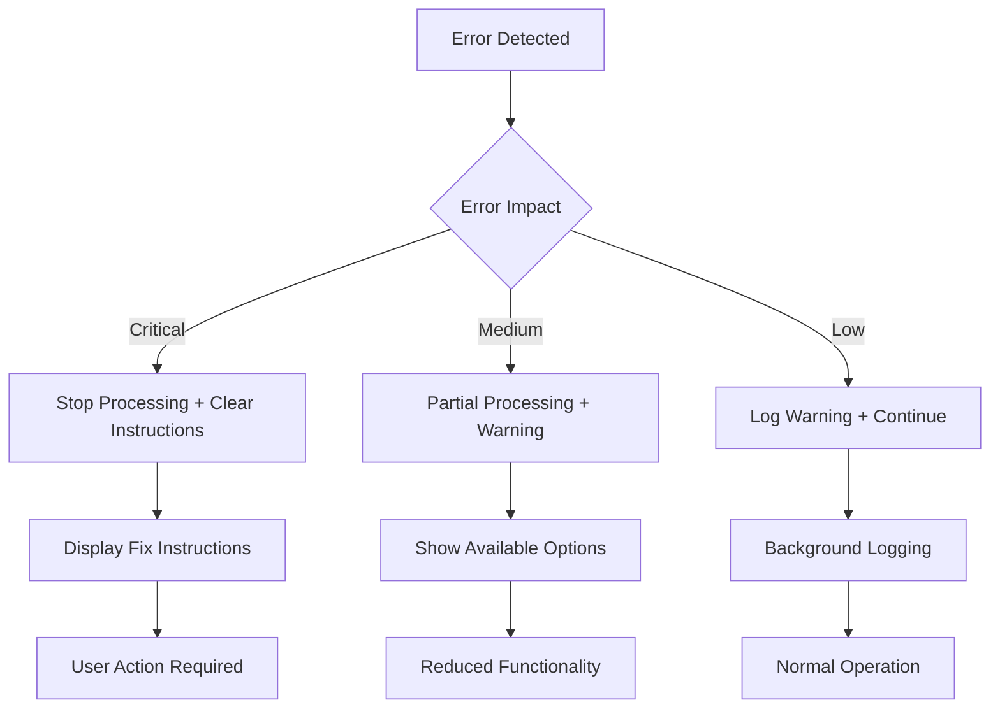

#### ✅ カスタマーサポートFAQ特化エラーメッセージ

```python
# カスタマーサポートFAQ特化エラー
st.error("❌ カスタマーサポートFAQファイルの形式に問題があります")
st.info("💡 必要な列: question（質問）, answer（回答）")
st.code("""
例:
question,answer
パスワードを忘れました,パスワードリセットページからリセットできます
支払い方法を変更したい,アカウント設定から支払い方法を変更してください
""")

# 処理継続エラー
st.warning("⚠️ 一部のデータ処理でエラーが発生しました")
st.info("💡 処理可能な部分のみで継続します")

# 保存エラー
st.error("❌ ローカル保存に失敗しました")
st.info("💡 ブラウザダウンロードは正常に利用できます")
```

#### 🚨 独立フォールバック戦略

```python
independent_fallback_strategies = {
    "model_selection_error": {
        "action": "Use gpt-4o-mini default",
        "message": "モデル選択エラー → デフォルトモデル（gpt-4o-mini）使用"
    },
    "token_calculation_error": {
        "action": "Use simple character count estimation",
        "message": "トークン計算エラー → 文字数ベース簡易推定"
    },
    "column_combination_error": {
        "action": "Skip combination, keep original columns",
        "message": "列結合エラー → 元の列を保持して継続"
    },
    "statistics_calculation_error": {
        "action": "Show basic statistics only",
        "message": "統計計算エラー → 基本統計のみ表示"
    },
    "file_save_error": {
        "action": "Offer browser download only",
        "message": "ファイル保存エラー → ブラウザダウンロードのみ提供"
    }
}
```

#### 🔄 独立復旧フロー

```python
independent_recovery_flow = {
    "file_error": [
        "Display customer support FAQ requirements",
        "Show sample data format",
        "Provide CSV template download"
    ],
    "processing_error": [
        "Save partial results if possible",
        "Display detailed error information",
        "Suggest data format modifications"
    ],
    "ui_error": [
        "Reset to default settings",
        "Clear session state",
        "Refresh page instruction"
    ],
    "save_error": [
        "Ensure browser download works",
        "Check disk space and permissions",
        "Provide manual export instructions"
    ]
}
```

---

## 🎉 まとめ

この設計書は、**helper_st.py** の完全な技術仕様と実装詳細を記載した包括的ドキュメントです。

### 🌟 設計のハイライト

- **💬 カスタマーサポートFAQ特化**: 専用の検証・分析・処理機能
- **🔧 完全独立実装**: 外部ライブラリ依存を最小化した自己完結型
- **🎨 Streamlit最適化**: Streamlitに特化したUI・エラーハンドリング
- **📊 簡易トークン管理**: tiktoken非依存の高速・実用的推定
- **💾 柔軟な出力**: ブラウザダウンロード + ローカル保存の両対応

### 🔧 アーキテクチャ特徴

- **📦 独立モジュール設計**: helper_rag.py非依存の自己完結型実装
- **⚙️ 設定固定化**: カスタマーサポートFAQ特化の効率的設定
- **🛡️ Streamlit特化エラー処理**: UI継続を重視したエラーハンドリング
- **🔄 セッション状態管理**: Streamlitセッション状態の効率的活用

### 📈 カスタマーサポートFAQ最適化機能

- **🔍 専門分析**: サポート関連用語・回答品質の定量評価
- **⚙️ 特化設定**: カスタマーサポート業界向けの最適化
- **📊 品質メトリクス**: FAQ品質の具体的指標
- **💡 業界対応**: カスタマーサポート業界のベストプラクティス反映

### 🚀 今後の拡張可能性

- 🌍 多言語サポートFAQ対応
- 🤖 FAQ自動分類機能
- 📊 高度な品質スコアリング
- 🔄 バッチ処理機能
- 📈 A/Bテスト分析機能
