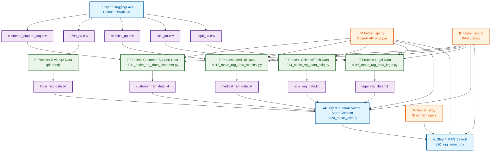

# 📋 本プロジェクトの処理フロー設計書

## 📝 概要

本プロジェクトは、HuggingFaceからデータセットをダウンロードし、OpenAI RAG（Retrieval-Augmented Generation）システムを構築する4段階の処理パイプラインです。

## 🔄 処理フロー



## 📋 詳細処理手順

### 🔽 Step 1: HuggingFace Dataset Download
**実行スクリプト**: `a30_00_dl_dataset_from_huggingface.py`

| No. | データセット | ファイル名 | 内容 |
|-----|-------------|-----------|------|
| ① | Customer Support FAQ | `customer_support_faq.csv` | カスタマーサポート・FAQデータセット |
| ② | Trivia QA | `trivia_qa.csv` | 一般知識・トリビアQAデータセット |
| ③ | Medical QA | `medical_qa.csv` | 医療質問回答データセット |
| ④ | Science/Tech QA | `sciq_qa.csv` | 科学・技術QAデータセット |
| ⑤ | Legal QA | `legal_qa.csv` | 法律・判例QAデータセット |

### 📝 Step 2: RAG Data Processing
各CSVファイルを RAG用のTXTファイルに加工

| データセット | 処理スクリプト | 出力ファイル |
|-------------|---------------|-------------|
| Customer Support | `a011_make_rag_data_customer.py` | `customer_rag_data.txt` |
| Medical QA | `a013_make_rag_data_medical.py` | `medical_rag_data.txt` |
| Science/Tech QA | `a014_make_rag_data_sciq.py` | `sciq_rag_data.txt` |
| Legal QA | `a015_make_rag_data_legal.py` | `legal_rag_data.txt` |

### 🗃️ Step 3: Vector Store Creation
**実行スクリプト**: `a020_make_vsid.py`

加工済みTXTファイルをOpenAIのVector Storeに登録し、検索可能な形式に変換

### 🔍 Step 4: RAG Search
**実行スクリプト**: `a30_rag_search.py`

Vector Storeに登録されたデータを利用して、質問に対する関連情報を検索・回答生成

## 🛠️ ヘルパー関数

| ファイル | 機能 | 利用箇所 |
|---------|------|---------|
| `helper_api.py` | OpenAI API wrapper、設定管理 | 全ステップ |
| `helper_rag.py` | RAG用データ前処理、設定 | データ加工・検索 |
| `helper_st.py` | Streamlit UI関数 | 検索インターフェース |

## 🔄 データフロー概要

```
HuggingFace → CSV → RAG用TXT → OpenAI Vector Store → RAG検索
```

各ステップは順次実行される設計で、前段階の出力が次段階の入力となる一方向のパイプライン構造です。