# 📋 server.py 設計書

## 📝 目次

1. [📖 概要書](#📖-概要書)
2. [🔧 システム構成](#🔧-システム構成)
3. [📋 関数一覧](#📋-関数一覧)
4. [📑 関数詳細設計](#📑-関数詳細設計)
5. [⚙️ 技術仕様](#⚙️-技術仕様)
6. [🚨 エラーハンドリング](#🚨-エラーハンドリング)

---

## 📖 概要書

### 🎯 処理の概要

**統合サーバー管理・起動システム**

本スクリプトは、RAGシステムの各種サーバーコンポーネント（Qdrant、API、StreamlitUI）を統合管理し、自動起動・監視を行うオーケストレーションツールです。Qdrantサーバーの自動起動、APIサーバーの管理、StreamlitUIの起動を一元的に制御します。

#### 🌟 主要機能

| 機能 | 説明 |
|------|------|
| 🐳 **Qdrant自動管理** | Dockerによる自動起動と接続監視 |
| 🌐 **APIサーバー管理** | FastAPIサーバーの起動とヘルスチェック |
| 🎨 **StreamlitUI起動** | 検索UIの自動起動（ポート8504） |
| 🔍 **接続性監視** | 各サービスの死活監視と自動復旧 |
| ⚡ **グレースフルシャットダウン** | Ctrl+Cによる安全な終了処理 |
| 📊 **エンドポイントテスト** | API動作確認と検証 |

#### 🗃️ サービス構成図

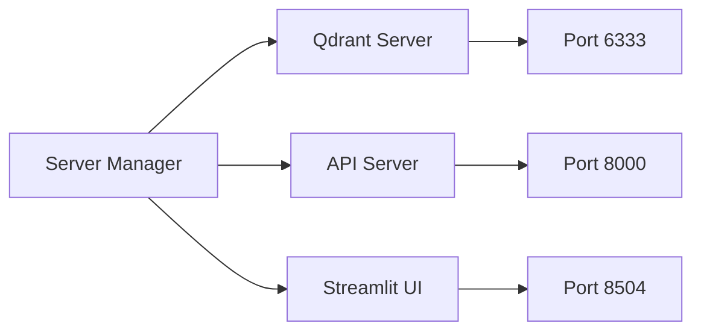

### 🔄 起動フロー

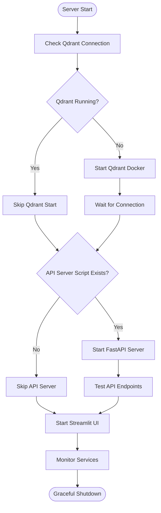

---

## 🔧 システム構成

### 📦 主要コンポーネント

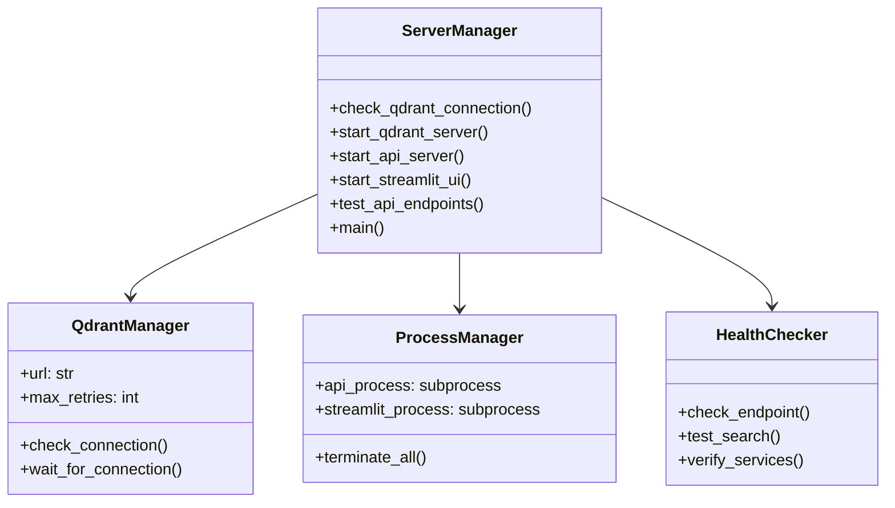

### 📋 サービス依存関係

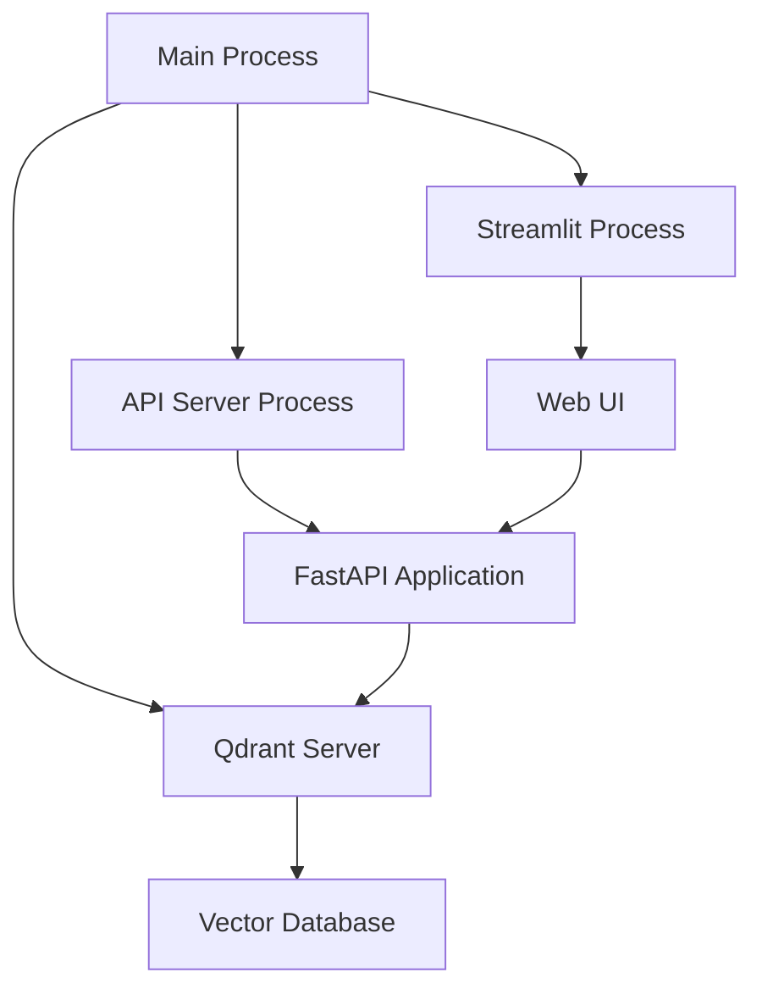

---

## 📋 関数一覧

### 🔍 接続管理関数

| 関数名 | 分類 | 処理概要 | 重要度 |
|--------|------|----------|---------|
| `check_qdrant_connection()` | 🔍 検証 | Qdrantサーバー接続確認 | ⭐⭐⭐ |

### 🚀 サーバー起動関数

| 関数名 | 分類 | 処理概要 | 重要度 |
|--------|------|----------|---------|
| `start_qdrant_server()` | 🐳 起動 | Qdrant Dockerコンテナ起動 | ⭐⭐⭐ |
| `start_api_server()` | 🌐 起動 | FastAPIサーバー起動 | ⭐⭐ |
| `start_streamlit_ui()` | 🎨 起動 | Streamlit UI起動 | ⭐⭐⭐ |

### 📊 テスト関数

| 関数名 | 分類 | 処理概要 | 重要度 |
|--------|------|----------|---------|
| `test_api_endpoints()` | 📊 検証 | APIエンドポイント動作確認 | ⭐⭐ |

### 🎯 制御関数

| 関数名 | 分類 | 処理概要 | 重要度 |
|--------|------|----------|---------|
| `main()` | 🎯 制御 | サーバー全体の起動制御 | ⭐⭐⭐ |

---

## 📑 関数詳細設計

### 🔍 check_qdrant_connection()

#### 🎯 処理概要
Qdrantサーバーへの接続を確認し、サービスの稼働状態を検証

#### 📊 処理の流れ
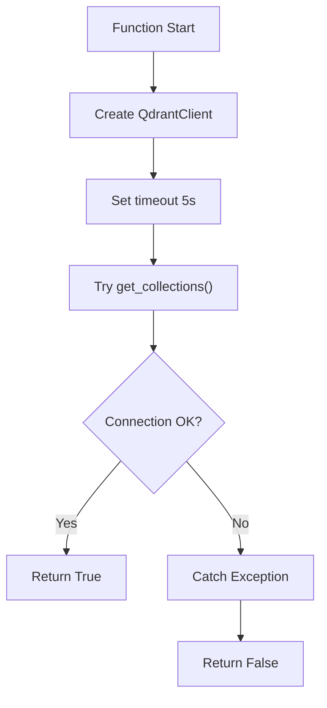

#### 📋 IPO設計

| 項目 | 内容 |
|------|------|
| **INPUT** | url: str = "http://localhost:6333" |
| **PROCESS** | QdrantClient接続テスト（タイムアウト5秒） |
| **OUTPUT** | bool（接続成功: True、失敗: False） |

---

### 🐳 start_qdrant_server()

#### 🎯 処理概要
Qdrantサーバーが起動していない場合、Dockerで自動起動し接続待機

#### 📊 処理の流れ
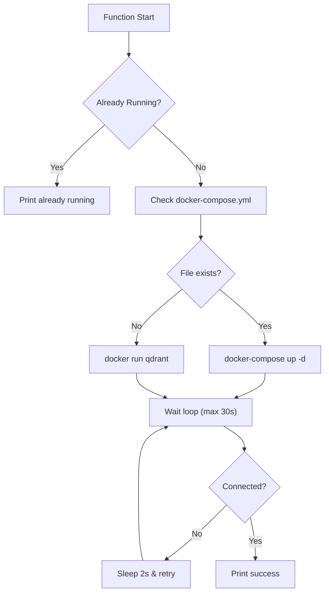

#### 📋 起動コマンド詳細

```python
# docker-compose使用時
cmd = ["docker-compose", "-f", "docker-compose/docker-compose.yml", "up", "-d"]

# Docker直接起動時
cmd = [
    "docker", "run", "-d",
    "--name", "qdrant",
    "-p", "6333:6333",
    "-v", "qdrant_data:/qdrant/storage",
    "qdrant/qdrant:latest"
]
```

---

### 🌐 start_api_server()

#### 🎯 処理概要
FastAPIサーバーをサブプロセスとして起動し、エンドポイントの準備完了を待機

#### 📊 処理の流れ
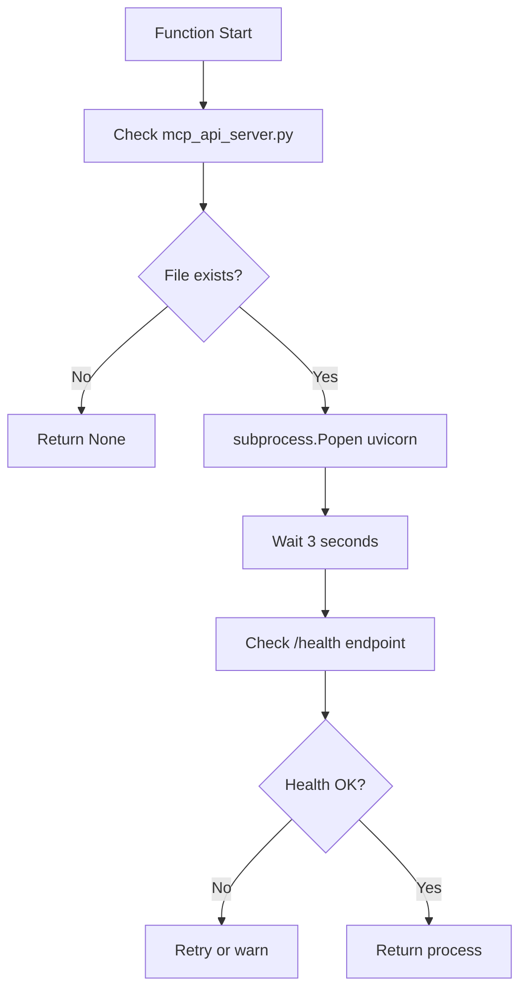

#### 📋 IPO設計

| 項目 | 内容 |
|------|------|
| **INPUT** | なし |
| **PROCESS** | uvicorn起動、ヘルスチェック |
| **OUTPUT** | subprocess.Popen object または None |

---

### 🎨 start_streamlit_ui()

#### 🎯 処理概要
Streamlit検索UIをサブプロセスとして起動（ポート8504）

#### 📊 処理の流れ
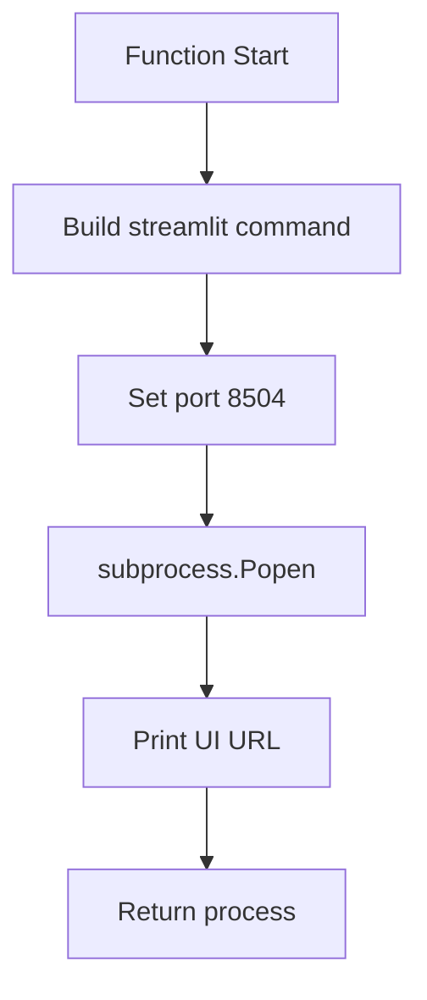

#### 📋 起動コマンド

```python
cmd = [
    "streamlit", "run",
    "a50_rag_search_local_qdrant.py",
    "--server.port", "8504",
    "--server.headless", "true"
]
```

---

### 📊 test_api_endpoints()

#### 🎯 処理概要
APIサーバーの主要エンドポイントをテストし、動作確認を実施

#### 📊 処理の流れ
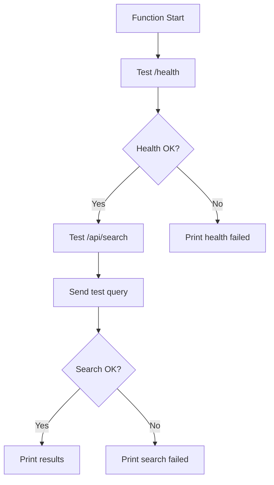

#### 📋 テストエンドポイント

```python
test_endpoints = {
    "/health": "GET",
    "/api/search": "POST",
    "/api/collections": "GET",
    "/api/status": "GET"
}
```

---

### 🎯 main()

#### 🎯 処理概要
全サービスの起動制御とグレースフルシャットダウン処理

#### 📊 処理の流れ
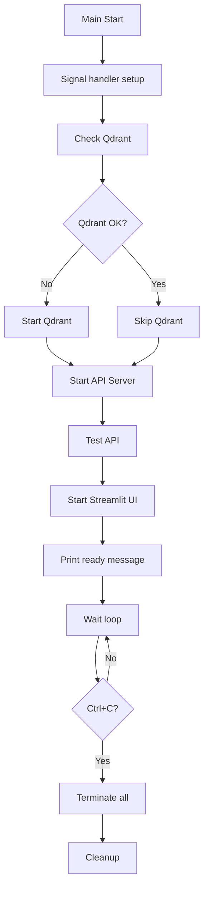

---

## ⚙️ 技術仕様

### 📦 依存要件

| コンポーネント | バージョン | 用途 | 重要度 |
|---------------|------------|------|---------|
| `Python` | ≥3.8 | 実行環境 | ⭐⭐⭐ |
| `Docker` | ≥20.10 | Qdrant実行 | ⭐⭐⭐ |
| `qdrant-client` | ≥1.6.0 | Qdrant接続 | ⭐⭐⭐ |
| `streamlit` | ≥1.48.0 | UI Framework | ⭐⭐⭐ |
| `fastapi` | ≥0.100.0 | API Framework | ⭐⭐ |
| `uvicorn` | ≥0.30.0 | ASGI Server | ⭐⭐ |

### 🖥️ ポート使用

#### 📡 サービスポート割り当て

```yaml
Port_Allocation:
  6333: "Qdrant HTTP API"
  6334: "Qdrant gRPC (optional)"
  8000: "FastAPI Server"
  8504: "Streamlit UI"
```

### ⚙️ プロセス管理

#### 🔧 サブプロセス設定

```python
process_config = {
    "api_server": {
        "command": ["uvicorn", "mcp_api_server:app"],
        "port": 8000,
        "stdout": subprocess.PIPE,
        "stderr": subprocess.PIPE
    },
    "streamlit": {
        "command": ["streamlit", "run"],
        "port": 8504,
        "stdout": subprocess.PIPE,
        "stderr": subprocess.PIPE
    }
}
```

### 🛡️ シグナルハンドリング

#### ⚡ グレースフルシャットダウン

```python
signal_handlers = {
    signal.SIGINT: "Ctrl+C処理",
    signal.SIGTERM: "Terminate処理",
    signal.SIGHUP: "Hangup処理（Unix）"
}
```

---

## 🚨 エラーハンドリング

### 🐳 Docker関連エラー

| エラー種別 | 原因 | 対処法 | 影響度 |
|-----------|------|--------|---------|
| **Docker未起動** | 🚫 Dockerデーモン停止 | Docker起動指示 | 🔴 高 |
| **コンテナ起動失敗** | 🐳 イメージ取得失敗 | docker pull実行 | 🔴 高 |
| **ポート競合** | 🔌 6333使用中 | 既存プロセス停止 | 🟡 中 |
| **ボリュームエラー** | 💾 ボリューム作成失敗 | 権限確認 | 🟡 中 |

### 🌐 プロセス関連エラー

| エラー種別 | 原因 | 対処法 | 影響度 |
|-----------|------|--------|---------|
| **起動失敗** | 🚫 スクリプト不在 | ファイル存在確認 | 🔴 高 |
| **ポート競合** | 🔌 8000/8504使用中 | ポート変更 | 🟡 中 |
| **権限不足** | 🔒 実行権限なし | chmod +x実行 | 🟡 中 |
| **依存関係エラー** | 📦 パッケージ不足 | pip install実行 | 🔴 高 |

### 🔍 接続関連エラー

| エラー種別 | 原因 | 対処法 | 影響度 |
|-----------|------|--------|---------|
| **タイムアウト** | ⏱️ 起動遅延 | 待機時間延長 | 🟡 中 |
| **接続拒否** | 🚫 サービス未起動 | サービス再起動 | 🔴 高 |
| **ネットワークエラー** | 🌐 ファイアウォール | 設定確認 | 🟡 中 |
| **認証エラー** | 🔑 APIキー不正 | 環境変数確認 | 🟡 中 |

### 🛠️ リカバリー戦略

#### 🔄 自動復旧フロー

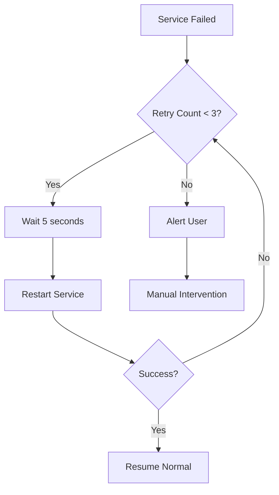

---

## 🎉 まとめ

この設計書は、**server.py** による統合サーバー管理システムの完全な技術仕様を文書化したものです。

### 🌟 設計のハイライト

- **🐳 自動起動**: Qdrantサーバーの透過的管理
- **🌐 統合管理**: 複数サービスの一元制御
- **🎨 UI統合**: Streamlit UIの自動起動
- **🔍 ヘルスチェック**: 各サービスの死活監視
- **⚡ 安全終了**: グレースフルシャットダウン

### 🔧 運用上の利点

- **ワンコマンド起動**: 全サービスの一括起動
- **自動復旧**: サービス障害時の自動再起動
- **状態監視**: リアルタイムのサービス監視
- **エラー通知**: 明確なエラーメッセージ

### 📈 システム統合での役割

- **オーケストレーター**: サービス起動順序制御
- **監視役**: 各コンポーネントの健全性確保
- **ゲートウェイ**: 統一エントリーポイント提供

### 🚀 今後の拡張可能性

- 🔄 サービスディスカバリー機能
- 📊 メトリクス収集・可視化
- 🔐 認証・認可統合
- ⚡ ロードバランシング
- 📈 自動スケーリング
- 🔧 設定のホットリロード