# 📋 setup.py 設計書

## 📝 目次

1. [📖 概要書](#📖-概要書)
2. [🔧 システム構成](#🔧-システム構成)
3. [📋 関数一覧](#📋-関数一覧)
4. [📑 関数詳細設計](#📑-関数詳細設計)
5. [⚙️ 技術仕様](#⚙️-技術仕様)
6. [🚨 エラーハンドリング](#🚨-エラーハンドリング)

---

## 📖 概要書

### 🎯 処理の概要

**MCP環境自動セットアップ・依存関係管理システム**

本スクリプトは、RAGシステムの開発・実行環境を自動構築する包括的セットアップツールです。Python環境の検証、必要パッケージのインストール、Qdrantサーバーの起動、環境変数の設定まで、プロジェクト実行に必要な全ての準備作業を自動化します。

#### 🌟 主要機能

| 機能 | 説明 |
|------|------|
| 🐍 **Python環境検証** | Python 3.8以上の要件確認と警告表示 |
| 📦 **パッケージ管理** | uv/pip自動検出による依存関係インストール |
| 🐳 **Qdrant自動起動** | Docker/docker-composeによるベクトルDB起動 |
| 🔑 **環境変数管理** | .envテンプレート自動生成 |
| 🔍 **接続性検証** | Qdrantサーバー接続自動テスト |
| 📊 **データ登録** | オプションでのサンプルデータ投入 |

#### 🗃️ セットアップフロー

```mermaid
graph LR
    A["Setup Start"] --> B["Check Python Version"]
    B --> C["Detect Package Manager"]
    C --> D["Install Dependencies"]
    D --> E["Check Qdrant Server"]
    E --> F["Start Qdrant if needed"]
    F --> G["Create .env Template"]
    G --> H["Optional: Register Data"]
    H --> I["Setup Complete"]
```

### 🔄 mainの処理の流れ

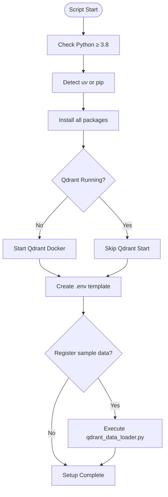

---

## 🔧 システム構成

### 📦 主要コンポーネント

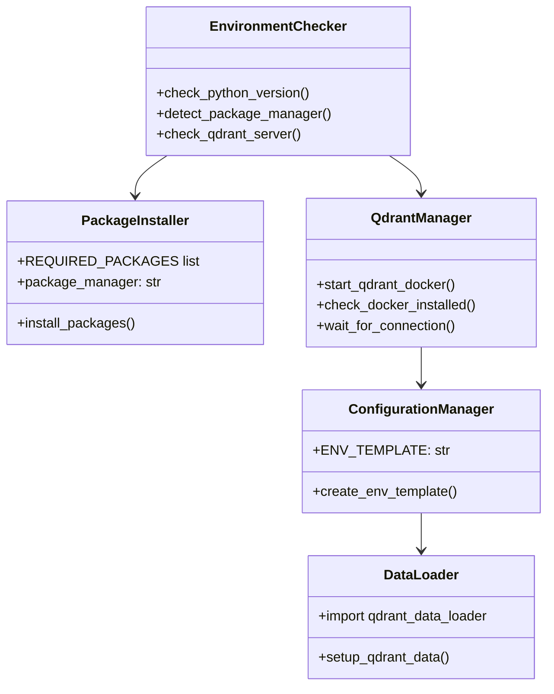

### 📋 依存関係構造

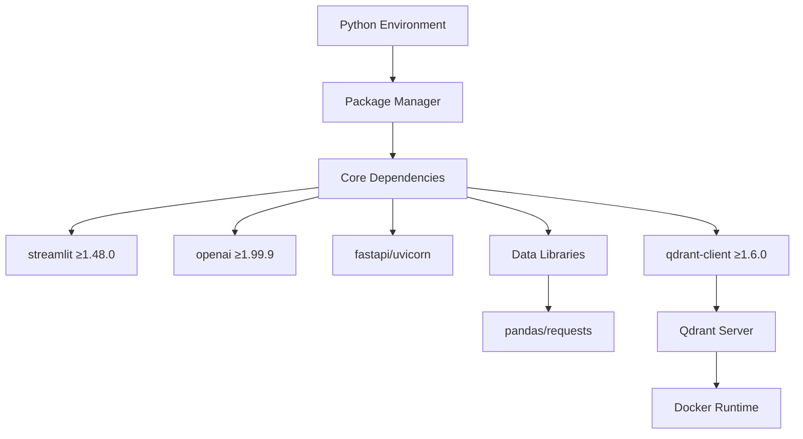

---

## 📋 関数一覧

### 🔍 環境検証関数

| 関数名 | 分類 | 処理概要 | 重要度 |
|--------|------|----------|---------|
| `check_python_version()` | 🐍 検証 | Python 3.8以上の要件確認 | ⭐⭐⭐ |
| `detect_package_manager()` | 📦 検出 | uv/pip パッケージマネージャー自動検出 | ⭐⭐⭐ |
| `check_qdrant_server()` | 🔍 検証 | Qdrantサーバー接続性確認 | ⭐⭐⭐ |

### 📦 インストール関数

| 関数名 | 分類 | 処理概要 | 重要度 |
|--------|------|----------|---------|
| `install_packages()` | 📥 導入 | 必要パッケージ一括インストール | ⭐⭐⭐ |
| `start_qdrant_docker()` | 🐳 起動 | Qdrant Dockerコンテナ起動 | ⭐⭐⭐ |

### 🔧 設定関数

| 関数名 | 分類 | 処理概要 | 重要度 |
|--------|------|----------|---------|
| `create_env_template()` | 🔑 生成 | 環境変数テンプレート作成 | ⭐⭐ |
| `setup_qdrant_data()` | 📊 登録 | サンプルデータのQdrant登録 | ⭐ |

### 🎯 制御関数

| 関数名 | 分類 | 処理概要 | 重要度 |
|--------|------|----------|---------|
| `main()` | 🎯 制御 | セットアップ全体の実行制御 | ⭐⭐⭐ |

---

## 📑 関数詳細設計

### 🐍 check_python_version()

#### 🎯 処理概要
実行環境のPythonバージョンを検証し、3.8未満の場合は警告を表示して終了

#### 📊 処理の流れ
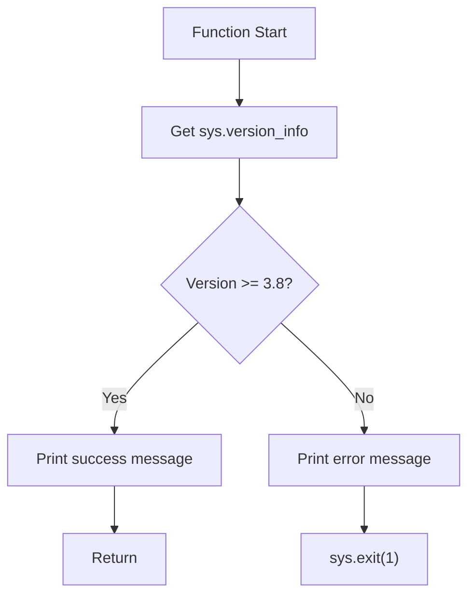

#### 📋 IPO設計

| 項目 | 内容 |
|------|------|
| **INPUT** | なし（sys.version_info を直接参照） |
| **PROCESS** | バージョンタプル比較 (major, minor) |
| **OUTPUT** | なし（副作用：コンソール出力、プログラム終了） |

---

### 📦 detect_package_manager()

#### 🎯 処理概要
システムで利用可能なPythonパッケージマネージャー（uv優先、pip代替）を自動検出

#### 📊 処理の流れ
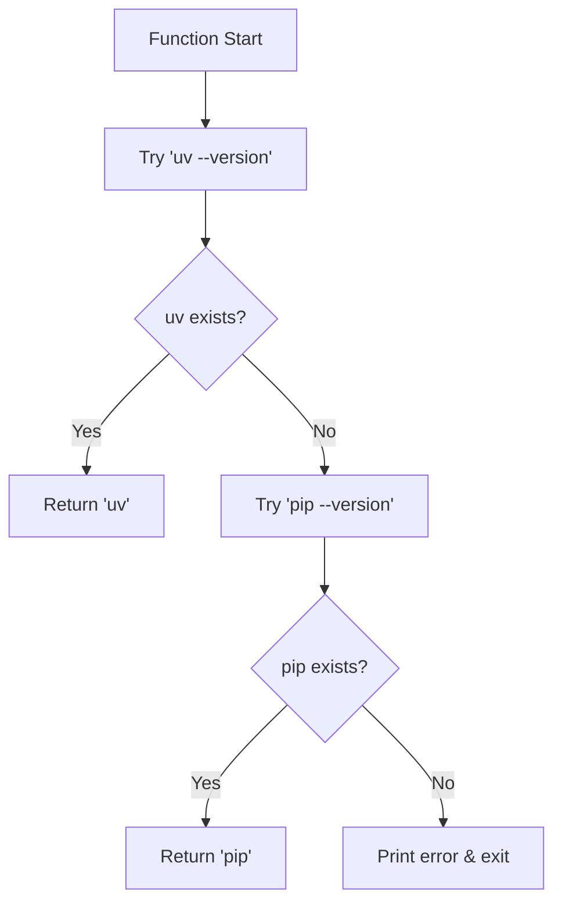

#### 📋 IPO設計

| 項目 | 内容 |
|------|------|
| **INPUT** | なし |
| **PROCESS** | subprocess.run でコマンド存在確認 |
| **OUTPUT** | `"uv"` または `"pip"` （string） |

---

### 📥 install_packages()

#### 🎯 処理概要
プロジェクトに必要な全依存パッケージを検出されたパッケージマネージャーで一括インストール

#### 📊 処理の流れ
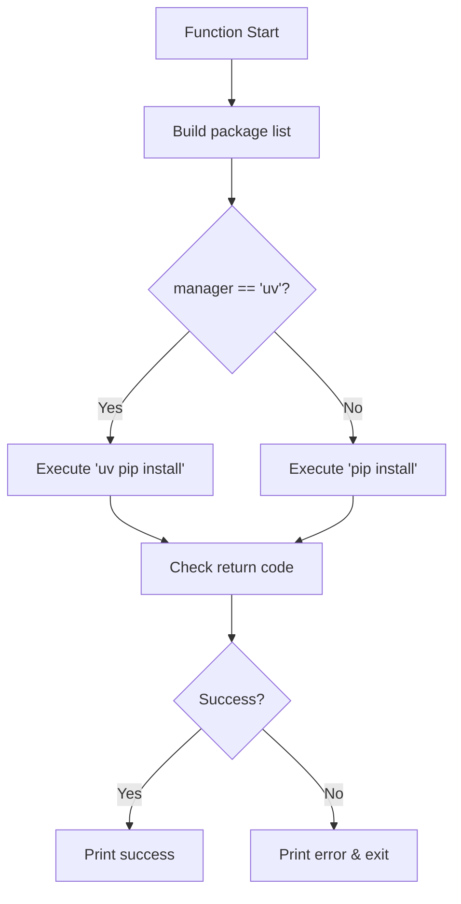

#### 📋 必須パッケージリスト

```python
REQUIRED_PACKAGES = [
    "streamlit>=1.48.0",      # UI Framework
    "openai>=1.99.9",         # OpenAI API
    "pydantic>=2.0.0",        # Data Validation
    "pandas>=2.0.0",          # Data Processing
    "qdrant-client>=1.6.0",   # Vector DB Client
    "requests>=2.32.0",       # HTTP Library
    "fastapi>=0.100.0",       # API Framework
    "uvicorn>=0.30.0",        # ASGI Server
    "psycopg2-binary",        # PostgreSQL Driver
    "python-multipart",       # Form Data Support
]
```

---

### 🔍 check_qdrant_server()

#### 🎯 処理概要
Qdrantサーバーの稼働状態を確認し、接続可能性を検証

#### 📊 処理の流れ
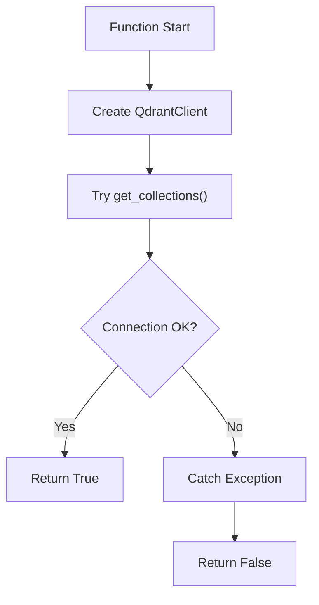

#### 📋 IPO設計

| 項目 | 内容 |
|------|------|
| **INPUT** | url: str = "http://localhost:6333" |
| **PROCESS** | QdrantClient接続テスト |
| **OUTPUT** | bool（接続成功: True、失敗: False） |

---

### 🐳 start_qdrant_docker()

#### 🎯 処理概要
Dockerを使用してQdrantサーバーを起動し、接続可能になるまで待機

#### 📊 処理の流れ
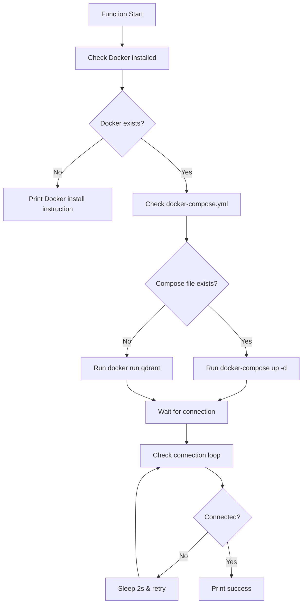

#### 📋 Docker起動コマンド

```python
# docker-compose使用時
docker-compose -f docker-compose/docker-compose.yml up -d

# 直接Docker使用時
docker run -d \
    --name qdrant \
    -p 6333:6333 \
    -v qdrant_data:/qdrant/storage \
    qdrant/qdrant:latest
```

---

### 🔑 create_env_template()

#### 🎯 処理概要
プロジェクトに必要な環境変数の.envテンプレートファイルを生成

#### 📊 処理の流れ
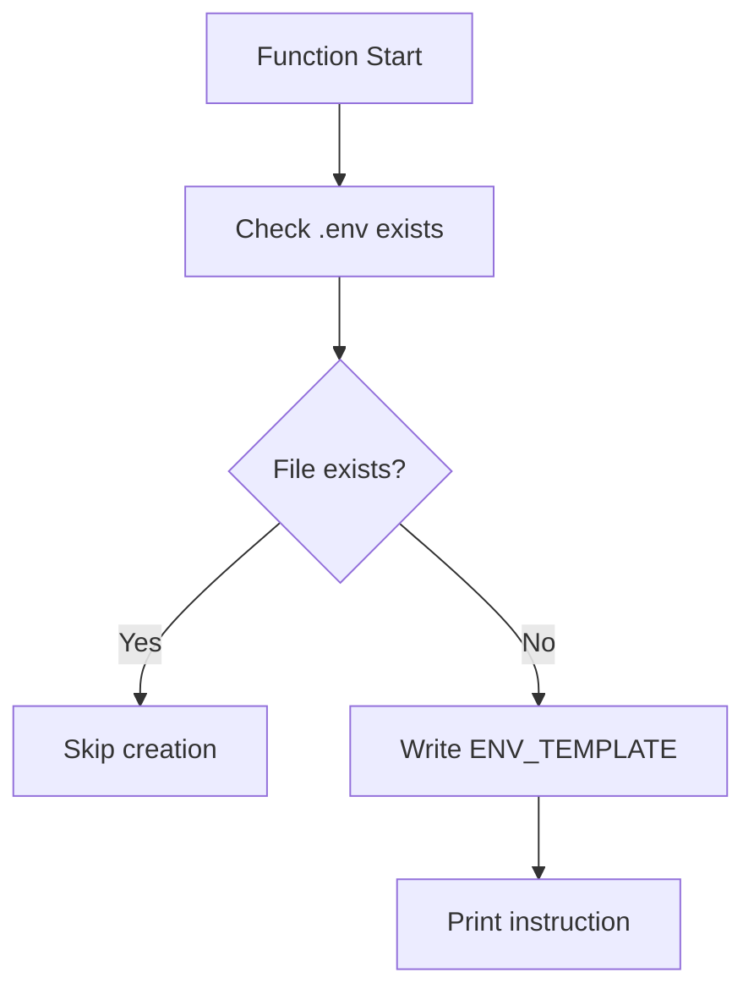

#### 📋 テンプレート内容

```python
ENV_TEMPLATE = """
# OpenAI API設定
OPENAI_API_KEY=your_openai_api_key_here
OPENAI_API_BASE=https://api.openai.com/v1

# Qdrant設定（ローカル）
QDRANT_URL=http://localhost:6333
QDRANT_API_KEY=

# Optional: Weather API
OPENWEATHER_API_KEY=your_weather_api_key_here

# Application Settings
DEBUG=False
LOG_LEVEL=INFO
"""
```

---

### 📊 setup_qdrant_data()

#### 🎯 処理概要
オプションでサンプルデータをQdrantに登録（qdrant_data_loader.pyを実行）

#### 📊 処理の流れ
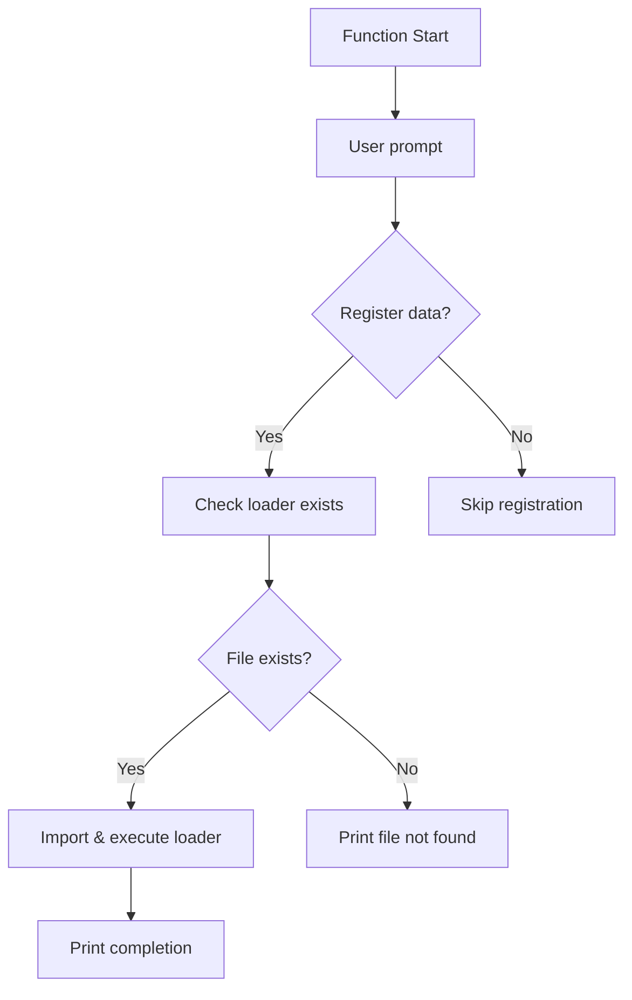

---

### 🎯 main()

#### 🎯 処理概要
セットアップ処理全体の実行制御とエラーハンドリング

#### 📊 処理の流れ
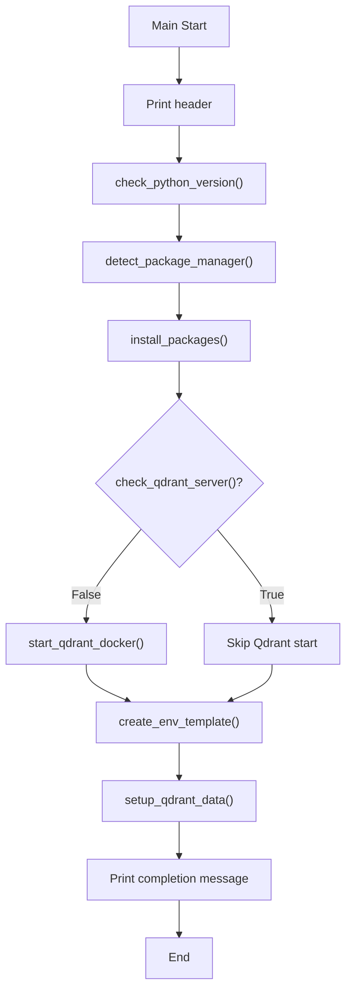

---

## ⚙️ 技術仕様

### 📦 依存ライブラリ詳細

| ライブラリ | バージョン | 用途 | 重要度 |
|-----------|-----------|------|---------|
| `streamlit` | ≥1.48.0 | 🎨 WebUI Framework | ⭐⭐⭐ |
| `openai` | ≥1.99.9 | 🤖 OpenAI API Client | ⭐⭐⭐ |
| `pydantic` | ≥2.0.0 | 🔧 データ検証 | ⭐⭐⭐ |
| `pandas` | ≥2.0.0 | 📊 データ処理 | ⭐⭐⭐ |
| `qdrant-client` | ≥1.6.0 | 🔍 ベクトルDB Client | ⭐⭐⭐ |
| `fastapi` | ≥0.100.0 | 🌐 API Framework | ⭐⭐ |
| `uvicorn` | ≥0.30.0 | 🚀 ASGI Server | ⭐⭐ |
| `psycopg2-binary` | 最新 | 🐘 PostgreSQL Driver | ⭐ |

### 🖥️ システム要件

#### 🔧 必須要件

```yaml
System_Requirements:
  python: ">=3.8"
  docker: ">=20.10"  # Qdrant実行用
  memory: ">=4GB"
  disk_space: ">=2GB"
  network: "インターネット接続（パッケージダウンロード用）"
```

#### 📡 ポート使用

```yaml
Port_Usage:
  6333: "Qdrant HTTP API"
  6334: "Qdrant gRPC API (optional)"
  8000: "FastAPI Server (optional)"
  8501: "Streamlit UI (optional)"
```

### ⚙️ パッケージマネージャー仕様

#### 🚀 uv（推奨）

```bash
# インストールコマンド
uv pip install <package>

# 特徴
- 高速インストール（Rust実装）
- 依存関係の効率的解決
- キャッシュ管理最適化
```

#### 📦 pip（代替）

```bash
# インストールコマンド
pip install <package>

# 特徴
- Python標準パッケージマネージャー
- 広範な互換性
- 安定した動作
```

---

## 🚨 エラーハンドリング

### 🐍 Python環境関連エラー

| エラー種別 | 原因 | 対処法 | 影響度 |
|-----------|------|--------|---------|
| **バージョン不適合** | 🐍 Python < 3.8 | Python 3.8+インストール指示 | 🔴 高 |
| **pip未インストール** | 📦 pipコマンドなし | get-pip.py実行指示 | 🔴 高 |
| **仮想環境未使用** | 🌐 グローバル環境汚染 | venv作成推奨 | 🟡 中 |
| **権限エラー** | 🔒 インストール権限不足 | --user オプション使用 | 🟡 中 |

### 📦 パッケージインストール関連エラー

| エラー種別 | 原因 | 対処法 | 影響度 |
|-----------|------|--------|---------|
| **ネットワークエラー** | 🌐 PyPIアクセス不可 | プロキシ設定・再試行 | 🔴 高 |
| **依存関係競合** | 🔄 バージョン競合 | 仮想環境再作成 | 🟡 中 |
| **ビルドエラー** | 🔨 Cコンパイラ不足 | build-essential インストール | 🟡 中 |
| **ディスク容量不足** | 💾 空き容量不足 | 不要ファイル削除 | 🔴 高 |

### 🐳 Docker関連エラー

| エラー種別 | 原因 | 対処法 | 影響度 |
|-----------|------|--------|---------|
| **Docker未インストール** | 🐳 Dockerなし | Docker Desktop インストール | 🔴 高 |
| **Docker未起動** | 🚫 デーモン停止 | Docker起動指示 | 🔴 高 |
| **権限エラー** | 🔐 sudoなし | dockerグループ追加 | 🟡 中 |
| **ポート競合** | 🔌 6333使用中 | 既存プロセス停止 | 🟡 中 |

### 🔍 Qdrant接続関連エラー

| エラー種別 | 原因 | 対処法 | 影響度 |
|-----------|------|--------|---------|
| **接続タイムアウト** | ⏱️ 起動未完了 | 待機時間延長 | 🟡 中 |
| **接続拒否** | 🚫 ポート閉塞 | ファイアウォール確認 | 🟡 中 |
| **認証エラー** | 🔑 APIキー不正 | 環境変数確認 | 🟡 中 |
| **バージョン非互換** | 🔄 Client/Server不一致 | バージョン合わせ | 🟡 中 |

### 🛠️ エラー処理戦略

#### 🔄 リトライメカニズム

```python
def retry_with_backoff(func, max_retries=3, delay=2):
    """指数バックオフでリトライ"""
    for i in range(max_retries):
        try:
            return func()
        except Exception as e:
            if i == max_retries - 1:
                raise
            time.sleep(delay * (2 ** i))
            print(f"Retry {i+1}/{max_retries}...")
```

#### ✅ エラーメッセージ例

```python
# Python バージョンエラー
print("❌ Error: Python 3.8 or higher is required")
print("💡 Please install Python 3.8+ from python.org")

# Docker エラー
print("❌ Error: Docker is not installed or not running")
print("💡 Please install Docker Desktop from docker.com")

# パッケージエラー
print(f"❌ Error installing packages: {e}")
print("💡 Try: pip install --upgrade pip")

# Qdrant エラー
print("❌ Cannot connect to Qdrant server")
print("💡 Check if Docker is running and port 6333 is free")
```

---

## 🎉 まとめ

この設計書は、**setup.py** による環境自動セットアップシステムの完全な技術仕様と実装詳細を網羅しています。

### 🌟 設計のハイライト

- **🐍 環境検証**: Python要件の自動確認
- **📦 スマート検出**: uv/pip自動選択による最適インストール
- **🐳 自動起動**: Qdrantサーバーの透過的管理
- **🔑 設定管理**: 環境変数テンプレート自動生成
- **📊 データ準備**: オプションのサンプルデータ登録

### 🔧 技術的特徴

- **ワンステップ実行**: `python setup.py` で全環境構築
- **エラー耐性**: 各ステップでの適切なエラーハンドリング
- **プラットフォーム対応**: Windows/Mac/Linux対応
- **最小権限実行**: sudo不要の設計

### 📈 開発効率への貢献

- **初期設定時間短縮**: 手動作業の完全自動化
- **環境統一**: チーム間での環境差異解消
- **依存関係管理**: バージョン固定による安定性
- **トラブルシューティング**: 明確なエラーメッセージ

### 🚀 今後の拡張可能性

- 🔄 環境別設定プロファイル
- 📊 依存関係の自動更新チェック
- 🌍 多言語対応メッセージ
- ⚡ 並列インストール処理
- 📈 セットアップ進捗の可視化
- 🔧 カスタム設定オプション